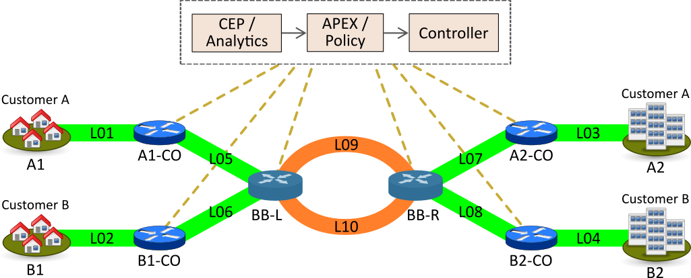

.. This work is licensed under a Creative Commons Attribution 4.0 International License.
.. http://creativecommons.org/licenses/by/4.0

.. _apex-PCVSExample:

Policy-controlled Video Streaming (pcvs) with APEX
**************************************************

.. contents::
    :depth: 3

Introduction
^^^^^^^^^^^^

      .. container:: sectionbody

           .. container:: paragraph

              This module contains several demos for
              Policy-controlled Video Streaming (PCVS). Each demo
              defines a policy using AVRO and Javascript (or other
              scripting languages for the policy logic). To run the
              demo, a vanilla Ubuntu server with some extra software packages is required:

               .. container:: ulist

                  -  Mininet as network simulator

                  -  Floodlight as SDN controller

                  -  Kafka as messaging system

                  -  Zookeeper for Kafka configuration

                  -  APEX for policy control

Install Ubuntu Server and SW
^^^^^^^^^^^^^^^^^^^^^^^^^^^^

          .. container:: sect1

            .. rubric:: Install Demo
               :name: install_demo

            .. container:: sectionbody

               .. container:: paragraph

                  Requirements:

               .. container:: ulist

                  -  Ubuntu server: 1.4 GB

                  -  Ubuntu with Xubuntu Desktop, git, Firefox: 2.3 GB

                  -  Ubuntu with all, system updated: 3 GB

                  -  With ZK, Kafka, VLC, Mininet, Floodlight, Python:
                     4.4 GB

                  -  APEX Build (M2 and built): M2 ~ 2 GB, APEX ~3.5 GB

                  -  APEX install (not build locally): ~ 300 MB

               .. container:: paragraph

                  On a Ubuntu OS (install a stable or LTS server first)

               .. container:: listingblock

                  .. container:: content

                     ::

                        # pre for Ubuntu, tools and X
                        sudo apt-get  -y install --no-install-recommends software-properties-common
                        sudo apt-get  -y install --no-install-recommends build-essential
                        sudo apt-get  -y install --no-install-recommends git
                        sudo aptitude -y install --no-install-recommends xubuntu-desktop
                        sudo apt-get  -y install --no-install-recommends firefox

                        # install Java
                        sudo add-apt-repository ppa:webupd8team/java
                        sudo apt-get update
                        sudo apt-get -y install --no-install-recommends oracle-java8-installer
                        java -version

                        # reboot system, run system update, then continue

                        # if VBox additions are needed, install and reboot
                        sudo (cd /usr/local/share; wget https://www.virtualbox.org/download/testcase/VBoxGuestAdditions_5.2.7-120528.iso)
                        sudo mount /usr/local/share/VBoxGuestAdditions_5.2.7-120528.iso /media/cdrom
                        sudo (cd /media/cdrom;VBoxLinuxAdditions.run)

                        # update apt-get DB
                        sudo apt-get update

                        # if APEX is build from source, install maven and rpm
                        sudo apt-get install maven rpm

                        # install ZooKeeper
                        sudo apt-get install zookeeperd

                        # install Kafka
                        (cd /tmp;wget http://ftp.heanet.ie/mirrors/www.apache.org/dist/kafka/1.0.0/kafka_2.12-1.0.0.tgz --show-progress)
                        sudo mkdir /opt/Kafka
                        sudo tar -xvf /tmp/kafka_2.12-1.0.0.tgz -C /opt/Kafka/

                        # install mininet
                        cd /usr/local/src
                        sudo git clone https://github.com/mininet/mininet.git
                        (cd mininet;util/install.sh -a)

                        # install floodlight, requires ant
                        sudo apt-get install ant
                        cd /usr/local/src
                        sudo wget --no-check-certificate https://github.com/floodlight/floodlight/archive/master.zip
                        sudo unzip master.zip
                        cd floodlight-master
                        sudo ant
                        sudo mkdir /var/lib/floodlight
                        sudo chmod 777 /var/lib/floodlight

                        # install python pip
                        sudo apt-get install python-pip

                        # install kafka-python (need newer version from github)
                        cd /usr/local/src
                        sudo git clone https://github.com/dpkp/kafka-python
                        sudo pip install ./kafka-python

                        # install vlc
                        sudo apt-get install vlc

               .. container:: paragraph

                  Install APEX either from source or from a distribution
                  package. See the APEX documentation for details. We
                  assume that APEX is installed in
                  ``/opt/ericsson/apex/apex``

               .. container:: paragraph

                  Copy the LinkMonitor file to Kafka-Python

               .. container:: listingblock

                  .. container:: content

                     ::

                        sudo cp /opt/ericsson/apex/apex/examples/scripts/pcvs/vpnsla/LinkMonitor.py /usr/local/src/kafka-python

               .. container:: paragraph

                  Change the Logback configuration in APEX to logic
                  logging

               .. container:: listingblock

                  .. container:: content

                     ::

                        (cd /opt/ericsson/apex/apex/etc; sudo cp logback-logic.xml logback.xml)

         .. container:: sect1

            .. rubric:: Get the Demo Video
               :name: get_the_demo_video

            .. container:: sectionbody

               .. container:: ulist

                  -  For all download options of the movie please visit
                     http://bbb3d.renderfarming.net/download.html

                  -  For lower-res downloads and mirrors see
                     https://peach.blender.org/download

               .. container:: listingblock

                  .. container:: content

                     ::

                        sudo mkdir /usr/local/src/videos

               .. container:: paragraph

                  Standard 720p (recommended)

               .. container:: listingblock

                  .. container:: content

                     ::

                        (cd /usr/local/src/videos; sudo curl -o big_buck_bunny_480p_surround.avi http://download.blender.org/peach/bigbuckbunny_movies/big_buck_bunny_480p_surround-fix.avi)

               .. container:: paragraph

                  Full HD video

               .. container:: listingblock

                  .. container:: content

                     ::

                        (cd videos; sudo curl -o bbb_sunflower_1080p_60fps_normal.mp4 http://distribution.bbb3d.renderfarming.net/video/mp4/bbb_sunflower_1080p_60fps_normal.mp4)

VPN SLA Demo
^^^^^^^^^^^^^

          .. container:: sect1

            .. container:: sectionbody

               .. container:: paragraph

                  This demo uses a network with several central office
                  and core switches, over which two VPNs are run. A
                  customer ``A`` has two location ``A1`` and ``A2`` and
                  a VPN between them. A customer ``B`` has two location
                  ``B1`` and ``B2`` and a VPN between them.

               .. container:: imageblock

                  .. container:: content

                     |VPN SLA Architecture|

               .. container:: paragraph

                  The architecture above shows the scenario. The
                  components are realized in this demo as follows:

               .. container:: ulist

                  -  *CEP / Analytics* - a simple Python script taking
                     events from Kafka and sending them to APEX

                  -  *APEX / Policy* - the APEX engine running the VPA
                     SLA policy

                  -  *Controller* - A vanilla Floodlight controller
                     taking events from the Link Monitor and configuring
                     Mininet

                  -  *Network* - A network created using Mininet

               .. container:: paragraph

                  The demo requires to start some software (detailed
                  below). To show actual video streams, we use ``VLC``.
                  If you do not want to show video streams, but only the
                  policy, skip the ``VLC`` section.

               .. container:: paragraph

                  All shown scripts are available in a full APEX
                  installation in
                  ``$APEX_HOME/examples/scripts/pcvs/vpnsla``.

               .. container:: sect2

                  .. rubric:: Start all Software
                     :name: start_all_software

                  .. container:: paragraph

                     Create environment variables in a file, say
                     ``env.sh``. In each new Xterm

                  .. container:: ulist

                     -  Source these environment settings, e.g.
                        ``. ./env.sh``

                     -  Run the commands below as root (``sudo`` per
                        command or ``sudo -i`` for interactive mode as
                        shown below)

                  .. container:: listingblock

                     .. container:: content

                        ::

                           #!/usr/bin/env bash

                           export src_dir=/usr/local/src
                           export APEX_HOME=/opt/ericsson/apex/apex
                           export APEX_USER=apexuser

                  .. container:: paragraph

                     In a new Xterm, start Floodlight

                  .. container:: listingblock

                     .. container:: content

                        ::

                           sudo -i
                           . ./env.sh
                           cd $src_dir/floodlight-master && java -jar target/floodlight.jar

                  .. container:: paragraph

                     In a new Xterm start Mininet

                  .. container:: listingblock

                     .. container:: content

                        ::

                           sudo -i
                           . ./env.sh
                           mn -c && python $APEX_HOME/examples/scripts/pcvs/vpnsla/MininetTopology.py

                  .. container:: paragraph

                     In a new Xterm, start Kafka

                  .. container:: listingblock

                     .. container:: content

                        ::

                           sudo -i
                           . ./env.sh
                           /opt/Kafka/kafka_2.12-1.0.0/bin/kafka-server-start.sh /opt/Kafka/kafka_2.12-1.0.0/config/server.properties

                  .. container:: paragraph

                     In a new Xerm start APEX with the Kafka
                     configuration for this demo

                  .. container:: listingblock

                     .. container:: content

                        ::

                           cd $APEX_HOME
                           ./bin/apexApps.sh engine -c examples/config/pcvs/vpnsla/kafka2kafka.json

                  .. container:: paragraph

                     In a new Xterm start the Link Monitor. The Link
                     Monitor has a 30 second sleep to slow down the
                     demonstration. So the first action of it comes 30
                     seconds after start. Every new action in 30 second
                     intervals.

                  .. container:: listingblock

                     .. container:: content

                        ::

                           sudo -i
                           . ./env.sh
                           cd $src_dir
                           xterm -hold -e 'python3 $src_dir/kafka-python/LinkMonitor.py' &

                  .. container:: paragraph

                     Now all software should be started and the demo is
                     running. The Link Monitor will send link up events,
                     picked up by APEX which triggers the policy. Since
                     there is no problem, the policy will do nothing.

               .. container:: sect2

                  .. rubric:: Create 2 Video Streams with VLC
                     :name: create_2_video_streams_with_vlc

                  .. container:: paragraph

                     In the Mininet console, type ``xterm A1 A2`` and
                     ``xterm B1 B2`` to open terminals on these nodes.

                  .. container:: paragraph

                     ``A2`` and ``B2`` are the receiving nodes. In these
                     terminals, run ``vlc-wrapper``. In each opened VLC
                     window do

                  .. container:: ulist

                     -  Click Media → Open Network Stream

                     -  Give the URL as ``rtp://@:5004``

                  .. container:: paragraph

                     ``A1`` and ``B1`` are the sending nodes (sending
                     the video stream) In these terminals, run
                     ``vlc-wrapper``. In each opened VLC window do

                  .. container:: ulist

                     -  Click Media → Stream

                     -  Add the video (from ``/usr/local/src/videos``)

                     -  Click ``Stream``

                     -  Click ``Next``

                     -  Change the destination
                        ``RTP / MPEG Transport Stream`` and click
                        ``Add``

                     -  Change the address and type to ``10.0.0.2`` in
                        ``A1`` and to ``10.0.0.4`` in ``B1``

                     -  Turn off ``Active Transcoding`` (this is
                        important to minimize CPU load)

                     -  Click ``Next``

                     -  Click ``Stream``

                  .. container:: paragraph

                     The video should be streaming across the network
                     from ``A1`` to ``A2`` and from ``B1`` to ``B2``. If
                     the video streams a slow or interrupted the CPU
                     load is too high. In these cases either try a
                     better machine or use a different (lower quality)
                     video stream.

               .. container:: sect2

                  .. rubric:: Take out L09 and let the Policy do it’s
                     Magic
                     :name: take_out_l09_and_let_the_policy_do_it_s_magic

                  .. container:: paragraph

                     Now it is time to take out the link ``L09``. This
                     will be picked up by the Link Monitor, which sends
                     a new event (L09 DOWN) to the policy. The policy
                     then will calculate which customer should be
                     impeded (throttled). This will continue, until SLAs
                     are violated, then a priority calculation will kick
                     in (Customer ``A`` is prioritized in the setup).

                  .. container:: paragraph

                     To initiate this, simply type ``link s5 s6 down``
                     in the Mininet console followed by ``exit``.

                  .. container:: paragraph

                     If you have the video streams running, you will see
                     one or the other struggeling, depending on the
                     policy decision.

               .. container:: sect2

                  .. rubric:: Reset the Demo
                     :name: reset_the_demo

                  .. container:: paragraph

                     If you want to reset the demo, simple stop (in this
                     order) the following process

                  .. container:: ulist

                     -  Link Monitor

                     -  APEX

                     -  Mininet

                     -  Floodlight

                  .. container:: paragraph

                     Then restart them in this order

                  .. container:: ulist

                     -  Floodlight

                     -  Mininet

                     -  APEX

                     -  Link Monitor

               .. container:: sect2

                  .. rubric:: Monitor the Demo
                     :name: monitor_the_demo

                  .. container:: paragraph

                     Floodlight and APEX provide REST interfaces for
                     monitoring.

                  .. container:: ulist

                     -  Floodlight: see `Floodlight
                        Docs <https://floodlight.atlassian.net/wiki/spaces/floodlightcontroller/pages/40403023/Web+GUI>`__
                        for details on how to access the monitoring. In
                        a standard installation as we use here, pointing
                        browser to the URL
                        ``http://localhost:8080/ui/pages/index.html``
                        should work on the same host

                     -  APEX please see the APEX documentation for
                        `Monitoring
                        Client <https://ericsson.github.io/apex-docs/user-manual/engine-apps/um-engapps-eng-monitoring.html>`__
                        or `Full
                        Client <https://ericsson.github.io/apex-docs/user-manual/engine-apps/um-engapps-full-client.html>`__
                        for details on how to monitor APEX.

VPN SLA Policy
^^^^^^^^^^^^^^

            .. container:: sectionbody

               .. container:: paragraph

                  The VPN SLA policy is designed as a MEDA policy. The
                  first state (M = Match) takes the trigger event (a
                  link up or down) and checks if this is a change to the
                  known topology. The second state (E = Establish) takes
                  all available information (trigger event, local
                  context) and defines what situation we have. The third
                  state (D = Decide) takes the situation and selects
                  which algorithm is best to process it. This state can
                  select between ``none`` (nothing to do), ``solved`` (a
                  problem is solved now), ``sla`` (compare the current
                  customer SLA situation and select one to impede), and
                  ``priority`` (impede non-priority customers). The
                  fourth and final state (A = Act) selects the right
                  action for the taken decision and creates the response
                  event sent to the orchestrator.

               .. container:: paragraph

                  We have added three more policies to set the local
                  context: one for adding nodes, one for adding edges
                  (links), and one for adding customers. These policies
                  do not realize any action, they are only here for
                  updating the local context. This mechanism is the
                  fasted way to update local context, and it is
                  independent of any context plugin.

               .. container:: paragraph

                  The policy uses data defined in Avro, so we have a
                  number of Avro schema definitions.

Context Schemas
---------------

         .. container:: sect1

            .. container:: sectionbody

               .. container:: paragraph

                  The context schemas are for the local context. We
                  model edges and nodes for the topology, customers, and
                  problems with all information on detected problems.

                  .. container:: ulist

                     -  |avroSchemaEdges_link|
                     -  |avroSchemaNodes_link|
                     -  |avroSchemaCustomers_link|

Trigger Schemas
---------------

        .. container:: sect1

            .. container:: sectionbody

               .. container:: paragraph

                  The trigger event provides a status as ``UP`` or
                  ``DOWN``. To avoid tests for these strings in the
                  logic, we defined an Avro schema for an enumeration (|avroSchemaLinkStatus_link|).
                  This does not impact the trigger system (it can still
                  send the strings), but makes the task logic simpler.

Context Logic Nodes
--------------------

         .. container:: sect1

            .. container:: sectionbody

               .. container:: paragraph

                  The node context logic simply takes the trigger event
                  (for context) and creates a new node in the local
                  context topology (|cntxtNodes_link|).

Context Logic Edges
--------------------

         .. container:: sect1

            .. container:: sectionbody

               .. container:: paragraph

                  The edge context logic simply takes the trigger event
                  (for context) and creates a new edge in the local
                  context topology (|cntxtEdges_link|).

Context Logic Customer
----------------------

         .. container:: sect1

            .. container:: sectionbody

               .. container:: paragraph

                  The customer context logic simply takes the trigger
                  event (for context) and creates a new customer in the
                  local context topology (|cntxtCustomer_link|).

Logic: Match
------------

         .. container:: sect1

            .. container:: sectionbody

               .. container:: paragraph

                  This is the logic for the match state. It is kept very
                  simple. Beside taking the trigger event, it also
                  creates a timestamp. This timestamp is later used for
                  SLA and downtime calculations as well as for some
                  performance information of the policy .
                  Sample |taskMatch_link|

Logic: Policy Establish State
-----------------------------

         .. container:: sect1

            .. container:: sectionbody

               .. container:: paragraph

                  This is the logic for the establish state. It is the
                  most complicated logic, since establishing a situation
                  for a decision is the most important part of any
                  policy. First, the policy describes what we find (the
                  switch block), in terms of 8 normal situations and 1
                  extreme error case.

               .. container:: paragraph

                  If required, it creates local context information for
                  the problem (if it is new) or updates it (if the
                  problem still exists). It also calculates customer SLA
                  downtime and checks for any SLA violations. Finally,
                  it creates a situation object.
                  Sample |taskEstablish_link|

Logic: Policy Decide State
--------------------------

         .. container:: sect1

            .. container:: sectionbody

               .. container:: paragraph

                  The decide state can select between different
                  algorithms depending on the situation. So it needs a
                  Task Selection Logic (TSL). This TSL select a task in
                  the current policy execution (i.e. potentially a
                  different one per execution).
                  Sample |tslDecide_Link|

               .. container:: paragraph

                  The actual task logic are then ``none``, ``solved``,
                  ``sla``, and ``priority``.
                  Sample task logic are as given below :

                  .. container:: ulist

                     -  |taskDecideNone_link|
                     -  |taskDecideSolved_Link|
                     -  |taskDecideSla_link|
                     -  |taskDecidePriority_Link|

Logic: Policy Act State
------------------------

         .. container:: sect1

            .. container:: sectionbody

               .. container:: paragraph

                  This is the logic for the act state. It is simply
                  selecting an action, and creating the repsonse event
                  for the orchestrator (the output of the policy).
                  Sample |taskAct_link|

CLI Spec
--------

         .. container:: sect1

            .. rubric:: Complete Policy Definition
               :name: complete_policy_definition

            .. container:: sectionbody

               .. container:: paragraph

                  The complete policy definition is realized using the
                  APEX CLI Editor. The script below shows the actual
                  policy specification. All logic and schemas are
                  included (as macro file).
                  Sample |vpnsla-apex_link|

Context Events Nodes
--------------------

         .. container:: sect1

            .. container:: sectionbody

               .. container:: paragraph

                  The following events create all nodes of the topology.

                  .. container:: ulist

                     -  |ctxtNodesJson_link|

Context Events Edges
--------------------

         .. container:: sect1

            .. container:: sectionbody

               .. container:: paragraph

                  The following events create all edges of the topology.

                  .. container:: ulist

                     -  |ctxtEdgesJson_link|

Context Events Customers
------------------------

         .. container:: sect1

            .. container:: sectionbody

               .. container:: paragraph

                  The following events create all customers of the topology.

                  .. container:: ulist

                     -  |ctxtCustomerJson_link|

Trigger Examples
----------------

         .. container:: sect1

            .. container:: sectionbody

               .. container:: paragraph

                  The following events are examples for trigger events

                  .. container:: ulist

                     -  |triggerEdgeJson_link|

Link Monitor
------------

         .. container:: sect1

            .. container:: sectionbody

               .. container:: paragraph

                  The Link Monitor is a Python script. At startup, it
                  sends the context events to APEX to initialize the
                  topology and the customers. Then it takes events from
                  Kafka and sends them to APEX.
                  Sample |linkMonitor_link|

Mininet Topology
----------------

         .. container:: sect1

            .. container:: sectionbody

               .. container:: paragraph

                  The topology is realized using Mininet. This
                  script is used to establish the topology and to realize
                  network configurations.
                  Sample |mininetTopology_link|

   .. container::
      :name: footer-text

      2.3.0-SNAPSHOT
      Last updated 2020-04-03 16:04:24 IST

.. |ONAP| image:: ../../../images/logos.png
   :class: builtBy
   :target: http://www.onap.org/

.. |avroSchemaEdges_link| raw:: html

  <a href="https://github.com/onap/policy-apex-pdp/tree/guilin/examples/examples-pcvs/src/main/resources/org/onap/policy/apex/examples/pcvs/vpnsla/avro/topology-edges.avsc" target="_blank">AVRO Schema Edges</a>
.. |avroSchemaNodes_link| raw:: html

  <a href="https://github.com/onap/policy-apex-pdp/tree/guilin/examples/examples-pcvs/src//main/resources/org/onap/policy/apex/examples/pcvs/vpnsla/avro/topology-nodes.avsc" target="_blank">AVRO Schema Nodes</a>
.. |avroSchemaCustomers_link| raw:: html

  <a href="https://github.com/onap/policy-apex-pdp/tree/guilin/examples/examples-pcvs/src/main/resources/org/onap/policy/apex/examples/pcvs/vpnsla/avro/customers.avsc" target="_blank">AVRO Schema Customers</a>
.. |avroSchemaLinkStatus_link| raw:: html

  <a href="https://github.com/onap/policy-apex-pdp/tree/guilin/examples/examples-pcvs/src/main/resources/org/onap/policy/apex/examples/pcvs/vpnsla/avro/link-status.avsc" target="_blank">AVRO Schema Link Status</a>
.. |cntxtNodes_link| raw:: html

  <a href="https://github.com/onap/policy-apex-pdp/tree/guilin/examples/examples-pcvs/src/main/resources/org/onap/policy/apex/examples/pcvs/vpnsla/logic/ctxt-nodes.js" target="_blank">Logic Node Context</a>
.. |cntxtEdges_link| raw:: html

  <a href="https://github.com/onap/policy-apex-pdp/tree/guilin/examples/examples-pcvs/src/main/resources/org/onap/policy/apex/examples/pcvs/vpnsla/logic/ctxt-edges.js" target="_blank">Logic Edge Context</a>
.. |cntxtCustomer_link| raw:: html

  <a href="https://github.com/onap/policy-apex-pdp/tree/guilin/examples/examples-pcvs/src/main/resources/org/onap/policy/apex/examples/pcvs/vpnsla/logic/ctxt-customer.js" target="_blank">Logic Customer Context</a>
.. |taskMatch_link| raw:: html

  <a href="https://github.com/onap/policy-apex-pdp/tree/guilin/examples/examples-pcvs/src/main/resources/org/onap/policy/apex/examples/pcvs/vpnsla/logic/task-match.js" target="_blank">Logic Policy Match State</a>
.. |taskEstablish_link| raw:: html

  <a href="https://github.com/onap/policy-apex-pdp/tree/guilin/examples/examples-pcvs/src/main/resources/org/onap/policy/apex/examples/pcvs/vpnsla/logic/task-establish.js" target="_blank">Logic Policy Establish State</a>
.. |tslDecide_Link| raw:: html

  <a href="https://github.com/onap/policy-apex-pdp/tree/guilin/examples/examples-pcvs/src/main/resources/org/onap/policy/apex/examples/pcvs/vpnsla/logic/tsl-decide.js" target="_blank">JS Logic Policy Decide State - TSL</a>
.. |taskDecideNone_link| raw:: html

  <a href="https://github.com/onap/policy-apex-pdp/tree/guilin/examples/examples-pcvs/src/main/resources/org/onap/policy/apex/examples/pcvs/vpnsla/logic/task-decide-none.js" target="_blank">Logic: Decide None</a>
.. |taskDecideSolved_Link| raw:: html

  <a href="https://github.com/onap/policy-apex-pdp/tree/guilin/examples/examples-pcvs/src/main/resources/org/onap/policy/apex/examples/pcvs/vpnsla/logic/task-decide-solved.js" target="_blank">Logic: Decide Solved</a>
.. |taskDecideSla_link| raw:: html

  <a href="https://github.com/onap/policy-apex-pdp/tree/guilin/examples/examples-pcvs/src/main/resources/org/onap/policy/apex/examples/pcvs/vpnsla/logic/task-decide-sla.js" target="_blank">Logic: Decide SLA</a>
.. |taskDecidePriority_Link| raw:: html

  <a href="https://github.com/onap/policy-apex-pdp/tree/guilin/examples/examples-pcvs/src/main/resources/org/onap/policy/apex/examples/pcvs/vpnsla/logic/task-decide-priority.js" target="_blank">Logic: Decide Priority</a>
.. |taskAct_link| raw:: html

  <a href="https://github.com/onap/policy-apex-pdp/tree/guilin/examples/examples-pcvs/src/main/resources/org/onap/policy/apex/examples/pcvs/vpnsla/logic/task-act.js" target="_blank">Logic Policy Act State</a>
.. |vpnsla-apex_link| raw:: html

  <a href="https://github.com/onap/policy-apex-pdp/tree/guilin/examples/examples-pcvs/src/main/resources/org/onap/policy/apex/examples/pcvs/vpnsla/vpnsla.apex" target="_blank">APEX VPN SLA Policy Specification</a>
.. |ctxtNodesJson_link| raw:: html

  <a href="https://github.com/onap/policy-apex-pdp/tree/guilin/examples/examples-pcvs/src/main/resources/examples/events/pcvs/vpnsla/CtxtNodes.json" target="_blank">Context Events Nodes</a>
.. |ctxtEdgesJson_link| raw:: html

  <a href="https://github.com/onap/policy-apex-pdp/tree/guilin/examples/examples-pcvs/src/main/resources/examples/events/pcvs/vpnsla/CtxtEdges.json" target="_blank">Context Events Edges</a>
.. |ctxtCustomerJson_link| raw:: html

  <a href="https://github.com/onap/policy-apex-pdp/tree/guilin/examples/examples-pcvs/src/main/resources/examples/events/pcvs/vpnsla/CtxtCustomers.json" target="_blank">Context Events Customers</a>
.. |triggerEdgeJson_link| raw:: html

  <a href="https://github.com/onap/policy-apex-pdp/tree/guilin/examples/examples-pcvs/src/main/resources/examples/events/pcvs/vpnsla/Trigger_Edge09.json" target="_blank">Trigger Examples</a>
.. |linkMonitor_link| raw:: html

  <a href="https://github.com/onap/policy-apex-pdp/tree/guilin/examples/examples-pcvs/src/main/resources/examples/scripts/pcvs/vpnsla/LinkMonitor.py" target="_blank">Link Monitor</a>
.. |mininetTopology_link| raw:: html

  <a href="https://github.com/onap/policy-apex-pdp/tree/guilin/examples/examples-pcvs/src/main/resources/examples/scripts/pcvs/vpnsla/MininetTopology.py" target="_blank">Mininet Topology</a>
