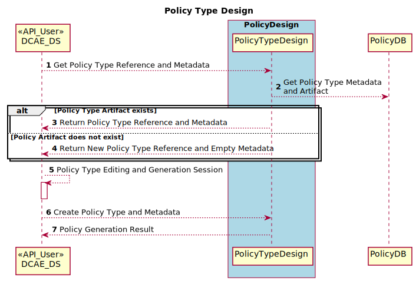
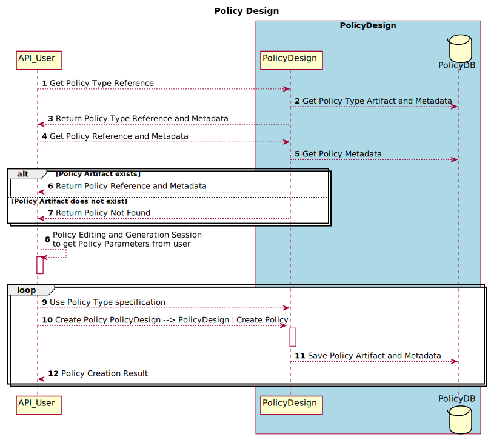
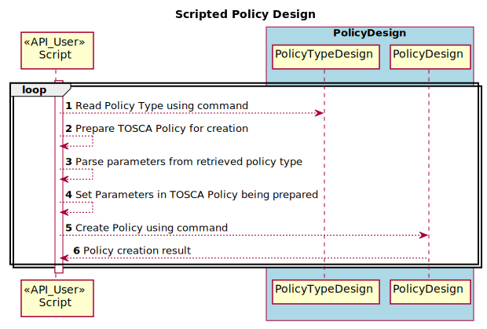
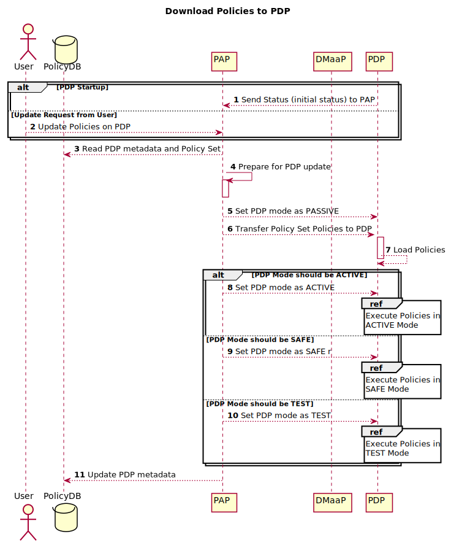

.. This work is licensed under a
.. Creative Commons Attribution 4.0 International License.
.. http://creativecommons.org/licenses/by/4.0

.. DO NOT REMOVE THIS LABEL - EVEN IF IT GENERATES A WARNING
.. _pf_architecture:

.. THIS IS USED INTERNALLY IN POLICY ONLY
.. _architecture-label:

Policy Framework Architecture
#############################

Abstract

This document describes the ONAP Policy Framework. It lays out the architecture of the framework and shows the APIs
provided to other components that interwork with the framework. It describes the implementation of the framework,
mapping out the components, software structure, and execution ecosystem of the framework.

.. contents::
    :depth: 6

.. toctree::
   :caption: References
   :maxdepth: 1

   tosca-policy-primer

1. Overview
===========

The ONAP Policy Framework is a comprehensive policy design, deployment, and execution environment. The Policy Framework
is the decision making component in `an ONAP system
<https://www.onap.org/wp-content/uploads/sites/20/2018/11/ONAP_CaseSolution_Architecture_112918FNL.pdf>`__.
It allows you to specify, deploy, and execute the governance of the features and functions in your ONAP system, be they
closed loop, orchestration, or more traditional open loop use case implementations. The Policy Framework is the
component that is the source of truth for all policy decisions.

One of the most important goals of the Policy Framework is to support Policy Driven Operational Management during the
execution of ONAP control loops at run time. In addition, use case implementations such as orchestration and control
benefit from the ONAP policy Framework because they can use the capabilities of the framework to manage and execute
their policies rather than embedding the decision making in their applications.

The Policy Framework is deployment agnostic, it manages Policy Execution (in PDPs) and Enforcement (in PEPs) regardless
of how the PDPs and PEPs are deployed. This allows policy execution and enforcement to be deployed in a manner that
meets the performance requirements of a given application or use case. In one deployment, policy execution could be
deployed in a separate executing entity in a Docker container. In another, policy execution could be co-deployed with
an application to increase performance. An example of co-deployment is the Drools PDP Control Loop image, which is a
Docker image that combines the ONAP Drools use case application and dependencies with the Drools PDP engine.

The ONAP Policy Framework architecture separates policies from the platform that is supporting them. The framework
supports development, deployment, and execution of any type of policy in ONAP. The Policy Framework is metadata (model)
driven so that policy development, deployment, and execution is as flexible as possible and can support modern rapid
development ways of working such as `DevOps
<https://en.wikipedia.org/wiki/DevOps>`__. A metadata driven approach also allows the amount of programmed support
required for policies to be reduced or ideally eliminated.

We have identified five capabilities as being essential for the framework:

1. Most obviously, the framework must be capable of being triggered by an event or invoked, and making decisions at run
   time.

2. It must be deployment agnostic; capable of managing policies for various Policy Decision Points (PDPs) or policy
   engines.

3. It must be metadata driven, allowing policies to be deployed, modified, upgraded, and removed as the system executes.

4. It must provide a flexible model driven policy design approach for policy type programming and specification of
   policies.

5. It must be extensible, allowing straightforward integration of new PDPs, policy formats, and policy development
   environments.

Another important aim of the architecture of a model driven policy framework is that it enables much more flexible
policy specification. The ONAP Policy Framework complies with the `TOSCA
<http://docs.oasis-open.org/tosca/TOSCA-Simple-Profile-YAML/v1.1/TOSCA-Simple-Profile-YAML-v1.1.pdf>`__ modelling
approach for policies, see the :ref:`TOSCA Policy Primer <tosca-label>` for more information on how policies are modeled
in TOSCA.

 1. A *Policy Type* describes the properties, targets, and triggers that the policy for a feature can have. A Policy type is
    implementation independent. It is the metadata that specifies:

  - the *configuration* data that the policy can take. The Policy Type describes each property that a policy of a
    given type can take. A Policy Type definition also allows the default value, optionality, and the ranges of properties
    to be defined.

  - the *targets* such as network element types, functions, services, or resources on which a policy of the given type
    can act.

  - the *triggers* such as the event type, filtered event, scheduled trigger, or conditions that can activate a policy
    of the given type.

  Policy Types are hierarchical, A Policy Type can inherit from a parent Policy Type, inheriting the properties, targets,
  and triggers of its parent. Policy Types are developed by domain experts in consultation with the developers that
  implement the logic and rules for the Policy Type.

 2. A *Policy* is defined using a Policy Type. The Policy defines:

  - the values for each property of the policy type
  - the specific targets (network elements, functions, services, resources) on which this policy will act
  - the specific triggers that trigger this policy.

 3. A *Policy Type Implementation* or *Raw Policy*, is the logic that implements the policy. It is implemented by a
    skilled policy developer in consultation with domain experts. The implementation has software that reads the Policy
    Type and parses the incoming configuration properties. The software has domain logic that is triggered when one of the
    triggers described in the Policy Type occurs. The software logic executes and acts on the targets specified in the
    Policy Type.

For example, a Policy Type could be written to describe how to manage Service Level Agreements for VPNs. The VPN Policy
Type can be used to create VPN policies for a bank network, a car dealership network, or a university with many campuses.
The Policy Type has two parameters:

 - The *maximumDowntime* parameter allows the maximum downtime allowed per year to be specified
 - The *mitigationStrategy* parameter allows one of three strategies to be selected for downtime breaches

  - *allocateMoreResources*, which will automatically allocate more resources to mitigate the problem
  - *report*, which report the downtime breach to a trouble ticketing system
  - *ignore*, which logs the breach and takes no further action

The Policy Type defines a trigger event, an event that is received from an analytics system when the maximum downtime
value for a VPN is breached. The target of the policy type is an instance of the VPN service.

The Policy Type Implementation is developed that can configure the maximum downtime parameter in an analytics system,
can receive a trigger from the analytics system when the maximum downtime is breached, and that can either request more
resources, report an issue to a trouble ticketing system, and can log a breach.

VPN Policies are created by specifying values for the properties, triggers, and targets specified in VPN Policy Type.

In the case of the bank network, the *maximumDowntime* threshold is specified as 5 minutes downtime per year and the
*mitigationStrategy* is defined as *allocateMoreResources*, and the target is specified as being the bank's VPN service
ID. When a breach is detected by the analytics system, the policy is executed, the target is identified as being the
bank's network, and more resources are allocated by the policy.

For the car dealership VPN policy, a less stringent downtime threshold of 60 minutes per year is specified, and the
mitigation strategy is to issue a trouble ticket. The university network is best effort, so a downtime of 4 days per
year is specified. Breaches are logged and mitigated as routine network administration tasks.

In ONAP, specific ONAP Policy Types are used to create specific policies that drive the ONAP Platform and Components.
For more detailed information on designing Policy Types and developing an implementation for that policy type, see
:ref:`Policy Design and Development <design-label>`.

The ONAP Policy Framework for building, configuring and deploying PDPs is extendable. It allows the use of ONAP PDPs as
is, the extension of ONAP PDPs, and lastly provides the capability for users to create and deploy their own PDPs. The
ONAP Policy Framework provides distributed policy management for **all** policies in ONAP at run time. Not only does
this provide unified policy access and version control, it provides life cycle control for policies and allows detection
of conflicts across all policies running in an ONAP installation.

2. Architecture
===============

The diagram below shows the architecture of the ONAP Policy Framework at its highest level.

The *PolicyAPI* component implements the functionality for CRUD of policy types and policies.
*PolicyAdministration* is responsible for the deployment life cycle of policies as well as interworking with the
mechanisms required to orchestrate the nodes and containers on which policies run. *PolicyAdministration* is also
responsible for the administration of policies at run time; ensuring that policies are available to users, that policies
are executing correctly, and that the state and status of policies is monitored. *PolicyExecution* is the set of PDPs
running in the ONAP system and is responsible for making policy decisions and for managing the administrative state of
the PDPs as directed by \ *PolicyAdministration.*

*PolicyAPI* provides APIs that allow creation of policy artifacts and supporting information in the policy
database. *PolicyAdministration* reads those artifacts and the supporting information from the policy database whilst
deploying policy artifacts. Once the policy artifacts are deployed, *PolicyAdministration* handles the run-time
management of the PDPs on which the policies are running. *PolicyAPI* interacts with the database, and has
no programmatic interface with *PolicyAdministration*, *PolicyExecution* or any other run-time ONAP components.

The diagram below shows a more detailed view of the architecture, as inspired by
`RFC-2753 https://tools.ietf.org/html/rfc2753` and `RFC-3198 https://tools.ietf.org/html/rfc3198`.

*PolicyAPI* provides a `CRUD <https://en.wikipedia.org/wiki/Create,_read,_update_and_delete>`__ API for policy
types and policies. The policy types and policy artifacts and their metadata (information about policies, policy types,
and their interrelations) are stored in the *PolicyDB*. The *PolicyDevGUI*, PolicyDistribution, and other applications
such as *CLAMP* can use the *PolicyAPI* API to create, update, delete, and read policy types and policies.

*PolicyAdministration* has two important functions:

- Management of the life cycle of PDPs in an ONAP installation. PDPs register with *PolicyAdministration* when they come
  up. *PolicyAdministration* handles the allocation of PDPs to PDP Groups and PDP Subgroups, so that they can be
  managed as microservices in infrastructure management systems such as Kubernetes.

- Management of the deployment of policies to PDPs in an ONAP installation. *PolicyAdministration* gives each PDP group
  a set of domain policies to execute.

*PolicyAdministration* handles PDPs and policy allocation to PDPs using asynchronous messaging over Kafka. It provides
three APIs:

- a CRUD API for policy groups and subgroups

- an API that allows the allocation of policies to PDP groups and subgroups to be controlled

- an API allows policy execution to be managed, showing the status of policy execution on PDP Groups, subgroups, and
  individual PDPs as well as the life cycle state of PDPs

*PolicyExecution* is the set of running PDPs that are executing policies, logically partitioned into PDP groups and
subgroups.

The figure above shows how *PolicyExecution* looks at run time with PDPs running in Kubernetes. A *PDPGroup* is a purely
logical construct that collects all the PDPs that are running policies for a particular domain together. A *PDPSubGroup*
is a group of PDPs of the same type that are running the same policies. *A PDPSubGroup* is deployed as a Kubernetes
`Deployment <https://kubernetes.io/docs/concepts/workloads/controllers/deployment/>`__. PDPs are defined as Kubernetes
`Pods <https://kubernetes.io/docs/concepts/workloads/pods/pod/>`__. At run time,  the actual number of PDPs in each
*PDPSubGroup* is specified in the configuration of the *Deployment* of that *PDPSubGroup* in Kubernetes. This
structuring of PDPs is required because, in order to simplify deployment and scaling of PDPs in Kubernetes, we gather
all the PDPs of the same type that are running the same policies together for deployment.

For example, assume we have policies for the SON (Self Organizing Network) and ACPS (Advanced Customer Premises Service)
domains. For SON,we have XACML, Drools, and APEX policies, and for ACPS we have XACML and Drools policies. The table
below shows the resulting \ *PDPGroup*, *PDPSubGroup*, and PDP allocations:

============= ================ ========================= ======================================== ================
**PDP Group** **PDP Subgroup** **Kubernetes Deployment** **Kubernetes Deployment Strategy**       **PDPs in Pods**
============= ================ ========================= ======================================== ================
SON           SON-XACML        SON-XACML-Dep             Always 2, be geo redundant               2 PDP-X
\             SON-Drools       SON-Drools-Dep            At Least 4, scale up on 70% load,        >= 4 PDP-D
                                                         scale down on 40% load, be geo-redundant
\             SON-APEX         SON-APEX-Dep              At Least 3, scale up on 70% load, scale  >= 3 PDP-A
                                                         down on 40% load, be geo-redundant
ACPS          ACPS-XACML       ACPS-XACML-Dep            Always 2                                 2 PDP-X
\             ACPS-Drools      ACPS-Drools-Dep           At Least 2, scale up on 80% load, scale  >=2 PDP-D
                                                         down on 50% load
============= ================ ========================= ======================================== ================

For more details on *PolicyAdministration* APIs and management of *PDPGroup* and *PDPSubGroup*, see the documentation
for :ref:`Policy Administration Point (PAP) Architecture <pap-label>`.

2.1 Policy Framework Object Model
---------------------------------

This section describes the structure of and relations between the main concepts in the Policy Framework. This model is
implemented as a common model and is used by *PolicyAPI*, *PolicyAdministration,* and *PolicyExecution.*

.. image:: images/ClassStructure.svg

The UML class diagram above shows thePolicy Framework Object Model.

2.2 Policy Design Architecture
------------------------------

This section describes the architecture of the model driven system used to develop policy types and to create
policies using policy types. The output of Policy Design is deployment-ready artifacts and Policy metadata in the Policy
Framework database.

Policy types that are expressed via natural language or a model require an implementation that allows them to be
translated into runtime policies. Some Policy Type implementations are set up and available in the platform during
startup such as Control Loop Operational Policy Models, OOF placement Models, DCAE microservice models. Policy type
implementations can also be loaded and deployed at run time.

2.2.1 Policy Type Design
^^^^^^^^^^^^^^^^^^^^^^^^

Policy Type Design is the task of creating policy types that capture the generic and vendor independent aspects of a
policy for a particular domain use case.

All policy types are specified in TOSCA service templates. Once policy types are defined and created in the system,
*PolicyAPI* manages them and uses them to allow policies to be created from these policy types in a uniform
way regardless of the domain that the policy type is addressing or the PDP technology that will execute the policy.

A *PolicyTypeImpl* is developed for a policy type for a certain type of PDP (for example XACML oriented for decision
policies, Drools rules or Apex state machines oriented for ECA policies). While a policy type is implementation
independent, a policy type implementation for a policy type is specific for the technology of the PDP on which
policies that use that policy type implementation will execute. A Policy Type may have many implementations. A
*PolicyTypeImpl* is the specification of the specific rules or tasks, the flow of the policy, its internal states
and data structures and other relevant information. A *PolicyTypeImpl* can be specific to a particular policy type
or it can be more general, providing the implementation of a class of policy types. Further, the design environment
and tool chain for implementing implementations of policy types is specific to the technology of the PDP on which
the implementation will run.

In the *xacml-pdp* and *drools-pdp*, an *application* is written for a given category of policy types. Such an
application may have logic written in Java or another programming language, and may have additional artifacts such
as scripts and SQL queries. The *application* unmarshals and marshals events going into and out of policies as well
as handling the sequencing of events for interactions of the policies with other components in ONAP. For example,
*drools-applications* handles the interactions for operational policies running in the drools PDP. In the
*apex-pdp*, all unmarshaling, marshaling, and component interactions are captured in the state machine, logic, and
configuraiton of the policy, a Java application is not used.

*PolicyAPI* provides the RESTful :ref:`Policy Design API <design-label>`, which allows other components to query
policy types, Those components can then create policies that specify values for the properties, triggers, and targets
specified in a policy type. This API is used by components such as *CLAMP* and *PolicyDistribution* to create policies
from policy types.

Consider a policy type created for managing faults on vCPE equipment in a vendor independent way. The policy type
implementation captures the generic logic required to manage the faults and specifies the vendor specific information
that must be supplied to the type for specific vendor vCPE VFs. The actual vCPE policy that is used for managing
particular vCPE equipment is created by setting the properties specified in the policy type for that vendor model
of vCPE.

2.2.1.1 Generating Policy Types
"""""""""""""""""""""""""""""""

It is possible to generate policy types using MDD (Model Driven Development) techniques. Policy types are expressed
using a DSL (Domain Specific Language) or a policy specification environment for a particular application domain. For
example, policy types for specifying SLAs could be expressed in a SLA DSL and policy types for managing SON features
could be generated from a visual SON management tool. The ONAP Policy framework provides an API that allows tool chains
to create policy types, see the :ref:`Policy Design and Development <design-label>` page.

A GUI implementation in another ONAP component (a *PolicyTypeDesignClient*) may use the *API_User* API to create and
edit ONAP policy types.

2.2.1.2 Programming Policy Type Implementations
"""""""""""""""""""""""""""""""""""""""""""""""

For skilled developers, the most straightforward way to create a policy type is to program it. Programming a policy type
might simply mean creating and editing text files, thus manually creating the TOSCA Policy Type YAML file and the policy
type implementation for the policy type.

A more formal approach is preferred. For policy type implementations, programmers use a specific Eclipse project type
for developing each type of implementation, a Policy Type Implementation SDK. The project is under source control in
git. This Eclipse project is structured correctly for creating implementations for a specific type of PDP. It includes
the correct POM files for generating the policy type implementation and has editors and perspectives that aid
programmers in their work

2.2.2 Policy Design
^^^^^^^^^^^^^^^^^^^

The *PolicyCreation* function of *PolicyAPI* creates policies from a policy type.  The information expressed
during policy type design is used to parameterize a policy type to create an executable policy. A service designer
and/or operations team can use tooling that reads the TOSCA Policy Type specifications to express and capture a policy
at its highest abstraction level. Alternatively, the parameter for the policy can be expressed in a raw JSON or YAML
file and posted over the policy design API described on the :ref:`Policy Design and Development <design-label>` page.

A number of mechanisms for policy creation are supported in ONAP. The process in *PolicyAPI* for creating a
policy is the same for all mechanisms. The most general mechanism for creating a policy is using the RESTful
*Policy Design API*, which provides a full interface to the policy creation support of *PolicyAPI*. This API may
be exercised directly using utilities such as *curl*.

In future releases, the Policy Framework may provide a command line tool that will be a loose wrapper around the API. It
may also provide a general purpose Policy GUI in the ONAP Portal for policy creation, which again would be a general
purpose wrapper around the policy creation API. The Policy GUI would interpret any TOSCA Model that has been loaded into
it and flexibly presents a GUI for a user to create policies from. The development of these mechanisms will be phased
over a number of ONAP releases.

A number of ONAP components use policy in manners which are specific to their particular needs. The manner in which the
policy creation process is triggered and the way in which information required to create a policy is specified and
accessed is specialized for these ONAP components.

For example, *CLAMP* provides a GUI for creation of Control Loop policies, which reads the Policy Type associated
with a control loop, presents the properties as fields in its GUI, and creates a policy using the property values entered
by the user.

The following subsections outline the mechanisms for policy creation and modification supported by the ONAP Policy
Framework.

2.2.2.1 Policy Design in the ONAP Policy Framework
""""""""""""""""""""""""""""""""""""""""""""""""""

Policy creation in *PolicyAPI* follows the general sequence shown in the sequence diagram below. An *API_USER*
is any component that wants to create a policy from a policy type. *PolicyAPI* supplies a REST interface that
exposes the API and also provides a command line tool and general purpose client that wraps the API.

An *API_User* first gets a reference to and the metadata for the Policy type for the policy they want to work on from
*PolicyAPI*. *PolicyAPI* reads the metadata and artifact for the policy type from the database. The
*API_User* then asks for a reference and the metadata for the policy. *PolicyAPI* looks up the policy in the
database. If the policy already exists, *PolicyAPI* reads the artifact and returns the reference of the existing
policy to the *API_User* with the metadata for the existing policy. If the policy does not exist, *PolicyAPI*
informs the *API_User*.

The *API_User* may now proceed with a policy specification session, where the parameters are set for the policy using
the policy type specification. Once the *API_User* is happy that the policy is completely and correctly specified, it
requests *PolicyAPI* to create the policy. *PolicyAPI* creates the policy, stores the created policy
artifact and its metadata in the database.

2.2.2.2 Model Driven VF (Virtual Function) Policy Design via VNF SDK Packaging
""""""""""""""""""""""""""""""""""""""""""""""""""""""""""""""""""""""""""""""

VF vendors express policies such as SLA, Licenses, hardware placement, run-time metric suggestions, etc. These details
are captured within the VNF SDK and uploaded into the SDC Catalog. The `SDC Distribution APIs
<https://wiki.onap.org/display/DW/SDC+Distribution+client+AID>`__ are used to interact with SDC. For example, SLA and
placement policies may be captured via TOSCA specification. License policies can be captured via TOSCA or an XACML
specification. Run-time metric vendor recommendations can be captured via the VES Standard specification.

The sequence diagram below is a high level view of SDC-triggered concrete policy generation for some arbitrary entity
*EntityA*. The parameters to create a policy are read from a TOSCA Policy specification read from a CSAR received from
SDC.

*PolicyDesign* uses the *PolicyDistribution* component for managing SDC-triggered  policy creation and update requests.
*PolicyDistribution* is an *API_User*, it uses the Policy Design API for policy creation and update. It reads the
information it needs to populate the policy type from a TOSCA specification in a CSAR received from SDC and then uses
this information to automatically generate a policy.

Note that SDC provides a wrapper for the SDC API as a Java Client and also provides a TOSCA parser. See the
documentation for the `Policy Distribution Component
<https://docs.onap.org/projects/onap-policy-parent/en/latest/distribution/distribution.html>`__.

In Step 4 above, the \ *PolicyDesign* must download the CSAR file. If the policy is to be composed from the TOSCA
definition, it must also parse the TOSCA definition.

In Step 11 above, the \ *PolicyDesign* must send back/publish status events to SDC such as DOWNLOAD_OK, DOWNLOAD_ERROR,
DEPLOY_OK, DEPLOY_ERROR, NOTIFIED.

2.2.2.3 Scripted Model Driven Policy Design
"""""""""""""""""""""""""""""""""""""""""""

Service policies such as optimization and placement policies can be specified as a TOSCA Policy at design time. These
policies use a TOSCA Policy Type specification as their schemas. Therefore, scripts can be used to create TOSCA policies
using TOSCA Policy Types.

One straightforward way of generating policies from Policy types is to use commands specified in a script file. A
command line utility such as *curl* is an *API_User*. Commands read policy types using the Policy Type API, parse the
policy type and uses the properties of the policy type to prepare a TOSCA Policy. It then issues further commands to use
the Policy API to create policies.

2.2.3 Policy Design Process
^^^^^^^^^^^^^^^^^^^^^^^^^^^

All policy types must be certified as being fit for deployment prior to run time deployment. Where design is executed
using the SDC application, it is assumed the life cycle being implemented by SDC certifies any policy types that
are declared within the ONAP Service CSAR. For other policy types and policy type implementations, the life cycle
associated with the applied software development process suffices. Since policy types and their implementations are
designed and implemented using software development best practices, they can be utilized and configured for various
environments (eg. development, testing, production) as desired.

2.3 Policy Runtime Architecture
-------------------------------

The Policy Framework Platform components are themselves designed as microservices that are easy to configure and deploy
via Docker images and K8S both supporting resiliency and scalability if required. PAPs and PDPs are deployed by the
underlying ONAP management infrastructure and are designed to comply with the ONAP interfaces for deploying containers.

The PAPs keep track of PDPs, support the deployment of PDP groups and the deployment of a *policy set* across those PDP
groups. A PAP is stateless in a RESTful sense. Therefore, if there is more than one PAP deployed, it does not matter
which PAP a user contacts to handle a request. The PAP uses the database (persistent storage) to keep track of ongoing
sessions with PDPs. Policy management on PDPs is the responsibility of PAPs; management of policy sets or policies by
any other manner is not permitted.

In the ONAP Policy Framework, the interfaces to the PDP are designed to be as streamlined as possible. Because the PDP
is the main unit of scalability in the Policy Framework, the framework is designed to allow PDPs in a PDP group to
arbitrarily appear and disappear and for policy consistency across all PDPs in a PDP group to be easily maintained.
Therefore, PDPs have just two interfaces; an interface that users can use to execute policies and interface to the PAP
for administration, life cycle management and monitoring. The PAP is responsible for controlling the state across the
PDPs in a PDP group. The PAP interacts with the Policy database and transfers policy sets to PDPs, and may cache the
policy sets for PDP groups.

See also Section 2 of the :ref:`Policy Design and Development <design-label>` page, where the mechanisms for PDP
Deployment and Registration with PAP are explained.

2.3.1 Policy Framework Services
^^^^^^^^^^^^^^^^^^^^^^^^^^^^^^^

The ONAP Policy Framework follows the architectural approach for microservices recommended by the `ONAP Architecture
Subcommittee <https://wiki.onap.org/display/DW/Architecture+Subcommittee>`__.

The ONAP Policy Framework uses an infrastructure such as Kubernetes `Services
<https://kubernetes.io/docs/concepts/services-networking/service/>`__ to manage the life cycle of Policy Framework
executable components at runtime. A Kubernetes service allows, among other parameters,  the number of instances (*pods*
in Kubernetes terminology) that should be deployed for a particular service to be specified and a common endpoint for
that service to be defined. Once the service is started in Kubernetes, Kubernetes ensures that the specified number of
instances is always kept running. As requests are received on the common endpoint, they are distributed across the
service instances. More complex call distribution and instance deployment strategies may be used; please see the
`Kubernetes Services <https://kubernetes.io/docs/concepts/services-networking/service/>`__ documentation for those
details.

If, for example, a service called *policy-pdpd-control-loop* is defined that runs 5 PDP-D instances. The service has the
end point *https://policy-pdpd-control-loop.onap/<service-specific-path>*. When the service is started, Kubernetes spins
up 5 PDP-Ds. Calls to the end point *https://policy-pdpd-control-loop.onap/<service-specific-path>* are distributed
across the 5 PDP-D instances. Note that the *.onap* part of the service endpoint is the namespace being used and is
specified for the full ONAP Kubernetes installation.

The following services will be required for the ONAP Policy Framework:

================ ============================== =======================================================================
**Service**      **Endpoint**                   **Description**
================ ============================== =======================================================================
PAP              policy-pap                     The PAP service, used for policy administration and deployment. See
                                                :ref:`Policy Design and Development <design-label>` for details of the
                                                API for this service
PDP-X-\ *domain* policy-pdpx-\ *domain*         A PDP service is defined for each PDP group. A PDP group is identified
                                                by the domain on which it operates.

                                                For example, there could be two PDP-X domains, one for admission
                                                policies for ONAP proper and another for admission policies for VNFs of
                                                operator *Supacom*. Two PDP-X services are defined:

                                                | policy-pdpx-onap
                                                | policy-pdpx-\ *supacom*
PDP-D-\ *domain* policy-pdpd-\ *domain*
PDP-A-\ *domain* policy-pdpa-\ *domain*
================ ============================== =======================================================================

There is one and only one PAP service, which handles policy deployment, administration, and monitoring for all policies
in all PDPs and PDP groups in the system. There are multiple PDP services, one PDP service for each domain for which
there are policies.

2.3.2 The Policy Framework Information Structure
^^^^^^^^^^^^^^^^^^^^^^^^^^^^^^^^^^^^^^^^^^^^^^^^

The following diagram captures the relationship between Policy Framework concepts at run time.

There is a one to one relationship between a PDP SubGroup, a Kubernetes PDP service, and the set of policies assigned to
run in the PDP subgroup. Each PDP service runs a single PDP subgroup with multiple PDPs, which executes a specific
Policy Set containing a number of policies that have been assigned to that PDP subgroup. Having and maintaining this
principle makes policy deployment and administration much more straightforward than it would be if complex relationships
between PDP services, PDP subgroups, and policy sets.

The topology of the PDPs and their policy sets is held in the Policy Framework database and is administered by the PAP service.

The diagram above gives an indicative structure of the run time topology information in the Policy Framework database.
Note that the *PDP_SUBGROUP_STATE* and *PDP_STATE* fields hold state information for life cycle management of PDP groups
and PDPs.

2.3.3 Startup, Shutdown and Restart
^^^^^^^^^^^^^^^^^^^^^^^^^^^^^^^^^^^

This section describes the interactions between Policy Framework components themselves and with other ONAP components at
startup, shutdown and restart.

2.3.3.1 PAP Startup and Shutdown
""""""""""""""""""""""""""""""""

The sequence diagram below shows the actions of the PAP at startup.

The PAP is the run time point of coordination for the ONAP Policy Framework. When it is started, it initializes itself
using data from the database. It then waits for periodic PDP status updates and for administration requests.

PAP shutdown is trivial. On receipt or a shutdown request, the PAP completes or aborts any ongoing operations and shuts
down gracefully.

2.3.3.2 PDP Startup and Shutdown
""""""""""""""""""""""""""""""""

The sequence diagram below shows the actions of the PDP at startup. See also Section 4 of the
:ref:`Policy Design and Development <design-label>` page for the API used to implement this sequence.

At startup, the PDP initializes itself.  At this point it is in PASSIVE mode. The PDP begins sending periodic Status
messages to the PAP. The first Status message initializes the process of loading the correct Policy Set on the PDP in
the PAP.

On receipt or a shutdown request, the PDP completes or aborts any ongoing policy executions and shuts down gracefully.

2.3.4 Policy Execution
^^^^^^^^^^^^^^^^^^^^^^

Policy execution is the execution of a policy in a PDP. Policy enforcement occurs in the component that receives a
policy decision.

Policy execution can be *synchronous* or *asynchronous*. In *synchronous* policy execution, the component requesting a
policy decision requests a policy decision and waits for the result. The PDP-X and PDP-A implement synchronous policy
execution. In *asynchronous* policy execution, the component that requests a policy decision does not wait for the
decision. Indeed, the decision may be passed to another component. The PDP-D and PDP-A implement asynchronous polic
execution.

Policy execution is carried out using the current life cycle mode of operation of the PDP. While the actual
implementation of the mode may vary somewhat between PDPs of different types, the principles below hold true for all
PDP types:

================== =====================================================================================================
**Lifecycle Mode** **Behaviour**
================== =====================================================================================================
PASSIVE MODE       Policy execution is always rejected irrespective of PDP type.
ACTIVE MODE        Policy execution is executed in the live environment by the PDP.
SAFE MODE*         Policy execution proceeds, but changes to domain state or context are not carried out. The PDP
                   returns an indication that it is running in SAFE mode together with the action it would have
                   performed if it was operating in ACTIVE mode. The PDP type and the policy types it is running must
                   support SAFE mode operation.
TEST MODE*         Policy execution proceeds and changes to domain and state are carried out in a test or sandbox
                   environment. The PDP returns an indication it is running in TEST mode together with the action it has
                   performed on the test environment. The PDP type and the policy types it is running must support TEST
                   mode operation.
================== =====================================================================================================

\* SAFE Mode and TEST Mode will be implemented in future versions of the Policy Framework.

2.3.5 Policy Lifecycle Management
^^^^^^^^^^^^^^^^^^^^^^^^^^^^^^^^^

Policy lifecycle management manages the deployment and life cycle of policies in PDP groups at run time. Policy sets can
be deployed at run time without restarting PDPs or stopping policy execution. PDPs preserve state for minor/patch
version upgrades and rollbacks.

2.3.5.1 Load/Update Policies on PDP
"""""""""""""""""""""""""""""""""""

The sequence diagram below shows how policies are loaded or updated on a PDP.

This sequence can be initiated in two ways; from the PDP or from a user action.

1. A PDP sends regular status update messages to the PAP. If this message indicates that the PDP has no policies or
   outdated policies loaded, then this sequence is initiated

2. A user may explicitly trigger this sequence to load policies on a PDP

The PAP controls the entire process. The PAP reads the current PDP metadata and the required policy and policy set
artifacts from the database. It then builds the policy set for the PDP. Once the policies are ready, the PAP sets the
mode of the PDP to PASSIVE. The Policy Set is transparently passed to the PDP by the PAP. The PDP loads all the policies
in the policy set including any models, rules, tasks, or flows in the policy set in the policy implementations.

Once the Policy Set is loaded, the PAP orders the PDP to enter the life cycle mode that has been specified for it
(ACTIVE/SAFE*/TEST*). The PDP begins to execute policies in the specified mode (see section 2.3.4).

\* SAFE Mode and TEST Mode will be implemented in future versions of the Policy Framework.

.. _policy-rollout:

2.3.5.2 Policy Rollout
""""""""""""""""""""""

A policy set steps through a number of life cycle modes when it is rolled out.

The user defines the set of policies for a PDP group. It is deployed to a PDP group and is initially in PASSIVE mode.
The user sets the PDP Group into TEST mode. The policies are run in a test or sandboxed environment for a period of
time. The test results are passed back to the user. The user may revert the policy set to PASSIVE mode a number of times
and upgrade the policy set during test operation.

When the user is satisfied with policy set execution and when quality criteria have been reached for the policy set, the
PDP group is set to run in SAFE mode. In this mode, the policies run on the target environment but do not actually
exercise any actions or change any context in the target environment. Again, as in TEST mode, the operator may decide to
revert back to TEST mode or even PASSIVE mode if issues arise with a policy set.

Finally, when the user is satisfied with policy set execution and when quality criteria have been reached, the PDP group
is set into ACTIVE state and the policy set executes on the target environment. The results of target operation are
reported. The PDP group can be reverted to SAFE, TEST, or even PASSIVE mode at any time if problems arise.

\* SAFE Mode and TEST Mode will be implemented in future versions of the Policy Framework. In current versions, policies
transition directly from PASSIVE mode to ACTIVE mode.

2.3.5.3 Policy Upgrade and Rollback
"""""""""""""""""""""""""""""""""""

There are a number of approaches for managing policy upgrade and rollback. Upgrade and rollback will be implemented in
future versions of the Policy Framework.

The most straightforward approach is to use the approach described in section :ref:`policy-rollout` for upgrading and
rolling back policy sets. In order to upgrade a policy set, one follows the process in :ref:`policy-rollout` with the
new policy set version. For rollback, one follows the process in :ref:`policy-rollout` with the older policy set, most
probably setting the old policy set into ACTIVE mode immediately. The advantage of this approach is that the approach is
straightforward. The obvious disadvantage is that the PDP group is not executing on the target environment while the new
policy set is in PASSIVE, TEST, and SAFE mode.

A second manner to tackle upgrade and rollback is to use a spare-wheel approach. An special upgrade PDP group service is
set up as a K8S service in parallel with the active one during the upgrade procedure. The spare wheel service is used to
execute the process described in :ref:`policy-rollout`. When the time comes to activate the policy set, the references
for the active and spare wheel services are simply swapped. The advantage of this approach is that the down time during
upgrade is minimized, the spare wheel PDP group can be abandoned at any time without affecting the in service PDP group,
and the upgrade can be rolled back easily for a period simply by preserving the old service for a time. The disadvantage
is that this approach is more complex and uses more resources than the first approach.

A third approach is to have two policy sets running in each PDP, an active set and a standby set. However such an
approach would increase the complexity of implementation in PDPs significantly.

2.3.6 Policy Monitoring
^^^^^^^^^^^^^^^^^^^^^^^

PDPs provide a periodic report of their status to the PAP. All PDPs report using a standard reporting format that is
extended to provide information for specific PDP types. PDPs provide at least the information below:

===================== ===============================================================================
**Field**             **Description**
===================== ===============================================================================
State                 Lifecycle State (PASSIVE/TEST*/SAFE*/ACTIVE)
Timestamp             Time the report record was generated
InvocationCount       The number of execution invocations the PDP has processed since the last report
LastInvocationTime    The time taken to process the last execution invocation
AverageInvocationTime The average time taken to process an invocation since the last report
StartTime             The start time of the PDP
UpTime                The length of time the PDP has been executing
RealTimeInfo          Real time information on running policies.
===================== ===============================================================================

\* SAFE Mode and TEST Mode will be implemented in future versions of the Policy Framework.

Currently, policy monitoring is supported by PAP and by pdp-apex. Policy monitoring for all PDPs will be supported in
future versions of the Policy Framework.

2.3.7 PEP Registration and Enforcement Guidelines
^^^^^^^^^^^^^^^^^^^^^^^^^^^^^^^^^^^^^^^^^^^^^^^^^

In ONAP there are several applications outside the Policy Framework that enforce policy decisions based on models
provided to the Policy Framework. These applications are considered Policy Enforcement Engines (PEP) and roles will be
provided to those applications using AAF/CADI to ensure only those applications can make calls to the Policy Decision
APIs. Some example PEPs are: DCAE, OOF, and SDNC.

See Section 3.4 of the :ref:`Policy Design and Development <design-label>`
for more information on the Decision APIs.

2.3.8 Multi-Cluster Support
^^^^^^^^^^^^^^^^^^^^^^^^^^^

Multi-cluster support was added to the Policy Framework during the Istanbul release,
enabling redundancy, load-sharing, and inter-site failover.

**Note:** *multi-cluster support has only been minimally tested, and is thus still
experimental.*

2.3.8.1 Shared DB
"""""""""""""""""

Multi-cluster support requires a shared DB.  Rather than spinning up a
separate DB for each cluster, all of the clusters are pointed to a common DB.
Policy-API adds policy types and policies, while Policy-PAP manages PDP Groups and
Subgroups, as well as policy deployments.  The information in these tables is not
segregated, but is, instead, shared across the API and PAP components across all of
the clusters.

2.3.8.2 Kafka Communication
"""""""""""""""""""""""""""

In prior releases, communication between the PAPs and PDPs took place via
DMaaP. The communication now takes place over Kafka topics.

2.3.8.3 Missed Heartbeat
""""""""""""""""""""""""

To manage the removal of terminated PDPs from the DB, a record, containing a
"last-updated" timestamp, is maintained within the DB for each PDP.  Whether using a
local or shared Kafka cluster, any PAP receiving a message from a PDP will update the timestamp
in the associated record, thus keeping the records “current”.

Periodically, each PAP will sweep the DB of PDP records whose timestamp has not been
updated recently.  The frequency with which it is checked is based on the value of
the "heartbeatMs" configuration parameter, with a record considered expired if no
heartbeat has been received for three cycles.

3. APIs Provided by the Policy Framework
========================================

See the :ref:`Policy Design and Development <design-label>` page.

4. Terminology
==============

================================= ==================================================================================
PAP (Policy Administration Point) A component that administers and manages policies
================================= ==================================================================================
PDP (Policy Deployment Point)     A component that executes a policy artifact (One or many?)
PDP_<>                            A specific type of PDP
PDP Group                         A group of PDPs that execute the same set of policies
Policy Development                The development environment for policies
Policy Type                       A generic prototype definition of a type of policy in TOSCA, see the
                                  :ref:`TOSCA Policy Primer <tosca-label>`
Policy                            An executable policy defined in TOSCA and created using a Policy Type, see  the
                                  :ref:`TOSCA Policy Primer <tosca-label>`
Policy Set                        A set of policies that are deployed on a PDP group. One and only one Policy Set is
                                  deployed on a PDP group
================================= ==================================================================================

5. Security
===========

5.1 Threat Modeling
-------------------

====================== ==================================================== ==========================
Threat category        Attacker’s motive                                    Affected security property
====================== ==================================================== ==========================
Spoofing               Impersonating another user or system                 Authenticity
Tampering              Illegal modification of data in transit or at rest   Integrity
Repudiation            Disputing an action that has taken place             Non-repudiability
Information            Disclosure of confidential information               Confidentiality
Denial of Service      Making system temporarily or permanently unavailable Availability
Elevation of Privilege Gaining higher privileges than entitled to           Authority
====================== ==================================================== ==========================

To ensure that this threat model is mitigated, use only ONAP Operations Manager `OOM <https://github.com/onap/oom>`_
for production deployment. Policy docker and helm environment available at `policy-docker <https://github.com/onap/policy-docker>`_
are for testing purposes only.

End of Document
