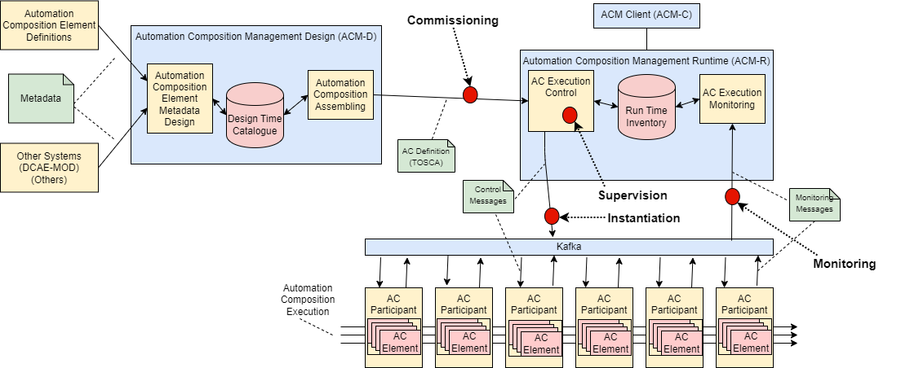
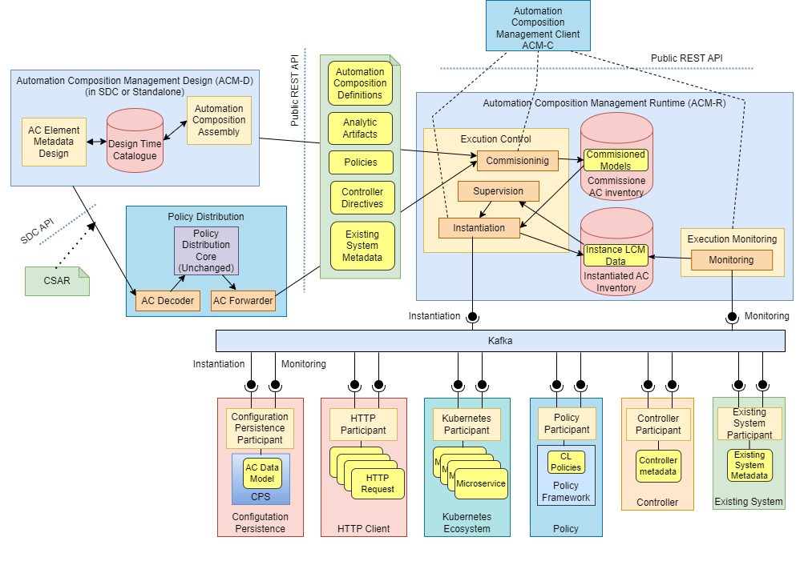
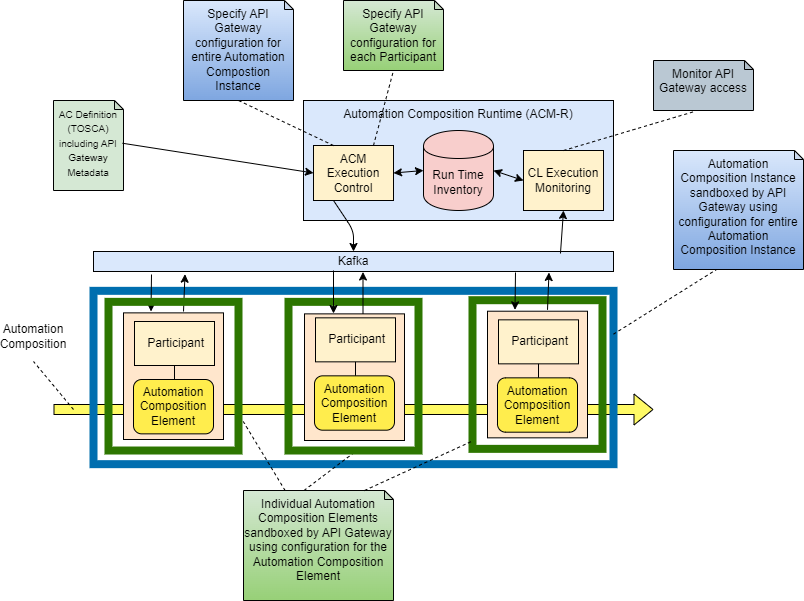

.. This work is licensed under a Creative Commons Attribution 4.0 International License.

.. _clamp-acm_architecture-label:

TOSCA Defined Automation Compositions: Architecture and Design
##############################################################

.. contents::
    :depth: 4

The idea of using automation compositions to automatically (or autonomously) perform network management
has been the subject of much research in the Network Management research community, see
:download:`this paper <files/Acms.pdf>` for some background. However, it is only with
the advent of ONAP that we have a platform that supports automation compositions for network management.
Before ONAP, Automation Compositions have been implemented by hard-coding components together and hard
coding logic into components. ONAP has taken a step forward towards automatic implementation
of Automation Compositions by allowing parameterization of Automation Compositions that work on the premise that
the Automation Compositions use a set of analytic, policy, and control components connected together in
set ways.

The goal of the work is to extend and enhance the current ONAP Automation Composition support to provide
a complete open-source framework for Automation Compositions. This will enhance the current support to
provide TOSCA based Automation Composition definition and development, commissioning and run-time management.
The participants that comprise a Automation Composition and the metadata needed to link the participants
together to create a Automation Composition are specified in a standardized way using the `OASIS TOSCA
modelling language <http://docs.oasis-open.org/tosca/TOSCA-Simple-Profile-YAML/>`_. The TOSCA
description is then used to commission, instantiate, and manage the Automation Compositions in the run
time system.

1 Terminology
=============

This section describes the terminology used in the system.

1.1 Automation Composition Terminology
--------------------------------------

**Automation Composition Type:** A definition of a Automation Composition in the TOSCA language. This definition describes
a certain type of a automation composition. The life cycle of instances of a Automation Composition Type are managed
by CLAMP.

**Automation Composition Instance:** An instance of a Automation Composition Type. The life cycle of a Automation Composition
Instance is managed by CLAMP. A Automation Composition Instance is a set of executing elements on which
Life Cycle Management (LCM) is executed collectively. For example, a set of microservices may be
spawned and executed together to deliver a service. This collection of services is a automation composition.

**Automation Composition Element Type:** A definition of a Automation Composition Element in the TOSCA language. This
definition describes a certain type of Automation Composition Element for a automation composition in a Automation
Composition Type.

**Automation Composition Element Instance:** A single entity executing on a participant, with its Life Cycle
being managed as part of the overall automation composition. For example, a single microservice that is
executing as one microservice in a service.

**CLAMP Automation Composition Runtime:** The CLAMP server that holds Automation Composition Type definitions and manages
the life cycle of Automation Composition Instances and their Automation Composition Elements in cooperation with
participants.

1.2 Participant Terminology
---------------------------

**Participant Type:** Definition of a type of system or framework that can take part in control
loops and a definition of the capabilities of that participant type. A participant advertises
its type to the CLAMP Automation Composition Runtime.

**Participant:** A system or framework that takes part in automation compositions by executing Automation Composition
Elements in cooperation with the CLAMP Automation Composition Runtime. A participant chooses to partake
in automation compositions, to manage Automation Composition Elements for CLAMP, and to receive, send and act on
LCM messages for the CLAMP runtime.

1.3 Terminology for Properties
------------------------------

**Common Properties:** Properties that apply to all Automation Composition Instances of a certain Automation
Composition Type and are specified when a Automation Composition Type is commissioned.

**Instance Specific Properties:** Properties that must be specified for each Automation Composition Instance
and are specified when a Automation Composition Instance is Initialized.

1.4 Concepts and their relationships
------------------------------------

The UML diagram below shows the concepts described in the terminology sections above and how
they are interrelated.

.. image:: images/02-acm-concepts.png

The Automation Composition Definition concepts describe the types of things that are in the system. These
concepts are defined at design time and are passed to the runtime in a TOSCA document. The
concepts in the Automation Composition Runtime are created by the runtime part of the system using the
definitions created at design time.

.. _acm-capabilities:

2 Capabilities
==============

We consider the capabilities of Automation Compositions at Design Time and Run Time.

At Design Time, three capabilities are supported:

#. **Automation Composition Element Definition Specification.** This capability allows users to define Automation
   Composition Element Types and the metadata that can be used on and configured on a Automation Composition Element
   Type. Users also define the Participant Type that will run the Automation Composition Element when it is
   taking part in in a automation composition. The post condition of an execution of this capability is that
   metadata for a Automation Composition Element Type is defined in the Automation Composition Design Time Catalogue.

#. **Automation Composition Element Definition Onboarding.** This capability allows external users and systems
   (such as SDC or DCAE-MOD) to define the metadata that can be used on and configured on a Automation
   Composition Element Type and to define the Participant Type that will run the Automation Composition Element when
   it is taking part in in a automation composition. The post condition of an execution of this capability
   is that metadata for a Automation Composition Element Type is defined in the Automation Composition Design Time
   Catalogue.

#. **Automation Composition Type Definition.** This capability allows users and other systems to create Automation
   Composition Type definitions by specifying a set of Automation Composition Element Definitions from those that
   are available in the Automation Composition Design Time Catalogue. These Automation Composition Elements will
   work together to form Automation Compositions. In an execution of this capability, a user specifies the
   metadata for the Automation Composition and specifies the set of Automation Composition Elements and their Participant
   Types. The user also selects the correct metadata sets for each participant in the Automation Composition
   Type and defines the overall Automation Composition Type metadata. The user also specifies the Common
   Property Types that apply to all instances of a automation composition type and the Instance Specific
   Property Types that apply to individual instances of a Automation Composition Type. The post condition for
   an execution of this capability is a Automation Composition definition in TOSCA stored in the Automation Composition
   Design Time Catalogue.

.. note::
    Once a Automation Composition Definition is commissioned to the Automation Composition Runtime and has been
    stored in the Run Time Inventory, it cannot be further edited unless it is decommissioned.

At Run Time, the following participant related capabilities are supported:

#. **System Pre-Configuration.** This capability allows participants to register and deregister
   with CLAMP. Participants explicitly register with CLAMP when they start. Automation Composition Priming
   is performed on each participant once it registers. The post condition for an execution of this
   capability is that a participant becomes available (registration) or is no longer available
   (deregistration) for participation in a automation composition.

#. **Automation Composition Priming on Participants.** A participant is primed to support a Automation Composition Type.
   Priming a participant means that the definition of a automation composition and the values of Common
   Property Types that apply to all instances of a automation composition type on a participant are sent
   to a participant. The participant can then take whatever actions it need to do to support
   the automation composition type in question. Automation Composition Priming takes place at participant
   registration and at Automation Composition Commissioning. The post condition for an execution of this
   capability is that all participants in this automation composition type are commissioned, that is they
   are prepared to run instances of their Automation Composition Element types.

At Run Time, the following Automation Composition Life Cycle management capabilities are supported:

#. **Automation Composition Commissioning:** This capability allows version controlled Automation Composition Type
   definitions to be taken from the Automation Composition Design Time Catalogue and be placed in the
   Commissioned Automation Composition Inventory. It also allows the values of Common Property Types
   that apply to all instances of a Automation Composition Type to be set. Further, the Automation Composition
   Type is primed on all concerned participants. The post condition for an execution of this
   capability is that the Automation Composition Type definition is in the Commissioned Automation Composition
   Inventory and the Automation Composition Type is primed on concerned participants.

#. **Automation Composition Instance Life Cycle Management:** This capability allows a Automation Composition
   Instance to have its life cycle managed.

   #. **Automation Composition Instance Creation:** This capability allows a Automation Composition Instance to be
      created. The Automation Composition Type definition is read from the Commissioned Automation Composition
      Inventory and values are assigned to the Instance Specific Property Types defined for
      instances of the Automation Composition Type in the same manner as the existing CLAMP client does.
      A Automation Composition Instance that has been created but has not yet been instantiated on
      participants is in state UNINITIALIZED. In this state, the Instance Specific Property Type
      values can be revised and updated as often as the user requires. The post condition for an
      execution of this capability is that the Automation Composition instance is created in the
      Instantiated Automation Composition Inventory but has not been instantiated on Participants.

   #. **Automation Composition Instance Update on Participants:** Once the user is happy with the property
      values, the Automation Composition Instance is updated on participants and the Automation Composition Elements
      for this Automation Composition Instance are initialized or updated by participants using the control
      loop metadata. The post condition for an execution of this capability is that the Automation
      Composition instance is updated on Participants.

   #. **Automation Composition State Change:** The user can now order the participants to change the state
      of the Automation Composition Instance. If the Automation Composition is set to state RUNNING, each participant
      begins accepting and processing automation composition events and the Automation Composition Instance is set
      to state RUNNING in the Instantiated Automation Composition inventory. The post condition for an
      execution of this capability is that the Automation Composition instance state is changed on
      participants.

   #. **Automation Composition Instance Monitoring:** This capability allows Automation Composition Instances to be
      monitored. Users can check the status of Participants, Automation Composition Instances, and Automation
      Composition Elements. Participants report their overall status and the status of Automation Composition
      Elements they are running periodically to CLAMP. Clamp aggregates these status reports
      into an aggregated Automation Composition Instance status record, which is available for monitoring.
      The post condition for an execution of this capability is that Automation Composition Instances are
      being monitored.

   #. **Automation Composition Instance Supervision:** This capability allows Automation Composition Instances to be
      supervised. The CLAMP runtime expects participants to report on Automation Composition Elements
      periodically. The CLAMP runtime checks that periodic reports are received and that each
      Automation Composition Element is in the state it should be in. If reports are missed or if a
      Automation Composition Element is in an incorrect state, remedial action is taken and notifications
      are issued. The post condition for an execution of this capability is that Automation Composition
      Instances are being supervised by the CLAMP runtime.

   #. **Automation Composition Instance Removal from Participants:** A user can order the removal of a Automation
      Composition Instance from participants. The post condition for an execution of this capability is
      that the Automation Composition instance is removed from Participants.

   #. **Automation Composition Instance Deletion:** A user can order the removal of a Automation Composition Instance
      from the CLAMP runtime. Automation Composition Instances that are instantiated on participants cannot
      be removed from the CLAMP runtime. The post condition for an execution of this capability
      is that the Automation Composition instance is removed from Instantiated Automation Composition Inventory.

#. **Automation Composition Decommissioning:** This capability allows version controlled Automation Composition Type
   definitions to be removed from the Commissioned Automation Composition Inventory. A Automation Composition
   Definition that has instances in the Instantiated Automation Composition Inventory cannot be removed.
   The post condition for an execution of this capability is that the Automation Composition Type
   definition removed from the Commissioned Automation Composition Inventory.

.. note::
    The system dialogues for run time capabilities are described in detail on the
    :ref:`System Level Dialogues <system-level-label>` page.

.. _acm-instance-states:

2.1 Automation Composition Instance States
------------------------------------------

When a automation composition definition has been commissioned, instances of the automation composition can be
created, updated, and deleted. The system manages the lifecycle of automation compositions and control
loop elements following the state transition diagram below.

.. image:: images/03-acm-instance-states.png

3 Overall Target Architecture
=============================

The diagram below shows an overview of the architecture of TOSCA based Automation Composition
Management in CLAMP.

Following the ONAP Reference Architecture, the architecture has a Design Time part and
a Runtime part.

The Design Time part of the architecture allows a user to specify metadata for participants.
It also allows users to compose automation compositions. The Design Time Catalogue contains the metadata
primitives and automation composition definition primitives for composition of automation compositions. As shown
in the figure above, the Design Time component provides a system where Automation Compositions can be
designed and defined in metadata. This means that a Automation Composition can have any arbitrary
structure and the Automation Composition developers can use whatever analytic, policy, or control
participants they like to implement their Automation Composition. At composition time, the user
parameterises the Automation Composition and stores it in the design time catalogue. This catalogue
contains the primitive metadata for any participants that can be used to compose a Automation
Composition. A Automation Composition SDK is used to compose a Automation Composition by aggregating the metadata for
the participants chosen to be used in a Automation Composition and by constructing the references between
the participants. The architecture of the Automation Composition Design Time part will be elaborated in
future releases.

Composed Automation Compositions are commissioned on the run time part of the system, where they are
stored in the Commissioned Automation Composition inventory and are available for instantiation. The
Commissioning component provides a CRUD REST interface for Automation Composition Types, and implements
CRUD of Automation Composition Types. Commissioning also implements validation and persistence of incoming
Automation Composition Types. It also guarantees the integrity of updates and deletions of Automation Composition
Types, such as performing updates in accordance with semantic versioning rules and ensuring that
deletions are not allowed on Automation Composition Types that have instances defined.

The Instantiation component manages the Life Cycle Management of Automation Composition Instances and
their Automation Composition Elements. It publishes a REST interface that is used to create Automation Composition
Instances and set values for Common and Instance Specific properties. This REST interface is
public and is used by the CLAMP GUI. It may also be used by any other client via the public
REST interface. the REST interface also allows the state of Automation Composition Instances to be changed.
A user can change the state of Automation Composition Instances as described in the state transition
diagram shown in section 2 above. The Instantiation component issues update and state change
messages via DMaaP to participants so that they can update and manage the state of the Automation
Composition Elements they are responsible for. The Instantiation component also implements persistence
of Automation Composition Instances, automation composition elements, and their state changes.

The Monitoring component reads updates sent by participants. Participants report on the
state of their Automation Composition Elements periodically and in response to a message they have
received from the Instantiation component. The Monitoring component reads the contents of
the participant messages and persists their state updates and statistics records. It also
publishes a REST interface that publishes the current state of all Participants, Automation
Composition Instances and their Automation Composition Elements, as well as publishing Participant and
Automation Composition statistics.

The Supervision component is responsible for checking that Automation Composition Instances are correctly
instantiated and are in the correct state (UNINITIALIZED/READY/RUNNING). It also handles
timeouts and on state changes to Automation Composition Instances, and retries and rolls back state
changes where state changes failed.

A Participant is an executing component that partakes in automation compositions. More explicitly, a
Participant is something that implements the Participant Instantiation and Participant
Monitoring messaging protocol over DMaaP for Life Cycle management of Automation Composition Elements.
A Participant runs Automation Composition Elements and manages and reports on their life cycle
following the instructions it gets from the CLAMP runtime in messages delivered over DMaaP.

In the figure above, five participants are shown. A Configuration Persistence Participant
manages Automation Composition Elements that interact with the `ONAP Configuration Persistence Service
<https://docs.onap.org/projects/onap-cps/en/latest/overview.html>`_
to store common data. The DCAE Participant runs Automation Composition Elements that manage DCAE
microservices. The Kubernetes Participant hosts the Automation Composition Elements that are managing
the life cycle of microservices in automation compositions that are in a Kubernetes ecosystem. The
Policy Participant handles the Automation Composition Elements that interact with the Policy Framework
to manage policies for automation compositions. A Automation Participant such as the CDS Participant
runs Automation Composition Elements that load metadata and configure controllers so that they can
partake in automation compositions. Any third party Existing System Participant can be developed to
run Automation Composition Elements that interact with any existing system (such as an operator's
analytic, machine learning, or artificial intelligence system) so that those systems can
partake in automation compositions.

4. Other Considerations
=======================

.. _management-acm-instance-configs:

4.1 Management of Automation Composition Instance Configurations
----------------------------------------------------------------

In order to keep management of versions of the configuration of automation composition instances
straightforward and easy to implement, the following version management scheme using
semantic versioning is implemented. Each configuration of a Automation Composition Instance and
configuration of a Automation Composition Element has a semantic version with 3 digits indicating
the **major.minor.patch** number of the version.

.. note::
    A **configuration** means a full set of parameter values for a Automation Composition Instance.

Change constraints:

#. A Automation Composition or Automation Composition Element in state **RUNNING** can be changed to a higher patch
   level or rolled back to a lower patch level. This means that hot changes that do not
   impact the structure of a Automation Composition or its elements can be executed.

#. A Automation Composition or Automation Composition Element in state **PASSIVE** can be changed to a higher
   minor/patch level or rolled back to a lower minor/patch level. This means that structural
   changes to Automation Composition Elements that do not impact the Automation Composition as a whole can be
   executed by taking the automation composition to state **PASSIVE**.

#. A Automation Composition or Automation Composition Element in state **UNINITIALIZED** can be changed to a higher
   major/minor/patch level or rolled back to a lower major/minor/patch level. This means
   that where the structure of the entire automation composition is changed, the automation composition must
   be uninitialized and reinitialized.

#. If a Automation Composition Element has a **minor** version change, then its Automation Composition Instance
   must have at least a **minor** version change.

#. If a Automation Composition Element has a **major** version change, then its Automation Composition Instance
   must have a **major** version change.

4.2 Scalability
---------------

The system is designed to be inherently scalable. The CLAMP runtime is stateless, all state
is preserved in the Instantiated Automation Composition inventory in the database. When the user
requests an operation such as an instantiation, activation, passivation, or an uninitialization
on a Automation Composition Instance, the CLAMP runtime broadcasts the request to participants over
DMaaP and saves details of the request to the database. The CLAMP runtime does not directly
wait for responses to requests.

When a request is broadcast on DMaaP, the request is asynchronously picked up by participants
of the types required for the Automation Composition Instance and those participants manage the life
cycle of its automation composition elements. Periodically, each participant reports back on the status
of operations it has picked up for the Automation Composition Elements it controls, together with
statistics on the Automation Composition Elements over DMaaP. On reception of these participant messages,
the CLAMP runtime stores this information to its database.

The participant to use on a automation composition can be selected from the registered participants
in either of two ways:

**Runtime-side Selection:** The CLAMP runtime selects a suitable participant from the list of
participants and sends the participant ID that should be used in the Participant Update message.
In this case, the CLAMP runtime decides on which participant will run the Automation Composition Element
based on a suitable algorithm. Algorithms could be round robin based or load based.

**Participant-side Selection:** The CLAMP runtime sends a list of Participant IDs that may be used
in the Participant Update message. In this case, the candidate participants decide among
themselves which participant should host the Automation Composition Element.

This approach makes it easy to scale Automation Composition life cycle management. As Automation Composition
Instance counts increase, more than one CLAMP runtime can be deployed and REST/supervision
operations on Automation Composition Instances can run in parallel. The number of participants can
scale because an asynchronous broadcast mechanism is used for runtime-participant communication
and there is no direct connection or communication channel between participants and CLAMP
runtime servers. Participant state, Automation Composition Instance state, and Automation Composition Element
state is held in the database, so any CLAMP runtime server can handle operations for any
participant. Because many participants of a particular type can be deployed and participant
instances can load balance automation composition element instances for different Automation Composition Instances
of many types across themselves using a mechanism such as a Kubernetes cluster.

4.3 Sandboxing and API Gateway Support
--------------------------------------

At runtime, interaction between ONAP platform services and application microservices are
relatively unconstrained, so interactions between Automation Composition Elements for a given Automation
Composition Instance remain relatively unconstrained. A
`proposal to support access-controlled access to and between ONAP services
<https://wiki.onap.org/pages/viewpage.action?pageId=103417456>`_
will improve this. This can be complemented by intercepting and controlling services
accesses between Automation Composition Elements for Automation Composition Instances for some/all Automation
Composition types.

API gateways such as `Kong <https://konghq.com/kong/>`_ have emerged as a useful technology
for exposing and controlling service endpoint access for applications and services. When a
Automation Composition Type is onboarded, or when Automation Composition Instances are created in the Participants,
CLAMP can configure service endpoints between Automation Composition Elements to redirect through an
API Gateway.

Authentication and access-control rules can then be dynamically configured at the API gateway
to support constrained access between Automation Composition Elements and Automation Composition Instances.

The diagram below shows the approach for configuring API Gateway access at Automation Composition
Instance and Automation Composition Element level.

At design time, the Automation Composition type definition specifies the type of API gateway configuration
that should be supported at Automation Composition and Automation Composition Element levels.

At runtime, the CLAMP can configure the API gateway to enable (or deny) interactions between
Automation Composition Instances and individually for each Automation Composition Element. All service-level
interactions in/out of a Automation Composition Element, except that to/from the API Gateway, can be
blocked by networking policies, thus sandboxing a Automation Composition Element and an entire Automation
Composition Instance if desired. Therefore, a Automation Composition Element will only have access to the APIs
that are configured and enabled for the Automation Composition Element/Instance in the API gateway.

For some Automation Composition Element Types the Participant can assist with service endpoint
reconfiguration, service request/response redirection to/from the API Gateway, or
annotation of requests/responses.

Once the Automation Composition instance is instantiated on participants, the participants configure
the API gateway with the Automation Composition Instance level configuration and with the specific
configuration for their Automation Composition Element.

Monitoring and logging of the use of the API gateway may also be provided. Information and
statistics on API gateway use can be read from the API gateway and passed back in monitoring
messages to the CLAMP runtime.

Additional isolation and execution-environment sandboxing can be supported depending on the
Automation Composition Element Type. For example: ONAP policies for given Automation Composition Instances/Types
can be executed in a dedicated PDP engine instances; DCAE or K8S-hosted services can executed
in isolated namespaces or in dedicated workers/clusters; etc..

5 APIs and Protocols
====================

The APIs and Protocols used by CLAMP for Automation Compositions are described on the pages below:

#. :ref:`System Level Dialogues <system-level-label>`
#. :ref:`The CLAMP Automation Composition Participant Protocol <acm-participant-protocol-label>`
#. :ref:`REST APIs for CLAMP Automation Compositions <acm-rest-apis-label>`

6 Design and Implementation
===========================

The design and implementation of TOSCA Automation Compositions in CLAMP is described for each executable entity on the pages below:

#. :ref:`The CLAMP Automation Composition Runtime Server <clamp-runtime-acm>`
#. :ref:`CLAMP Automation Composition Participants <clamp-acm-participants>`
#. :ref:`Managing Automation Compositions using The CLAMP GUI <clamp-gui-acm>`

End of Document
