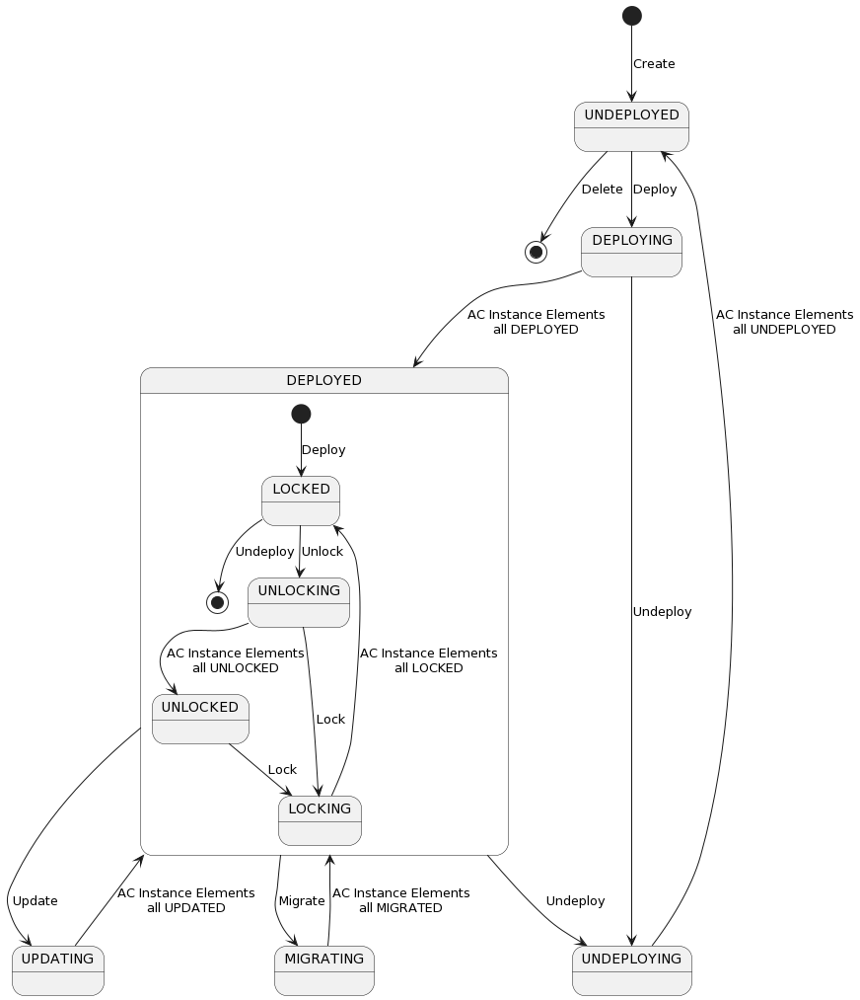
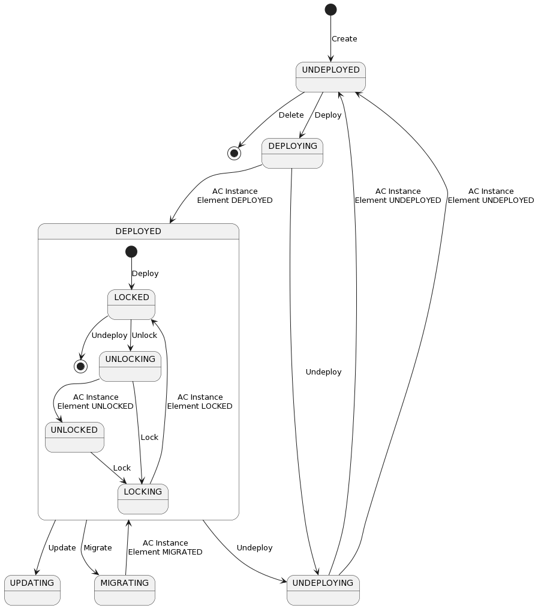
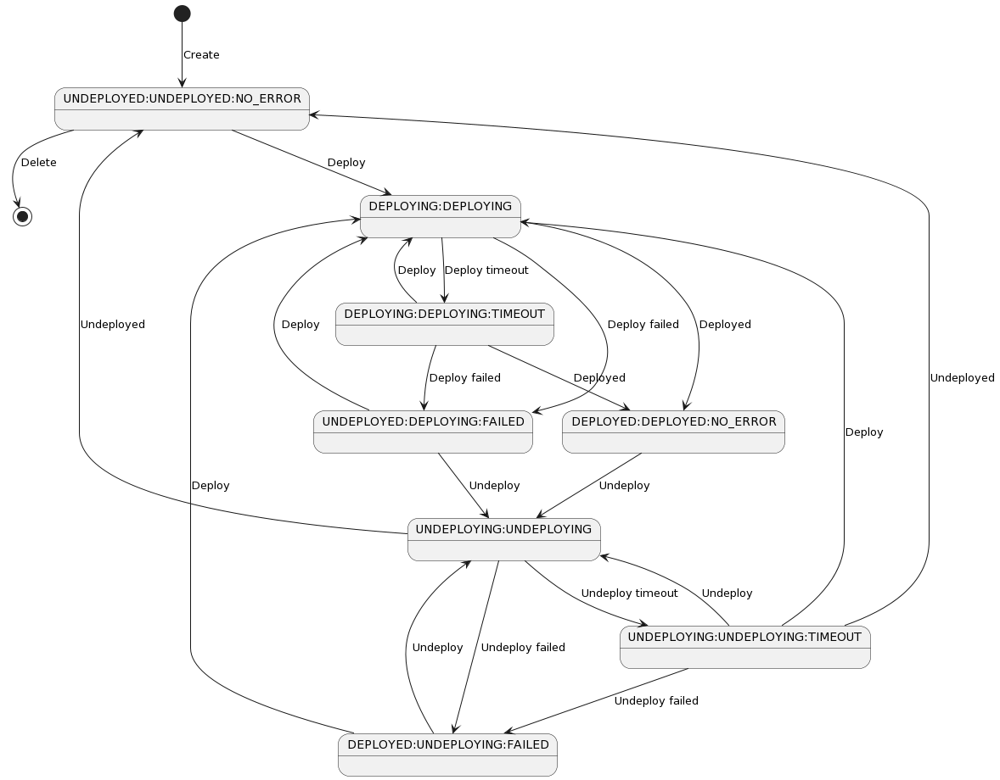

.. This work is licensed under a Creative Commons Attribution 4.0 International License.

.. _acm-states-label:

ACM States
##########

.. contents::
    :depth: 4

Automation Composition Management manages a number of states of various types to manage the lifecycle of compositions. Those states are described here. Please also see the ACM System Level Dialogues page to see the system dialogues that change states and how states interrelate in detail. Please also see ITU Recommendation X.731, which is reflected in the states of AC Element Instances.

Participant Replica State
=========================
Any participant could have more than one replica.
Participant replica states are NOT managed by ACM but the state of a participant replica is recorded and supervised by ACM.

Automation Composition Type State
=================================
The states that an Automation Composition Type can have, are shown in the diagram below.

Automation Composition Element Type State
=========================================
The states that an Automation Composition Element Type can have on ACM Runtime are shown in the diagram below.

The states that an Automation Composition Element Type can have on a Participant are shown in the diagram below.

The states diagram below, shows the fail and timeout scenario.
In that diagram the state is presented using this combination [ Composition Element Type State : Composition Type State : StateChangeResult ].

Automation Composition Instance State
=====================================
The states that an Automation Composition Instance can have are shown in the diagram below.

Automation Composition Element Instance State
=============================================
The states that an Automation Composition Element Instance can have on ACM Runtime are shown in the diagram below.

The states that an Automation Composition Element Instance can have on a Participant are shown in the diagram below.

Automation Composition State with fail and timeout
==================================================
The states that an Automation Composition Element Instance can have for each flow, are shown in the diagrams below.
For each diagram the state is presented using this combination [ Instance Element State : Instance State : StateChangeResult ].

Deploy
------

Update
------

Migrate
-------

Delete
------

Automation Composition Instance Sub State
=========================================
The sub states that an Automation Composition Instance can have are shown in the diagram below.

.. image:: images/acm-states/AcInstanceSubStates.png

How State are saved in DB
=========================
Any state will be saved in DB as number:

Participant Replica State
-------------------------

+--------------------+------------+
|  ParticipantState  |  Database  |
+====================+============+
|  ON_LINE           |         0  |
+--------------------+------------+
|  OFF_LINE          |         1  |
+--------------------+------------+

Automation Composition Type State
---------------------------------

+----------------+------------+
|  AcTypeState   |  Database  |
+================+============+
|  COMMISSIONED  |         0  |
+----------------+------------+
|  PRIMING       |         1  |
+----------------+------------+
|  PRIMED        |         2  |
+----------------+------------+
|  DEPRIMING     |         3  |
+----------------+------------+

Automation Composition Instance DeployState
===========================================

+---------------+------------+
|  DeployState  |  Database  |
+===============+============+
|  DEPLOYED     |         0  |
+---------------+------------+
|  DEPLOYING    |         1  |
+---------------+------------+
|  UNDEPLOYED   |         2  |
+---------------+------------+
|  UNDEPLOYING  |         3  |
+---------------+------------+
|  DELETING     |         4  |
+---------------+------------+
|  DELETED      |         5  |
+---------------+------------+
|  UPDATING     |         6  |
+---------------+------------+
|  MIGRATING    |         7  |
+---------------+------------+

Automation Composition Instance Lock State
==========================================

+-------------+------------+
|  LockState  |  Database  |
+=============+============+
|  LOCKED     |         0  |
+-------------+------------+
|  LOCKING    |         1  |
+-------------+------------+
|  UNLOCKED   |         2  |
+-------------+------------+
|  UNLOCKING  |         3  |
+-------------+------------+
|  NONE       |         4  |
+-------------+------------+

Automation Composition Instance Sub State
=========================================

+-------------------------+------------+
|  SubState               |  Database  |
+=========================+============+
|  NONE                   |         0  |
+-------------------------+------------+
|  MIGRATION_PRECHECKING  |         1  |
+-------------------------+------------+
|  PREPARING              |         2  |
+-------------------------+------------+
|  REVIEWING              |         3  |
+-------------------------+------------+

End of Document
