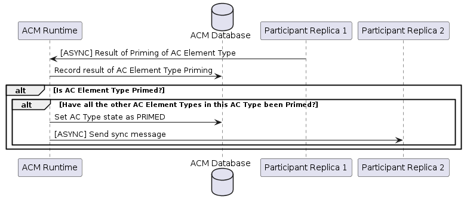
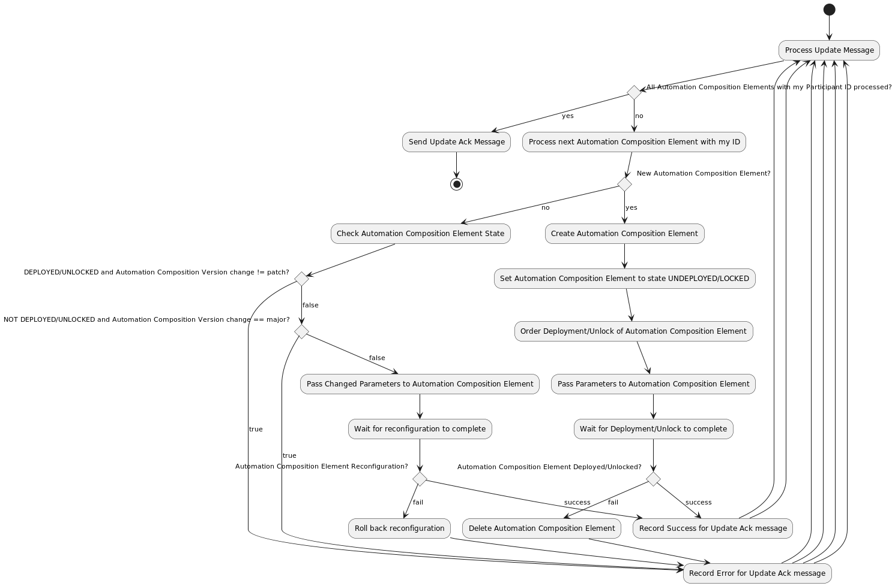
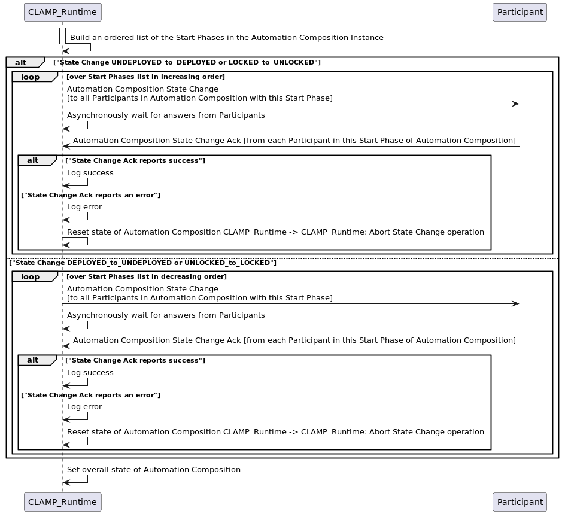
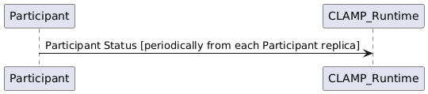

.. This work is licensed under a Creative Commons Attribution 4.0 International License.

.. _acm-participant-protocol-label:

The ACM Automation Composition Participant Protocol
###################################################

The ACM Automation Composition protocol is an asynchronous protocol that is used by the ACM
runtime to coordinate lifecycle management of Automation Composition instances. The protocol
supports the functions described in the sections below.

Protocol Dialogues
==================

The protocol supports the dialogues described below.

Participant Registration and De-Registration
--------------------------------------------

Participant Registration is performed by a Participant when it starts up. It registers its ID and the ACM Element Types it supports with the ACM runtime.
In a scenario where Participant has been restarted, ACM runtime have to provide all Primed ACM Definition and Deployed ACM instances of the Participant sending a Restart message.

.. image:: ../images/system-dialogues/RegisterParticipant.png

Participant Deregistration is performed by a Participant when it shuts down. It deregisters its ID and type with the ACM runtime.

.. image:: ../images/system-dialogues/DeregisterParticipant.png

Automation Composition Priming and De-Priming
---------------------------------------------

The Priming operation sends Automation Composition Types and common property values to participants for each Automation Composition Element Type in the Automation Composition Type. The ParticipantPrime message type is sent to trigger priming and depriming in participants in participants

.. image:: ../images/system-dialogues/PrimeAcTypeOnPpnts.png

A participant should respond for each Automation Composition Element Type, thus causing the full Automation Composition Type to become primed. Note that if more than one participant can support an Automation Composition Element Type the ACM Runtime uses the participant in the first response it receives for that Automation Composition Element Type.

The ACM Runtime updates the priming information in the database.

The Depriming operation removes Automation Composition Types and common property values on participants for each Automation Composition Element Type in the Automation Composition Type.

.. image:: ../images/system-dialogues/DeprimeOnParticipants.png

A participant should respond for each Automation Composition Element Type, thus causing the full Automation Composition Type to become deprimed.

.. image:: ../images/system-dialogues/DeprimeElements.png

The ACM Runtime updates the priming information in the database.

.. image:: ../images/system-dialogues/UpdateDeprimeInDb.png

Automation Composition Update
-----------------------------

Automation Composition Update handles creation, change, and deletion of Automation Compositions on
participants. Change of Automation Compositions uses a semantic versioning approach and follows the
semantics described on the page :ref:`4.1 Management of Automation Composition Instance
Configurations <management-acm-instance-configs>`.

.. image:: ../images/acm-participants-protocol/acm-update.png

The handling of an *ACMUpdate* message in each participant is as shown below.

Automation Composition State Change
-----------------------------------

This dialogue is used to change the state of Automation Compositions and their Automation
Composition Elements. The CLAMP Runtime sends an Automation Composition State Change message on the
Automation Composition to all participants. Participants that have Automation Composition Elements
in that Automation Composition attempt an update on the state of the Automation Composition
elements they have for that Automation Composition, and report the result back.

The *startPhase* in the `Definition of TOSCA fundamental Automation Composition Types
<https://github.com/onap/policy-clamp/blob/master/common/src/main/resources/tosca/AutomationCompositionTOSCAServiceTemplateTypes.yaml>`_
is particularly important in Automation Composition state changes because sometimes the user wishes
to control the order in which the state changes in Automation Composition Elements in an Automation
Composition. In-state changes from *UNDEPLOYED → DEPLOYED*,
Automation Composition elements are started in increasing order of their startPhase. In-state
changes from *DEPLOYED → UNDEPLOYED*, Automation Composition
elements are started in decreasing order of their *startPhase*.

The ACM runtime controls the state change process described in the diagram below. The ACM
runtime sends an Automation Composition state change message on the messaging system (e.g. Kafka) to all participants in a
particular start phase so, in each state change multiple Automation Composition State Change
messages are sent, one for each start phase in the Automation Composition. If more than one
Automation Composition Element has the same start phase, those Automation Composition Elements
receive the same Automation Composition State Change message from Kafka and start in parallel.

The Participant reads each State Change Message it sees on Kafka. If the start phase on the
Automation Composition State Change message matches the Start Phase of the Automation Composition
Element, the participant processes the state change message. Otherwise, the participant ignores the
message.

The flow of the DEPLOY/UNDEPLOY state change messages are shown below. But the same flow is true for LOCK/UNLOCK and DELETE

.. note:: More details of the state machine are available on :ref:`ACM States <acm-states-label>`

.. image:: ../images/acm-participants-protocol/acm-state-change-msg.png

Automation Composition Monitoring and Reporting
-----------------------------------------------

This dialogue is used as a heartbeat mechanism for participants, to monitor the status of
Automation Composition Elements, and to gather statistics on Automation Compositions. The
*ParticipantStatus* message is sent periodically by each participant. The reporting interval for
sending the message is configurable.

Messages
========

The CLAMP Automation Composition Participant Protocol uses the following messages. The
descriptions below give an overview of each message. For the precise definition of the messages,
see the `CLAMP code at Github
<https://github.com/onap/policy-clamp/tree/montreal/models/src/main/java/org/onap/policy/clamp/models/acm/messages/dmaap/participant>`_
. All messages are carried on DMaaP.

.. csv-table:: ACM Messages
  :file: ../files/ACM-Message-Table.csv
  :header-rows: 1

End of Document
