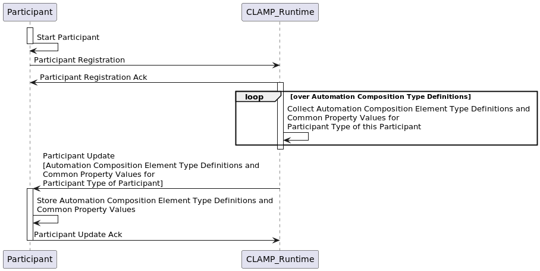
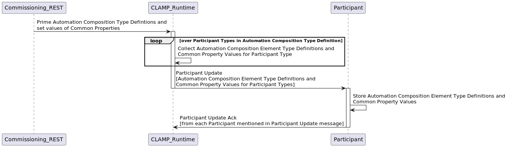
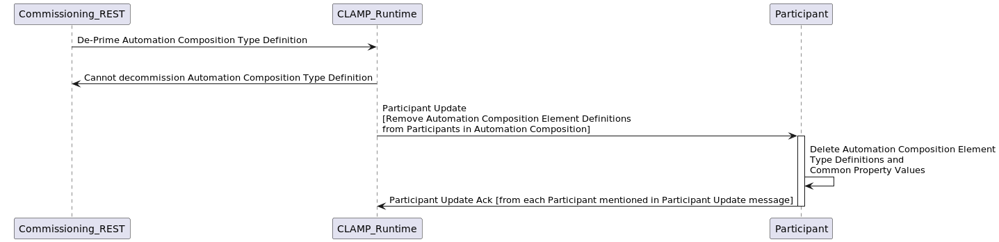
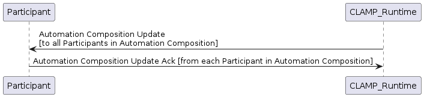
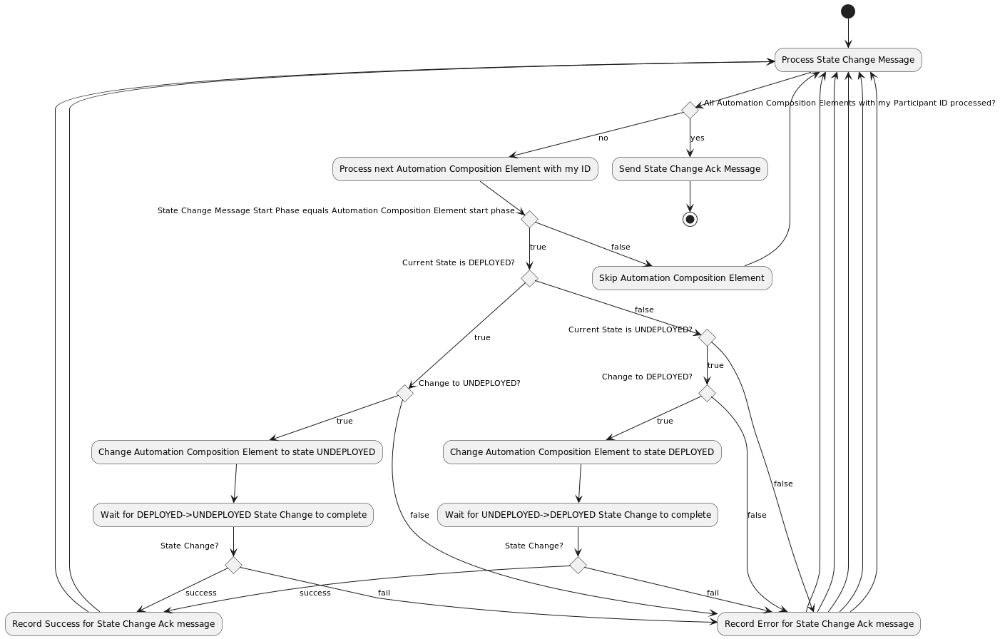

.. This work is licensed under a Creative Commons Attribution 4.0 International License.

.. _acm-participant-protocol-label:

The ACM Automation Composition Participant Protocol
###################################################

The CLAMP Automation Composition protocol is an asynchronous protocol that is used by the CLAMP runtime to coordinate
lifecycle management of Automation Composition instances. The protocol supports the functions described in the sections
below.

Protocol Dialogues
==================

The protocol supports the dialogues described below.

Participant Registration and De-Registration
--------------------------------------------

Registration when a participant comes up and update of participant with Automation Composition type information and
common parameter values for its Automation Composition types.

De-registration is executed as a participant goes down.

Automation Composition Priming and De-Priming
---------------------------------------------

When an Automation Composition is primed, the portion of the Automation Composition Type Definition and Common Property
values for the participants of each participant type mentioned in the Automation Composition Definition are sent to the
participants.

When an Automation Composition is de-primed, the portion of the Automation Composition Type Definition and Common
Property values for the participants of each participant type mentioned in the Automation Composition
Definition are deleted on participants.

Automation Composition Update
-----------------------------

Automation Composition Update handles creation, change, and deletion of Automation Compositions on participants. Change
of Automation Compositions uses a semantic versioning approach and follows the semantics described on the page
`4.1 Management of Automation Composition Instance Configurations <management-cl-instance-configs>`.

The handling of an *ACMUpdate* message in each participant is as shown below.

.. image:: ../images/acm-participants-protocol/acm-update-msg.png

Automation Composition State Change
-----------------------------------

This dialogue is used to change the state of Automation Compositions and their Automation Composition Elements. The
CLAMP Runtime sends an Automation Composition State Change message on the Automation Composition to all participants.
Participants that have Automation Composition Elements in that Automation Composition attempt an update on the state
of the Automation Composition elements they have for that Automation Composition, and report the result back.

The *startPhase* in the `Definition of TOSCA fundamental Automation Composition Types
<https://github.com/onap/policy-clamp/blob/master/common/src/main/resources/tosca/AutomationCompositionTOSCAServiceTemplateTypes.yaml>`_
is particularly important in Automation Composition state changes because sometimes the user wishes to control the
order in which the state changes in Automation Composition Elements in an Automation Composition. In-state changes
from *UNITITIALISED → PASSIVE* and from *PASSIVE → RUNNING*, Automation Composition elements are started in increasing
order of their startPhase. In-state changes from *RUNNING → PASSIVE* and from *PASSIVE → UNITITIALISED*, Automation
Composition elements are started in decreasing order of their *startPhase*.

The CLAMP runtime controls the state change process described in the diagram below. The CLAMP runtime sends an
Automation Composition state change message on DMaaP to all participants in a particular start phase so, in each state
change multiple Automation Composition State Change messages are sent, one for each start phase in the Automation
Composition. If more than one Automation Composition Element has the same start phase, those Automation Composition
Elements receive the same Automation Composition State Change message from DMaaP and start in parallel.

The Participant reads each State Change Message it sees on DMaaP. If the start phase on the Automation Composition
State Change message matches the Start Phase of the Automation Composition Element, the participant processes the state
change message. Otherwise, the participant ignores the message.

.. image:: ../images/acm-participants-protocol/acm-state-change.png

The handling of an ACMStateChange message in each participant is as shown below.

Automation Composition Monitoring and Reporting
-----------------------------------------------

This dialogue is used as a heartbeat mechanism for participants, to monitor the status of Automation Composition
Elements, and to gather statistics on Automation Compositions. The *ParticipantStatus* message is sent periodically by
each participant. The reporting interval for sending the message is configurable.

.. image:: ../images/acm-participants-protocol/acm-monitoring.png

Messages
========

The CLAMP Automation Composition Participant Protocol uses the following messages. The descriptions below give
an overview of each message. For the precise definition of the messages, see the `CLAMP code at Github
<https://github.com/onap/policy-clamp/tree/master/models/src/main/java/org/onap/policy/clamp/models/acm/messages/dmaap/participant>`_
. All messages are carried on DMaaP.

.. list-table::
   :widths: 15 10 10 15 15 35
   :header-rows: 1

   * - Message
     - Source
     - Target
     - Purpose
     - Important Fields
     - Field Descriptions
   * - ParticipantRegister
     - Participant
     - CLAMP Runtime
     - Participant registers with the CLAMP runtime
     - ParticipantId
     - The ID of this participant
   * -
     -
     -
     -
     - ParticipantType
     - The type of the participant; maps to the capabilities of the participant in Automation Composition Type
       Definitions
   * - ParticipantRegisterAck
     - CLAMP Runtime
     - Participant
     - Acknowledgment of Participant Registration
     - ParticipantId
     - The ID of this participant
   * -
     -
     -
     -
     - ParticipantType
     - The type of the participant; maps to the capabilities of the participant in Automation Composition Type
       Definitions
   * -
     -
     -
     -
     - Result
     - Success/Fail
   * -
     -
     -
     -
     - Message
     - A message indicating the reason for failure
   * - ParticipantUpdate
     - CLAMP Runtime
     - Participant
     - CLAMP Runtime sends Automation Composition Element Definitions and Common Parameter Values to Participants
     - ParticipantDefinitionUpdateMap
     - Map with Participant ID as its key, each value on the map is an ACMElementDefintionMap
   * -
     -
     -
     -
     - ACMElementDefintionMap
     - List of ACMElementDefinition values for a particular participant, keyed by its Control
       Loop Element Definition ID
   * -
     -
     -
     -
     - ACMElementDefinition
     - An ACMElementToscaServiceTemplate containing the definition of the Automation Composition Element
       and a CommonPropertiesMap with the values of the common property values for Automation Composition Elements
       of this type
   * -
     -
     -
     -
     - ACMElementToscaServiceTemplate
     - The definition of the Automation Composition Element in TOSCA
   * -
     -
     -
     -
     - CommonPropertiesMap
     - A <String, String> map indexed by the property name. Each map entry is the serialized value of
       the property, which can be deserialized into an instance of the type of the property.
   * - ParticipantUpdateAck
     - Participant
     - CLAMP Runtime
     - Acknowledgment of Participant Update
     - ParticipantId
     - The ID of this participant
   * -
     -
     -
     -
     - ParticipantType
     - The type of the participant; maps to the capabilities of the participant in Automation Composition Type
       Definitions
   * -
     -
     -
     -
     - Result
     - Success/Fail
   * -
     -
     -
     -
     - Message
     - A message indicating the reason for failure
   * - ParticipantDeregister
     - Participant
     - CLAMP Runtime
     - Participant deregisters with the CLAMP runtime
     - ParticipantId
     - The ID of this participant
   * -
     -
     -
     -
     - ParticipantType
     - The type of the participant; maps to the capabilities of the participant in Automation Composition Type
       Definitions
   * - ParticipantDeregisterAck
     - CLAMP Runtime
     - Participant
     - Acknowledgment of Participant Deegistration
     - ParticipantId
     - The ID of this participant
   * -
     -
     -
     -
     - ParticipantType
     - The type of the participant; maps to the capabilities of the participant in Automation Composition Type
       Definitions
   * -
     -
     -
     -
     - Result
     - Success/Fail
   * -
     -
     -
     -
     - Message
     - A message indicating the reason for failure
   * - ACMUpdate
     - CLAMP Runtime
     - Participant
     - CLAMP Runtime sends Automation Composition Element instances and Instance Specific Parameter Values for
       an Automation Composition Instance to Participants
     - ACMId
     - The name and version of the Automation Composition
   * -
     -
     -
     -
     - ParticipantUpdateMap
     - Map with Participant ID as its key, each value on the map is an ACMElementList
   * -
     -
     -
     -
     - ACMElementList
     - List of ACMElement values for the Automation Composition
   * -
     -
     -
     -
     - ACMElement
     - An ACMElement, which contains among other things a PropertiesMap with the values of the
       property values for this Automation Composition Element instance and a ToscaServiceTemplateFragment with
       extra concept definitions and instances that a participant may need.
   * -
     -
     -
     -
     - PropertiesMap
     - A <String, String> map indexed by the property name. Each map entry is the serialized value of
       the property, which can be deserialized into an instance of the type of the property.
   * -
     -
     -
     -
     - ToscaServiceTemplateFragment
     - A well-formed TOSCA service template containing extra concept definitions and instances that a
       participant may need. For example, the Policy Participant may need policy type definitions or
       policy instances to be provided if they are not already stored in the Policy Framework.
   * - ACMUpdateAck
     - Participant
     - CLAMP Runtime
     - Acknowledgment of Automation Composition Update
     - ParticipantId
     - The ID of this participant
   * -
     -
     -
     -
     - ParticipantType
     - The type of the participant; maps to the capabilities of the participant in Automation Composition Type
       Definitions
   * -
     -
     -
     -
     - ACMId
     - The name and version of the Automation Composition
   * -
     -
     -
     -
     - ACMResult
     - Holds a Result and Message for the overall operation on the participant and a map of Result
       and Message fields for each Automation Composition Element of the Automation Composition on this participant
   * -
     -
     -
     -
     - Result
     - Success/Fail
   * -
     -
     -
     -
     - Message
     - A message indicating the reason for failure
   * - ACMStateChange
     - CLAMP Runtime
     - Participant
     - CLAMP Runtime asks Participants to change the state of an Automation Composition
     - ACMId
     - The name and version of the Automation Composition
   * -
     -
     -
     -
     - currentState
     - The current state of the Automation Composition
   * -
     -
     -
     -
     - orderedState
     - The state that the Automation Composition should transition to
   * -
     -
     -
     -
     - startPhase
     - The start phase to which this ACMStateChange message applies
   * - ACMStateChangeAck
     - Participant
     - CLAMP Runtime
     - Acknowledgment of Automation Composition State Change
     - ParticipantId
     - The ID of this participant
   * -
     -
     -
     -
     - ParticipantType
     - The type of the participant; maps to the capabilities of the participant in Automation Composition Type
       Definitions
   * -
     -
     -
     -
     - ACMId
     - The name and version of the Automation Composition
   * -
     -
     -
     -
     - startPhase
     - The start phase to which this ACMStateChangeAck message applies
   * -
     -
     -
     -
     - ACMResult
     - Holds a Result and Message for the overall operation on the participant and a map of Result and
       Message fields for each Automation Composition Element of the Automation Composition on this participant
   * -
     -
     -
     -
     - Result
     - Success/Fail
   * -
     -
     -
     -
     - Message
     - A message indicating the reason for failure
   * - ParticipantStatusReq
     - CLAMP Runtime
     - Participant
     - Request that the specified participants return a ParticipantStatus message immediately
     - ParticipantId
     - The ID of this participant, if not specified, all participants respond.
   * - ParticipantStatus
     - Participant
     - CLAMP Runtime
     - Periodic or on-demand report for heartbeat, Participant Status, Automation Composition Status, and Control
       Loop Statistics
     - ParticipantId
     - The ID of this participant
   * -
     -
     -
     -
     - ParticipantType
     - The type of the participant; maps to the capabilities of the participant in Automation Composition
       Type Definitions
   * -
     -
     -
     -
     - ParticipantDefinitionUpdateMap (returned in repsonse to ParticipantStatusReq only)
     - See ParticipantUpdate message above for definition of this field
   * -
     -
     -
     -
     - ParticipantStatus
     - The current status of the participant for monitoring
   * -
     -
     -
     -
     - ParticipantStatistics
     - Statistics on the participant such as uptime, or messages processed. Can include participant
       specific data in a string blob that is opaque to CLAMP
   * -
     -
     -
     -
     - ACMInfoMap
     - A map of ACMInfo types indexed by ACMId, one entry for each Automation Composition
       running on the participant
   * -
     -
     -
     -
     - ACMInfo
     - The ACMStatus and ACMStatistics for a given Automation Composition
   * -
     -
     -
     -
     - ACMStatus
     - The current status of the Automation Composition for monitoring
   * -
     -
     -
     -
     - ACMStatistics
     - Statistics on the Automation Composition such as uptime, or messages processed. Can include participant
       specific data in a string blob that is opaque to CLAMP

End of Document
