.. This work is licensed under a Creative Commons Attribution 4.0 International License.

.. _system-level-label:

ACM System Level Dialogues
##########################
Priming The CLAMP Automation Composition Runtime Lifecycle Management uses the following system-level dialogues. These dialogues enable the CLAMP runtime capabilities described in Section 2 of TOSCA Defined Automation Compositions: Architecture and Design. Design Time dialogues will be described in future releases of the system.

.. contents::
    :depth: 4

1 Dialogues on Participants
===========================
1.1 Register a Participant
--------------------------

Participant Registration is performed by a Participant when it starts up. It registers its ID and the ACM Element Types it supports with the ACM runtime.

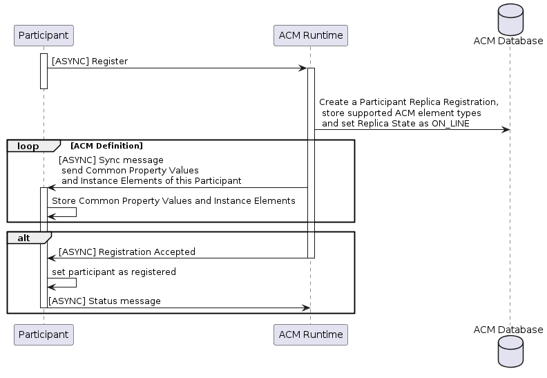

1.2 Deregister a Participant
----------------------------
Participant Deregistration is performed by a Participant when it shuts down. It deregisters its ID and type with the ACM runtime.

.. image:: ../images/system-dialogues/DeregisterParticipant.png

1.3 Supervise Participants
--------------------------
Participant Supervision is performed periodically between participants and the ACM runtime server to ensure that registered participants are available over time. Participants send a heartbeat message to the ACM runtime at a configured interval. The heartbeat message contains updated status information for each AC Element Instance that has changed status since the last Heartbeat message sent by the participant.

.. image:: ../images/system-dialogues/SuperviseParticipantsStatusUpdate.png

The ACM runtime regularly checks the heartbeat reports from participants and takes action if participants time out. If a heartbeat message is not received for a participant in the Timeout Interval, the participant is marked as timed out and its ACM element instances are informed.

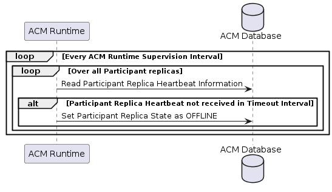

1.4 Get Participant Information
-------------------------------
The information on participants is available over a REST endpoint.

1.5 Order Full Participant Report
---------------------------------

2 Dialogues on Automation Composition Types
===========================================
Commissioning dialogues are used to commission and decommission Automation Composition Types and to set the values of Common Parameters. The values of common parameters are included in the TOSCA YAML file that defines the full Automation Composition Type.

2.1 Commission or Update an Automation Composition Type
-------------------------------------------------------
Create on a POST and update on a PUT.

2.2 Commission an Automation Composition Type using SDC
-------------------------------------------------------

2.3 Decommission an Automation Composition Type
-----------------------------------------------

2.4 Prime an Automation Composition Type on Participants
--------------------------------------------------------
The Priming operation sends Automation Composition Types and common property values to participants for each Automation Composition Element Type in the Automation Composition Type.

.. image:: ../images/system-dialogues/PrimeAcTypeOnPpnts.png

A participant should respond for each Automation Composition Element Type, thus causing the full Automation Composition Type to become primed. Note that if more than one participant can support an Automation Composition Element Type the ACM Runtime uses the participant in the first response it receives for that Automation Composition Element Type.

.. image:: ../images/system-dialogues/PrimeAcTypeMultiplePpnts.png

The ACM Runtime updates the priming information in the database.

.. image:: ../images/system-dialogues/PrimeInfoUpdatedInDb.png

2.5 Deprime an Automation Composition Type on Participants
----------------------------------------------------------
The Depriming operation removes Automation Composition Types and common property values on participants for each Automation Composition Element Type in the Automation Composition Type.

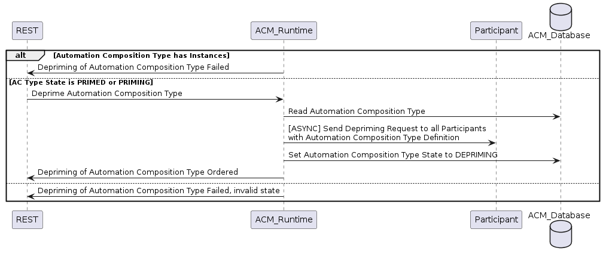

A participant should respond for each Automation Composition Element Type, thus causing the full Automation Composition Type to become deprimed.

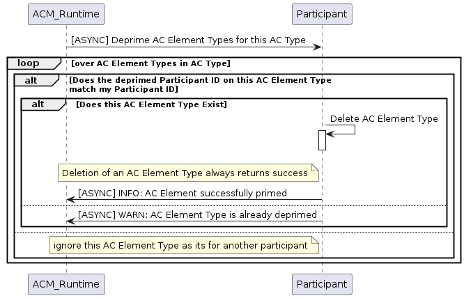

The ACM Runtime updates the priming information in the database.

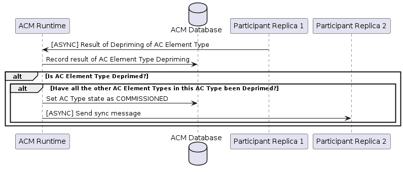

2.6 Get Automation Composition Types
------------------------------------
This dialogue allows an Automation Composition Type to be read.

3. Instantiation Dialogues
==========================
Instantiation dialogues are used to create, set parameters on, instantiate, update, and remove Automation Composition instances.

3.1 Create an Automation Composition Instance
---------------------------------------------

Note that this dialogue creates the Automation Composition Instance in the ACM database. The instance is sent to the participants using the process described in the dialogue in Section 3.3.

3.2 Delete an Automation Composition Instance
---------------------------------------------
The user requests the AC Instance to be deleted using a REST endpoint. The ACM Runtime orders the AC Instance to be deleted.

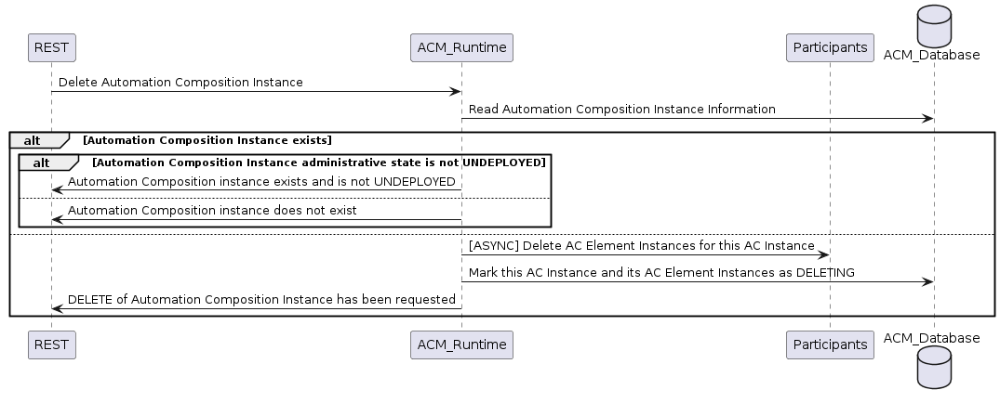

Each participant deletes its AC Element Instances from the AC Instance

The ACM Runtime receives and stores the responses, when all instances element are deleted, it delete the instance.

3.3 Deploy Automation Composition Instance
------------------------------------------
The user requests the AC Instance to be deployed using a REST endpoint. The ACM Runtime orders the AC Instance to be deployed to Participants.

Each participant deploys its AC Element Instances from the AC Instance.

The ACM Runtime receives and stores the responses.

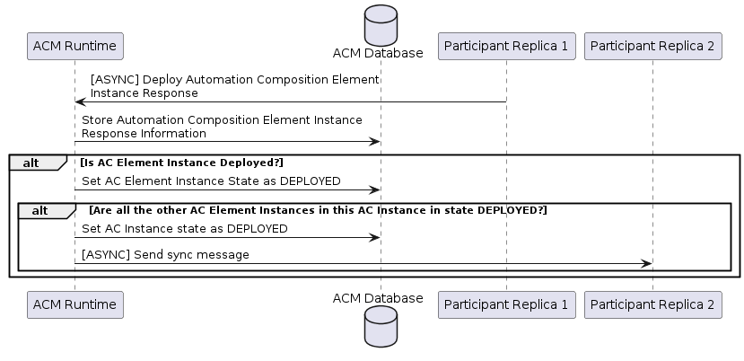

3.4 Update Automation Composition Instance
------------------------------------------
The user requests the AC Instance to be updated using a REST endpoint. The ACM Runtime orders the AC Instance to be updated.

Each participant updates its AC Element from the AC Instance

The ACM Runtime receives and stores the responses.

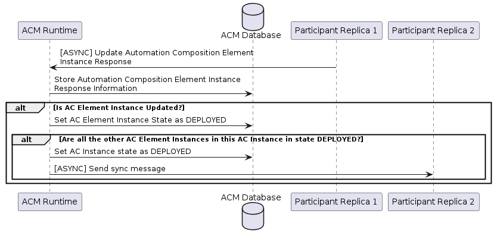

3.5 Migrate Automation Composition Instance
-------------------------------------------
The user requests the AC Instance to be migrated using a REST endpoint. The ACM Runtime orders the AC Instance to be migrated.

Each participant migrated its AC Element from the AC Instance

The ACM Runtime receives and stores the responses.

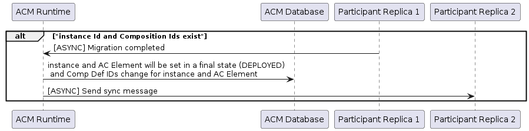

3.6 Undeploy Automation Composition Instance
--------------------------------------------
The user requests the AC Instance to be undeployed using a REST endpoint. The ACM Runtime orders the AC Instance to be undeployed.

Each participant undeploys its AC Element Instances from the AC Instance

The ACM Runtime receives and stores the responses.

3.7 Read Automation Composition Instances
-----------------------------------------

3.8 Unlock Automation Composition Instance
------------------------------------------
The user requests the AC Instance to be unlocked using a REST endpoint. The ACM Runtime orders the AC Instance to be unlocked on Participants.

Each participant unlocks its AC Element Instances from the AC Instance.

The ACM Runtime receives and stores the responses.

3.9 Lock Automation Composition Instance
----------------------------------------
The user requests the AC Instance to be locked using a REST endpoint. The ACM Runtime orders the AC Instance to be locked on Participants.

Each participant locks its AC Element Instances from the AC Instance.

The ACM Runtime receives and stores the responses.

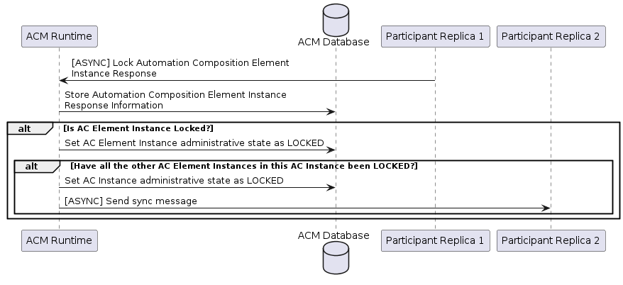

3.10 Update Operational State on Automation Composition Instance
----------------------------------------------------------------

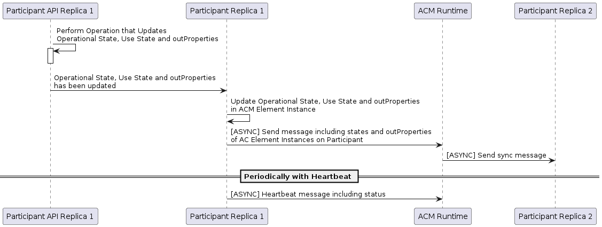

3.11 Update Usage State on Automation Composition Instance
----------------------------------------------------------

3.12 Failure handling in ACM
----------------------------
After any ACM operation is completed, one of the following result messages will be updated in the ACM. These result values are
updated along with the overall state of the ACM instance.

 - NO_ERROR
 - TIMEOUT
 - FAILED

The enum result values 'NO_ERROR' and 'FAILED' have to be set by the participants while reporting the CompositionState back to the runtime.

If the operation succeeds, the participant is required to update the result value with 'NO_ERROR' while reporting the composition state.

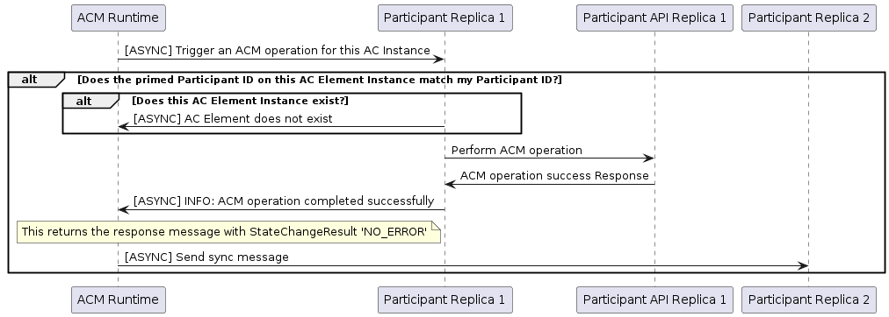

The result value should be updated as 'FAILED' by the participants when any failures occurred.
Also in case of failures, the overall state of the composition remains in any of the transitioning states (DEPLOYING, UNDEPLOYING, PRIMING, UPDATING)
with the appropriate result values updated by the participant.

.. image:: ../images/system-dialogues/FailedAcmResult.png

Runtime marks the operation result with the value 'TIMEOUT' when the participant gets disconnected from the ACM-R in the middle of any ACM operation.
When the participant fails to report the periodic heartbeat during an ACM operation, the operation result is then marked as 'TIMEOUT' by the ACM-R after the configured waiting limit is
reached.

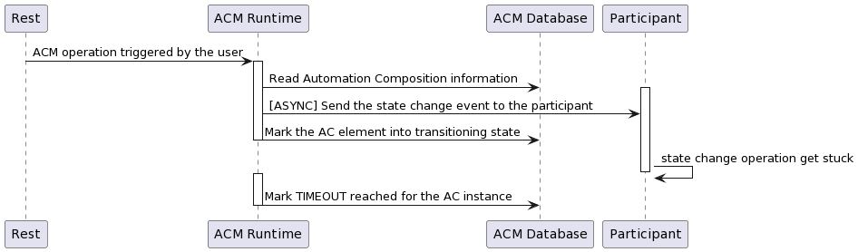

The following parameter is set in the application properties for the runtime to configure the 'TIMEOUT' value in milliseconds.

.. code-block:: yaml

        runtime:
          participantParameters:
            maxStatusWaitMs: 100000  --> Denotes the maximum wait time by the runtime to receive the periodic status update from the participants

An ACM operation has to be completed and updated with any of the above specified result values in order to allow the user to trigger subsequent requests.
The user cannot trigger any state change events before the operation gets completed. When an operation is marked 'TIMEOUT', the following scenarios are applicable.

 - The participant might come back ONLINE and complete the operation to mark the result with 'NO_ERROR' or 'FAILED'
 - The user can trigger another state change event to the ACM.

End of Document

