.. This work is licensed under a Creative Commons Attribution 4.0 International License.

.. _clamp-policy-gui-label:

TOSCA Policy GUI
################

.. contents::
    :depth: 4

1 - How to run the Front-End Gui
================================
This section describes how to run the front end on your local machine.

**Prerequisite:**

**Building and running CLAMP**

see
:ref:`Clamp ACM Smoke Tests <policy-clamp-runtime-smoke-label>`

**Step 1:** Go to the clamp directory

.. code-block:: bash

    cd /clamp/extra/bin-for-dev

**Step 2:** Inside the clamp directory run

.. code-block:: bash

    ./start-db.sh test

**Step 3:** Check docker container id

.. code-block:: bash

    docker ps

**Step 4:** Log into docker container

.. code-block:: bash

    docker exec -it 'container_id' bash

**Step 5:** Go into mariadb shell

.. code-block:: bash

    mysql -u root -p

**Step 6:** Enter password

    strong_pitchou

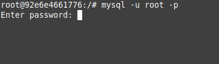

**Step 7:** Go into cldsdb4 database

.. code-block:: bash

    use cldsdb4;

**Step 8:** Verify if there is data in the following table 'loop_templates'

.. code-block:: bash

    select * from loop_templates;

** If for some reason the database is empty do the go to the '/docker-entrypoint-initdb.d/dump' directory

.. code-block:: bash

    ./load-fake-data.sh

**Step 9:** Once the database is up and running need to start the clamp emulator, by running the following command inside the /clamp/extra/bin-for-dev

.. code-block:: bash

    ./start-emulator.sh

**Step 10:** Verify if mariadb and the emulator is running

.. code-block:: bash

    docker ps

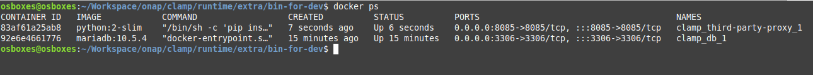

**Step 11:** Start the backend service by running the command inside the /clamp/extra/bin-for-dev

.. code-block:: bash

    ./start-backend.sh

.. _building-ui-label:

2 - Checking out and building the UI
====================================

**Step 1:** Checkout the UI from the repo

.. code-block:: bash

    git clone "https://gerrit.nordix.org/onap/policy/gui"

**Step 2:** Change into the "gui" directory and run the following

.. code-block:: bash

    mvn clean install

**Step 3:** Go into the gui-clamp/ui-react directory and run the following

.. code-block:: bash

    npm install

**Step 4:** Start the front end UI

.. code-block:: bash

    npm start --scripts-prepend-node-path

*If you get the following error*

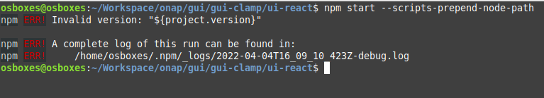

.. code-block:: bash

   gedit package.json

Then change ``"version": "${project.version}",`` to ``"version": "2.1.1",``

Save and close, then delete the node_modules directory

.. code-block:: bash

    rm -rf node_modules/

Then run again

.. code-block:: bash

    npm install

.. code-block:: bash

    npm start --scripts-prepend-node-path

**Step 5:** Once the UI starts at localhost:3000 it will ask for credentials:

    Login: admin
    Password: password

3 - How to Commission/Decommission the TOSCA Service Template
=============================================================

This section describes how to commission and decommission the Tosca Service Template

** Prerequisite:

See :ref:`Policy GUI Prerequisites<clamp-policy-gui-label>`

**Step 1:** From the Main Menu Click on TOSCA Automation Composition Dropdown

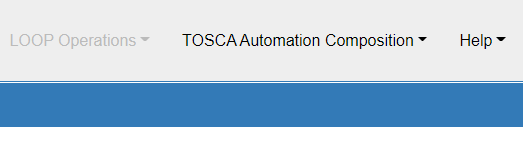

**Step 2:** From the Dropdown Menu Select Upload Automation Composition To Commissioning

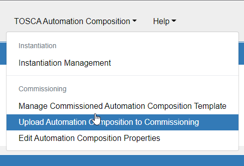

**Step 3:** On the window Upload Tosca to Commissioning API Click on the input box that says 'Please Select a file'

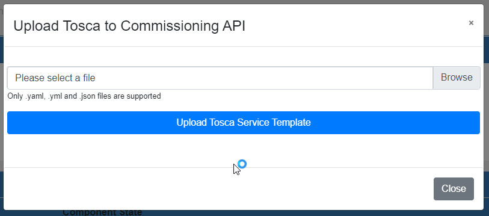

**Step 4:** Once the yaml file is selected click on Upload Tosca Service Template

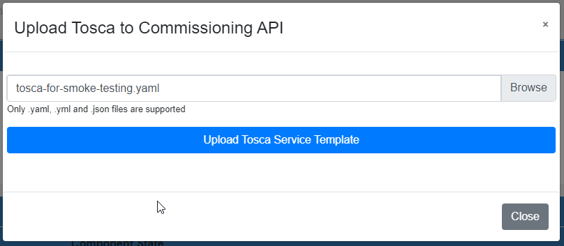

**Step 5:** After the upload there should have a message "Upload Success" in green

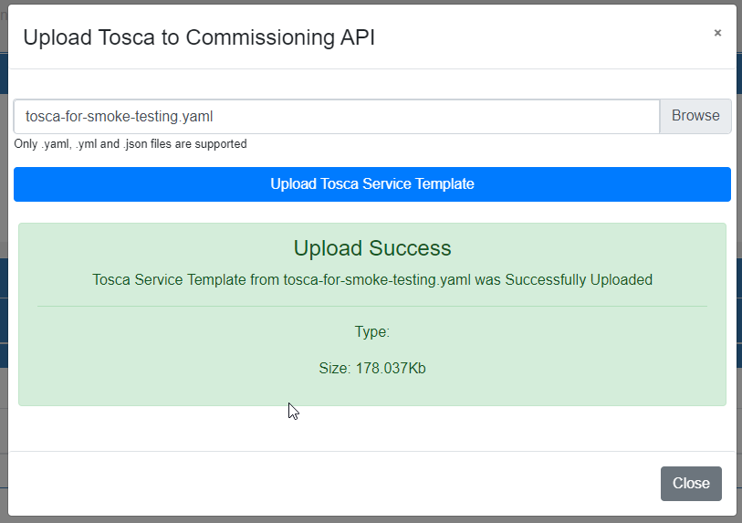

**Step 6:** To validate that the TOSCA Service Template has been commissioned click on Manage Commissioned Automation Composition Template

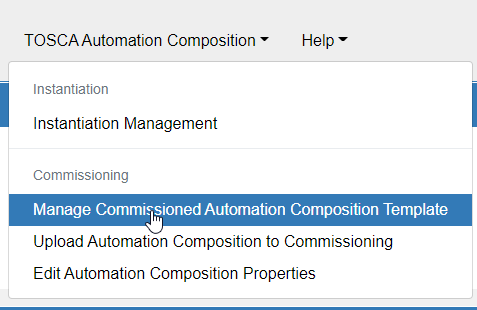

**Step 7:** In the View Tosca Template Window click on Pull Tosca Service Template

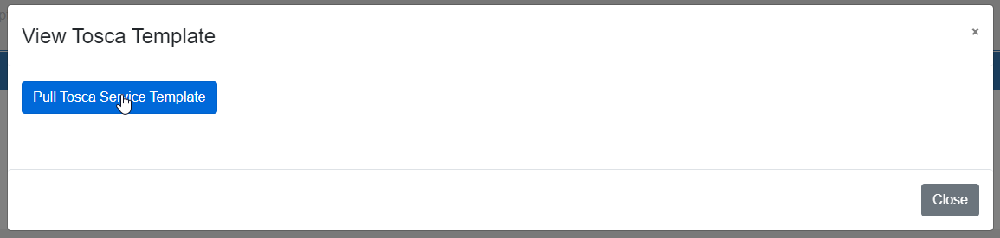

**Step 8:** Once the Tosca Service Template has been pulled there should be a json object rendered in the window

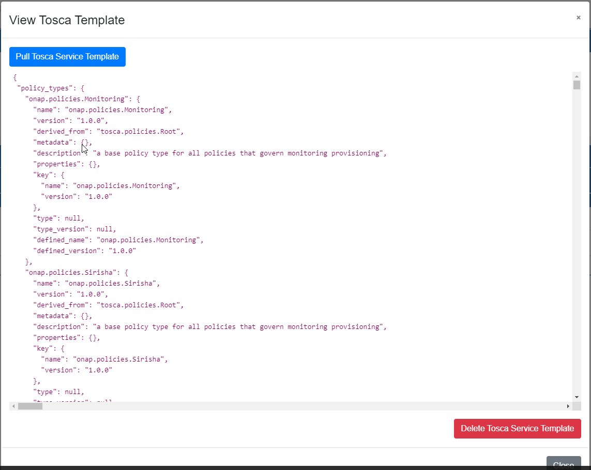

**Step 9:** Click on Close close the window

**Step 10:** Click on Edit Automation Composition Properties

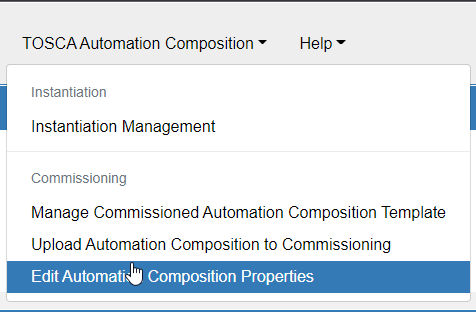

**Step 11:** In the Change ACM Common Properties change the appropriate properties and click on save and there should have a popup saying 'Changes Saved.  Commission When Ready...'

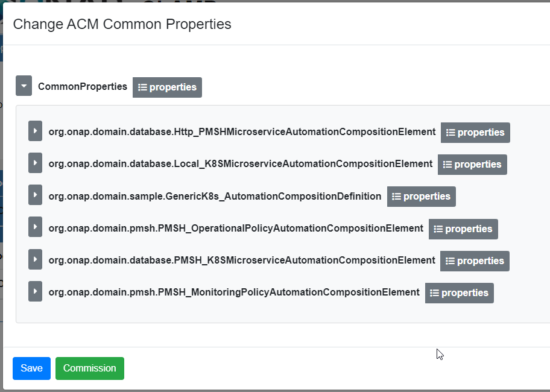

**Step 12:** After saving the changes click on Commission and should have a Green message saying 'Commissioning Success'

.. image:: images/14-gui.png

**Step 13:** To Decommission the Tosca Service Follow Step 6 and 8

**Step 14:** Once the json objected is rendered in the window click on delete

**Step 14:** Once the json objected is rendered in the window click on delete

**Step 15:** If the delete is successful it should show a message "Delete Successful"

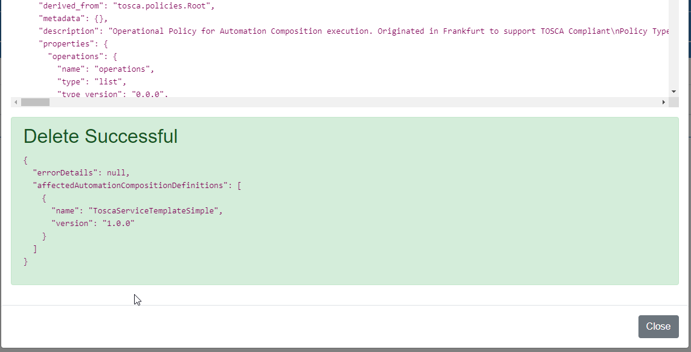

4 - How to Save Instance Properties and Change The Order State
==============================================================

This section describes how to save the instance properties and change it's order state

** Prerequisite:

see building-ui-label_

**Step 1:** Go to the participant http directory

.. code-block:: bash

    cd /clamp/participant/participant-impl/participant-impl-http

**Step 2:** Run he following command

.. code-block:: bash

    mvn spring-boot:run -Dspring-boot.run.arguments=--server.port=8080

**Step 3:** Go to the participant kubernetes directory

.. code-block:: bash

    cd /clamp/participant/participant-impl/participant-impl-kubernetes

**Step 4:** Run he following command

.. code-block:: bash

    mvn spring-boot:run -Dspring-boot.run.arguments=--server.port=8081

**Step 5:** Go to the participant policy directory

.. code-block:: bash

    cd /clamp/participant/participant-impl/participant-impl-policy

**Step 6:** Run he following command

.. code-block:: bash

    mvn spring-boot:run -Dspring-boot.run.arguments=--server.port=8082

**Step 7:** From the Main Menu Click on Instantiation Management

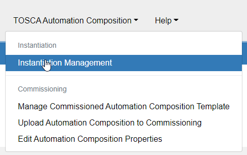

**Step 8:** Once the window for Manage Instance is open click on Create Instance

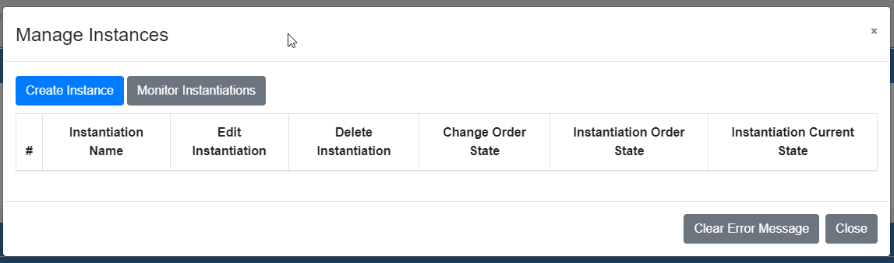

**Step 9:** With the Window Create Instance Properties Insert a Name and change the appropriate properties and click save

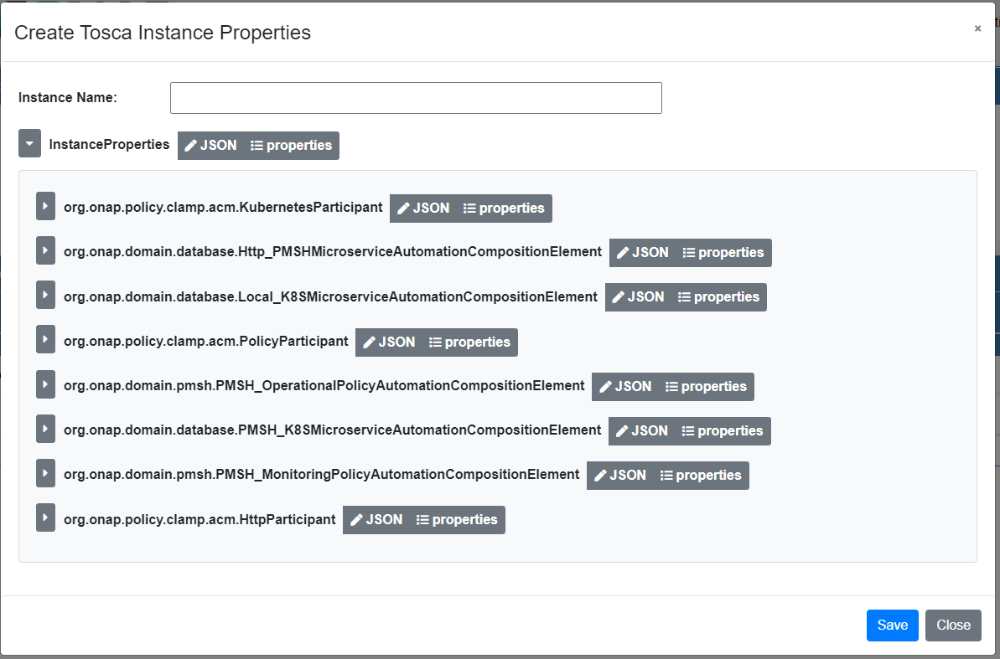

**Step 10:** After clicking save it should come with a green message saying "Instantiation Properties Success"

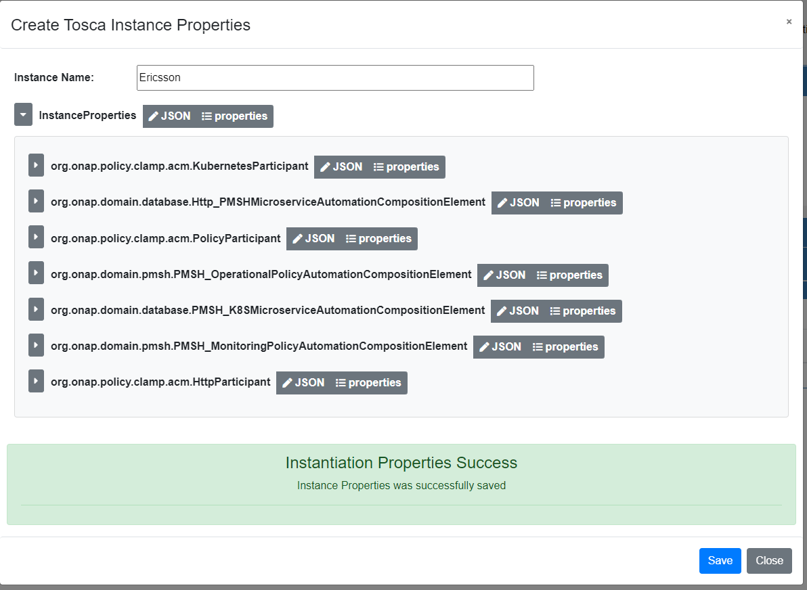

**Step 11:** To delete an instance repeat Step 7

**Step 12:** Once the window for Manage Instance is open click on Delete

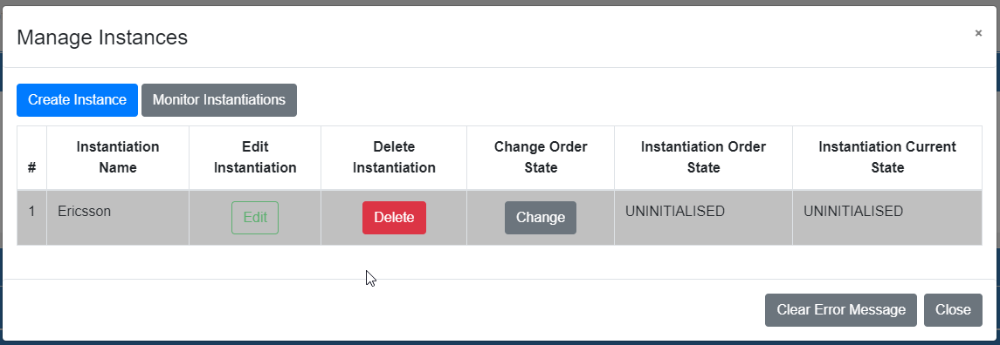

* NOTE: The only way to delete the instance properties if the order state has to be UNINITIALISED

**Step 13:** To change the state click on Change in Manage Instances Window

**Step 14:** After clicking Change there should have a drop down with specific different ordered states

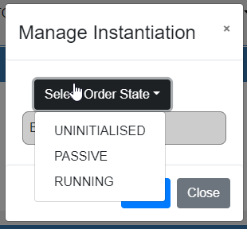

**Step 15:** From UNINITIALISED the user can only select Passive Ordered State

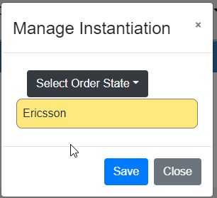

**Step 16:** Click on Save and a Message in Green "Ordered State Change Success"

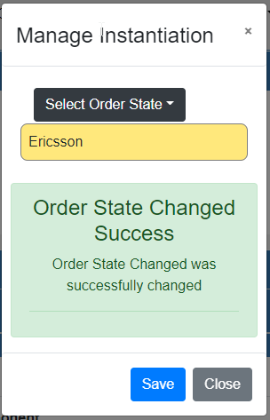

* NOTE: Can't change from Passive to Running in a local developer machine, can only change in the production environment

End of document
