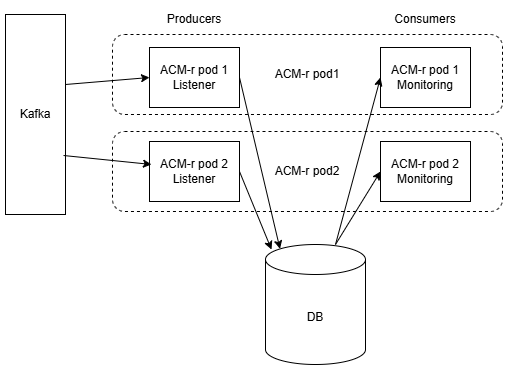
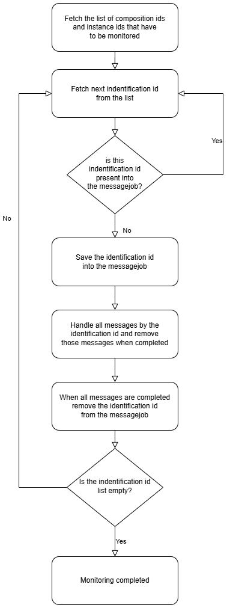

.. This work is licensed under a Creative Commons Attribution 4.0 International License.

.. _clamp-runtime-acm:

The CLAMP Automation Composition Runtime
########################################

.. contents::
    :depth: 3

This article explains how CLAMP Automation Composition Runtime is implemented.

Terminology
***********
- Broadcast message: a message for all participants (participantId=null and replicaId=null)
- Message to a participant: a message only for a participant (participantId properly filled)
- ThreadPoolExecutor: ThreadPoolExecutor executes the given task, into SupervisionAspect class is configured to execute tasks in ordered manner, one by one
- Spring Scheduling: into SupervisionAspect class, the @Scheduled annotation invokes "schedule()" method every "runtime.participantParameters.heartBeatMs" milliseconds with a fixed delay
- MessageIntercept: "@MessageIntercept" annotation is used into SupervisionHandler class to intercept "handleParticipantMessage" method calls using spring aspect oriented programming
- GUI: swagger-ui or Postman
- Message Broker: It supports the message Broker Kafka

Design of Rest Api
******************

Check CLAMP Runtime and Participants
++++++++++++++++++++++++++++++++++++
- GUI calls GET "/onap/policy/clamp/acm/health" endpoint and receives the "UP" status as response
- GUI calls GET "/onap/policy/clamp/acm/v2/participants" endpoint and receives as response: all participants with supported Element Types, all replicas registered, and all compositions and instances connected. The end point supports the pagination by parameters "size" and "page"
- GUI calls GET "/onap/policy/clamp/acm/v2/participants/{participantId}" endpoint and receives as response: the participant with supported Element Types, all replicas registered, and all compositions and instances connected. The end point supports the pagination by parameters "size" and "page"

Order an immediate Participant Report from all participants
+++++++++++++++++++++++++++++++++++++++++++++++++++++++++++
- GUI calls PUT "/onap/policy/clamp/acm/v2/participants" endpoint
- ACM-runtime receives the call by Rest-Api (CommissioningController)
- It triggers the execution to send a broadcast PARTICIPANT_STATUS_REQ message

Create of a Automation Composition Definition Type
++++++++++++++++++++++++++++++++++++++++++++++++++
- GUI calls POST "/onap/policy/clamp/acm/v2/compositions" endpoint with a Automation Composition Type Definition (Tosca Service Template) as body
- ACM-runtime receives the call by Rest-Api (CommissioningController)
- It validates the Automation Composition Type Definition
- It saves to DB the Tosca Service Template using AcDefinitionProvider with new compositionId and COMMISSIONED status
- the Rest-Api call returns the compositionId generated and the list of Element Definition Type

Fetch of Automation Composition Definition Type
+++++++++++++++++++++++++++++++++++++++++++++++
- GUI calls GET "/onap/policy/clamp/acm/v2/compositions" endpoint and receives all compositions as response. The end point supports the pagination by parameters "size" and "page"
- GUI calls GET "/onap/policy/clamp/acm/v2/compositions/{compositionId}" endpoint and receives the composition as response.

Update of a Automation Composition Definition Type
++++++++++++++++++++++++++++++++++++++++++++++++++
- GUI calls POST "/onap/policy/clamp/acm/v2/compositions" endpoint with a Automation Composition Type Definition (Tosca Service Template) as body. It have to contain the compositionId
- ACM-runtime receives the call by Rest-Api (CommissioningController)
- It checks that Automation Composition Type Definition is in COMMISSIONED status
- It validates the Automation Composition Type Definition
- It updates to DB the Tosca Service Template using AcDefinitionProvider using the compositionId
- the Rest-Api call returns the compositionId and the list of Element Definition Type

Priming of a Automation Composition Definition Type
+++++++++++++++++++++++++++++++++++++++++++++++++++
- GUI calls POST "/onap/policy/clamp/acm/v2/compositions/{compositionId}" endpoint with PRIME as primeOrder
- ACM-runtime receives the call by Rest-Api (CommissioningController)
- It checks that Automation Composition Type Definition is in COMMISSIONED status
- It validates and update the AC Element Type Definition with supported Element Types by participants
- It updates AC Definition to DB with PRIMING as status
- It triggers the execution to send a broadcast PARTICIPANT_PRIME message
- the message is built by ParticipantPrimePublisher using Tosca Service Template data

Create of a Automation Composition Instance
+++++++++++++++++++++++++++++++++++++++++++
- GUI calls POST "/onap/policy/clamp/acm/v2/compositions/{compositionId}/instances" endpoint with a Automation Composition Instance as body. It have to contain the compositionId
- ACM-runtime receives the call by Rest-Api (InstantiationController)
- It validates the AC Instance and checks that the related composition has COMMISSIONED as status
- It set the related participantId into the AC Element Instance using the participantId defined in AC Element Type Definition
- It saves the Automation Composition to DB with UNDEPLOYED deployState and NONE lockState
- the Rest-Api call returns the instanceId and the list of AC Element Instance

Fetch of Automation Composition Instance
++++++++++++++++++++++++++++++++++++++++
- GUI calls GET "/onap/policy/clamp/acm/v2/compositions/{compositionId}/instances" endpoint and receives all instances of a composition as response. The end point supports the pagination by parameters "size" and "page"
- GUI calls GET "/onap/policy/clamp/acm/v2/compositions/{compositionId}/instances/{instanceId}" endpoint and receives the instance as response.

Update of a Automation Composition Instance
+++++++++++++++++++++++++++++++++++++++++++
- GUI calls POST "/onap/policy/clamp/acm/v2/compositions/{compositionId}/instances" endpoint with a Automation Composition Instance as body. It have to contain the compositionId and the instanceId
- ACM-runtime receives the call by Rest-Api (InstantiationController)
- It checks that AC Instance is in UNDEPLOYED/DEPLOYED deployState
- It updates the Automation Composition to DB
- the Rest-Api call returns the instanceId and the list of AC Element Instance
- the runtime sends an update event to the participants which performs the update operation on the deployed instances.

Migrate-Precheck of a Automation Composition Instance
+++++++++++++++++++++++++++++++++++++++++++++++++++++
- GUI has already a new composition definition primed
- GUI calls POST "/onap/policy/clamp/acm/v2/compositions/{compositionId}/instances" endpoint with a Automation Composition Instance as body. It have to contain the compositionId, the compositionTargetId and the instanceId
- ACM-runtime receives the call by Rest-Api (InstantiationController)
- It checks that AC Instance is in DEPLOYED deployState
- It checks that compositionTargetId is related to a primed composition definition
- It only set the subState of the Automation Composition to DB
- the Rest-Api call returns the instanceId and the list of AC Element Instance
- the runtime sends a migrate-precheck event to the participants which performs the check operation on the deployed instances.

Migrate of a Automation Composition Instance
++++++++++++++++++++++++++++++++++++++++++++
- GUI has already a new composition definition primed
- GUI calls POST "/onap/policy/clamp/acm/v2/compositions/{compositionId}/instances" endpoint with a Automation Composition Instance as body. It have to contain the compositionId, the compositionTargetId and the instanceId
- ACM-runtime receives the call by Rest-Api (InstantiationController)
- It checks that AC Instance is in DEPLOYED deployState
- It checks that compositionTargetId is related to a primed composition definition
- It updates the Automation Composition to DB
- the Rest-Api call returns the instanceId and the list of AC Element Instance
- the runtime sends a migrate event to the participants which performs the migrate operation on the deployed instances.

Issues AC instance to change status
+++++++++++++++++++++++++++++++++++

case **subOrder: PREPARE**

- GUI calls "/onap/policy/clamp/acm/v2/compositions/{compositionId}/instances/{instanceId}" endpoint with PREPARE as subOrder
- ACM-runtime receives the call by Rest-Api (InstantiationController)
- It validates the status order issued (related AC Instance has UNDEPLOYED as deployState)
- It updates the AC Instance to DB with PREPARING subState
- It triggers the execution to send a broadcast AUTOMATION_COMPOSITION_PREPARE message with preDeploy set to true
- the message is built by AcPreparePublisher using Instance data.

case **deployOrder: DEPLOY**

- GUI calls "/onap/policy/clamp/acm/v2/compositions/{compositionId}/instances/{instanceId}" endpoint with DEPLOY as deployOrder
- ACM-runtime receives the call by Rest-Api (InstantiationController)
- It validates the status order issued (related AC Instance has UNDEPLOYED as deployState)
- It updates the AC Instance to DB with DEPLOYING deployState
- It triggers the execution to send a broadcast AUTOMATION_COMPOSITION_DEPLOY message
- the message is built by AutomationCompositionDeployPublisher using Tosca Service Template data and Instance data. (with startPhase = first startPhase)

case **subOrder: REVIEW**

- GUI calls "/onap/policy/clamp/acm/v2/compositions/{compositionId}/instances/{instanceId}" endpoint with REVIEW as subOrder
- ACM-runtime receives the call by Rest-Api (InstantiationController)
- It validates the status order issued (related AC Instance has DEPLOYED as deployState)
- It updates the AC Instance to DB with REVIEWING subState
- It triggers the execution to send a broadcast AUTOMATION_COMPOSITION_PREPARE message with preDeploy set to false
- the message is built by AcPreparePublisher using Instance data.

case **lockOrder: UNLOCK**

- GUI calls "/onap/policy/clamp/acm/v2/compositions/{compositionId}/instances/{instanceId}" endpoint with UNLOCK as lockOrder
- ACM-runtime receives the call by Rest-Api (InstantiationController)
- It validates the status order issued (related AC Instance has DEPLOYED as deployState and LOCK as lockOrder)
- It updates the AC Instance to DB with LOCKING lockOrder
- It triggers the execution to send a broadcast AUTOMATION_COMPOSITION_STATE_CHANGE message
- the message is built by AutomationCompositionStateChangePublisher using Instance data. (with startPhase = first startPhase)

case **lockOrder: LOCK**

- GUI calls "/onap/policy/clamp/acm/v2/compositions/{compositionId}/instances/{instanceId}" endpoint with LOCK as lockOrder
- ACM-runtime receives the call by Rest-Api (InstantiationController)
- It validates the status order issued (related AC Instance has DEPLOYED as deployState and UNLOCK as lockOrder)
- It updates the AC Instance to DB with UNLOCKING lockOrder
- It triggers the execution to send a broadcast AUTOMATION_COMPOSITION_STATE_CHANGE message
- the message is built by AutomationCompositionStateChangePublisher using Instance data. (with startPhase = last StartPhase)

case **deployOrder: UNDEPLOY**

- GUI calls "/onap/policy/clamp/acm/v2/compositions/{compositionId}/instances/{instanceId}" endpoint with UNDEPLOY as deployOrder
- ACM-runtime receives the call by Rest-Api (InstantiationController)
- It validates the status order issued (related AC Instance has DEPLOYED as deployState and LOCK as lockOrder)
- It updates the AC Instance to DB with UNDEPLOYING deployState
- It triggers the execution to send a broadcast AUTOMATION_COMPOSITION_STATE_CHANGE message
- the message is built by AutomationCompositionStateChangePublisher using Instance data. (with startPhase = last StartPhase)

Delete of a Automation Composition Instance
+++++++++++++++++++++++++++++++++++++++++++
- GUI calls DELETE "/onap/policy/clamp/acm/v2/compositions/{compositionId}/instances/{instanceId}" endpoint
- ACM-runtime receives the call by Rest-Api (InstantiationController)
- It checks that AC Instance is in UNDEPLOYED deployState
- It updates the AC Instance to DB with DELETING deployState
- It triggers the execution to send a broadcast AUTOMATION_COMPOSITION_STATE_CHANGE message
- the message is built by AutomationCompositionStateChangePublisher using Instance data. (with startPhase = last StartPhase)

Depriming of a Automation Composition Definition Type
+++++++++++++++++++++++++++++++++++++++++++++++++++++
- GUI calls POST "/onap/policy/clamp/acm/v2/compositions/{compositionId}" endpoint with DEPRIME as primeOrder
- ACM-runtime receives the call by Rest-Api (CommissioningController)
- It checks that Automation Composition Type Definition is in PRIMED status
- It updates AC Definition to DB with DEPRIMING as status
- It triggers the execution to send a broadcast PARTICIPANT_PRIME message
- the message is built by ParticipantPrimePublisher using Tosca Service Template data

Delete of a Automation Composition Definition Type
++++++++++++++++++++++++++++++++++++++++++++++++++
- GUI calls DELETE "/onap/policy/clamp/acm/v2/compositions/{compositionId}" endpoint
- ACM-runtime receives the call by Rest-Api (CommissioningController)
- It checks that AC Definition Type is in COMMISSIONED status
- It deletes the Automation Composition Type from DB

StartPhase
**********
The startPhase is particularly important in Automation Composition update and Automation Composition state changes because sometime the user wishes to control the order in which the state changes in Automation Composition Elements in a Automation Composition.

How to define StartPhase
++++++++++++++++++++++++
StartPhase is defined as shown below in the Definition of TOSCA fundamental Automation Composition Types yaml file.

.. code-block:: YAML

  startPhase:
    type: integer
    required: false
    constraints:
    - greater-or-equal: 0
    description: A value indicating the start phase in which this Automation Composition element will be started, the
                 first start phase is zero. Automation Composition Elements are started in their start_phase order and stopped
                 in reverse start phase order. Automation Composition Elements with the same start phase are started and
                 stopped simultaneously
    metadata:
      common: true

The "common: true" value in the metadata of the startPhase property identifies that property as being a common property.
This property will be set on the CLAMP GUI during Automation Composition commissioning.
Example where it could be used:

.. code-block:: YAML

  org.onap.domain.database.Http_PMSHMicroserviceAutomationCompositionElement:
    # Consul http config for PMSH.
    version: 1.2.3
    type: org.onap.policy.clamp.acm.HttpAutomationCompositionElement
    type_version: 1.0.1
    description: Automation Composition element for the http requests of PMSH microservice
    properties:
      provider: ONAP
      uninitializedToPassiveTimeout: 180
      startPhase: 1

How StartPhase works
++++++++++++++++++++
In state changes from UNDEPLOYED → DEPLOYED or LOCKED → UNLOCKED, Automation Composition elements are started in increasing order of their startPhase.

Example of DEPLOY order with Http_PMSHMicroserviceAutomationCompositionElement with startPhase to 1 and PMSH_K8SMicroserviceAutomationCompositionElement with startPhase to 0

- ACM-runtime sends a broadcast AUTOMATION_COMPOSITION_DEPLOY message to all participants with startPhase = 0
- participant receives the AUTOMATION_COMPOSITION_DEPLOY message and runs to DEPLOYED state (only AC elements defined as startPhase = 0)
- ACM-runtime receives AUTOMATION_COMPOSITION_DEPLOY_ACK messages from participants and set the state (from the AC element of the message) to DEPLOYED
- ACM-runtime calculates that all AC elements with startPhase = 0 are set to proper state and sends a broadcast AUTOMATION_COMPOSITION_DEPLOY message with startPhase = 1
- participant receives the AUTOMATION_COMPOSITION_DEPLOY message and runs to DEPLOYED state (only AC elements defined as startPhase = 1)
- ACM-runtime receives AUTOMATION_COMPOSITION_DEPLOY_ACK messages from participants and set the state (from the AC element of the message) to DEPLOYED
- ACM-runtime calculates that all AC elements are set to proper state and set AC to DEPLOYED

In that scenario the message AUTOMATION_COMPOSITION_DEPLOY has been sent two times.

Prepare and Migration using Stage
*********************************
The stage is particularly important in Automation Composition migration because sometime the user wishes to control
not only the order in which the state changes in Automation Composition Elements but also to execute again using the same Automation Composition Elements.

How to define Stage
+++++++++++++++++++
Stage is defined as shown below in the Definition of TOSCA fundamental Automation Composition Types yaml file.

.. code-block:: YAML

  stage:
    type: map
    required: false
    description: A map of list indicating for each operation the stages in which this automation composition element will be started, the
                 first stage is zero. Automation Composition Elements are started in their stage order.
                 Automation Composition Elements with the same stage are started simultaneously.
    metadata:
      common: true

Example where it could be used:

.. code-block:: YAML

  org.onap.domain.database.Http_PMSHMicroserviceAutomationCompositionElement:
    # Consul http config for PMSH.
    version: 1.2.3
    type: org.onap.policy.clamp.acm.HttpAutomationCompositionElement
    type_version: 1.0.1
    description: Automation Composition element for the http requests of PMSH microservice
    properties:
      provider: ONAP
      uninitializedToPassiveTimeout: 180
      stage:
        prepare: [0]
        migrate: [0,2]

Backward compatibility for Stage definition
+++++++++++++++++++++++++++++++++++++++++++
Stage for migration could be defined as shown below:

.. code-block:: YAML

  stage:
    type: list
    required: false
    description: A list indicating the stages in which this automation composition element will be started, the
                 first stage is zero. Automation Composition Elements are started in their stage order.
                 Automation Composition Elements with the same stage are started simultaneously.
    metadata:
      common: true

Example of Backward compatibility for migration:

.. code-block:: YAML

  org.onap.domain.database.Http_PMSHMicroserviceAutomationCompositionElement:
    # Consul http config for PMSH.
    version: 1.2.3
    type: org.onap.policy.clamp.acm.HttpAutomationCompositionElement
    type_version: 1.0.1
    description: Automation Composition element for the http requests of PMSH microservice
    properties:
      provider: ONAP
      uninitializedToPassiveTimeout: 180
      stage: [0,2]

How Stage works
+++++++++++++++
In state changes in MIGRATING Automation Composition elements starts in increasing order from stage 0.

Example of MIGRATE order with Http_PMSHMicroserviceAutomationCompositionElement with stage [0,2] and PMSH_K8SMicroserviceAutomationCompositionElement with startPhase to [0,1]:

- ACM-runtime sends a broadcast AUTOMATION_COMPOSITION_MIGRATION message to all participants with stage = 0
- participant receives the AUTOMATION_COMPOSITION_MIGRATION message and runs to DEPLOYED state (only AC elements that contains stage 0: Http_PMSHMicroserviceAutomationCompositionElement and PMSH_K8SMicroserviceAutomationCompositionElement)
- ACM-runtime receives AUTOMATION_COMPOSITION_DEPLOY_ACK messages from participants and set the state (from the AC element of the message) to DEPLOYED
- ACM-runtime calculates that all AC elements with stage = 0 are set to proper state and sends a broadcast AUTOMATION_COMPOSITION_MIGRATION message with stage = 1
- participant receives the AUTOMATION_COMPOSITION_MIGRATION message and runs to DEPLOYED state (only AC elements that contains stage 1: PMSH_K8SMicroserviceAutomationCompositionElement)
- ACM-runtime receives AUTOMATION_COMPOSITION_DEPLOY_ACK messages from participants and set the state (from the AC element of the message) to DEPLOYED
- ACM-runtime calculates that all AC elements with stage = 1 are set to proper state and sends a broadcast AUTOMATION_COMPOSITION_MIGRATION message with stage = 2
- participant receives the AUTOMATION_COMPOSITION_MIGRATION message and runs to DEPLOYED state (only AC elements that contains stage 2: Http_PMSHMicroserviceAutomationCompositionElement)
- ACM-runtime receives AUTOMATION_COMPOSITION_DEPLOY_ACK messages from participants and set the state (from the AC element of the message) to DEPLOYED
- ACM-runtime calculates that all AC elements are set to proper state and set AC to DEPLOYED

In that scenario the message AUTOMATION_COMPOSITION_MIGRATION has been sent three times,
Http_PMSHMicroserviceAutomationCompositionElement and PMSH_K8SMicroserviceAutomationCompositionElement will be executed two times.

Add and remove elements during Migration
****************************************
When an AC instance is migrated to a new AC definition, the user has the flexibility to add a new element or remove an existing element from the instance.
The target AC composition definition should contain the new element definition added and also the respective elements removed while commissioning to ACM-R.
The new elements are further instantiated in the migration request with the instance properties, and the elements required to be undeployed are removed accordingly.
ACM-R sends the updated element list in the migration request to the participants where the participant is expected to handle the add/remove scenario.
The migration method on the participant receives the details of previously existed composition/instance as well as the updated composition/instance and hence the difference in the new and old properties for an
element can be identified by the participant.
Participants can also identify the newly added elements and the removed elements with the ElementState enum that is set for each element.

Example:
 For a newly added element in the migration, the element information about the previously existed element will contain the ElementState enum set to the value "NOT_PRESENT" by the intermediary, and the updated element object will contain the
 ElementState value "NEW". Based on these enum values on both the objects, the participant can identify a new element added in the migration. The participant can choose to trigger a deployment of this new element and update the element state once the
 deploy operation is complete.

 For the elements that are removed in the migration, the element information about the previously existed element will contain the ElementState enum set to the value "PRESENT" by the intermediary, and the object for the updated element info will contain the
 ElementState value "REMOVED". Based on this, the participant can identify a removed element in the migration and choose to trigger an undeployment of this element. The element state after the undeploy operation need not be updated to ACM-R as the element is already removed in the ACM-R.
 The participant is also expected to trigger a "DELETE" operation for the removed element if required in order to delete any element OutProperties if stored in the memory. Similarly, The element state after the delete operation need not be updated to ACM-R for the removed element.

Configure custom namings for TOSCA node types
*********************************************

The node type of the AC element and the Automation composition can be customised as per the user requirement.
These customised names can be used in the TOSCA node type definitions of AC element and composition. All the
AC element and composition definitions (node templates) should be derived from the corresponding node types.
The following parameters are provided in the config file of ACM-runtime for customisation:

.. code-block:: YAML

 runtime:
   acmParameters:
     toscaElementName: customElementType
     toscaCompositionName: customCompositionType

If there are no values provided for customisation, the default node types "org.onap.policy.clamp.acm.AutomationCompositionElement"
and "org.onap.policy.clamp.acm.AutomationComposition" are used for the AC element and composition by the ACM-runtime.
In this case, the element and composition definition has to be derived from the same in the TOSCA. For overriding the names in the
onap helm chart, the following properties can be updated in the values.yaml.

.. code-block:: YAML

  customNaming:
    toscaElementName: customElementName
    toscaCompositionName: customCompositionName

Design of managing messages
***************************

PARTICIPANT_REGISTER
++++++++++++++++++++
- A participant replica starts and send a PARTICIPANT_REGISTER message with participantId, replicaId and supported Element Types
- ACM-runtime collects the message from Message Broker by ParticipantRegisterListener
- if not present, it saves participant replica reference with status ON_LINE to DB
- it sends PARTICIPANT_REGISTER_ACK to participant replica

PARTICIPANT_PRIME_ACK
++++++++++++++++++++++
- A participant sends PARTICIPANT_PRIME_ACK message in response to a PARTICIPANT_PRIME message
- ParticipantPrimeAckListener collects the message from Message Broker
- It stores the message into the DB
- MessageIntercept intercepts that event and adds a task to handle a monitoring execution in SupervisionScanner
- Monitoring updates AC Definition to DB with PRIMED/DEPRIMED as status
- If AC Definition is fully PRIMED, Monitoring sends sync message to all participants replica

PARTICIPANT_STATUS
++++++++++++++++++
- A participant sends a scheduled PARTICIPANT_STATUS message with participantId, replicaId and supported Element Types. Same message could be used by participant to update OutProperties of an AC instance/AC definition.
- ACM-runtime collects the message from Message Broker by ParticipantStatusListener
- If not present, it saves participant replica reference with status ON_LINE to DB
- If the message contains OutProperties of an AC instance/AC definition it stores the message into the DB
- MessageIntercept intercepts that event and adds a task to handle a monitoring execution in SupervisionScanner
- Monitoring updates the AC instance/AC definition
- Monitoring sends a sync message to all participants replica

AUTOMATION_COMPOSITION_DEPLOY_ACK
+++++++++++++++++++++++++++++++++
- A participant sends AUTOMATION_COMPOSITION_DEPLOY_ACK message in response to a AUTOMATION_COMPOSITION_DEPLOY message. It will send a AUTOMATION_COMPOSITION_DEPLOY_ACK - for each AC elements moved to the DEPLOYED state
- AutomationCompositionUpdateAckListener collects the message from Message Broker
- It store the message into the DB
- MessageIntercept intercepts that event and adds a task to handle a monitoring execution in SupervisionScanner
- Monitoring checks the status of all Automation Composition elements and checks if the Automation Composition is fully DEPLOYED
- Monitoring updates the AC instance to DB
- If the Automation Composition is fully DEPLOYED Monitoring sends a sync message to all participants replica

AUTOMATION_COMPOSITION_STATECHANGE_ACK
++++++++++++++++++++++++++++++++++++++
- A participant sends AUTOMATION_COMPOSITION_STATECHANGE_ACK message in response to a AUTOMATION_COMPOSITION_STATECHANGE message. It will send a AUTOMATION_COMPOSITION_DEPLOY_ACK - for each AC elements moved to the ordered state
- AutomationCompositionStateChangeAckListener collects the message from Message Broker
- It store the message into the DB
- MessageIntercept intercepts that event and adds a task to handle a monitoring execution in SupervisionScanner
- Monitoring checks the status of all Automation Composition elements and checks if the transition process of the Automation Composition is terminated
- Monitoring updates the AC instance to DB
- If the transition process is terminated, Monitoring sends a sync message to all participants replica

Design of monitoring execution in SupervisionScanner
****************************************************
Monitoring is designed to process the follow operations:

- to elaborate the messages from participants
- to determine the next startPhase in a AUTOMATION_COMPOSITION_DEPLOY message
- to determine the next stage in a AUTOMATION_COMPOSITION_MIGRATION/AUTOMATION_COMPOSITION_PREPARE message
- to update AC deployState: in a scenario that "AutomationComposition.deployState" is in a kind of transitional state (example DEPLOYING), if all  - AC elements are moved properly to the specific state, the "AutomationComposition.deployState" will be updated to that and saved to DB
- to update AC lockState: in a scenario that "AutomationComposition.lockState" is in a kind of transitional state (example LOCKING), if all  - AC elements are moved properly to the specific state, the "AutomationComposition.lockState" will be updated to that and saved to DB
- to update AC subState: in a scenario that "AutomationComposition.subState" is in a kind of transitional state (example PREPARING), if all  - AC elements are moved properly to NONE state, the "AutomationComposition.subState" will be updated to NONE and saved to DB
- to delete AC Instance: in a scenario that "AutomationComposition.deployState" is in DELETING, if all  - AC elements are moved properly to DELETED, the AC Instance will be deleted from DB
- to retry AUTOMATION_COMPOSITION_DEPLOY/AUTOMATION_COMPOSITION_STATE_CHANGE messages. if there is an AC instance with startPhase completed, it will be moved to the next startPhase and retry a broadcast message with the new startPhase
- to retry AUTOMATION_COMPOSITION_MIGRATION/AUTOMATION_COMPOSITION_PREPARE messages. if there is an AC instance with stage completed, it will be moved to the next stage and retry a broadcast message with the new stage
- to send sync message to all participants replica: in scenario where AC instance transition is fully completed or OutProperties has been changed

The solution Design timeout and reporting for all Participant message dialogues are implemented into the monitoring execution.

- Spring Scheduling inserts the task to monitor timeout execution into ThreadPoolExecutor
- ThreadPoolExecutor executes the task
- set AC instance stateChangeResult in timeout, if ACM-runtime do no receive Act message before MaxWaitMs milliseconds

Producer and Consumer and Scheduling job mechanisms
+++++++++++++++++++++++++++++++++++++++++++++++++++
To avoid conflicts, for example when an ACM-r pod is receiving a messages to change outProperties of an AC instance and other ACM-r pod is receiving a messages to change the status of an element of the same instance,
Producer and Consumer and Scheduling job mechanisms has been implemented.
With the Producer and Consumer mechanism, any ACM-r replica monitoring could elaborate a message independently from what ACM-r replica has fetched the message.
Listeners of ACM-r will fetch messages from kafka and store to a message FIFO queue stored in DB.

Monitoring of a ACM-r replica will fetch messages from that queue.
All Monitoring from different ACM-r pods are synchronized with Scheduling job to avoid to fetch messages related to same AC instance or AC definition at same time.
InstanceIds and a compositionIds are generated with UUID as unique key and could be used as identificationId for messages.

Edge case scenario: ACM-r pod has been terminated from Kubernetes
-----------------------------------------------------------------
Full elaboration of a monitoring for an AC instance or for a AC definition is protected by a transaction.
If an ACM-r pod has been terminated from Kubernetes, the monitoring not full completed will be rollback from database.
The monitoring job not completed wil be deleted after 200 seconds. All message of that AC definition or AC instance will processed by other monitoring.

Design of Exception handling
****************************
GlobalControllerExceptionHandler
++++++++++++++++++++++++++++++++
If error occurred during the Rest Api call, ACM-runtime responses with a proper status error code and a JSON message error.
This class is implemented to intercept and handle AutomationCompositionException and PfModelRuntimeException if they are thrown during the Rest Ali calls.
All of those classes must implement ErrorResponseInfo that contains message error and status response code.
So the Exception is converted in JSON message.

RuntimeErrorController
++++++++++++++++++++++
If wrong end-point is called or an Exception not intercepted by GlobalControllerExceptionHandler, ACM-runtime responses with a proper status error code and a JSON message error.
This class is implemented to redirect the standard Web error page to a JSON message error.
Typically that happen when a wrong end-point is called, but also could be happen for not authorized call, or any other Exception not intercepted by GlobalControllerExceptionHandler.

Handle version and "X-ONAP-RequestID"
*************************************
RequestResponseLoggingFilter class handles version and "X-ONAP-RequestID" during a Rest-Api call; it works as a filter, so intercepts the Rest-Api and adds to the header those information.

Media Type Support
******************
ACM-runtime Rest Api supports **application/json**, **application/yaml** and **text/plain** Media Types. The configuration is implemented in CoderHttpMesageConverter.

application/json
++++++++++++++++
JSON format is a standard for Rest Api. For the conversion from JSON to Object and vice-versa will be used **org.onap.policy.common.utils.coder.StandardCoder**.

application/yaml
++++++++++++++++
YAML format is a standard for Automation Composition Type Definition. For the conversion from YAML to Object and vice-versa will be used **org.onap.policy.common.utils.coder.StandardYamlCoder**.

text/plain
++++++++++
Text format is used by Prometheus. For the conversion from Object to String  will be used **StringHttpMessageConverter**.

JSON log format
***************
ACM-runtime supports log in Json format. Below an example of appender for logback configuration to enable it.

.. code-block:: xml
   :caption: Part of logback configuration
   :linenos:

    <appender name="STDOUT" class="ch.qos.logback.core.ConsoleAppender">
        <encoder class="ch.qos.logback.core.encoder.LayoutWrappingEncoder">
            <layout class="org.onap.policy.clamp.acm.runtime.config.LoggingConsoleLayout">
                <timestampFormat>YYYY-MM-DDThh:mm:ss.sss+/-hh:mm</timestampFormat>
                <timestampFormatTimezoneId>Etc/UTC</timestampFormatTimezoneId>
                <staticParameters>service_id=policy-acm|application_id=policy-acm</staticParameters>
            </layout>
        </encoder>
    </appender>

LayoutWrappingEncoder implements the encoder interface and wraps the Java class LoggingConsoleLayout as layout to which it delegates the work of transforming an event into Json string.
Parameters for LoggingConsoleLayout:

- *timestampFormat*: Timestamp Format
- *timestampFormatTimezoneId*: Time Zone used in the Timestamp Format
- *staticParameters*: List of parameters do add into the log separated with a "|"

Below un example of result:

.. code-block:: json

   {"severity":"INFO","extra_data":{"logger":"network","thread":"KAFKA-source-policy-acruntime-participant"},"service_id":"policy-acm","message":"[IN|KAFKA|policy-acruntime-participant]\n{\"state\":\"ON_LINE\",\"participantDefinitionUpdates\":[],\"automationCompositionInfoList\":[],\"participantSupportedElementType\":[{\"id\":\"f88c4463-f012-42e1-8927-12b552ecf380\",\"typeName\":\"org.onap.policy.clamp.acm.K8SMicroserviceAutomationCompositionElement\",\"typeVersion\":\"1.0.0\"}],\"messageType\":\"PARTICIPANT_STATUS\",\"messageId\":\"d3dc2f86-4253-4520-bbac-97c4c04547ad\",\"timestamp\":\"2025-01-21T16:14:27.087474035Z\",\"participantId\":\"101c62b3-8918-41b9-a747-d21eb79c6c93\",\"replicaId\":\"c1ba61d2-1dbd-44e4-80bd-135526c0615f\"}","application_id":"policy-acm","timestamp":"2025-01-21T16:14:27.114851006Z"}
   {"severity":"INFO","extra_data":{"logger":"network","thread":"KAFKA-source-policy-acruntime-participant"},"service_id":"policy-acm","message":"[IN|KAFKA|policy-acruntime-participant]\n{\"state\":\"ON_LINE\",\"participantDefinitionUpdates\":[],\"automationCompositionInfoList\":[],\"participantSupportedElementType\":[{\"id\":\"4609a119-a8c7-41ee-96d1-6b49c3afaf2c\",\"typeName\":\"org.onap.policy.clamp.acm.HttpAutomationCompositionElement\",\"typeVersion\":\"1.0.0\"}],\"messageType\":\"PARTICIPANT_STATUS\",\"messageId\":\"ea29ab01-665d-4693-ab17-3a72491b5c71\",\"timestamp\":\"2025-01-21T16:14:27.117716317Z\",\"participantId\":\"101c62b3-8918-41b9-a747-d21eb79c6c91\",\"replicaId\":\"5e4f9690-742d-4190-a439-ebb4c820a010\"}","application_id":"policy-acm","timestamp":"2025-01-21T16:14:27.144379028Z"}
