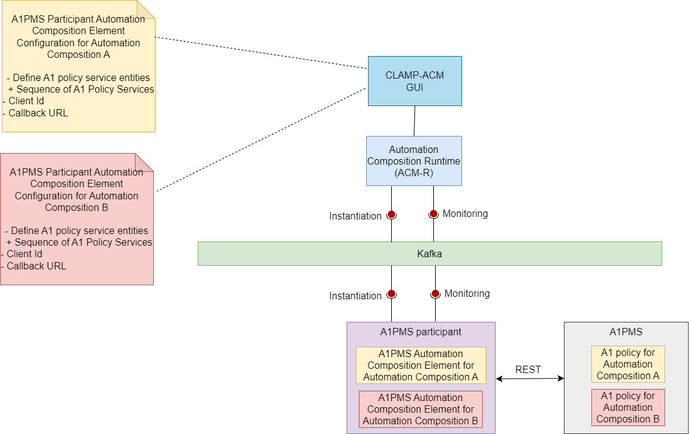

.. This work is licensed under a Creative Commons Attribution 4.0 International License.

.. _clamp-acm-a1pms-participant:

A1PMS Participant
######################

The A1PMS participant receives a A1 policy service information from the CLAMP runtime and creates the A1 policy service in A1PMS. The participant acts as a wrapper around the A1PMS and creates the policy service.

Supported message Broker are DMaap and Strimzi-Kafka.

When a automation composition is initialized, the A1PMS participant starts a A1PMS Automation Composition
element for the automation composition. It reads the configuration information sent from the
Automation Composition Runtime runs a REST client to talk to the A1PMS endpoint that is receiving
the REST requests.

Prerequisites for using A1PMS participant:
------------------------------------------

- A running A1PMS. A1PMS base url should be configured in A1PMS participant to make REST calls.

Supported Element Types
-----------------------
Supported Element Types for A1PMS participant will be used to define the A1PMS participant Element Definition Types in tosca template.
Participant Supported Element Types is defined in A1PMS participant application.yaml.

.. code-block:: YAML

    participantSupportedElementTypes:
      -
        typeName: org.onap.policy.clamp.acm.A1PMSAutomationCompositionElement
        typeVersion: 1.0.1

Defining a TOSCA CL definition for A1PMS participant:
-----------------------------------------------------

A *Policy Service Entity* describes a A1PMS policy service that is managed by the A1PMS participant. A
Policy Service Entity can be created, Read, and Deleted. The user defines
the A1 Policy Service Entities that it wants its A1PMS Automation Composition Element to manage and
provides the parameters to manage each A1 Policy Service Entity.

Sample tosca template defining a participant and a AC element definition. :download:`click here <tosca/tosca-a1pms-participant.yml>`

Configuring a Automation Composition Element on the A1PMS participant for a Automation Composition
-------------------------------------------------------------------------------------------------------

The user defines the following properties in the TOSCA template for the a1pms participant:

.. list-table::
   :widths: 15 10 50
   :header-rows: 1

   * - Property
     - Type
     - Description
   * - a1PolicyServiceEntityId
     - ToscaConceptIdentifier
     - The name and version of the A1 Policy Service that needs to be managed by the A1PMS participant
   * - clientId
     - String
     - The identity of the service
   * - callbackUrl
     - String
     - The callback for notifying of Near-RT RIC state changes
   * - keepAliveIntervalSeconds
     - Integer
     - Keep alive interval for the service. This is used to enable optional heartbeat supervision of the service. If set (> 0) the registered service should regularly invoke a 'keepalive' REST call. When a service fails to invoke this 'keepalive' call within the configured time, the service is considered unavailable. An unavailable service will be automatically deregistered and its policies will be deleted. Value 0 means timeout supervision is disabled.

Sample Automation Composition instances.
In that example the user fills the properties defined in the TOSCA for the A1PMS participant :download:`click here <tosca/automation-composition-a1pms.yml>`

A1PMS participant Interactions:
-------------------------------
The A1PMS participant interacts with Automation Composition Runtime on the northbound via Message Broker. It interacts with the A1PMS on the southbound for performing A1PMS service relation operations.

The communication for the Automation Composition updates and state change requests are sent from the Automation Composition Runtime to the participant via Message Broker.
The participant performs appropriate operations on the A1PMS via REST based on the received messages from the Automation Composition Runtime.

A1PMS participant Workflow:
---------------------------
Once the participant is started, it sends a "REGISTER" event to the Message Broker topic which is then consumed by the Automation Composition Runtime to register this participant on the runtime database.
The user can commission the tosca definitions from the Policy Gui to the Automation Composition Runtime.
Once the automation composition definitions are available in the runtime database, the user can prime them and further updates the participant with these definitions via Message Broker.
After primed, the Automation Composition can be instantiated with the default state "UNDEPLOYED" from the Policy Gui.

When the state of the Automation Composition is changed from "UNDEPLOYED" to "DEPLOYED" from the Policy Gui, the a1pms participant receives the automation composition state change event from the runtime and creates the A1 policy services associated with each Automation Composition Elements.

When the state of the Automation Composition is changed from "DEPLOYED" to "UNDEPLOYED" back, the participant deletes the A1 policy services that are part of the Automation Composition Element.
