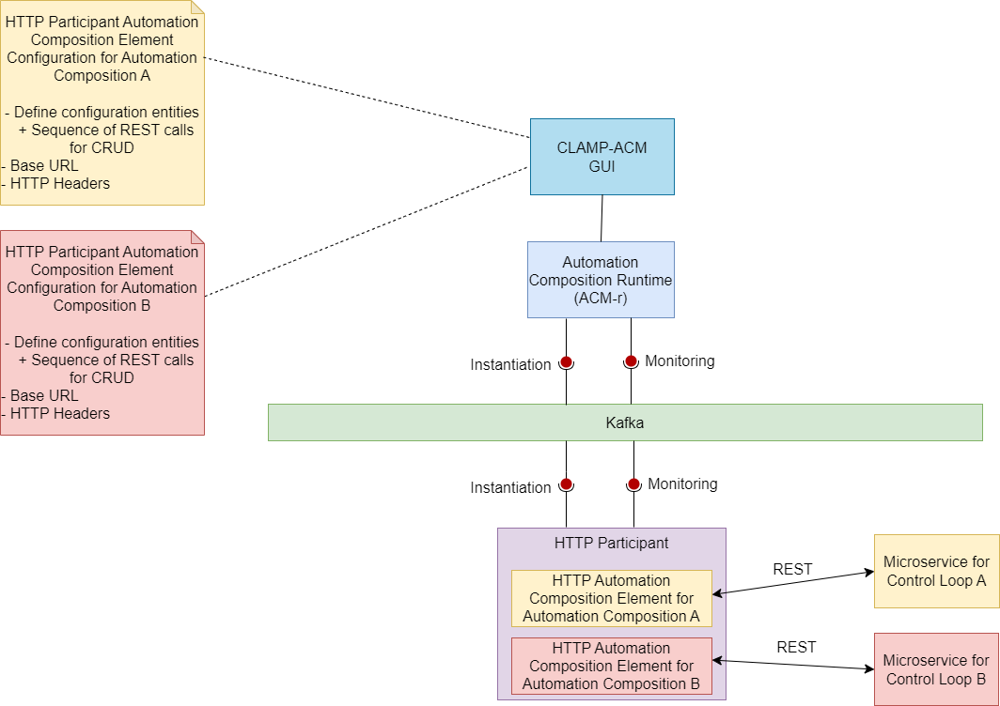

.. This work is licensed under a Creative Commons Attribution 4.0 International License.

.. _clamp-acm-http-participant:

HTTP Participant
################

The CLAMP HTTP participant receives configuration information from the CLAMP runtime,
maps the configuration information to a REST URL, and makes a REST call on the URL.
Typically the HTTP Participant is used with another participant such as the
:ref:`Kubernetes Participant <clamp-acm-k8s-participant>`, which brings up
the microservice that runs a REST server. Once the microservice is up, the HTTP
participant can be used to configure the microservice over its REST interface.Of course,
the HTTP participant works towards any REST service, it is not restricted to REST
services started by participants.
It supports the message Broker Kafka.

The HTTP participant runs a Automation Composition Element to handle the REST dialogues for a
particular application domain. The REST dialogues are whatever REST calls that are
required to implement the functionality for the application domain.

The HTTP participant allows the REST dialogues for a Automation Composition to be managed. A
particular Automation Composition may require many *things* to be configured and managed and this
may require many REST dialogues to achieve.

When a automation composition is initialized, the HTTP participant starts a HTTP Automation Composition
element for the automation composition. It reads the configuration information sent from the
Automation Composition Runtime runs a HTTP client to talk to the REST endpoint that is receiving
the REST requests. A HTTP participant can simultaneously manage HTTP Automation Composition
Elements towards multiple REST endpoints, as shown in the diagram above where the HTTP
participant is running two HTTP Automation Composition Elements, one for Automation Composition A and one for
Automation Composition B.

Supported Element Types
-----------------------
Supported Element Types for Http participant will be used to define the HTTP participant Element Definition Types in tosca template.
Participant Supported Element Types is defined in Http participant application.yaml.

.. code-block:: YAML

    participantSupportedElementTypes:
      -
        typeName: org.onap.policy.clamp.acm.HttpAutomationCompositionElement
        typeVersion: 1.0.0

Configuring an Automation Composition Definition and Instance for the HTTP participant
--------------------------------------------------------------------------------------
A *Configuration Entity* describes a concept that is managed by the HTTP participant. A
Configuration Entity can be created, Read, Updated, and Deleted (CRUD). The user defines
the Configuration Entities that it wants its HTTP Automation Composition Element to manage and
provides a sequence of parameterized REST commands to Create, Read, Update, and Delete
each Configuration Entity.

Sample tosca template defining a http participant and a AC element definition. :download:`click here <tosca/tosca-http-participant.yml>`

The user defines the following properties in the TOSCA for the HTTP participant:

.. list-table::
   :widths: 15 10 50
   :header-rows: 1

   * - Property
     - Type
     - Description
   * - baseUrl
     - URL
     - A well formed URL pointing at the REST server that is processing the REST requests
   * - httpHeaders
     - map
     - A map of *<String, String>* defining the HTTP headers to send on all REST calls
   * - configurationEntitiies
     - map
     - A map of *<String, ConfigurationEntity>* describing the names and definitions of
       configuration entities that are managed by this HTTP Automation Composition Element

The *ConfigurationEntity* type is described in the following table:

.. list-table::
   :widths: 15 10 50
   :header-rows: 1

   * - Field
     - Type
     - Description
   * - ID
     - ToscaConceptIdentifier
     - The name and version of the Configuration Entity
   * - restSequence
     - List<RestRequest>
     - A list of REST requests to give manage the Configuration Entity

The *RestRequest* type is described in the following table:

.. list-table::
   :widths: 15 10 50
   :header-rows: 1

   * - Field
     - Type
     - Description
   * - httpMethod
     - HttpMethod
     - An enum for the HTTP method {GET, PUT, POST, DELETE}
   * - path
     - String
     - The path of the REST endpoint relative to the baseUrl
   * - body
     - String
     - The body of the request for POST and PUT methods
   * - expectedResponse
     - HttpStatus
     - The expected HTTP response code fo the REST request

Sample Automation Composition instances.
In that example the user fills the properties defined in the TOSCA for the HTTP participant :download:`click here <tosca/automation-composition-http.yml>`

Http participant Interactions:
------------------------------
The http participant interacts with Automation Composition Runtime on the northbound via Message Broker. It interacts with any microservice on the southbound over http for configuration.

The communication for the Automation Composition updates and state change requests are sent from the Automation Composition Runtime to the participant via Message Broker.
The participant invokes the appropriate http endpoint of the microservice based on the received messages from the Automation Composition Runtime.

startPhase:
-----------
The http participant is often used along with :ref:`Kubernetes Participant <clamp-acm-k8s-participant>` to configure the microservice after the deployment.
This requires the Automation Composition Element of http participant to be started after the completion of deployment of the microservice. This can be achieved by adding the property `startPhase`
in the Automation Composition Element of http participant. Automation Composition Runtime starts the elements based on the `startPhase` value defined in the Tosca. The default value of startPhase is taken as '0'
which takes precedence over the Automation Composition Elements with the startPhase value '1'. Http Automation Composition Elements are defined with value '1' in order to start the Automation Composition Element in the second phase.

Http participant Workflow:
--------------------------
Once the participant is started, it sends a "REGISTER" event to the Message Broker topic which is then consumed by the Automation Composition Runtime to register this participant on the runtime database.
The user can commission the tosca definitions from the Policy Gui to the Automation Composition Runtime.
Once the automation composition definitions are available in the runtime database the user can prime them and further updates the participant with these definitions via Message Broker.
After primed, the Automation Composition can be instantiated with the default state "UNDEPLOYED" from the Policy Gui.

When the state of the Automation Composition is changed from "UNDEPLOYED" to "DEPLOYED" from the Policy Gui, the http participant receives the automation composition state change event from the runtime and
configures the microservice of the corresponding Automation Composition Element over http.
The configuration entity for a microservice is associated with each Automation Composition Element for the http participant.
The http participant holds the executed http requests information along with the responses received.

The participant is used in a generic way to configure any entity over http and it does not hold the information about the microservice to unconfigure/revert the configurations when the
state of Automation Composition changes from "DEPLOYED" to "UNDEPLOYED".

