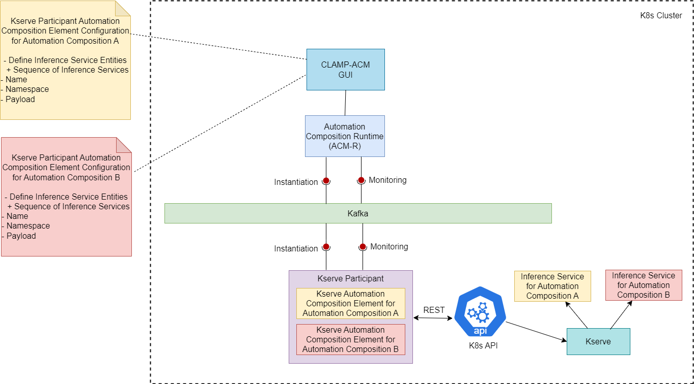

.. This work is licensed under a Creative Commons Attribution 4.0 International License.

.. _clamp-acm-kserve-participant:

Kserve Participant
##################

The Kserve participant receives inference service information from the CLAMP runtime and creates the inference services in Kubernetes cluster. The participant acts as a wrapper around the Kserve and creates the inference service.

Supported message Broker are DMaap and Strimzi-Kafka.

When an automation composition is initialized, the Kserve participant starts a Kserve Automation Composition
element for the automation composition. It reads the configuration information sent from the
Automation Composition Runtime and runs a REST client to talk to the K8s API to create the inference services.

Prerequisites for using Kserve participant:
-------------------------------------------

- Kserve installation in the same k8s cluster where Kserve participant is running.

Supported Element Types
-----------------------
Supported Element Types for Kserve participant will be used to define the Kserve participant Element Definition Types in tosca template.
Participant Supported Element Types is defined in Kserve participant application.yaml.

.. code-block:: YAML

    participantSupportedElementTypes:
      -
        typeName: org.onap.policy.clamp.acm.KserveAutomationCompositionElement
        typeVersion: 1.0.1

Defining a TOSCA CL definition for Kserve participant:
------------------------------------------------------

A *Kserve Inference Service Entity* describes a inference service that is managed by the Kserve participant. A
Inference Service Entity can be created, Read, and Deleted. The user defines
the Inference Service Entities that it wants its Kserve Automation Composition Element to manage.

Sample tosca template defining a participant and a AC element definition. :download:`click here <tosca/tosca-kserve-participant.yml>`

Configuring a Automation Composition Element on the Kserve participant for a Automation Composition
---------------------------------------------------------------------------------------------------

The user defines the following properties in the TOSCA template for the Kserve participant:

.. list-table::
   :widths: 15 10 50
   :header-rows: 1

   * - Property
     - Type
     - Description
   * - kserveInferenceEntityId
     - ToscaConceptIdentifier
     - The name and version of the inference service that needs to be managed by the Kserve participant
   * - name
     - String
     - The name of the inference service
   * - namespace
     - String
     - The namespace in the k8s cluster where the inference service needs to be installed
   * - payload
     - String
     - The payload of the inference service kubernetes entity. This will be used as payload to call the Kubernetes API.

Sample Automation Composition instances.
In that example the user fills the properties defined in the TOSCA for the Kserve participant :download:`click here <tosca/automation-composition-kserve.yml>`

Kserve participant Interactions:
--------------------------------
The Kserve participant interacts with Automation Composition Runtime on the northbound via Message Broker. It interacts with the Kubernetes API on the southbound for performing Kserve relation operations.

The communication for the Automation Composition updates and state change requests are sent from the Automation Composition Runtime to the participant via Message Broker.
The participant performs appropriate operations on the Kserve via Kubernetes REST based on the received messages from the Automation Composition Runtime.

Kserve participant Workflow:
----------------------------
Once the participant is started, it sends a "REGISTER" event to the Message Broker topic which is then consumed by the Automation Composition Runtime to register this participant on the runtime database.
The user can commission the tosca definitions from the Policy Gui to the Automation Composition Runtime.
Once the automation composition definitions are available in the runtime database, the user can prime them and further updates the participant with these definitions via Message Broker.
After primed, the Automation Composition can be instantiated with the default state "UNDEPLOYED" from the Policy Gui.

When the state of the Automation Composition is changed from "UNDEPLOYED" to "DEPLOYED" from the Policy Gui, the kserve participant receives the automation composition state change event from the runtime and
deploys the inference service associated with each Automation Composition Elements by calling the kubernetes api in the cluster.

The participant also monitors the deployed inference services for the configured time until the inference services comes to RUNNING state.
It holds the deployment information of the inference service including the current status of the inference services after the deployment.

When the state of the Automation Composition is changed from "DEPLOYED" to "UNDEPLOYED" back, the participant also undeploys the inference service from the cluster that are part of the Automation Composition Element.
