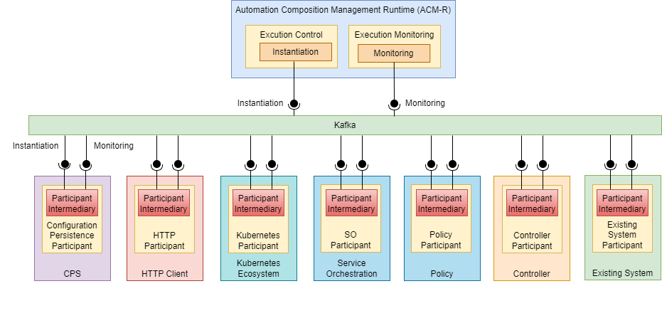

.. This work is licensed under a Creative Commons Attribution 4.0 International License.

.. _clamp-acm-participants:

Automation Composition Participants
###################################

A Participant is a component that acts as a bridge between the CLAMP Automation Composition Management runtime and components such as
the Policy Framework, DCAE, or a Kubernetes cluster that are taking part in automation composition management. It listens
to Kafka to receive messages from the CLAMP runtime and performs operations towards components that
are taking part in acms. A participant has an Automation Composition Management Element for each automation composition in
which it is taking part.

The implementation of a participant may use a common
:ref:`Participant Intermediary library <clamp-acm-participant-intermediary>`, which carries out common
message and state handling for Automation Composition Elements in participants. The *ParticipantImpelementation* is the
component specific implementation of a participant, which is specifically developed for each component that
wishes to take part in automation composition management.

The figure above shows participants for various components that may take part in automation composition management.

.. note:: The figure above is for illustration. Not all the participants mentioned above
          have realizations in ONAP. Some of the participants in the figure above represent
          a type of participant. For example, a controller participant would be written for
          a specific controller such as CDS and a participant for an existing system would be
          written towards that existing system.

The detailed implementation of the CLAMP Participant ecosystem is described on the following pages:

.. toctree::
   :maxdepth: 1

   participant-intermediary
   http-participant
   k8s-participant
   a1pms-participant
   kserve-participant
   policy-framework-participant
