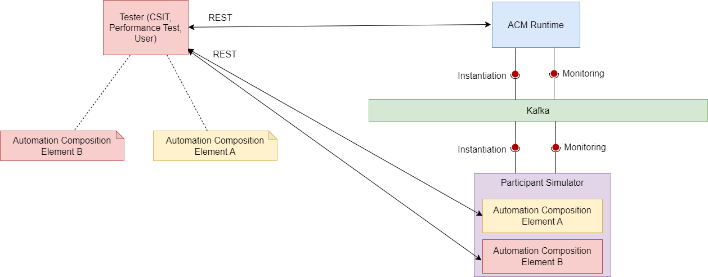

.. This work is licensed under a Creative Commons Attribution 4.0 International License.

.. _clamp-acm-sim-participant:

Simulator Participant
#####################

This can be used for simulation testing purpose when there are no actual frameworks or a full deployment.
Typically the Simulator Participant can be used with other Simulator participants with different supported element types.
Once the microservice is up, the Simulator participants can be used to test CLAMP runtime and intermediary library.
It supports the message Broker Kafka.

Supported Element Types
-----------------------
Supported Element Types for Simulator participant will be used to define a whatever participant Element Definition Types in tosca template.
Participant Supported Element Types is defined in Simulator participant application.yaml.
The example below shows how to mock the HTTP participant:

.. code-block:: YAML

    participantSupportedElementTypes:
      -
        typeName: org.onap.policy.clamp.acm.HttpAutomationCompositionElement
        typeVersion: 1.0.0

Supported participant Interactions:
-----------------------------------
The Simulator participant interacts with ACM Runtime on the northbound via Message Broker. It interacts with tester via Rest Api.

The communication for the Automation Composition updates and state change requests are sent from the ACM Runtime to the participant via Message Broker.
The tester can invoke the appropriate endpoint of the participant to change the behavior of how the participant should replay to ACM runtime.

Participant Simulator API
=========================

This API allows a Participant Simulator to be started and run for test purposes.

:download:`Download Policy Participant Simulator API Swagger  <swagger/participant-sim.json>`

.. swaggerv2doc:: swagger/participant-sim.json
