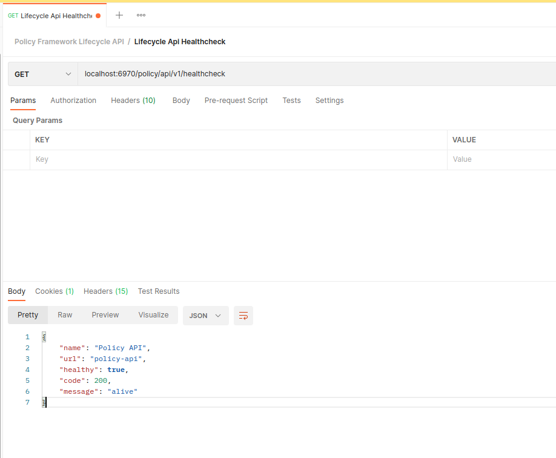
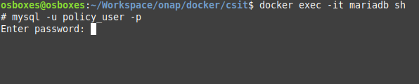
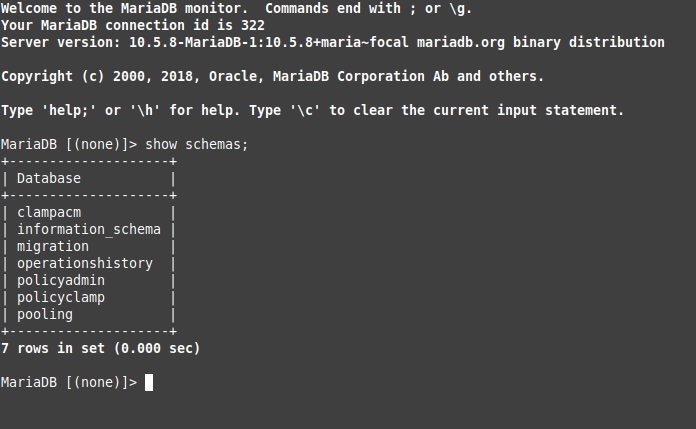
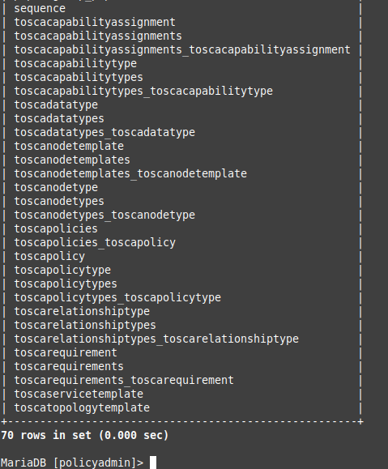
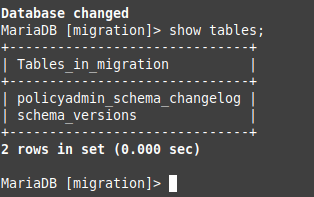
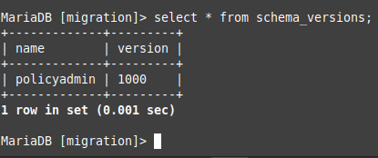
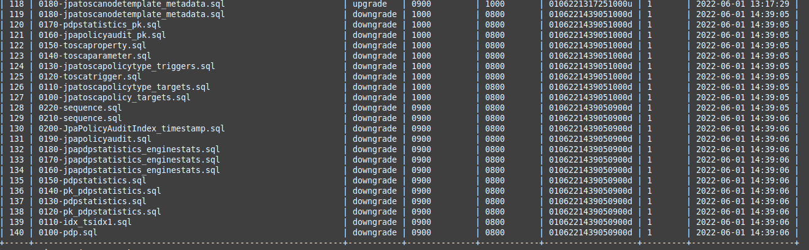
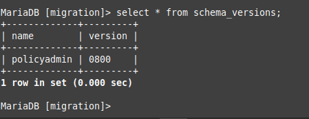
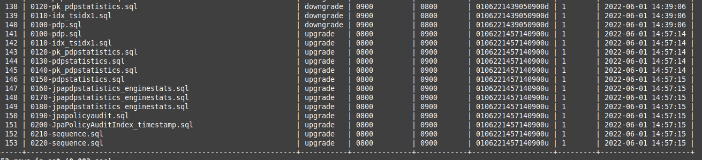
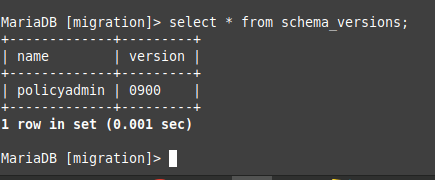

.. This work is licensed under a Creative Commons Attribution 4.0 International License.

.. _clamp-policy-upgrade-label:

TOSCA Policy Testing Upgrade
############################

.. contents::
    :depth: 3

Automation Composition
**********************

Istanbul
++++++++

**Step 1:** Clone Policy Clamp

.. code-block:: bash

    git clone "https://gerrit.onap.org/r/policy/clamp"

**Step 2:** Change Master Branch to Istanbul

.. code-block:: bash

    git checkout -b origin/istanbul

**Step 3:** Run Maven Clean Install

.. code-block:: bash

    mvn clean install

**Step 3:** Create the Database by going to /clamp/runtime/extra/bin-for-dev

.. code-block:: bash

    ./start-db.sh test

**Step 4:** Start Clamp Runtime by going to /clamp/runtime/extra/bin-for-dev

.. code-block:: bash

    ./start-backend.sh

**Step 5:** Start Control Loop Runtime by going to /clamp/runtime-controlloop

.. code-block:: bash

    java -jar target/policy-clamp-runtime-controlloop-6.1.5-SNAPSHOT

**Step 6:** Open up Postman and import the following collections

    `Download Istanbul Postman Collections <collections/Control Loop Istanbul.postman_collection.json>`_

**Step 7:** Open up the folder Control Loop Istanbul/Commissioning

    Select POST Commission Tosca Service Template and run it.

    *- Should receive the following result*

.. code-block:: json
    :linenos:

    {
        "errorDetails": null,
        "affectedInstanceProperties": [
            {
                "name": "PMSH_Instance1",
                "version": "1.2.3"
            },
            {
                "name": "org.onap.domain.pmsh.PMSH_MonitoringPolicyControlLoopElement",
                "version": "1.2.3"
            },
            {
                "name": "org.onap.domain.sample.GenericK8s_ControlLoopDefinition",
                "version": "1.2.3"
            },
            {
                "name": "org.onap.domain.database.PMSH_K8SMicroserviceControlLoopElement_Instance1",
                "version": "1.2.3"
            },
            {
                "name": "org.onap.domain.database.Local_K8SMicroserviceControlLoopElement_Instance1",
                "version": "1.2.3"
            },
            {
                "name": "org.onap.policy.controlloop.PolicyControlLoopParticipant",
                "version": "2.3.1"
            },
            {
                "name": "org.onap.controlloop.HttpControlLoopParticipant",
                "version": "2.3.4"
            },
            {
                "name": "org.onap.domain.database.Http_PMSHMicroserviceControlLoopElement",
                "version": "1.2.3"
            },
            {
                "name": "org.onap.domain.pmsh.PMSH_OperationalPolicyControlLoopElement",
                "version": "1.2.3"
            },
            {
                "name": "org.onap.domain.database.Local_K8SMicroserviceControlLoopElement",
                "version": "1.2.3"
            },
            {
                "name": "org.onap.domain.pmsh.PMSH_MonitoringPolicyControlLoopElement_Instance1",
                "version": "1.2.3"
            },
            {
                "name": "org.onap.domain.pmsh.DerivedPolicyControlLoopElement_Instance1",
                "version": "1.2.3"
            },
            {
                "name": "org.onap.k8s.controlloop.K8SControlLoopParticipant",
                "version": "2.3.4"
            },
            {
                "name": "org.onap.domain.pmsh.DerivedDerivedPolicyControlLoopElement",
                "version": "1.2.3"
            },
            {
                "name": "org.onap.domain.pmsh.PMSH_OperationalPolicyControlLoopElement_Instance1",
                "version": "1.2.3"
            },
            {
                "name": "org.onap.domain.sample.GenericK8s_ControlLoopDefinition_Instance1",
                "version": "1.2.3"
            },
            {
                "name": "org.onap.policy.controlloop.PolicyControlLoopParticipant_Instance1",
                "version": "2.3.1"
            },
            {
                "name": "org.onap.k8s.controlloop.K8SControlLoopParticipant_Instance1",
                "version": "2.3.4"
            },
            {
                "name": "org.onap.controlloop.HttpControlLoopParticipant_Instance1",
                "version": "2.3.4"
            },
            {
                "name": "org.onap.domain.pmsh.DerivedDerivedPolicyControlLoopElement_Instance1",
                "version": "1.2.3"
            },
            {
                "name": "org.onap.domain.database.Http_PMSHMicroserviceControlLoopElement_Instance1",
                "version": "1.2.3"
            },
            {
                "name": "org.onap.domain.database.PMSH_K8SMicroserviceControlLoopElement",
                "version": "1.2.3"
            },
            {
                "name": "org.onap.domain.pmsh.DerivedPolicyControlLoopElement",
                "version": "1.2.3"
            }
        ]
    }

**Step 8:** To try out other endpoints try out the other postman collections inside commission folder

**Step 9:** To decommission the Tosca Service Template Select DELETE Tosca Service Template

    *- Should receive the following result*

.. code-block:: json
    :linenos:

    {
        "errorDetails": null,
        "affectedControlLoopDefinitions": [
            {
                "name": "ToscaServiceTemplateSimple",
                "version": "1.0.0"
            }
        ]
    }

**Step 10:** For Instance Properties select the following folder in postman Control Loop Istanbul/Instantiation

    Select POST Instance Properties

    *- Should receive the following result*

.. code-block:: json
    :linenos:

    {
        "errorDetails": null,
        "affectedInstanceProperties": [
            {
                "name": "PMSH_Instance1",
                "version": "1.2.3"
            },
            {
                "name": "org.onap.domain.pmsh.PMSH_MonitoringPolicyControlLoopElement",
                "version": "1.2.3"
            },
            {
                "name": "org.onap.domain.sample.GenericK8s_ControlLoopDefinition",
                "version": "1.2.3"
            },
            {
                "name": "org.onap.domain.database.PMSH_K8SMicroserviceControlLoopElement_Instance1",
                "version": "1.2.3"
            },
            {
                "name": "org.onap.domain.database.Local_K8SMicroserviceControlLoopElement_Instance1",
                "version": "1.2.3"
            },
            {
                "name": "org.onap.policy.controlloop.PolicyControlLoopParticipant",
                "version": "2.3.1"
            },
            {
                "name": "org.onap.controlloop.HttpControlLoopParticipant",
                "version": "2.3.4"
            },
            {
                "name": "org.onap.domain.database.Http_PMSHMicroserviceControlLoopElement",
                "version": "1.2.3"
            },
            {
                "name": "org.onap.domain.pmsh.PMSH_OperationalPolicyControlLoopElement",
                "version": "1.2.3"
            },
            {
                "name": "org.onap.domain.database.Local_K8SMicroserviceControlLoopElement",
                "version": "1.2.3"
            },
            {
                "name": "org.onap.domain.pmsh.PMSH_MonitoringPolicyControlLoopElement_Instance1",
                "version": "1.2.3"
            },
            {
                "name": "org.onap.domain.pmsh.DerivedPolicyControlLoopElement_Instance1",
                "version": "1.2.3"
            },
            {
                "name": "org.onap.k8s.controlloop.K8SControlLoopParticipant",
                "version": "2.3.4"
            },
            {
                "name": "org.onap.domain.pmsh.DerivedDerivedPolicyControlLoopElement",
                "version": "1.2.3"
            },
            {
                "name": "org.onap.domain.pmsh.PMSH_OperationalPolicyControlLoopElement_Instance1",
                "version": "1.2.3"
            },
            {
                "name": "org.onap.domain.sample.GenericK8s_ControlLoopDefinition_Instance1",
                "version": "1.2.3"
            },
            {
                "name": "org.onap.policy.controlloop.PolicyControlLoopParticipant_Instance1",
                "version": "2.3.1"
            },
            {
                "name": "org.onap.k8s.controlloop.K8SControlLoopParticipant_Instance1",
                "version": "2.3.4"
            },
            {
                "name": "org.onap.controlloop.HttpControlLoopParticipant_Instance1",
                "version": "2.3.4"
            },
            {
                "name": "org.onap.domain.pmsh.DerivedDerivedPolicyControlLoopElement_Instance1",
                "version": "1.2.3"
            },
            {
                "name": "org.onap.domain.database.Http_PMSHMicroserviceControlLoopElement_Instance1",
                "version": "1.2.3"
            },
            {
                "name": "org.onap.domain.database.PMSH_K8SMicroserviceControlLoopElement",
                "version": "1.2.3"
            },
            {
                "name": "org.onap.domain.pmsh.DerivedPolicyControlLoopElement",
                "version": "1.2.3"
            }
        ]
    }

**Step 11:** To try out other endpoints try out the other postman collections inside Instantiation folder

**Step 12:** To delete Instance properties select DELETE Instance Properties

    *- Should receive the following result*

.. code-block:: json
    :linenos:

    {
        "errorDetails": null,
        "affectedControlLoops": [
            {
                "name": "PMSH_Instance1",
                "version": "1.2.3"
            }
        ]
    }

**Step 13:** For monitoring endpoints go to Control Loop Istanbul/Monitoring folder

Jakarta
+++++++

**Step 1:** Clone Policy Clamp

.. code-block:: bash

    git clone "https://gerrit.onap.org/r/policy/clamp"

**Step 2:** Change Master Branch to Jakarta

.. code-block:: bash

    git checkout -b origin/jakarta

**Step 3:** Run Maven Clean Install

.. code-block:: bash

    mvn clean install

**Step 3:** Create the Database by going to /clamp/runtime/extra/bin-for-dev

.. code-block:: bash

    ./start-db.sh test

**Step 4:** Start Clamp Runtime by going to /clamp/runtime/extra/bin-for-dev

.. code-block:: bash

    ./start-backend.sh

**Step 5:** Start Automation Composition Runtime by going to /clamp/runtime-acm

.. code-block:: bash

    java -jar target/policy-clamp-runtime-acm-6.3.0-SNAPSHOT.jar

**Step 6:** Open up Postman and import the following collections

    `Download Jakarta Postman Collections <collections/Automation Composition Jakarta.postman_collection.json>`_

**Step 7:** Open up the folder Automation Composition Jakarta/Commissioning

    Select POST Commission Tosca Service Template and run it.

    *- Should receive the following result*

.. code-block:: json
    :linenos:

    {
        "errorDetails": null,
        "affectedAutomationCompositionDefinitions": [
            {
                "name": "org.onap.domain.database.Http_PMSHMicroserviceAutomationCompositionElement",
                "version": "1.2.3"
            },
            {
                "name": "org.onap.domain.database.PMSH_K8SMicroserviceAutomationCompositionElement",
                "version": "1.2.3"
            },
            {
                "name": "org.onap.domain.pmsh.PMSH_MonitoringPolicyAutomationCompositionElement",
                "version": "1.2.3"
            },
            {
                "name": "org.onap.domain.pmsh.PMSH_OperationalPolicyAutomationCompositionElement",
                "version": "1.2.3"
            },
            {
                "name": "org.onap.domain.sample.GenericK8s_AutomationCompositionDefinition",
                "version": "1.2.3"
            },
            {
                "name": "org.onap.policy.clamp.acm.HttpParticipant",
                "version": "2.3.4"
            },
            {
                "name": "org.onap.policy.clamp.acm.KubernetesParticipant",
                "version": "2.3.4"
            },
            {
                "name": "org.onap.policy.clamp.acm.PolicyParticipant",
                "version": "2.3.1"
            }
        ]
    }

**Step 8:** To try out other endpoints try out the other postman collections inside commission folder

**Step 9:** To decommission the Tosca Service Template Select DELETE Tosca Service Template

    *- Should receive the following result*

.. code-block:: json
    :linenos:

    {
        "errorDetails": null,
        "affectedAutomationCompositionDefinitions": [
            {
                "name": "ToscaServiceTemplateSimple",
                "version": "1.0.0"
            }
        ]
    }

**Step 10:** For Instance Properties select the following folder in postman Automation Composition Jakarta/Instantiation

    Select POST Instance Properties

    *- Should receive the following result*

.. code-block:: json
    :linenos:

    {
        "errorDetails": null,
        "affectedInstanceProperties": [
            {
                "name": "ATT",
                "version": "2.3.4"
            },
            {
                "name": "org.onap.domain.sample.GenericK8s_AutomationCompositionDefinition",
                "version": "1.2.3"
            },
            {
                "name": "org.onap.policy.clamp.acm.PolicyParticipant",
                "version": "2.3.1"
            },
            {
                "name": "org.onap.domain.pmsh.PMSH_OperationalPolicyAutomationCompositionElement",
                "version": "1.2.3"
            },
            {
                "name": "org.onap.domain.pmsh.PMSH_MonitoringPolicyAutomationCompositionElement",
                "version": "1.2.3"
            },
            {
                "name": "org.onap.policy.clamp.acm.HttpParticipant",
                "version": "2.3.4"
            },
            {
                "name": "org.onap.policy.clamp.acm.KubernetesParticipant-ATT",
                "version": "2.3.4"
            },
            {
                "name": "org.onap.policy.clamp.acm.KubernetesParticipant",
                "version": "2.3.4"
            },
            {
                "name": "org.onap.domain.database.Http_PMSHMicroserviceAutomationCompositionElement-ATT",
                "version": "1.2.3"
            },
            {
                "name": "org.onap.domain.pmsh.PMSH_OperationalPolicyAutomationCompositionElement-ATT",
                "version": "1.2.3"
            },
            {
                "name": "org.onap.domain.database.Http_PMSHMicroserviceAutomationCompositionElement",
                "version": "1.2.3"
            },
            {
                "name": "org.onap.domain.database.PMSH_K8SMicroserviceAutomationCompositionElement-ATT",
                "version": "1.2.3"
            },
            {
                "name": "org.onap.domain.pmsh.PMSH_MonitoringPolicyAutomationCompositionElement-ATT",
                "version": "1.2.3"
            },
            {
                "name": "org.onap.policy.clamp.acm.PolicyParticipant-ATT",
                "version": "2.3.1"
            },
            {
                "name": "org.onap.policy.clamp.acm.HttpParticipant-ATT",
                "version": "2.3.4"
            },
            {
                "name": "org.onap.domain.database.PMSH_K8SMicroserviceAutomationCompositionElement",
                "version": "1.2.3"
            },
            {
                "name": "org.onap.domain.sample.GenericK8s_AutomationCompositionDefinition-ATT",
                "version": "1.2.3"
            }
        ]
    }

**Step 11:** To try out other endpoints try out the other postman collections inside Instantiation folder

**Step 12:** To delete Instance properties select DELETE Instance Properties

    *- Should receive the following result*

.. code-block:: json
    :linenos:

    {
        "errorDetails": null,
        "affectedAutomationCompositionDefinitions": [
            {
                "name": "ToscaServiceTemplateSimple",
                "version": "1.0.0"
            }
        ]
    }

**Step 13:** For monitoring endpoints go to Automation Composition Jakarta/Monitoring folder

PAP & API
*********

Istanbul
++++++++

**Step 1:** Clone Policy Docker

.. code-block:: bash

    git clone "https://gerrit.onap.org/r/policy/docker"

**Step 2:** Go to the CSIT directory

.. code-block:: bash

    cd docker/csit

**Step 3:** Run prepare csit script

.. code-block:: bash

    ./prepare-csit.sh

**Step 4:** Run start api pap script

.. code-block:: bash

    ./start-api-pap.sh

**Step 5:** Once api and pap has started check run the postman script Policy Framework Lifecycle API/Lifecycle Api Healthcheck at port 6970

**Step 6:** Log into mariadb container

.. code-block:: bash

    docker exec -it mariadb sh

**Step 7:** Log into mariadb container

.. code-block:: bash

    docker exec -it mariadb sh

**Step 8:** Connect to mariadb

.. code-block:: bash

    mysql -u policy_user -p

**Step 9:** Enter mariadb password

**password:** policy_user

**Step 10:** View all schemas

.. code-block:: bash

    show schemas;

**Step 11:** Select policyadmin schema

.. code-block:: bash

    use policyadmin;

**Step 12:** View all tables

.. code-block:: bash

    show tables;

**Step 13:** Change schema to migration

.. code-block:: bash

    use migration;

**Step 14:** View migration tables

.. code-block:: bash

    show tables;

**Step 15:** Select tables from schema_versions

.. code-block:: bash

    select * from schema_versions;

'*' Notice the version 1000 is the latest

**Step 16:** Go inside the db-migrator container

.. code-block:: bash

    docker exec -it policy-db-migrator sh

**Step 17:** See what environment variables is set on the container

.. code-block:: bash

    printenv

**Step 18:** If SQL_HOST, SQL_DB, SQL_USER, SQL_PASSWORD & SCRIPT_DIRECTORY is not set do the following

.. code-block:: bash
    :linenos:

    export SQL_HOST=mariadb
    export SQL_DB=policyadmin
    export SQL_USER=policy_user
    export SQL_PASSWORD=policy_user
    export SCRIPT_DIRECTORY=sql

**Step 19:** To downgrade to Istanbul go to the following directory /opt/app/policy/bin and use the following script

.. code-block:: bash

    ./prepare_downgrade policyadmin

**Step 20:** To downgrade to Istanbul go to the following directory /opt/app/policy/bin and use the following script

.. code-block:: bash

    ./db-migrator -s policyadmin -o downgrade -f 1000 -t 0800

**Step 21:** Go back to the mariaddb container

.. code-block:: bash

    docker exec -it mariadb sh

**Step 22:** Log back into mariadb

.. code-block:: bash

    mysql -u policy_user -p

**Step 23:** See if the downgrade has been successfully

.. code-block:: bash
    :linenos:

    use migration;
    select * from policyadmin_schema_changelog;
    select * from schema_versions;

*

*

**Step 24:** To upgrade to Jakarta repeat steps 16, 17 & 18

**Step 25:** Got to the following directory /opt/app/policy/bin and use the following script

.. code-block:: bash

    ./prepare_upgrade.sh policyadmin

**Step 26:** Got to the following directory /opt/app/policy/bin and use the following script

.. code-block:: bash

    ./db-migrator -s policyadmin -o upgrade -f 0800 -t 0900

**Step 27:** Repeat steps 21, 22 & 23

*

*

