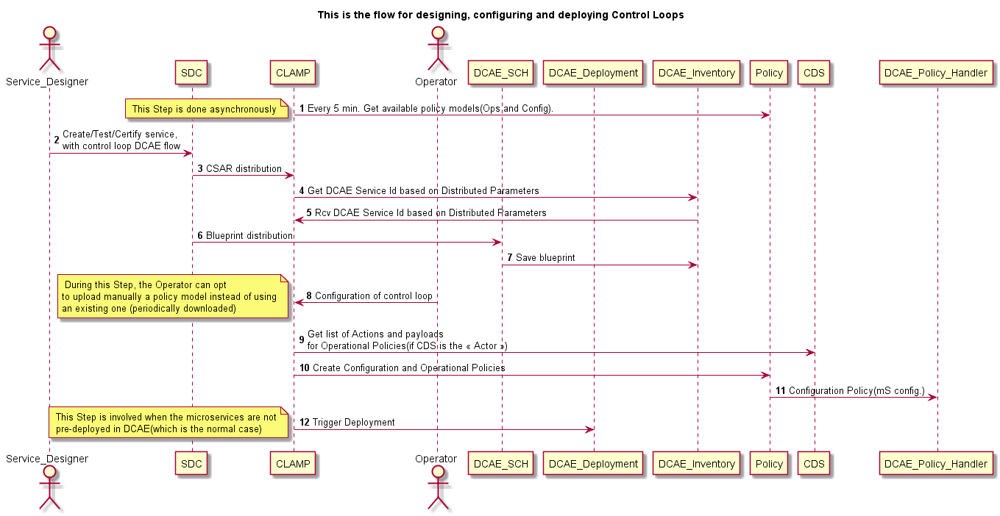
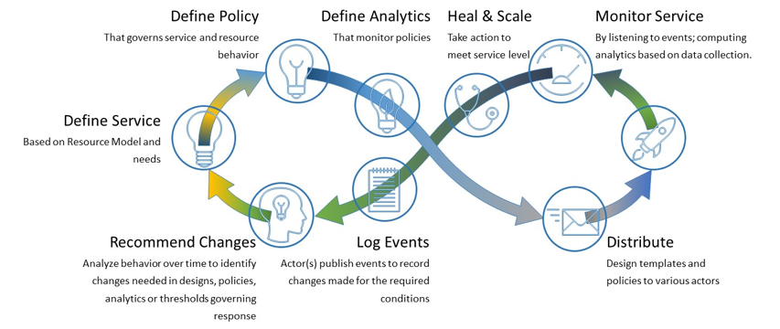

.. This work is licensed under a Creative Commons Attribution 4.0 International License.
.. http://creativecommons.org/licenses/by/4.0
.. Copyright (c) 2017-2021 AT&T Intellectual Property.  All rights reserved.

.. _architecture:

Policy/Clamp in the ONAP Architecture
=====================================

CLAMP platform has been integrated into the Policy framework project, starting as a POC during
Honolulu release and as a official feature with Istanbul release. So CLAMP must be seen now
as a function provided by the Policy Framework project.

CLAMP is a function for designing and managing control loops and a UI to manage Policies.
It is used to visualize a control loop, configure it with specific parameters for a particular network
service, then deploying and undeploying it.  Once deployed, the user can also
update the loop with new parameters during runtime, as well as suspending and
restarting it.

Starting with Istanbul release, CLAMP GUI can also be used to create/read/update/delete/list policies
outside of a control loop, and therefore CLAMP is also the front-end for Policies management in ONAP.

CLAMP interacts with other systems to deploy and execute the control loop. For
example, it extracts the control loop blueprint from CSAR distributed by SDC.
CLAMP also calls the internal Policy framework API to get the Policy Models(Model Driven Control Loop)
It requests from DCAE the instantiation of microservices.
to manage the control loop flow. Furthermore, it creates and updates multiple
policies (for DCAE mS configuration and actual Control Operations) in the Policy Engine
that define the closed loop flow.

|clamp-flow|

The ONAP CLAMP function abstracts the details of these systems under the concept
of a control loop model.  The design of a control loop and its management is
represented by a workflow in which all relevant system interactions take
place.  This is essential for a self-service model of creating and managing
control loops, where no low-level user interaction with other components is
required.

At a higher level, CLAMP is about supporting and managing the broad operational
life cycle of VNFs/VMs and ultimately ONAP components itself. It offers the
ability to design, test, deploy and update control loop automation - both closed
and open. Automating these functions represents a significant saving on
operational costs compared to traditional methods.

|closed-loop|

