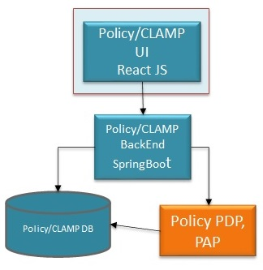

.. This work is licensed under a Creative Commons Attribution 4.0 International License.
.. http://creativecommons.org/licenses/by/4.0
.. Copyright (c) 2017-2021 AT&T Intellectual Property. All rights reserved.
.. _clamp-builtin-label:

Policy/CLAMP - Control Loop Automation Management Platform
==========================================================
.. High level architecture, design, and packaging information for release planning and delivery.

.. include:: architecture.rst

Offered APIs
------------
The list of APIs that Policy/CLAMP has offered could be find in the following table:

.. |pdf-icon| image:: images/pdf.png
              :width: 40px

.. |swagger-icon| image:: images/swagger.png
                   :width: 40px

.. |html-icon| image:: images/html.png
               :width: 40px

.. csv-table::
   :header: "|Swagger-icon|", "|html-icon|", "|pdf-icon|"
   :widths: 60,60,60

   "swagger json file", "html doc", "pdf doc"
   ":download:`link <swagger/swagger.json>`", ":download:`link <swagger/swagger.html>`", ":download:`link <swagger/swagger.pdf>`"

Consumed APIs
-------------
Policy/CLAMP uses the API's exposed by the following ONAP components:

- SDC : REST based interface exposed by the SDC, Distribution of service to DCAE
- DCAE: REST based interface exposed by DCAE, Common Controller Framework, DCAE microservices onboarded (TCA, Stringmatch, Holmes (optional))
- Policy Core: REST based interface, Policy Core engine target both XACML and Drools PDP, Policy Engine trigger operations to App-C/VF-C/SDN-C
- CDS: REST based interface, to retrieve list of operations/actions with their corresponding payload at runtime for Operational Policies where the field 'actor' is 'CDS'.

Delivery
--------
Policy/CLAMP component is composed of a UI layer and a backend layer, each layer having its own container.
Policy/CLAMP also requires a database instance with 1 DB, it uses MariaDB, which is the same DB as for the core Policy.

|clamp-policy-archi|

Logging & Diagnostic Information
--------------------------------
CLAMP uses logback framework to generate logs. The logback.xml file can be found under the [src/main/resources/ folder](src/main/resources).

With the default log settings, all logs will be generated into console and into root.log file under the CLAMP root folder. The root.log file is not allowed to be appended, thus restarting the CLAMP will result in cleaning of the old log files.

.. _index-clamp-installation:

Installation
------------
A [docker-compose example file](extra/docker/clamp/docker-compose.yml) can be found under the [extra/docker/clamp/ folder](extra/docker/).

Once the image has been built and is available locally, you can use the `docker-compose up` command to deploy a pre-populated database and a CLAMP instance available on [https://localhost:3000](https://localhost:3000).

Configuration
-------------
.. Where are they provided?
.. What are parameters and values?

Currently, the CLAMP docker images can be deployed with small configuration needs. Though, you might need to make small adjustments to the configuration. As CLAMP is spring based, you can use the SPRING_APPLICATION_JSON environment variable to update its parameters.

.. TODO detail config parameters and the usage

There are one datasource for Clamp. By default, it will try to connect to the localhost server using the credentials available in the example SQL files. If you need to change the default database host and/or credentials, you can do it by using the following json as SPRING_APPLICATION_JSON environment variable :

.. code-block:: json

    {
        "spring.datasource.cldsdb.url": "jdbc:mariadb:sequential://clampdb.{{ include "common.namespace" . }}:3306/cldsdb4?autoReconnect=true&connectTimeout=10000&socketTimeout=10000&retriesAllDown=3",
        "clamp.config.files.sdcController": "file:/opt/clamp/sdc-controllers-config.json",
        "clamp.config.dcae.inventory.url": "https://inventory.{{ include "common.namespace" . }}:8080",
        "clamp.config.dcae.dispatcher.url": "https://deployment-handler.{{ include "common.namespace" . }}:8443",
        "clamp.config.dcae.deployment.url": "https://deployment-handler.{{ include "common.namespace" . }}:8443",
        "clamp.config.dcae.deployment.userName": "none",
        "clamp.config.dcae.deployment.password": "none",
        "clamp.config.policy.api.url": "https://policy-api.{{ include "common.namespace" . }}:6969",
        "clamp.config.policy.api.userName": "healthcheck",
        "clamp.config.policy.api.password": "zb!XztG34",
        "clamp.config.policy.pap.url": "https://policy-pap.{{ include "common.namespace" . }}:6969",
        "clamp.config.policy.pap.userName": "healthcheck",
        "clamp.config.policy.pap.password": "zb!XztG34",
        "clamp.config.cadi.aafLocateUrl": "https://aaf-locate.{{ include "common.namespace" . }}:8095",
        "com.att.eelf.logging.path": "/opt/clamp",
        "com.att.eelf.logging.file": "logback.xml"
    }

SDC-Controllers config
----------------------
This file is a JSON that must be specified to Spring config, here is an example:

.. code-block:: json

    {
     "sdc-connections":{
       "sdc-controller1":{
           "user": "clamp",
           "consumerGroup": "consumerGroup1",
           "consumerId": "consumerId1",
           "environmentName": "AUTO",
           "sdcAddress": "localhost:8443",
           "password": "b7acccda32b98c5bb7acccda32b98c5b05D511BD6D93626E90D18E9D24D9B78CD34C7EE8012F0A189A28763E82271E50A5D4EC10C7D93E06E0A2D27CAE66B981",
           "pollingInterval":30,
           "pollingTimeout":30,
           "activateServerTLSAuth":"false",
           "keyStorePassword":"",
           "keyStorePath":"",
           "messageBusAddresses":["dmaaphost.com"]
       },
       "sdc-controller2":{
           "user": "clamp",
           "consumerGroup": "consumerGroup1",
           "consumerId": "consumerId1",
           "environmentName": "AUTO",
           "sdcAddress": "localhost:8443",
           "password": "b7acccda32b98c5bb7acccda32b98c5b05D511BD6D93626E90D18E9D24D9B78CD34C7EE8012F0A189A28763E82271E50A5D4EC10C7D93E06E0A2D27CAE66B981",
           "pollingInterval":30,
           "pollingTimeout":30,
           "activateServerTLSAuth":"false",
           "keyStorePassword":"",
           "keyStorePath":"",
           "messageBusAddresses":["dmaaphost.com"]
       }
     }
    }

Multiple controllers can be configured so that Clamp is able to receive the notifications from different SDC servers.
Each Clamp existing in a cluster should have different consumerGroup and consumerId so that they can each consume the SDC notification.
The environmentName is normally the Dmaap Topic used by SDC.
If the sdcAddress is not specified or not available (connection failure) the messageBusAddresses will be used (Dmaap servers)

Administration
--------------

A user can access Policy/CLAMP UI at the following URL : https://localhost:3000.
(in this URL 'localhost' must be replaced by the actual host where Policy/CLAMP has been installed if it is not your current localhost)
For OOM, the URL is https://<host-ip>:30258

.. code-block:: html

   - Without AAF, the credentials are
     Default username : admin
     Default password : password

   - With AAF enabled, the certificate p12 must be added to the browser
     ca path: src/main/resources/clds/aaf/org.onap.clamp.p12, password "China in the Spring"
     Or get it from this page : https://wiki.onap.org/display/DW/Control+Loop+Flows+and+Models+for+Casablanca

Human Interfaces
----------------
.. Basic info on the interface type, ports/protocols provided over, etc.

User Interface - serve to configure control loop
Policy/CLAMP UI is used to configure the Control Loop designed and distributed by SDC. From that UI it's possible to distribute the configuration policies and control the life-cycle of the DCAE Micro Services.
Policy/CLAMP UI is also used to manage Policies outside of a Control Loop.

The following actions are done using the UI:

* Design a control loop flow by selecting a predefined template from a list
  (a template is an orchestration chain of Micro-services, so the template
  defines how the micro-services of the control loop are chained together)

* Give value to the configuration the parameters of each micro-service of
  the control loop

* Select the service and VNF(of that service) to which the control loop
  will be attached

* Configure the operational policy(the actual operation resulting from
  the control loop)

* Send the “TOSCA” blueprint parameters that will be used by DCAE to start the
  control loop (The blueprint will be sent first to SDC and SDC will
  publish it to DCAE)

* Trigger the deployment of the Control loop in DCAE

* Control (start/stop) the operation of the control loop in DCAE

HealthCheck API - serve to verify CLAMP status (see offered API's section)
* https://<host-ip>:8443/restservices/clds/v1/healthcheck
This one does not require the certificate

Walk-through can be found here: https://wiki.onap.org/display/DW/CLAMP+videos

.. toctree::
   :maxdepth: 1
   :titlesonly:

   CLAMP User Guide <user-guide.rst>