.. This work is licensed under a Creative Commons Attribution 4.0 International License.
.. http://creativecommons.org/licenses/by/4.0
.. Copyright (c) 2017-2021 AT&T Intellectual Property.  All rights reserved.

Control loop in Policy/CLAMP
----------------------------
There are 2 control loop levels in Policy/CLAMP:

- Control loop template: This is created from the DCAE blueprint (designed in the DCAE designer), and distributed by SDC to CLAMP.
- Control loop instance: Based on the template, it represents a physical control loop in the platform related to a service and a VNF.

There is no way to design the microservice components of the control loop from scratch in CLAMP, you can only configure it and manage its life-cycle.
For more info on how to design the service in SDC, check this: https://wiki.onap.org/display/DW/CLAMP+videos#CLAMPvideos-DesignpartinSDC

There is a specific menu to view the available Control loop templates.

|clamp-template-menu|

Each microservice policies and operational policies is related to a Policy Model.
Clamp either communicates with Policy Engine periodically to download the available Policy Models automatically or user can upload the Policy Model manually.
Policy Models related operations could be found under Policy Models menu.

|clamp-policy-model-menu|

Under the menu *Loop Instance*, there's a list of actions to perform regarding to the loops.

|clamp-loop-menu|

Option *Create* creates the loop from the templates distributed by SDC.

|clamp-create-loop|

Option *Open* opens the saved loops. Once the distributed control loop has been chosen, the control loop is shown to the user.

|clamp-open-loop|

Option *Close* will close the current opened loop.

Option *Modify* opens the window to add/remove different Operational Policies to the loop.
Tab *Add Operational Policies* lists all the available operational policies.
Click *Add* button to add the selected operational policies to the loop.

|clamp-add-operational-policies|

Tab *Remove Operational Policies* lists all the operational policies added to the loop.
Click *Remove* button to remove the selected operational policies from the loop.

|clamp-remove-operational-policies|

Once opened, the user can start configure empty control loop using **Closed loop modeller**.

|clamp-opened-loop|

Loop modeler has 3 main parts:

#. Loop configuration view
    Visualizes event flow in Control Loop. This view is auto-generated by Clamp. To generate it Clamp parses DCAE_INVENTORY_BLUEPRINT from CSAR distributed by SDC.
    It Always consists of **VES -> <nodes from blueprint> -> OperationalPolicy**. Not all nodes are visualized. Only those with type **dcae.nodes.\***
    |blueprint-node|

#. Loop status
    Visualizes status of opened loop.
#. Loop logs
    Table with log data of opened loop

Control Loop properties
-----------------------
In Dublin release this view shows what are deployment parameters or control Loop.
To open it from *Loop Instance* menu select *Properties*

|clamp-menu-prop|

This opens a box with JSON object. It contains deployment parameters extracted from DCAE_INVENTORY_BLUEPRINT.
It's not recommended to edit this JSON. Each of this parameters should be available in view shown to deploy analytic application.

|clamp-prop-box|

Operational policy properties
---------------------------------------
Operational policies are added by the user using *Modify* window. The configuration view is generated using Policy Type assigned to selected operational policy.

To configure operational policies, user has to click the corresponding operational policy boxes. Example popup dialog for operational policy looks like:

|clamp-op-policy-box-policy|

Operations and payload for CDS actor is fetched from CDS.
Clamp receives CDS blueprint name and version information from sdnc_model_name and sdnc_model_version properties in CSAR distributed by SDC and queries CDS to get list of operations and payload for the corresponding CDS blueprint.

|clamp-cds-operation|

Micro-service policy properties
-------------------------------
Boxes between `VES` and `Operational Policies` are generated from blueprint. They can be one of ONAP predefined analytic microservices or custom analytics.
Each of the boxes is clickable. Microservice configuration view is generated using Policy Type assigned to selected microservice.
Clamp by default assumes that microservices have policy type **onap.policies.monitoring.cdap.tca.hi.lo.app**.

After clicking microservice box Clamp opens popup dialog. Example popup dialog for microservice with default type looks like:

|clamp-config-policy-tca|

In the *Loop Operations* menu, lists the operations to be perform to the loop.

|clamp-loop-operation-menu|

Submitting the Control loop to core policy
------------------------------------------
The SUBMIT operation can be used to send the configuration to policy engine.
If everything is successful, the status to the policy will become *SENT*. Clamp should also show proper logs in logs view.

|clamp-policy-submitted|

After Policies are submitted they should be visible in Policy PAP component.
Please check  `Policy GUI <https://docs.onap.org/en/dublin/submodules/policy/engine.git/docs/platform/policygui.html>`_

Deploy/undeploy the Control Loop to DCAE
-----------------------------------------
Once sent to policy engine, Clamp can ask to DCAE to DEPLOY the micro service

This opens a window where the parameters of the DCAE micro service can be configured/tuned.
The policy_id is automatically generated by Clamp in the previous steps.

|clamp-deploy-params|

Once deployed on DCAE the status of DCAE goes to *MICROSERVICE_INSTALLED_SUCCESSFULLY*, it can then be Undeployed/Stopped/Restart.

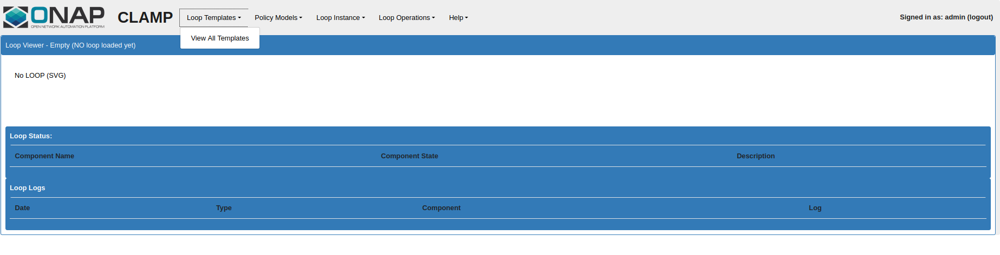
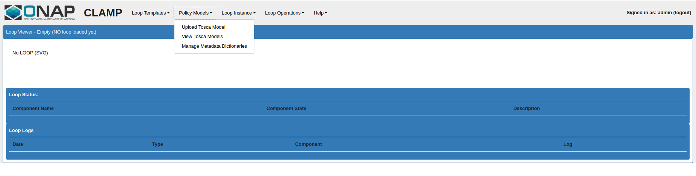
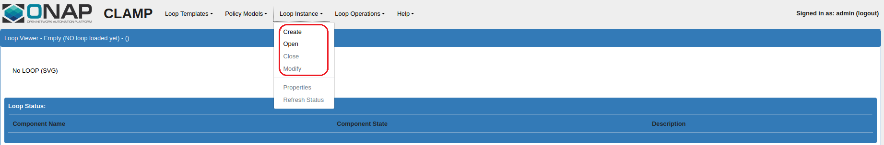
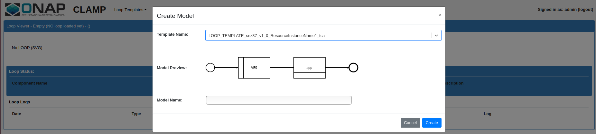
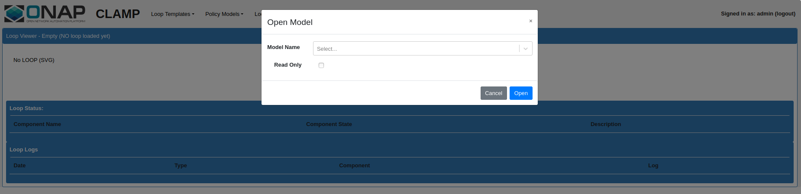
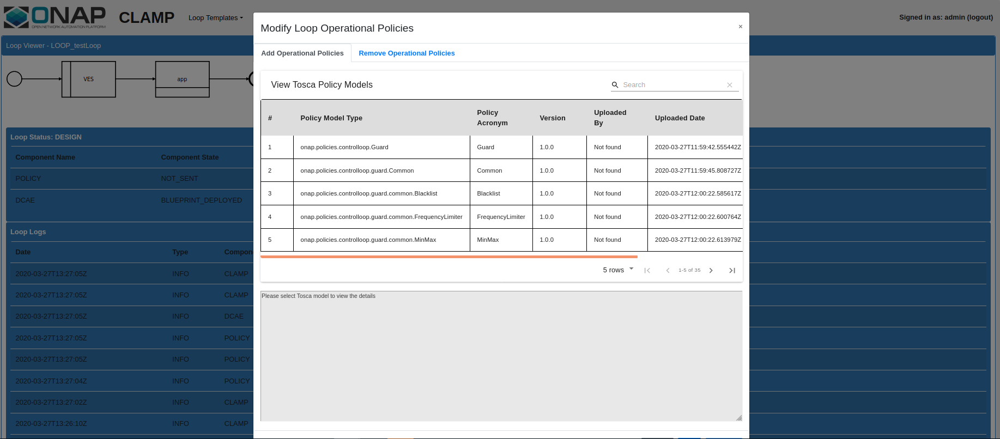
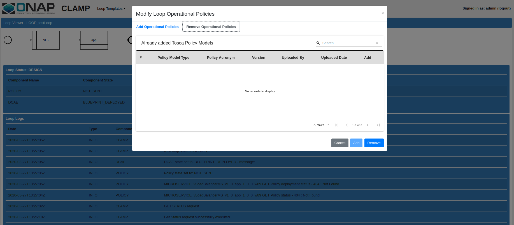
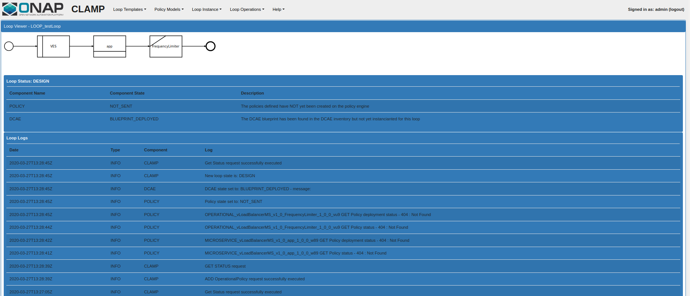
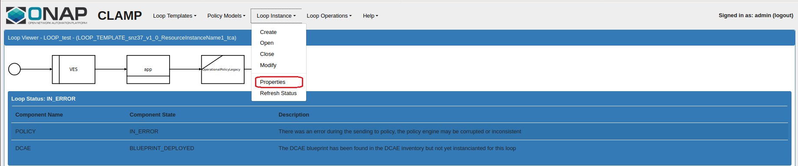
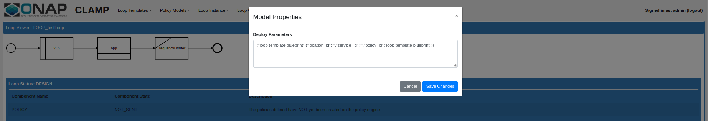
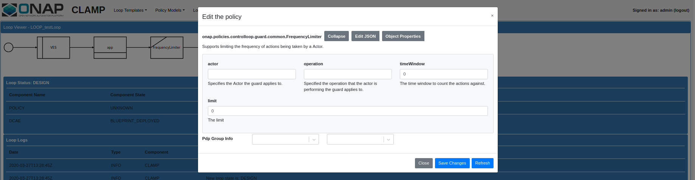
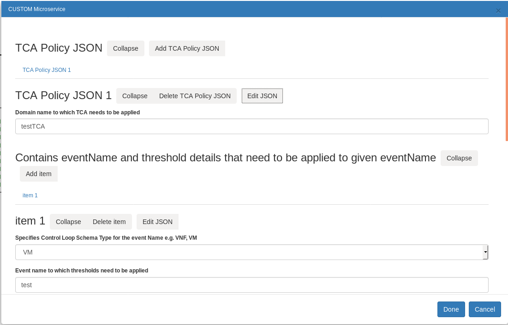
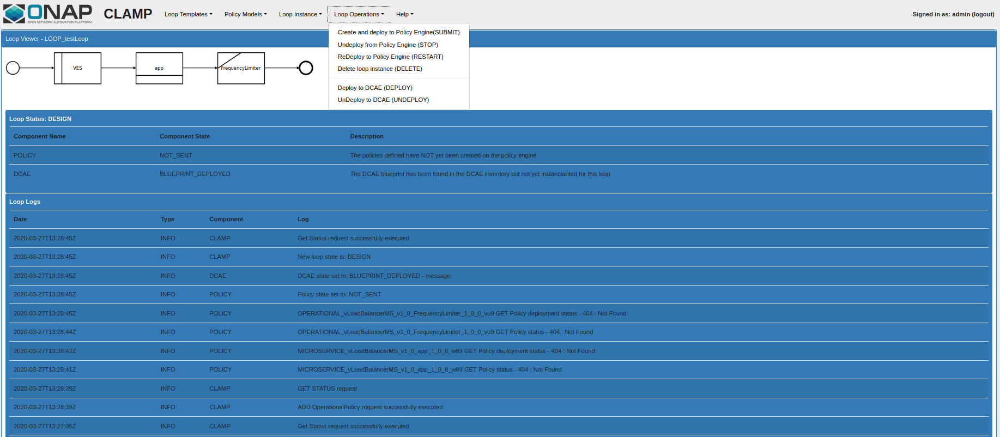
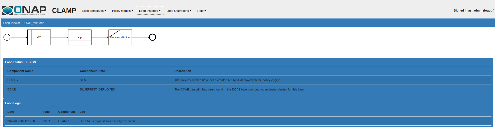
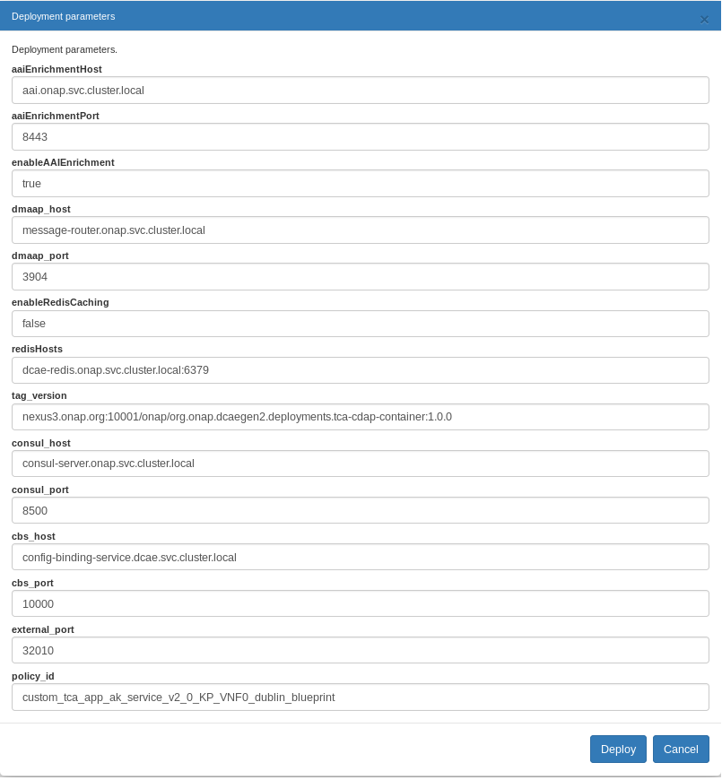
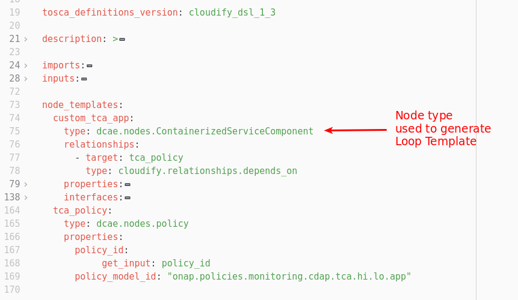
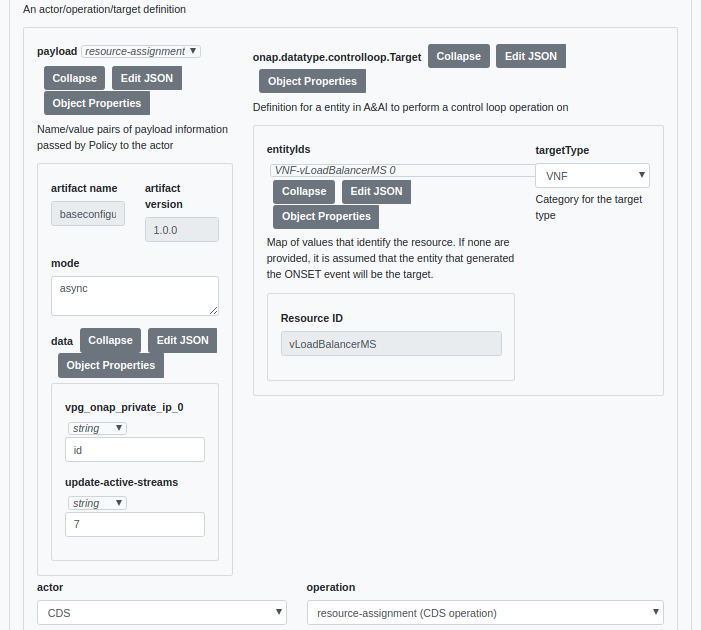
