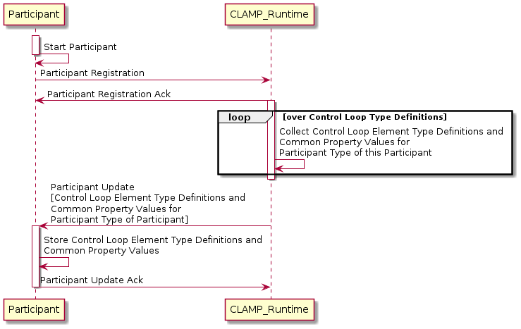
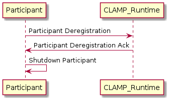
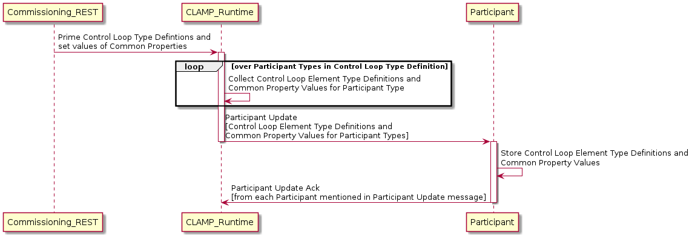
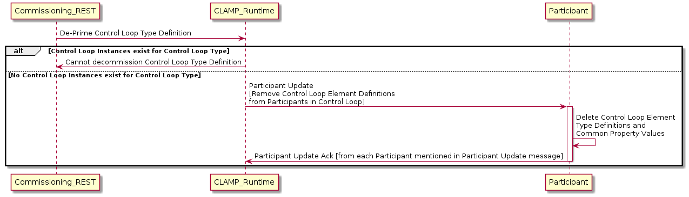
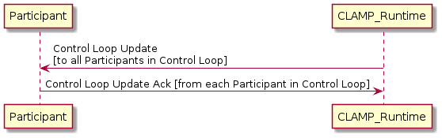
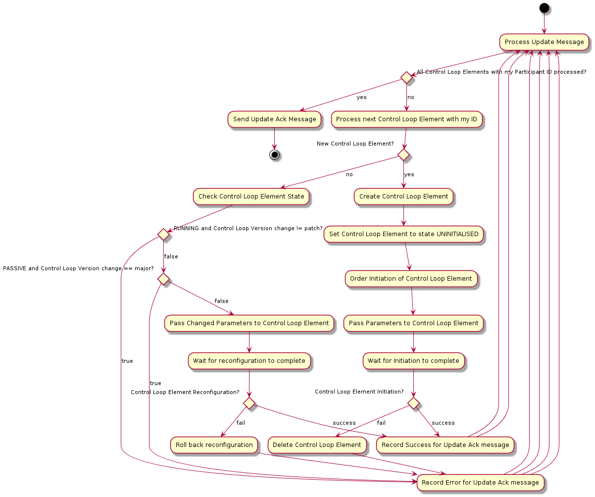
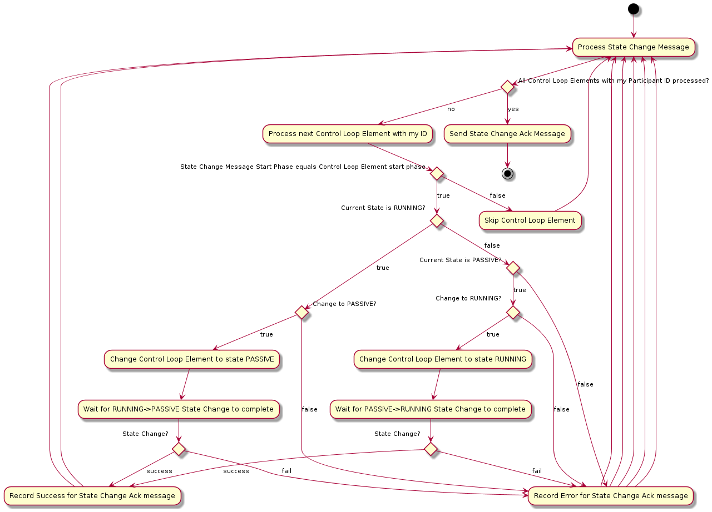
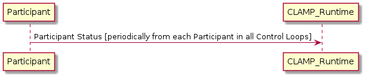

.. This work is licensed under a Creative Commons Attribution 4.0 International License.

.. _controlloop-participant-protocol-label:

The CLAMP Control Loop Participant Protocol
###########################################

The CLAMP Control Loop Participant protocol is an asynchronous protocol that is used by the
CLAMP runtime to coordinate life cycle management of Control Loop instances. The protocol
supports the functions described in the sections below.

Protocol Dialogues
==================

The protocol supports the dialogues described below.

Participant Registration and De-Registration
--------------------------------------------

Registration when a participant comes up and update of participant with control loop type
information and common parameter values for its control loop types.

De-registration is executed as a participant goes down.

Control Loop Priming and De-Priming
-----------------------------------

When a control loop is primed, the portion of the Control Loop Type Definition and Common
Property values for the participants of each participant type mentioned in the Control Loop
Definition are sent to the participants.

When a control loop is de-primed, the portion of the Control Loop Type Definition and Common
Property values for the participants of each participant type mentioned in the Control Loop
Definition are deleted on participants.

Control Loop Update
-------------------

Control Loop Update handles creation, change, and deletion of control loops on participants.
Change of control loops uses a semantic versioning approach and follow the semantics described
on the page `4.1 Management of Control Loop Instance Configurations <management-cl-instance-configs>`.

The handling of a ControlLoopUpdate message in each participant is as shown below.

Control Loop State Change
-------------------------

This dialogue is used to change the state of Control Loops and their Control Loop Elements. The
CLAMP Runtime sends a Control Loop State Change message on the control loop to all participants.
Participants that have Control Loop Elements in that Control Loop attempt an update on the state
of the control loop elements they have for that control loop, and report the result back.

The *startPhase* in the `Definition of TOSCA fundamental Control Loop Types
<https://github.com/onap/policy-clamp/blob/master/common/src/main/resources/tosca/ControlLoopTOSCAServiceTemplateTypes.yaml>`_
is particularly important in control loop state changes because sometime the user wishes to control
the order in which the state changes in Control Loop Elements in a control loop. In state changes
from *UNITITIALISED* → *PASSIVE* and from *PASSIVE* → *RUNNING*, control loop elements are started in
increasing order of their *startPhase*. In state changes from *RUNNING* → *PASSIVE* and from *PASSIVE*
→ *UNITITIALISED*, control loop elements are started in decreasing order of their *startPhase*.

The CLAMP runtime controls the state change process described in the diagram below. The CLAMP runtime
sends a Control Loop State Change message on DMaaP to all participants in a particular Start Phase so,
in each state change multiple Control Loop State Change messages are sent, one for each Start Phase in
the control loop. If more than one Control Loop Element has the same Start Phase, those Control Loop
Elements receive the same Control Loop State Change message from DMaaP and start in parallel.

The Participant reads each State Change Message it sees on DMaaP. If the Start Phase on the Control
Loop State Change message matches the Start Phase of the Control Loop Element, the participant processes
the State Change message. Otherwise the participant ignores the message.

.. image:: ../images/clamp-cl-participants/controlloop-state-change.png

The handling of a ControlLoopStateChange message in each participant is as shown below.

Control Loop Monitoring and Reporting
-------------------------------------

This dialogue is used as a heartbeat mechanism for participants, to monitor the status of Control Loop
Elements, and to gather statistics on control loops. The ParticipantStatus message is sent periodically
by each participant. The reporting interval for sending the message is configurable.

Messages
========

The CLAMP Control Loop Participant Protocol uses the following messages. The descriptions below give
an overview of each message. For the precise definition of the messages, see the `CLAMP code at Github
<https://github.com/onap/policy-clamp/tree/master/models/src/main/java/org/onap/policy/clamp/controlloop/models/messages/dmaap/participant>`_
. All messages are carried on DMaaP.

.. list-table::
   :widths: 15 10 10 15 15 35
   :header-rows: 1

   * - Message
     - Source
     - Target
     - Purpose
     - Important Fields
     - Field Descriptions
   * - ParticipantRegister
     - Participant
     - CLAMP Runtime
     - Participant registers with the CLAMP runtime
     - ParticipantId
     - The ID of this participant
   * -
     -
     -
     -
     - ParticipantType
     - The type of the participant, maps to the capabilities of the participant in Control Loop Type
       Definitions
   * - ParticipantRegisterAck
     - CLAMP Runtime
     - Participant
     - Acknowledgement of Participant Registration
     - ParticipantId
     - The ID of this participant
   * -
     -
     -
     -
     - ParticipantType
     - The type of the participant, maps to the capabilities of the participant in Control Loop Type
       Definitions
   * -
     -
     -
     -
     - Result
     - Success/Fail
   * -
     -
     -
     -
     - Message
     - Message indicating reason for failure
   * - ParticipantUpdate
     - CLAMP Runtime
     - Participant
     - CLAMP Runtime sends Control Loop Element Definitions and Common Parameter Values to Participants
     - ParticipantDefinitionUpdateMap
     - Map with Participant ID as its key, each value on the map is a ControlLoopElementDefintionMap
   * -
     -
     -
     -
     - ControlLoopElementDefintionMap
     - List of ControlLoopElementDefinition values for a particular participant, keyed by its Control
       Loop Element Definition ID
   * -
     -
     -
     -
     - ControlLoopElementDefinition
     - A ControlLoopElementToscaServiceTemplate containing the definition of the Control Loop Element
       and a CommonPropertiesMap with the values of the common property values for Control Loop Elements
       of this type
   * -
     -
     -
     -
     - ControlLoopElementToscaServiceTemplate
     - The definition of the Control Loop Element in TOSCA
   * -
     -
     -
     -
     - CommonPropertiesMap
     - A <String, String> map indexed by the property name. Each map entry is the serialized value of
       the property, which can be deserialized into an instance of the type of the property.
   * - ParticipantUpdateAck
     - Participant
     - CLAMP Runtime
     - Acknowledgement of Participant Update
     - ParticipantId
     - The ID of this participant
   * -
     -
     -
     -
     - ParticipantType
     - The type of the participant, maps to the capabilities of the participant in Control Loop Type
       Definitions
   * -
     -
     -
     -
     - Result
     - Success/Fail
   * -
     -
     -
     -
     - Message
     - Message indicating reason for failure
   * - ParticipantDeregister
     - Participant
     - CLAMP Runtime
     - Participant deregisters with the CLAMP runtime
     - ParticipantId
     - The ID of this participant
   * -
     -
     -
     -
     - ParticipantType
     - The type of the participant, maps to the capabilities of the participant in Control Loop Type
       Definitions
   * - ParticipantDeregisterAck
     - CLAMP Runtime
     - Participant
     - Acknowledgement of Participant Deegistration
     - ParticipantId
     - The ID of this participant
   * -
     -
     -
     -
     - ParticipantType
     - The type of the participant, maps to the capabilities of the participant in Control Loop Type
       Definitions
   * -
     -
     -
     -
     - Result
     - Success/Fail
   * -
     -
     -
     -
     - Message
     - Message indicating reason for failure
   * - ControlLoopUpdate
     - CLAMP Runtime
     - Participant
     - CLAMP Runtime sends Control Loop Element instances and Instance Specific Parameter Values for
       a Control Loop Instance to Participants
     - ControlLoopId
     - The name and version of the Control Loop
   * -
     -
     -
     -
     - ParticipantUpdateMap
     - Map with Participant ID as its key, each value on the map is a ControlLoopElementList
   * -
     -
     -
     -
     - ControlLoopElementList
     - List of ControlLoopElement values for the Control Loop
   * -
     -
     -
     -
     - ControlLoopElement
     - A ControlLoopElement, which contains among other things a PropertiesMap with the values of the
       property values for this Control Loop Element instance and a ToscaServiceTemplateFragment with
       extra concept definitions and instances that a participant may need.
   * -
     -
     -
     -
     - PropertiesMap
     - A <String, String> map indexed by the property name. Each map entry is the serialized value of
       the property, which can be deserialized into an instance of the type of the property.
   * -
     -
     -
     -
     - ToscaServiceTemplateFragment
     - A well-formed TOSCA service template containing extra concept definitions and instances that a
       participant may need. For example, the Policy Participant may need policy type definitions or
       policy instances to be provided if they are not already stored in the Policy Framework.
   * - ControlLoopUpdateAck
     - Participant
     - CLAMP Runtime
     - Acknowledgement of Control Loop Update
     - ParticipantId
     - The ID of this participant
   * -
     -
     -
     -
     - ParticipantType
     - The type of the participant, maps to the capabilities of the participant in Control Loop Type
       Definitions
   * -
     -
     -
     -
     - ControlLoopId
     - The name and version of the Control Loop
   * -
     -
     -
     -
     - ControlLoopResult
     - Holds a Result and Message for the overall operation on the participant and a map of Result
       and Message fields for each Control Loop Element of the control loop on this participant
   * -
     -
     -
     -
     - Result
     - Success/Fail
   * -
     -
     -
     -
     - Message
     - Message indicating reason for failure
   * - ControlLoopStateChange
     - CLAMP Runtime
     - Participant
     - CLAMP Runtime asks Participants to change the state of a Control Loop
     - ControlLoopId
     - The name and version of the Control Loop
   * -
     -
     -
     -
     - currentState
     - The current state of the Control Loop
   * -
     -
     -
     -
     - orderedState
     - The state that the Control Loop should transition to
   * -
     -
     -
     -
     - startPhase
     - The start phase to which this ControLoopStateChange message applies
   * - ControlLoopStateChangeAck
     - Participant
     - CLAMP Runtime
     - Acknowledgement of Control Loop State Change
     - ParticipantId
     - The ID of this participant
   * -
     -
     -
     -
     - ParticipantType
     - The type of the participant, maps to the capabilities of the participant in Control Loop Type
       Definitions
   * -
     -
     -
     -
     - ControlLoopId
     - The name and version of the Control Loop
   * -
     -
     -
     -
     - startPhase
     - The start phase to which this ControLoopStateChangeAck message applies
   * -
     -
     -
     -
     - ControlLoopResult
     - Holds a Result and Message for the overall operation on the participant and a map of Result and
       Message fields for each Control Loop Element of the control loop on this participant
   * -
     -
     -
     -
     - Result
     - Success/Fail
   * -
     -
     -
     -
     - Message
     - Message indicating reason for failure
   * - ParticipantStatusReq
     - CLAMP Runtime
     - Participant
     - Request that the specified participants return a ParticipantStatus message immediately
     - ParticipantId
     - The ID of this participant, if not specified, all participants respond.
   * - ParticipantStatus
     - Participant
     - CLAMP Runtime
     - Periodic or on-demand report for heartbeat, Participant Status, Control Loop Status, and Control
       Loop Statistics
     - ParticipantId
     - The ID of this participant
   * -
     -
     -
     -
     - ParticipantType
     - The type of the participant, maps to the capabilities of the participant in Control Loop
       Type Definitions
   * -
     -
     -
     -
     - ParticipantDefinitionUpdateMap (returned in repsonse to ParticipantStatusReq only)
     - See ParticipantUpdate message above for definition of this field
   * -
     -
     -
     -
     - ParticipantStatus
     - The current status of the participant for monitoring
   * -
     -
     -
     -
     - ParticipantStatistics
     - Statistics on the participant such as up time, or messages processed. Can include participant
       specific data in a string blob that is opaque to CLAMP
   * -
     -
     -
     -
     - ControlLoopInfoMap
     - A map of ControlLoopInfo types indexed by ControlLoopId, one entry for each control loop
       running on the participant
   * -
     -
     -
     -
     - ControlLoopInfo
     - The ControlLoopStatus and ControlLoopStatistics for a given control loop
   * -
     -
     -
     -
     - ControlLoopStatus
     - The current status of the control loop for monitoring
   * -
     -
     -
     -
     - ControlLoopStatistics
     - Statistics on the control loop such as up time, or messages processed. Can include participant
       specific data in a string blob that is opaque to CLAMP

End of Document
