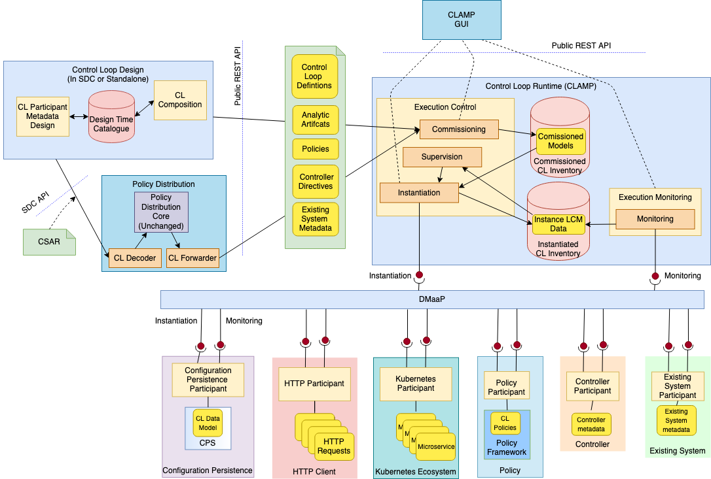

.. This work is licensed under a Creative Commons Attribution 4.0 International License.

.. _clamp-builtin-label:

CLAMP Metadata Control Loop Automation Management using TOSCA
#############################################################

.. contents::
    :depth: 4

The idea of using control loops to automatically (or autonomously) perform network management
has been the subject of much research in the Network Management research community, see
:download:`this paper <files/ControlLoops.pdf>` for some background. However, it is only with
the advent of ONAP that we have a platform that supports control loops for network management.
Before ONAP, Control Loops have been implemented by hard-coding components together and hard
coding logic into components. ONAP has taken a step forward towards automatic implementation
of Control Loops by allowing parameterization of Control Loops that work on the premise that
the Control Loops use a set of analytic, policy, and control components connected together in
set ways.

The goal of the work is to extend and enhance the current ONAP Control Loop support to provide
a complete open-source framework for Control Loops. This will enhance the current support to
provide TOSCA based Control Loop definition and development, commissioning and run-time management.
The participants that comprise a Control Loop and the metadata needed to link the participants
together to create a Control Loop are specified in a standardized way using the `OASIS TOSCA
modelling language <http://docs.oasis-open.org/tosca/TOSCA-Simple-Profile-YAML/>`_. The TOSCA
description is then used to commission, instantiate, and manage the Control Loops in the run
time system.

1 Terminology
=============

This section describes the terminology used in the system.

1.1 Control Loop Terminology
----------------------------

**Control Loop Type:** A definition of a Control Loop in the TOSCA language. This definition describes
a certain type of a control loop. The life cycle of instances of a Control Loop Type are managed
by CLAMP.

**Control Loop Instance:** An instance of a Control Loop Type. The life cycle of a Control Loop
Instance is managed by CLAMP. A Control Loop Instance is a set of executing elements on which
Life Cycle Management (LCM) is executed collectively. For example, a set of microservices may be
spawned and executed together to deliver a service. This collection of services is a control loop.

**Control Loop Element Type:** A definition of a Control Loop Element in the TOSCA language. This
definition describes a certain type of Control Loop Element for a control loop in a Control
Loop Type.

**Control Loop Element Instance:** A single entity executing on a participant, with its Life Cycle
being managed as part of the overall control loop. For example, a single microservice that is
executing as one microservice in a service.

**CLAMP Control Loop Runtime:** The CLAMP server that holds Control Loop Type definitions and manages
the life cycle of Control Loop Instances and their Control Loop Elements in cooperation with
participants.

1.2 Participant Terminology
---------------------------

**Participant Type:** Definition of a type of system or framework that can take part in control
loops and a definition of the capabilities of that participant type. A participant advertises
its type to the CLAMP Control Loop Runtime.

**Participant:** A system or framework that takes part in control loops by executing Control Loop
Elements in cooperation with the CLAMP Control Loop Runtime. A participant chooses to partake
in control loops, to manage Control Loop Elements for CLAMP, and to receive, send and act on
LCM messages for the CLAMP runtime.

1.3 Terminology for Properties
------------------------------

**Common Properties:** Properties that apply to all Control Loop Instances of a certain Control
Loop Type and are specified when a Control Loop Type is commissioned.

**Instance Specific Properties:** Properties that must be specified for each Control Loop Instance
and are specified when a Control Loop Instance is Initialized.

1.4 Concepts and their relationships
------------------------------------

The UML diagram below shows the concepts described in the terminology sections above and how
they are interrelated.

The Control Loop Definition concepts describe the types of things that are in the system. These
concepts are defined at design time and are passed to the runtime in a TOSCA document. The
concepts in the Control Loop Runtime are created by the runtime part of the system using the
definitions created at design time.

.. _controlloop-capabilities:

2 Capabilities
==============

We consider the capabilities of Control Loops at Design Time and Run Time.

At Design Time, three capabilities are supported:

#. **Control Loop Element Definition Specification.** This capability allows users to define Control
   Loop Element Types and the metadata that can be used on and configured on a Control Loop Element
   Type. Users also define the Participant Type that will run the Control Loop Element when it is
   taking part in in a control loop. The post condition of an execution of this capability is that
   metadata for a Control Loop Element Type is defined in the Control Loop Design Time Catalogue.

#. **Control Loop Element Definition Onboarding.** This capability allows external users and systems
   (such as SDC or DCAE-MOD) to define the metadata that can be used on and configured on a Control
   Loop Element Type and to define the Participant Type that will run the Control Loop Element when
   it is taking part in in a control loop. The post condition of an execution of this capability
   is that metadata for a Control Loop Element Type is defined in the Control Loop Design Time
   Catalogue.

#. **Control Loop Type Definition.** This capability allows users and other systems to create Control
   Loop Type definitions by specifying a set of Control Loop Element Definitions from those that
   are available in the Control Loop Design Time Catalogue. These Control Loop Elements will
   work together to form Control Loops. In an execution of this capability, a user specifies the
   metadata for the Control Loop and specifies the set of Control Loop Elements and their Participant
   Types. The user also selects the correct metadata sets for each participant in the Control Loop
   Type and defines the overall Control Loop Type metadata. The user also specifies the Common
   Property Types that apply to all instances of a control loop type and the Instance Specific
   Property Types that apply to individual instances of a Control Loop Type. The post condition for
   an execution of this capability is a Control Loop definition in TOSCA stored in the Control Loop
   Design Time Catalogue.

.. note::
    Once a Control Loop Definition is commissioned to the Control Loop Runtime and has been
    stored in the Run Time Inventory, it cannot be further edited unless it is decommissioned.

At Run Time, the following participant related capabilities are supported:

#. **System Pre-Configuration.** This capability allows participants to register and deregister
   with CLAMP. Participants explicitly register with CLAMP when they start. Control Loop Priming
   is performed on each participant once it registers. The post condition for an execution of this
   capability is that a participant becomes available (registration) or is no longer available
   (deregistration) for participation in a control loop.

#. **Control Loop Priming on Participants.** A participant is primed to support a Control Loop Type.
   Priming a participant means that the definition of a control loop and the values of Common
   Property Types that apply to all instances of a control loop type on a participant are sent
   to a participant. The participant can then take whatever actions it need to do to support
   the control loop type in question. Control Loop Priming takes place at participant
   registration and at Control Loop Commissioning. The post condition for an execution of this
   capability is that all participants in this control loop type are commissioned, that is they
   are prepared to run instances of their Control Loop Element types.

At Run Time, the following Control Loop Life Cycle management capabilities are supported:

#. **Control Loop Commissioning:** This capability allows version controlled Control Loop Type
   definitions to be taken from the Control Loop Design Time Catalogue and be placed in the
   Commissioned Control Loop Inventory. It also allows the values of Common Property Types
   that apply to all instances of a Control Loop Type to be set. Further, the Control Loop
   Type is primed on all concerned participants. The post condition for an execution of this
   capability is that the Control Loop Type definition is in the Commissioned Control Loop
   Inventory and the Control Loop Type is primed on concerned participants.

#. **Control Loop Instance Life Cycle Management:** This capability allows a Control Loop
   Instance to have its life cycle managed.

   #. **Control Loop Instance Creation:** This capability allows a Control Loop Instance to be
      created. The Control Loop Type definition is read from the Commissioned Control Loop
      Inventory and values are assigned to the Instance Specific Property Types defined for
      instances of the Control Loop Type in the same manner as the existing CLAMP client does.
      A Control Loop Instance that has been created but has not yet been instantiated on
      participants is in state UNINITIALIZED. In this state, the Instance Specific Property Type
      values can be revised and updated as often as the user requires. The post condition for an
      execution of this capability is that the Control Loop instance is created in the
      Instantiated Control Loop Inventory but has not been instantiated on Participants.

   #. **Control Loop Instance Update on Participants:** Once the user is happy with the property
      values, the Control Loop Instance is updated on participants and the Control Loop Elements
      for this Control Loop Instance are initialized or updated by participants using the control
      loop metadata. The post condition for an execution of this capability is that the Control
      Loop instance is updated on Participants.

   #. **Control Loop State Change:** The user can now order the participants to change the state
      of the Control Loop Instance. If the Control Loop is set to state RUNNING, each participant
      begins accepting and processing control loop events and the Control Loop Instance is set
      to state RUNNING in the Instantiated Control Loop inventory. The post condition for an
      execution of this capability is that the Control Loop instance state is changed on
      participants.

   #. **Control Loop Instance Monitoring:** This capability allows Control Loop Instances to be
      monitored. Users can check the status of Participants, Control Loop Instances, and Control
      Loop Elements. Participants report their overall status and the status of Control Loop
      Elements they are running periodically to CLAMP. Clamp aggregates these status reports
      into an aggregated Control Loop Instance status record, which is available for monitoring.
      The post condition for an execution of this capability is that Control Loop Instances are
      being monitored.

   #. **Control Loop Instance Supervision:** This capability allows Control Loop Instances to be
      supervised. The CLAMP runtime expects participants to report on Control Loop Elements
      periodically. The CLAMP runtime checks that periodic reports are received and that each
      Control Loop Element is in the state it should be in. If reports are missed or if a
      Control Loop Element is in an incorrect state, remedial action is taken and notifications
      are issued. The post condition for an execution of this capability is that Control Loop
      Instances are being supervised by the CLAMP runtime.

   #. **Control Loop Instance Removal from Participants:** A user can order the removal of a Control
      Loop Instance from participants. The post condition for an execution of this capability is
      that the Control Loop instance is removed from Participants.

   #. **Control Loop Instance Deletion:** A user can order the removal of a Control Loop Instance
      from the CLAMP runtime. Control Loop Instances that are instantiated on participants cannot
      be removed from the CLAMP runtime. The post condition for an execution of this capability
      is that the Control Loop instance is removed from Instantiated Control Loop Inventory.

#. **Control Loop Decommissioning:** This capability allows version controlled Control Loop Type
   definitions to be removed from the Commissioned Control Loop Inventory. A Control Loop
   Definition that has instances in the Instantiated Control Loop Inventory cannot be removed.
   The post condition for an execution of this capability is that the Control Loop Type
   definition removed from the Commissioned Control Loop Inventory.

.. note::
    The system dialogues for run time capabilities are described in detail on the
    :ref:`System Level Dialogues <system-level-label>` page.

.. _controlloop-instance-states:

2.1 Control Loop Instance States
--------------------------------

When a control loop definition has been commissioned, instances of the control loop can be
created, updated, and deleted. The system manages the lifecycle of control loops and control
loop elements following the state transition diagram below.

3 Overall Target Architecture
=============================

The diagram below shows an overview of the architecture of TOSCA based Control Loop
Management in CLAMP.

Following the ONAP Reference Architecture, the architecture has a Design Time part and
a Runtime part.

The Design Time part of the architecture allows a user to specify metadata for participants.
It also allows users to compose control loops. The Design Time Catalogue contains the metadata
primitives and control loop definition primitives for composition of control loops. As shown
in the figure above, the Design Time component provides a system where Control Loops can be
designed and defined in metadata. This means that a Control Loop can have any arbitrary
structure and the Control Loop developers can use whatever analytic, policy, or control
participants they like to implement their Control Loop. At composition time, the user
parameterises the Control Loop and stores it in the design time catalogue. This catalogue
contains the primitive metadata for any participants that can be used to compose a Control
Loop. A Control Loop SDK is used to compose a Control Loop by aggregating the metadata for
the participants chosen to be used in a Control Loop and by constructing the references between
the participants. The architecture of the Control Loop Design Time part will be elaborated in
future releases.

Composed Control Loops are commissioned on the run time part of the system, where they are
stored in the Commissioned Control Loop inventory and are available for instantiation. The
Commissioning component provides a CRUD REST interface for Control Loop Types, and implements
CRUD of Control Loop Types. Commissioning also implements validation and persistence of incoming
Control Loop Types. It also guarantees the integrity of updates and deletions of Control Loop
Types, such as performing updates in accordance with semantic versioning rules and ensuring that
deletions are not allowed on Control Loop Types that have instances defined.

The Instantiation component manages the Life Cycle Management of Control Loop Instances and
their Control Loop Elements. It publishes a REST interface that is used to create Control Loop
Instances and set values for Common and Instance Specific properties. This REST interface is
public and is used by the CLAMP GUI. It may also be used by any other client via the public
REST interface. the REST interface also allows the state of Control Loop Instances to be changed.
A user can change the state of Control Loop Instances as described in the state transition
diagram shown in section 2 above. The Instantiation component issues update and state change
messages via DMaaP to participants so that they can update and manage the state of the Control
Loop Elements they are responsible for. The Instantiation component also implements persistence
of Control Loop Instances, control loop elements, and their state changes.

The Monitoring component reads updates sent by participants. Participants report on the
state of their Control Loop Elements periodically and in response to a message they have
received from the Instantiation component. The Monitoring component reads the contents of
the participant messages and persists their state updates and statistics records. It also
publishes a REST interface that publishes the current state of all Participants, Control
Loop Instances and their Control Loop Elements, as well as publishing Participant and
Control Loop statistics.

The Supervision component is responsible for checking that Control Loop Instances are correctly
instantiated and are in the correct state (UNINITIALIZED/READY/RUNNING). It also handles
timeouts and on state changes to Control Loop Instances, and retries and rolls back state
changes where state changes failed.

A Participant is an executing component that partakes in control loops. More explicitly, a
Participant is something that implements the Participant Instantiation and Participant
Monitoring messaging protocol over DMaaP for Life Cycle management of Control Loop Elements.
A Participant runs Control Loop Elements and manages and reports on their life cycle
following the instructions it gets from the CLAMP runtime in messages delivered over DMaaP.

In the figure above, five participants are shown. A Configuration Persistence Participant
manages Control Loop Elements that interact with the `ONAP Configuration Persistence Service
<https://docs.onap.org/projects/onap-cps/en/latest/overview.html>`_
to store common data. The DCAE Participant runs Control Loop Elements that manage DCAE
microservices. The Kubernetes Participant hosts the Control Loop Elements that are managing
the life cycle of microservices in control loops that are in a Kubernetes ecosystem. The
Policy Participant handles the Control Loop Elements that interact with the Policy Framework
to manage policies for control loops. A Controller Participant such as the CDS Participant
runs Control Loop Elements that load metadata and configure controllers so that they can
partake in control loops. Any third party Existing System Participant can be developed to
run Control Loop Elements that interact with any existing system (such as an operator's
analytic, machine learning, or artificial intelligence system) so that those systems can
partake in control loops.

4. Other Considerations
=======================

.. _management-cl-instance-configs:

4.1 Management of Control Loop Instance Configurations
------------------------------------------------------

In order to keep management of versions of the configuration of control loop instances
straightforward and easy to implement, the following version management scheme using
semantic versioning is implemented. Each configuration of a Control Loop Instance and
configuration of a Control Loop Element has a semantic version with 3 digits indicating
the **major.minor.patch** number of the version.

.. note::
    A **configuration** means a full set of parameter values for a Control Loop Instance.

Change constraints:

#. A Control Loop or Control Loop Element in state **RUNNING** can be changed to a higher patch
   level or rolled back to a lower patch level. This means that hot changes that do not
   impact the structure of a Control Loop or its elements can be executed.

#. A Control Loop or Control Loop Element in state **PASSIVE** can be changed to a higher
   minor/patch level or rolled back to a lower minor/patch level. This means that structural
   changes to Control Loop Elements that do not impact the Control Loop as a whole can be
   executed by taking the control loop to state **PASSIVE**.

#. A Control Loop or Control Loop Element in state **UNINITIALIZED** can be changed to a higher
   major/minor/patch level or rolled back to a lower major/minor/patch level. This means
   that where the structure of the entire control loop is changed, the control loop must
   be uninitialized and reinitialized.

#. If a Control Loop Element has a **minor** version change, then its Control Loop Instance
   must have at least a **minor** version change.

#. If a Control Loop Element has a **major** version change, then its Control Loop Instance
   must have a **major** version change.

4.2 Scalability
---------------

The system is designed to be inherently scalable. The CLAMP runtime is stateless, all state
is preserved in the Instantiated Control Loop inventory in the database. When the user
requests an operation such as an instantiation, activation, passivation, or an uninitialization
on a Control Loop Instance, the CLAMP runtime broadcasts the request to participants over
DMaaP and saves details of the request to the database. The CLAMP runtime does not directly
wait for responses to requests.

When a request is broadcast on DMaaP, the request is asynchronously picked up by participants
of the types required for the Control Loop Instance and those participants manage the life
cycle of its control loop elements. Periodically, each participant reports back on the status
of operations it has picked up for the Control Loop Elements it controls, together with
statistics on the Control Loop Elements over DMaaP. On reception of these participant messages,
the CLAMP runtime stores this information to its database.

The participant to use on a control loop can be selected from the registered participants
in either of two ways:

**Runtime-side Selection:** The CLAMP runtime selects a suitable participant from the list of
participants and sends the participant ID that should be used in the Participant Update message.
In this case, the CLAMP runtime decides on which participant will run the Control Loop Element
based on a suitable algorithm. Algorithms could be round robin based or load based.

**Participant-side Selection:** The CLAMP runtime sends a list of Participant IDs that may be used
in the Participant Update message. In this case, the candidate participants decide among
themselves which participant should host the Control Loop Element.

This approach makes it easy to scale Control Loop life cycle management. As Control Loop
Instance counts increase, more than one CLAMP runtime can be deployed and REST/supervision
operations on Control Loop Instances can run in parallel. The number of participants can
scale because an asynchronous broadcast mechanism is used for runtime-participant communication
and there is no direct connection or communication channel between participants and CLAMP
runtime servers. Participant state, Control Loop Instance state, and Control Loop Element
state is held in the database, so any CLAMP runtime server can handle operations for any
participant. Because many participants of a particular type can be deployed and participant
instances can load balance control loop element instances for different Control Loop Instances
of many types across themselves using a mechanism such as a Kubernetes cluster.

4.3 Sandboxing and API Gateway Support
--------------------------------------

At runtime, interaction between ONAP platform services and application microservices are
relatively unconstrained, so interactions between Control Loop Elements for a given Control
Loop Instance remain relatively unconstrained. A
`proposal to support access-controlled access to and between ONAP services
<https://wiki.onap.org/pages/viewpage.action?pageId=103417456>`_
will improve this. This can be complemented by intercepting and controlling services
accesses between Control Loop Elements for Control Loop Instances for some/all Control
Loop types.

API gateways such as `Kong <https://konghq.com/kong/>`_ have emerged as a useful technology
for exposing and controlling service endpoint access for applications and services. When a
Control Loop Type is onboarded, or when Control Loop Instances are created in the Participants,
CLAMP can configure service endpoints between Control Loop Elements to redirect through an
API Gateway.

Authentication and access-control rules can then be dynamically configured at the API gateway
to support constrained access between Control Loop Elements and Control Loop Instances.

The diagram below shows the approach for configuring API Gateway access at Control Loop
Instance and Control Loop Element level.

At design time, the Control Loop type definition specifies the type of API gateway configuration
that should be supported at Control Loop and Control Loop Element levels.

At runtime, the CLAMP can configure the API gateway to enable (or deny) interactions between
Control Loop Instances and individually for each Control Loop Element. All service-level
interactions in/out of a Control Loop Element, except that to/from the API Gateway, can be
blocked by networking policies, thus sandboxing a Control Loop Element and an entire Control
Loop Instance if desired. Therefore, a Control Loop Element will only have access to the APIs
that are configured and enabled for the Control Loop Element/Instance in the API gateway.

For some Control Loop Element Types the Participant can assist with service endpoint
reconfiguration, service request/response redirection to/from the API Gateway, or
annotation of requests/responses.

Once the Control Loop instance is instantiated on participants, the participants configure
the API gateway with the Control Loop Instance level configuration and with the specific
configuration for their Control Loop Element.

Monitoring and logging of the use of the API gateway may also be provided. Information and
statistics on API gateway use can be read from the API gateway and passed back in monitoring
messages to the CLAMP runtime.

Additional isolation and execution-environment sandboxing can be supported depending on the
Control Loop Element Type. For example: ONAP policies for given Control Loop Instances/Types
can be executed in a dedicated PDP engine instances; DCAE or K8S-hosted services can executed
in isolated namespaces or in dedicated workers/clusters; etc..

5 APIs and Protocols
====================

The APIs and Protocols used by CLAMP for Control Loops are described on the pages below:

#. :ref:`System Level Dialogues <system-level-label>`
#. :ref:`Defining Control Loops in TOSCA for CLAMP <defining-controlloops-label>`
#. :ref:`The CLAMP Control Loop Participant Protocol <controlloop-participant-protocol-label>`
#. :ref:`REST APIs for CLAMP Control Loops <controlloop-rest-apis-label>`

6 Design and Implementation
===========================

The design and implementation of TOSCA Control Loops in CLAMP is described for each executable entity on the pages below:

#. The CLAMP Runtime Server
#. CLAMP Participants
#. The CLAMP GUI
#. Building and running CLAMP
#. Testing CLAMP

End of Document
