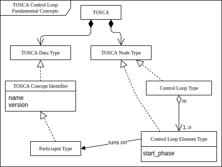
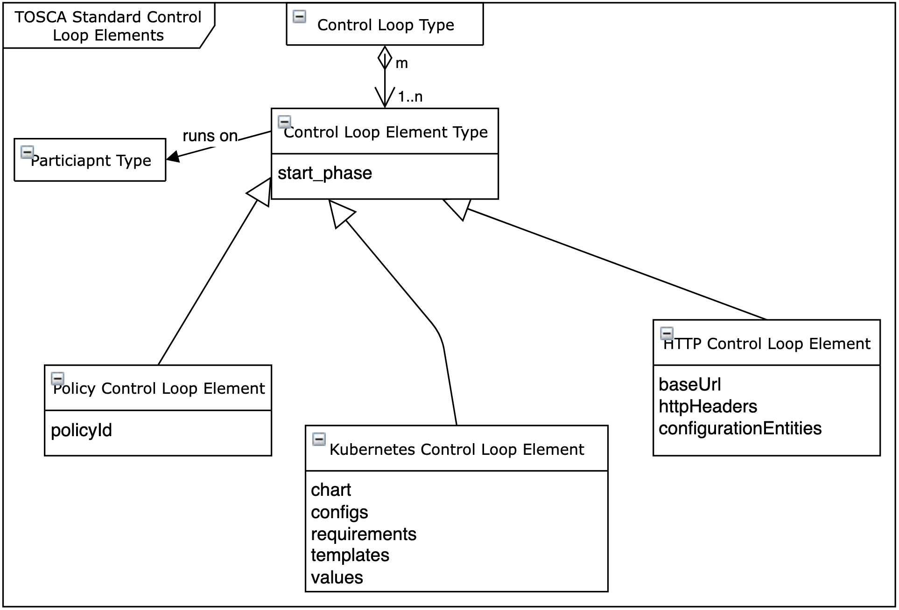
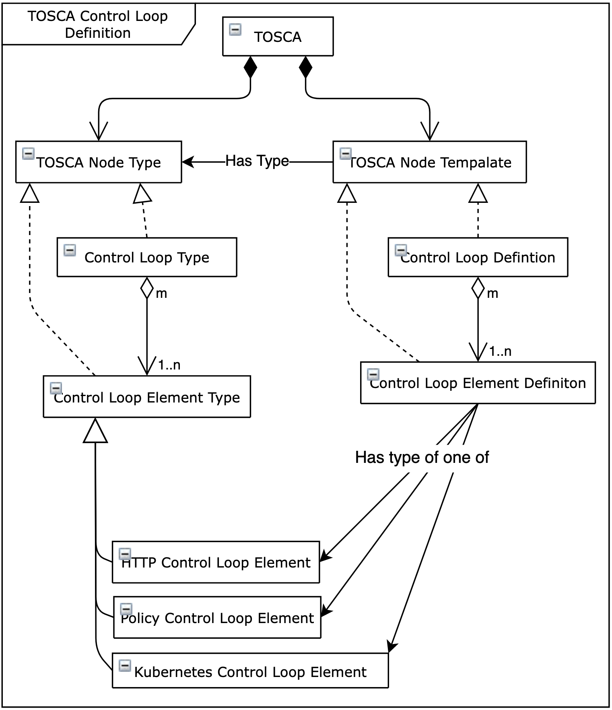
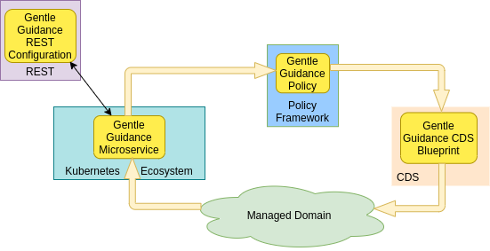

.. This work is licensed under a Creative Commons Attribution 4.0 International License.

.. _defining-controlloops-label:

Defining Control Loops in TOSCA for CLAMP
#########################################

.. contents::
    :depth: 4

A Control Loop Type is defined in a TOSCA service template. A TOSCA Service Template has
two parts: a definition part in the service template itself, which contains the definitions
of concepts that can be used to define the types of concepts that can appear on a Toplogy
Template and a Topology Template that defines a topology. See the `Oasis Open TOSCA
<https://docs.oasis-open.org/tosca/TOSCA-Simple-Profile-YAML/v1.3/>`_ web page
for more details on TOSCA.

Unsurprisingly, to define a Control Loop Type in TOSCA, of Control Loop related concepts
that we can use in all control loops exist. They are described in Section 1. Section 2
describes how properties are managed. Properties are the configuration parameters that are
provided to Control Loops and the Control Loop Elements they use. Section 3 describes how to
define a Control Loop using the predefined Control Loop concepts.

1 Standard TOSCA Service Template Concepts for Control Loops
============================================================

These concepts are the base concepts available to users who write definitions for control
loops in TOSCA. TOSCA control loop definitions are written using these concepts.

1.1 Fundamental TOSCA Concepts for Control Loops
------------------------------------------------

The following TOSCA concepts are the fundamental concepts in a TOSCA Service Template for
defining control loops.

The TOSCA concepts above may be declared in the TOSCA Service Template of a control loop.
If the concepts already exist in the Design Time Catalogue or the Runtime Inventory, they
may be omitted from a TOSCA service template that defines a control loop type.

The *start_phase* is a value indicating the start phase in which this control loop element
will be started, the first start phase is zero. Control Loop Elements are started in their
start_phase order and stopped in reverse start phase order. Control Loop Elements with the
same start phase are started and stopped simultaneously.

The Yaml file that holds the Definition of `TOSCA fundamental Control Loop Types is available in Github
<https://github.com/onap/policy-clamp/blob/master/common/src/main/resources/tosca/ControlLoopTOSCAServiceTemplateTypes.yaml>`_
and is the canonical definition of the Control Loop concepts.

1.2 TOSCA Concepts for Control Loop Elements delivered by ONAP
--------------------------------------------------------------

TOSCA Standard Control Loop Elements

1.2.1 Policy Control Loop Element
~~~~~~~~~~~~~~~~~~~~~~~~~~~~~~~~~

The Policy Participant runs Policy Control Loop Elements. Each Policy Control Loop Element
manages the deployment of the policy specified in the Policy Control Loop Element definition.
The Yaml file that holds the `Policy Control Loop Element Type definition is available in Github
<https://github.com/onap/policy-clamp/blob/master/common/src/main/resources/tosca/PolicyControlLoopElementType.yaml>`_
and is the canonical definition of the Policy Control Loop Element type. For a description of
the Policy Control Loop Element and Policy Participant, please see `The CLAMP Policy Framework
Participant <#>`_ page.

1.2.2 HTTP Control Loop Element
~~~~~~~~~~~~~~~~~~~~~~~~~~~~~~~

The HTTP Participant runs HTTP Control Loop Elements. Each HTTP Control Loop Element manages
REST communication towards a REST endpoint using the REST calls a user has specified in the
configuration of the HTTP Control Loop Element. The Yaml file that holds the
`HTTP Control Loop Element Type definition is available in Github
<https://github.com/onap/policy-clamp/blob/master/common/src/main/resources/tosca/HttpControlLoopElementType.yaml>`_
and is the canonical definition of the HTTP Control Loop Element type. For a description of
the HTTP Control Loop Element and HTTP Participant, please see `The CLAMP HTTP Participant <#>`_ page.

.. _kubernetes-cl-element:

1.2.3 Kubernetes Control Loop Element
~~~~~~~~~~~~~~~~~~~~~~~~~~~~~~~~~~~~~

The Kubernetes Participant runs Kubernetes Control Loop Elements. Each Kubernetes Control Loop
Element manages a Kubernetes microservice using Helm. The user defines the Helm chart for the
Kubernetes microservice as well as other properties that the microservice requires in order to
execute. The Yaml file that holds the
`Kubernetes Control Loop Element Type defintion is available in Github
<https://github.com/onap/policy-clamp/blob/master/common/src/main/resources/tosca/KubernetesControlLoopElementType.yaml>`_
and is the canonical definition of the Kubernetes Control Loop Element type. For a description
of the Kubernetes Control Loop Element and Kubernetes Participant,please see
`The CLAMP Kubernetes Participant <#>`_ page.

1.2.4 CDS Control Loop Element
~~~~~~~~~~~~~~~~~~~~~~~~~~~~~~

The CDS Participant runs CDS Control Loop Elements. Each CDS Control Loop Element manages the
deployment of the CDS blueprint specified in the CDS Control Loop Element definition. The Yaml
file that holds the `CDS Control Loop Element Type definition is available in Github
<https://github.com/onap/policy-clamp/blob/master/common/src/main/resources/tosca/CdsControlLoopElementType.yaml>`_
and is the canonical definition of the CDS Control Loop Element type. For a description of the
CDS Control Loop Element and CDS Participant, please see `The CLAMP CDS Participant page <#>`_.

1.2.5 DCAE Participant
~~~~~~~~~~~~~~~~~~~~~~

The DCAE Participant runs DCAE Control Loop Elements. Each DCAE Control Loop Element manages
a DCAE microservice on DCAE. The user defines the DCAE blueprint for the DCAE microservice as
well as other properties that the microservice requires in order to execute. The Yaml file that
holds the `DCAE Control Loop Type definition is available in Github
<https://github.com/onap/policy-clamp/blob/master/common/src/main/resources/tosca/DcaeControlLoopElementType.yaml>`_
and is the canonical definition of the DCAE Control Loop Element type. For a description of
the DCAE Control Loop Element and DCAE Participant, please see `The CLAMP DCAE Participant <#>`_ page.

2 Common and Instance Specific Properties
=========================================

Properties are used to define the configuration for Control Loops and Control Loop Elements.
At design time, the types, constraints, and descriptions of the properties are specified.
The values for properties are specified in the CLAMP GUI at runtime. TOSCA provides support
for defining properties, see `Section 3.6.10: TOSCA Property Definition
<https://docs.oasis-open.org/tosca/TOSCA-Simple-Profile-YAML/v1.3/os/TOSCA-Simple-Profile-YAML-v1.3-os.html#DEFN_ELEMENT_PROPERTY_DEFN>`_
in the TOSCA documentation.

2.1 Terminology for Properties
------------------------------

**Property:** Metadata defined in TOSCA that is associated with a Control Loop, a Control
Loop Element, or a Participant.

**TOSCA Property Type:** The TOSCA definition of the type of a property. A property can have
a generic type such as string or integer or can have a user defined TOSCA data type.

**TOSCA Property Value:** The value of a Property Type. Property values are assigned at run
time in CLAMP.

**Common Property Type:** Property Types that apply to all instances of a Control Loop Type.

**Common Property Value:** The value of a Property Type. It is assigned at run time once for
all instances of a Control Loop Type.

**Instance Specific Property Type:** Property Types that apply to an individual instance of
a Control Loop Type.

**Instance Specific Property Value:** The value of a Property Type that applies to an
individual instance of a Control Loop Type. The value is assigned at run time for each
control loop instance.

Control Loop Properties can be *common* or *instance specific*. See Section 2 of
:ref:`TOSCA Defined Control Loops: Architecture and Design <controlloop-capabilities>`
for a detailed description of the usage of common and instance specific properties.

2.2 Common Properties
---------------------

Common properties apply to all instances of a control loop. Common properties are identified
by a special metadata flag in Control Loop and Control Loop Element definitions. For example,
the startPhase parameter on any Control Loop Element has the same value for any instance of
that control loop element, so it is defined as shown below in the
`Definition of TOSCA fundamental Control Loop Types
<https://github.com/onap/policy-clamp/blob/master/common/src/main/resources/tosca/ControlLoopTOSCAServiceTemplateTypes.yaml>`_
yaml file.

.. code-block:: yaml

    startPhase:
      type: integer
      required: false
      constraints:
      - greater-or-equal: 0
      description: A value indicating the start phase in which this control loop element will be started, the
                  first start phase is zero. Control Loop Elements are started in their start_phase order and stopped
                  in reverse start phase order. Control Loop Elements with the same start phase are started and
                  stopped simultaneously
      metadata:
        common: true

The "common: true" value in the metadata of the startPhase property identifies that property
as being a common property. This property will be set on the CLAMP GUI during control loop
commissioning.

2.3 Instance Specific Properties
--------------------------------

Instance Specific  properties apply to individual instances of a Control Loop and/or Control
Loop Element and must be set individually for Control Loop and Control Loop Element instance.
Properties are instance specific by default, but can be identified by a special metadata flag
in Control Loop and Control Loop Element definitions. For example, the chart parameter on a
Kubernetes Control Loop Element has a different value for every instance of a Kubernetes Control
Loop Element, so it can be defined as shown below in the :ref:`Kubernetes Control Loop Type definition
<kubernetes-cl-element>` yaml file.

.. code-block:: yaml

    # Definition that omits the common flag metadata
    chart:
      type: org.onap.datatypes.policy.clamp.controlloop.kubernetesControlLoopElement.Chart
      typeVersion: 1.0.0
      description: The helm chart for the microservice
      required: true
    
    # Definition that specifies the common flag metadata
    chart:
      type: org.onap.datatypes.policy.clamp.controlloop.kubernetesControlLoopElement.Chart
      typeVersion: 1.0.0
      description: The helm chart for the microservice
      required: true
      metadata:
        common: false

The "common: false" value in the metadata of the chart property identifies that property as
being an instance specific property. This property will be set on the CLAMP GUI during control
loop instantiation.

3 Writing a Control Loop Type Definition
=========================================

The TOSCA definition of a control loop contains a TOSCA Node Template for the control loop
itself, which contains TOSCA Node Templates for each Control Loop Element that makes up the
Control Loop.

To create a control loop, a user creates a TOSCA Topology Template. In the Topology Template,
the user creates a TOSCA Node Template for each Control Loop Element that will be in the
Control Loop Definition. Finally, the user creates the Node Template that defines the Control
Loop itself, and references the Control Loop Element definitions that make up the Control Loop
Definition.

3.1 The Gentle Guidance Control Loop
------------------------------------

The best way to explain how to create a Control Loop Definition is by example.

The example Gentle Guidance control loop is illustrated in the diagram above. The domain logic
for the control loop is implemented in a microservice running in Kubernetes, a policy, a CDS
blueprint, and some configuration that is passed to the microservice over a REST endpoint.
We want to manage the life cycle of the domain logic for our Gentle Guidance control loop using
our TOSCA based Control Loop Life Cycle Management approach. To do this we create four Control
Loop Element definitions, one for the Kubernetes microservice, one for the policy, one for the
CDS blueprint and one or the REST configuration.

3.2 The TOSCA Control Loop Definition
-------------------------------------

We use a TOSCA Topology Template to specify a Control Loop definition and the definitions of
its Control Loop Elements. Optionally, we can specify default parameter values in the TOSCA
Topology Template. The actual values of Control Loop common and instance specific parameters
are set at run time in the CLAMP GUI.

In the case of the Gentle Guidance control loop, we define a Control Loop Element Node Template
for each part of the domain logic we are managing. We then define the Control Loop Node Template
for the control loop itself.

Please refer to the `No Properties yaml file in Github
<https://github.com/onap/policy-clamp/blob/master/common/src/test/resources/gentleguidance/GentleGuidanceNoPropeties.yaml>`_
for the definitive Yaml specification for the TOSCA Topology Template for the Gentle Guidance
domain when no parameters are defined.

Please refer to the `Default Properties yaml file in Github
<https://github.com/onap/policy-clamp/blob/master/common/src/test/resources/gentleguidance/GentleGuidanceDefaultPropeties.yaml>`_
for the definitive Yaml specification for the TOSCA Topology Template for the Gentle Guidance
domain when the default values of parameters are defined.

4 Creating Custom Control Loop Elements
========================================

Any organization can include their own component in the framework and use the framework and have
the Policy Framework CLAMP manage the lifecycle of domain logic in their component as part of a
Control Loop. To do this, a participant for the component must be developed that allows Control
Loop Elements for that component to be run. To develop a participant, the participant must comply
with the `CLAMP Participants <#>`_
framework and in particular comply with `The CLAMP Control Loop Participant Protocol <#>`_.
The organization must also specify a new Control Loop Element type definition in TOSCA similar to
those supplied in ONAP and described in Section 1.2. This Control Loop Element type tells the
CLAMP Control Loop Lifecycle management that the Control Loop Element exists and can be included
in control loops. It also specifies the properties that can be specified for the Control Loop Element.

An organization can supply the code for the Participant (for example as a Java jar file) and a
TOSCA artifact with the Control Loop Element definition and it can be added to the platform. In
future releases, support will be provided to include participants and their Control Loop Element
definitions as packaged plugins that can be installed on the platform.

End of document
