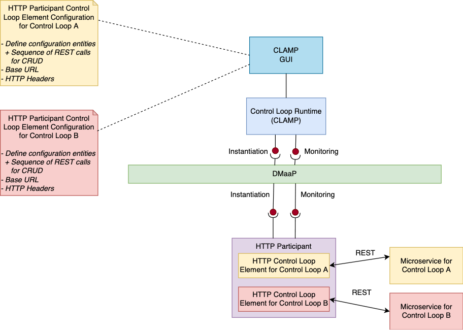

.. This work is licensed under a Creative Commons Attribution 4.0 International License.

.. _clamp-controlloop-http-participant:

HTTP Participant
################

.. warning:: To be completed

The CLAMP HTTP participant receives configuration information from the CLAMP runtime,
maps the configuration information to a REST URL, and makes a REST call on the URL.
Typically the HTTP Participant is used with another participant such as the
:ref:`Kubernetes Participant <clamp-controlloop-k8s-participant>`, which brings up
the microservice that runs a REST server. Once the microservice is up, the HTTP
participant can be used to configure the microservice over its REST interface.Of course,
the HTTP participant works towards any REST service, it is not restricted to REST
services started by participants.

The HTTP participant runs a Control Loop Element to handle the REST dialogues for a
particular application domain. The REST dialogues are whatever REST calls that are
required to implement the functionality for the application domain.

The HTTP participant allows the REST dialogues for a Control Loop to be managed. A
particular Control Loop may require many *things* to be configured and managed and this
may require many REST dialogues to achieve.

A *Configuration Entity* describes a concept that is managed by the HTTP participant. A
Configuration Entity can be created, Read, Updated, and Deleted (CRUD). The user defines
the Configuration Entities that it wants its HTTP Control Loop Element to manage and
provides a sequence of parameterized REST commands to Create, Read, Update, and Delete
each Configuration Entity.

When a control loop is initialized, the HTTP participant starts a HTTP Control Loop
element for the control loop. It reads the configuration information sent from the
Control Loop Runtime runs a HTTP client to talk to the REST endpoint that is receiving
the REST requests. A HTTP participant can simultaneously manage HTTP Control Loop
Elements towards multiple REST endpoints, as shown in the diagram above where the HTTP
participant is running two HTTP Control Loop Elements, one for Control Loop A and one for
Control Loop B.

Configuring a Control Loop Element on the HTTP participant for a Control Loop
-----------------------------------------------------------------------------

The user configures the following properties in the CLAMP GUI for the HTTP participant:

.. list-table::
   :widths: 15 10 50
   :header-rows: 1

   * - Property
     - Type
     - Description
   * - baseUrl
     - URL
     - A well formed URL pointing at the REST server that is processing the REST requests
   * - httpHeaders
     - map
     - A map of *<String, String>* defining the HTTP headers to send on all REST calls
   * - configurationEntitiies
     - map
     - A map of *<String, ConfigurationEntity>* describing the names and definitions of
       configuration entities that are managed by this HTTP Control Loop Element

The *ConfigurationEntity* type is described in the following table:

.. list-table::
   :widths: 15 10 50
   :header-rows: 1

   * - Field
     - Type
     - Description
   * - ID
     - ToscaConceptIdentifier
     - The name and version of the Configuration Entity
   * - restSequence
     - List<RestRequest>
     - A list of REST requests to give manage the Configuration Entity

The *RestRequest* type is described in the following table:

.. list-table::
   :widths: 15 10 50
   :header-rows: 1

   * - Field
     - Type
     - Description
   * - httpMethod
     - HttpMethod
     - An enum for the HTTP method {GET, PUT, POST, DELETE}
   * - path
     - String
     - The path of the REST endopint relative to the baseUrl
   * - body
     - String
     - The body of the request for POST and PUT methods
   * - expectedResponse
     - HttpStatus
     - The expected HTTP response code fo the REST request
 