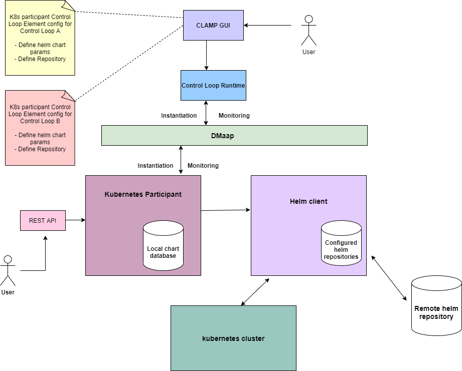
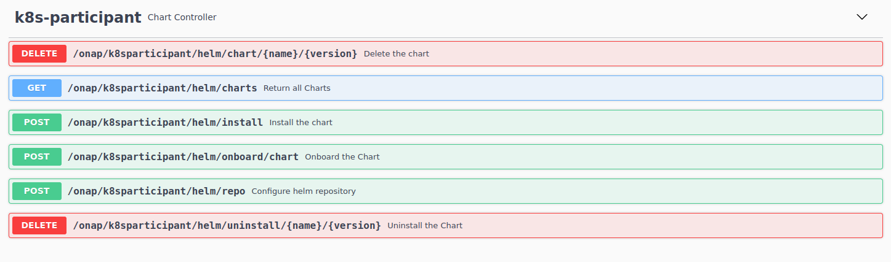

.. This work is licensed under a Creative Commons Attribution 4.0 International License.

.. _clamp-controlloop-k8s-participant:

Kubernetes Participant
######################

The kubernetes participant receives a helm chart information from the CLAMP runtime and installs the helm chart in to the
k8s cluster on the specified namespace. It can fetch the helm chart from remote helm repositories as well as from any of the repositories
that are configured on the helm client. The participant acts as a wrapper around the helm client and creates the required
resources in the k8s cluster.

The kubernetes participant also exposes REST endpoints for onboarding, installing and uninstalling of helm charts from the
local chart database which facilitates the user to also use this component as a standalone application for helm operations.

In Istanbul version, the kubernetes participant supports the following methods of installation of helm charts.

- Installation of helm charts from configured helm repositories and remote repositories passed via TOSCA in CLAMP.
- Installation of helm charts from the local chart database via the participant's REST Api.

Prerequisites for using Kubernetes participant in Istanbul version:
-------------------------------------------------------------------

- A running Kubernetes cluster.

  Note:

  - If the kubernetes participant is deployed outside the cluster , the config file of the k8s cluster needs to be copied to the `./kube` folder of kubernetes participant's home directory to make the participant work with the external cluster.

  - If the participant needs additional permission to create resources on the cluster, cluster-admin role binding can be created for the service account of the participant with the below command.

    Example: `kubectl create clusterrolebinding k8s-participant-admin-binding --clusterrole=cluster-admin --serviceaccount=<k8s participant service account>`

Defining a TOSCA CL definition for kubernetes participant:
-------------------------------------------------------
A *chart* parameter map describes the helm chart parameters in tosca template for a microservice that is used by the kubernetes participant for the deployment.
A Control Loop element in TOSCA is mapped to the kubernetes participant and also holds the helm chart parameters for a microservice defined under the properties of the Control Loop Element.

Sample tosca template defining a participant and a control loop element for a control loop. :download:`click here <tosca/tosca-k8s-participant.yml>`

Configuring a Control Loop Element on the kubernetes participant for a Control Loop
-----------------------------------------------------------------------------------

The user configures the following properties in the TOSCA template for the kubernetes participant:

.. list-table::
   :widths: 15 10 50
   :header-rows: 1

   * - Property
     - Type
     - Description
   * - chartId
     - ToscaConceptIdentifier
     - The name and version of the helm chart that needs to be managed by the kubernetes participant
   * - namespace
     - String
     - The namespace in the k8s cluster where the helm chart needs to be installed
   * - releaseName
     - String
     - The helm deployment name that specifies the installed component in the k8s cluster
   * - repository (optional)
     - map
     - A map of *<String, String>* defining the helm repository parameters for the chart
   * - overrideParams (optional)
     - map
     - A map of *<String, String>* defining the helm chart parameters that needs to be overridden

Note: The repository property can be skipped if the helm chart is available in the local chart database or
in a repository that is already configured on the helm client. The participant does a chart lookup by default.

The *repository* type is described in the following table:

.. list-table::
   :widths: 15 10 50
   :header-rows: 1

   * - Field
     - Type
     - Description
   * - repoName
     - String
     - The name of the helm repository that needs to be configured on the helm client
   * - protocol
     - String
     - Specifies http/https protocols to connect with repository url
   * - address
     - String
     - Specifies the ip address or the host name
   * - port (optional)
     - String
     - Specifies the port where the repository service is running
   * - userName (optional)
     - String
     - The username to login the helm repository
   * - password (optional)
     - String
     - The password to login the helm repository

Kubernetes participant Interactions:
------------------------------------
The kubernetes participant interacts with Control Loop Runtime on the northbound via DMaap. It interacts with the helm client on the southbound for performing various helm operations to the k8s cluster.

The communication for the Control loop updates and state change requests are sent from the Control Loop Runtime to the participant via DMaap.
The participant performs appropriate operations on the k8s cluster via helm client based on the received messages from the Control Loop Runtime.

kubernetes participant Workflow:
--------------------------------
Once the participant is started, it sends a "REGISTER" event to the DMaap topic which is then consumed by the Control Loop Runtime to register this participant on the runtime database.
The user can commission the tosca definitions from the Policy Gui to the Control Loop Runtime that further updates the participant with these definitions via DMaap.
Once the control loop definitions are available in the runtime database, the Control Loop can be instantiated with the default state "UNINITIALISED" from the Policy Gui.

When the state of the Control Loop is changed from "UNINITIALISED" to "PASSIVE" from the Policy Gui, the kubernetes participant receives the control loop state change event from the runtime and
deploys the helm charts associated with each Control Loop Elements by creating appropriate namespace on the cluster.
If the repository of the helm chart is not passed via TOSCA, the participant looks for the helm chart in the configured helm repositories of helm client.
It also performs a chart look up on the local chart database where the helm charts are onboarded via the participant's REST Api.

The participant also monitors the deployed pods for the next 3 minutes until the pods comes to RUNNING state.
It holds the deployment information of the pods including the current status of the pods after the deployment.

When the state of the Control Loop is changed from "PASSIVE" to "UNINITIALISED" back, the participant also undeploys the helm charts from the cluster that are part of the Control Loop Element.

REST APIs on Kubernetes participant
-----------------------------------

Kubernetes participant can also be installed as a standalone application which exposes REST endpoints for onboarding,
installing, uninstalling helm charts from local chart database.

:download:`Download Kubernetes participant API Swagger <swagger/k8s-participant-swagger.json>`