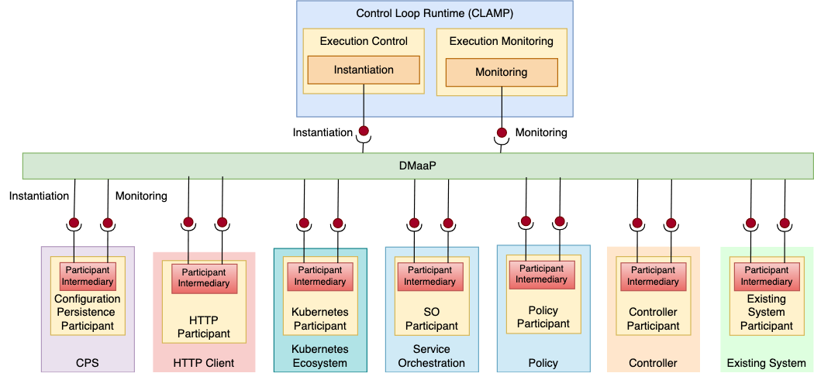

.. This work is licensed under a Creative Commons Attribution 4.0 International License.

.. _clamp-controlloop-participants:

Control Loop Participants
#########################

A Participant is a component that acts as a bridge between the CLAMP COntrol Loop runtime and components such as
the Policy Framework, DCAE, or a Kubernetes cluster that are taking part in control loops. It listens
to DMaaP to receive messages from the CLAMP runtime and performs operations towards components that
are taking part in control loops. A participant has a Control Loop Element for each control loop in
which it is taking part.

The implementation of a participant may use a common
:ref:`Participant Intermediary library <clamp-controlloop-participant-intermediary>`, which carries out common
message and state handling for Control Loop Elements in participants. The *ParticipantImpelementation* is the
component specific implementation of a participant, which is specifically developed for each component that
wishes to take part in control loops.

The figure above shows participants for various components that may take part in control loops.

.. note:: The figure above is for illustration. Not all the participants mentioned above
          have realizations in ONAP. Some of the participants in the figure above represent
          a type of participant. For example, a controller participant would be written for
          a specific controller such as CDS and a participant for an existing system would be
          written towards that existing system.

The detailed implementation of the CLAMP Participant ecosystem is described on the following pages:

.. toctree::
   :maxdepth: 1

   participant-intermediary
   http-participant
   k8s-participant
   policy-framework-participant
   participant-simulator
