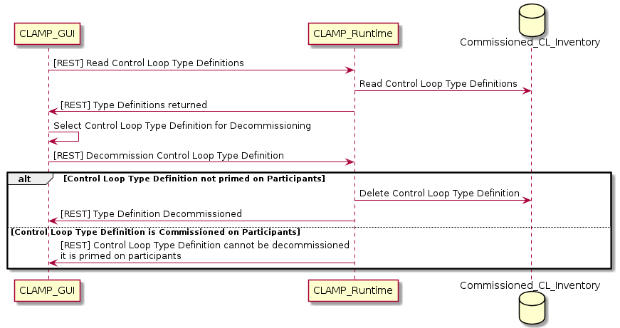
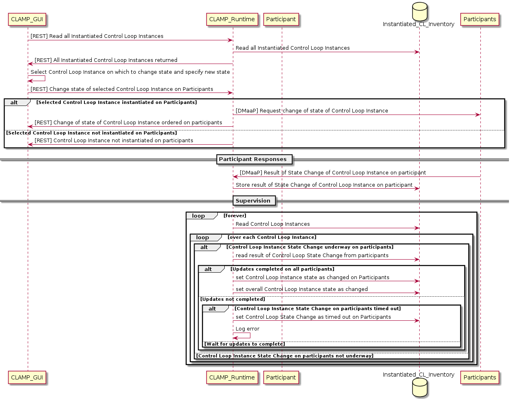
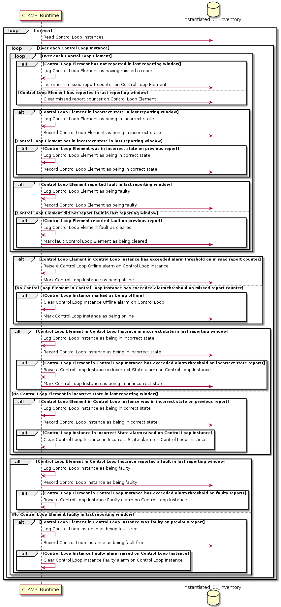

.. This work is licensed under a Creative Commons Attribution 4.0 International License.

.. _system-level-label:

System Level Dialogues
######################

.. contents::
    :depth: 4

The CLAMP Control Loop Runtime Lifecycle Management uses the following system level dialogues.
These dialogues enable the CLAMP runtime capabilities described in :ref:`Section 2 of
TOSCA Defined Control Loops: Architecture and Design <controlloop-capabilities>`.
Design Time dialogues will be described in future releases of the system.

1 Commissioning Dialogues
=========================

Commissioning dialogues are used to commission and decommission Control Loop Type definitions
and to set the values of Common Parameters.

Commissioning a Control Loop Type is a three-step process:

#. The Control Loop Type must be created, that is the Control Loop Type definition must be
   loaded and stored in the database. This step may be carried out over the REST interface or
   using SDC distribution.

#. The Common Properties of the Control Loop type must be assigned values and those values
   must be stored in the database. This step is optional only if all mandatory common properties
   have default values. The Common Property values may be set and amended over and over again
   in multiple sessions until the Control Loop Type is primed.

#. The Control Loop Type Definition and the Common Property values must be primed, that is
   sent to the concerned participants. Once a Control Loop Type is primed, its Common Property
   values can no longer be changed. To change Common Properties on a primed Control Loop Type,
   all instances of the Control Loop Type must be removed and the Control Loop Type must be
   de-primed.

1.1 Commissioning a Control Loop Type Definition using the CLAMP GUI
--------------------------------------------------------------------

This dialogue corresponds to a "File → Import" menu on the CLAMP GUI. The documentation of
future releases of the system will describe how the Design Time functionality interacts
with the Runtime commissioning API.

1.2 Commissioning a Control Loop Type Definition using SDC
----------------------------------------------------------

1.3 Setting Common Properties for a Control Loop Type Definition
----------------------------------------------------------------

This dialogue sets the values of common properties. The values of the common properties
may be set, updated, or deleted at will, as this dialogue saves the properties to the
database but does not send the definitions or properties to the participants. However,
once a Control Loop Type Definition and its properties are primed (See :ref:`Section 1.4
<_priming-cl-label>`), the properties cannot be changed until the control loop type
definition is de-primed (See :ref:`Section 1.5 <depriming-cl-label>`).

.. _priming-cl-label:

1.4 Priming a Control Loop Type Definition on Participants
----------------------------------------------------------
The Priming operation sends Control Loop Type definitions and common property values
to participants. Once a Control Loop Type definition is primed, its property values
can on longer be changed until it is de-primed.

.. _depriming-cl-label:

1.5 De-Prime a Control Loop Type Definition on Participants
-----------------------------------------------------------

This dialogue allows a Control Loop Type Definition to be de-primed so that it can be
deleted or its common parameter values can be altered.

.. image:: images/system-dialogues/depriming-cl-type-definition.png

1.6 Decommissioning a Control Loop Type Definition in CLAMP
-----------------------------------------------------------

1.7 Reading Commissioned Control Loop Type Definitions
------------------------------------------------------

2. Instantiation Dialogues
==========================

Instantiation dialogues are used to create, set parameters on, instantiate, update,
and remove Control Loop instances.

Assume a suitable Control Loop Definition exists in the Commissioned Control Loop Inventory.
To get a Control Loop instance running one would, for example, execute dialogues
:ref:`2.1 <creating-cl-instance>`, :ref:`2.3 <updating-cl-instance-config>`, and
:ref:`2.4 <changing-cl-instance-state>`.

.. _creating-cl-instance:

2.1 Creating a Control Loop Instance
------------------------------------

.. note::
    This dialogue creates the Control Loop Instance in the Instantiated Control Loop Inventory.
    The instance is sent to the participants using the process described in the dialogue in
    :ref:`Section 2.3 <updating-cl-instance-config>`.

2.2 Updating Instance Specific Parameters on a Control Loop Instance
--------------------------------------------------------------------

.. _updating-cl-instance-config:

2.3 Updating a Control Loop Instance with a Configuration on Participants
-------------------------------------------------------------------------

.. _changing-cl-instance-state:

2.4 Changing the state of a Control Loop Instance on Participants
-----------------------------------------------------------------

2.5 De-instantiating a Control Loop Instance from Participants
--------------------------------------------------------------

2.6 Deleting a Control Loop Instance
------------------------------------

2.7 Reading Control Loop Instances
----------------------------------

1. Monitoring Dialogues
=======================

Monitoring dialogues are used to monitor and to read statistics on Control Loop Instances.

3.1 Reporting of Monitoring Information and Statistics by Participants
----------------------------------------------------------------------

3.2 Viewing of Monitoring Information
-------------------------------------

3.2 Viewing of Statistics
-------------------------

3.3 Statistics Housekeeping
---------------------------

4. Supervision Dialogues
========================

Supervision dialogues are used to check the state of Control Loop Instances and Participants.

4.1 Supervise Participants
--------------------------

4.2 Supervise Control Loops
---------------------------

End of Document
