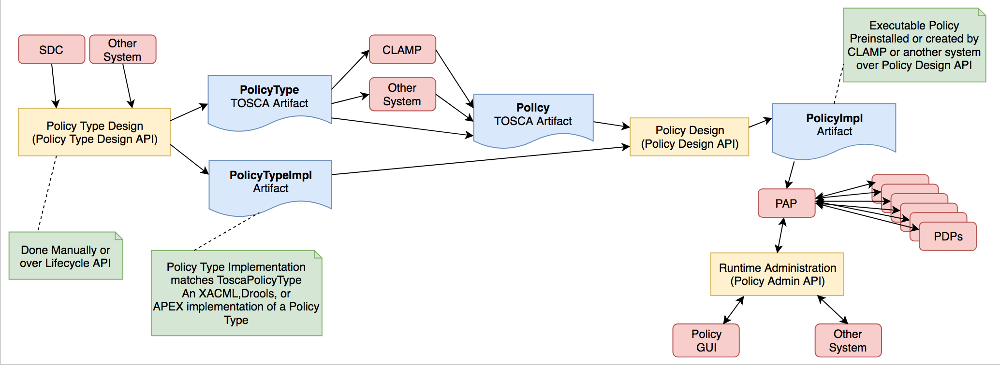

.. This work is licensed under a
.. Creative Commons Attribution 4.0 International License.
.. http://creativecommons.org/licenses/by/4.0

.. _design-label:

Policy Design and Development
-----------------------------

.. contents::
    :depth: 3

This document provides examples that illustrate how to write, deploy, and run policies
of various types using the framework.

The figure below shows the Artifacts (Blue) in the ONAP Policy
Framework, the Activities (Yellow) that manipulate them, and important
components (Pink) that interact with them.

Please see the `TOSCA Policy
Primer <tosca-label>`__ page for an
introduction to TOSCA policy concepts.

TOSCA defines a *PolicyType*, the definition of a type of policy that
can be applied to a service. It also defines a *Policy*, the definition
of an instance of a *PolicyType*. In the Policy Framework, we must
handle and manage these TOSCA definitions and tie them to real
implementations of policies that can run on PDPs.

The diagram above outlines how this is achieved. Each TOSCA *PolicyType*
must have a corresponding *PolicyTypeImpl* in the Policy Framework. The
TOSCA \ *PolicyType* definition can be used to create a TOSCA *Policy*
definition, either directly by the Policy Framework, by CLAMP, or by
some other system. Once the \ *Policy* artifact exists, it can be used
together with the *PolicyTypeImpl* artifact to create a *PolicyImpl*
artifact. A *PolicyImpl* artifact is an executable policy implementation
that can run on a PDP.

The TOSCA *PolicyType* artifact defines the external characteristics of
the policy; defining its properties, the types of entities it acts on,
and its triggers.  A *PolicyTypeImpl* artifact is an XACML, Drools, or
APEX implementation of that policy definition. *PolicyType* and
*PolicyTypeImpl* artifacts may be preloaded, may be loaded manually, or
may be created using the Lifecycle API. Alternatively, *PolicyType*
definitions may be loaded over the Lifecycle API for preloaded
*PolicyTypeImpl* artifacts. A TOSCA *PolicyType* artifact can be used by
clients (such as CLAMP or CLI tools) to create, parse, serialize, and/or
deserialize an actual Policy.

The TOSCA *Policy* artifact is used internally by the Policy Framework,
or is input by CLAMP or other systems. This artifact specifies the
values of the properties for the policy and specifies the specific
entities the policy acts on. Policy Design uses the TOSCA *Policy*
artifact and the *PolicyTypeImpl* artifact to create an executable
*PolicyImpl* artifact. 

1 ONAP Policy Types
===================

Policy Type Design manages TOSCA *PolicyType* artifacts and their
*PolicyTypeImpl* implementations\ *.*

*TOSCA PolicyType* may ultimately be defined by the modeling team but
for now are defined by the Policy Framework project. Various editors and
GUIs are available for creating *PolicyTypeImpl* implementations.
However, systematic integration of *PolicyTypeImpl* implementation is
outside the scope of the ONAP Dublin release.

The \ *PolicyType* definitions and implementations listed below are
preloaded and are always available for use in the Policy Framework.

====================================== ==================================================================================================
**Policy Type**                        **Description**
====================================== ==================================================================================================
onap.policies.Monitoring               Overarching model that supports Policy driven DCAE microservice components used in a Control Loops
onap.policies.controlloop.Operational  Used to support actor/action operational policies for control loops
onap.policies.controlloop.Guard        Control Loop guard policies for policing control loops
onap.policies.controlloop.Coordination Control Loop Coordination policies to assist in coordinating multiple control loops at runtime
====================================== ==================================================================================================

1.1 onap.policies.Monitoring Policy Type
----------------------------------------

This is a base Policy Type that supports Policy driven DCAE microservice
components used in a Control Loops. The implementation of this Policy
Type is developed using the XACML PDP to support question/answer Policy
Decisions during runtime for the DCAE Policy Handler.

**Base Policy Type definition for onap.policies.Monitoring**  

.. codeblock:: yaml

    tosca_definitions_version: tosca_simple_yaml_1_0_0
    topology_template:
        policy_types:
            - onap.policies.Monitoring:
                derived_from: tosca.policies.Root
                version: 1.0.0
                description: a base policy type for all policies that govern monitoring provision

The \ *PolicyTypeImpl* implementation of the *onap.policies.Montoring*
Policy Type is generic to support definition of TOSCA *PolicyType*
artifacts in the Policy Framework using the Policy Type Design API.
Therefore many TOSCA *PolicyType* artifacts will use the same
*PolicyTypeImpl* implementation with different property types and
towards different targets. This allows dynamically generated DCAE
microservice component Policy Types to be created at Design Time.

DCAE microservice components can generate their own TOSCA \ *PolicyType*
using TOSCA-Lab Control Loop guard policies in SDC (Stretch Goal) or can
do so manually. See `How to generate artefacts for SDC catalog using
Tosca Lab
Tool <file://localhost/display/DW/How+to+generate+artefacts+for+SDC+catalog+using+Tosca+Lab+Tool>`__
for details on TOSCA-LAB in SDC. For Dublin, the DCAE team is defining
the manual steps required to build policy models \ `Onboarding steps for
DCAE MS through SDC/Policy/CLAMP
(Dublin) <file://localhost/pages/viewpage.action%3fpageId=60883710>`__.

NOTE: For Dublin, mS Policy Types will be pre-loaded into the SDC
platform and be available as a Normative. The policy framework will
pre-load support for those mS Monitoring policy types.

End of Document

