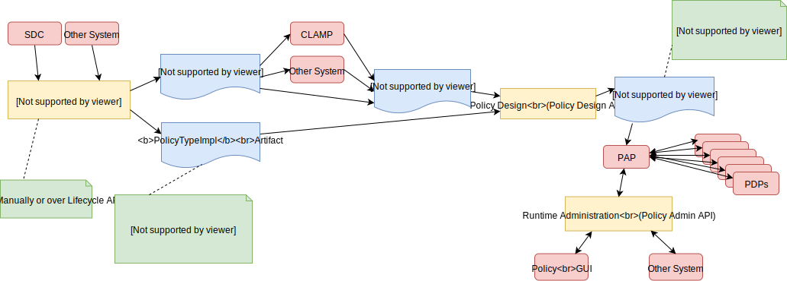
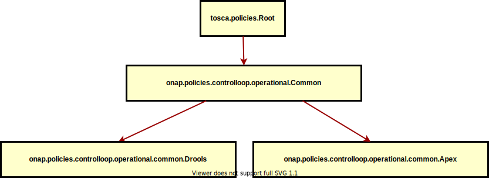
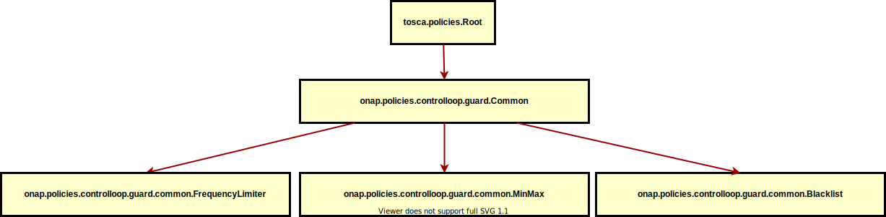
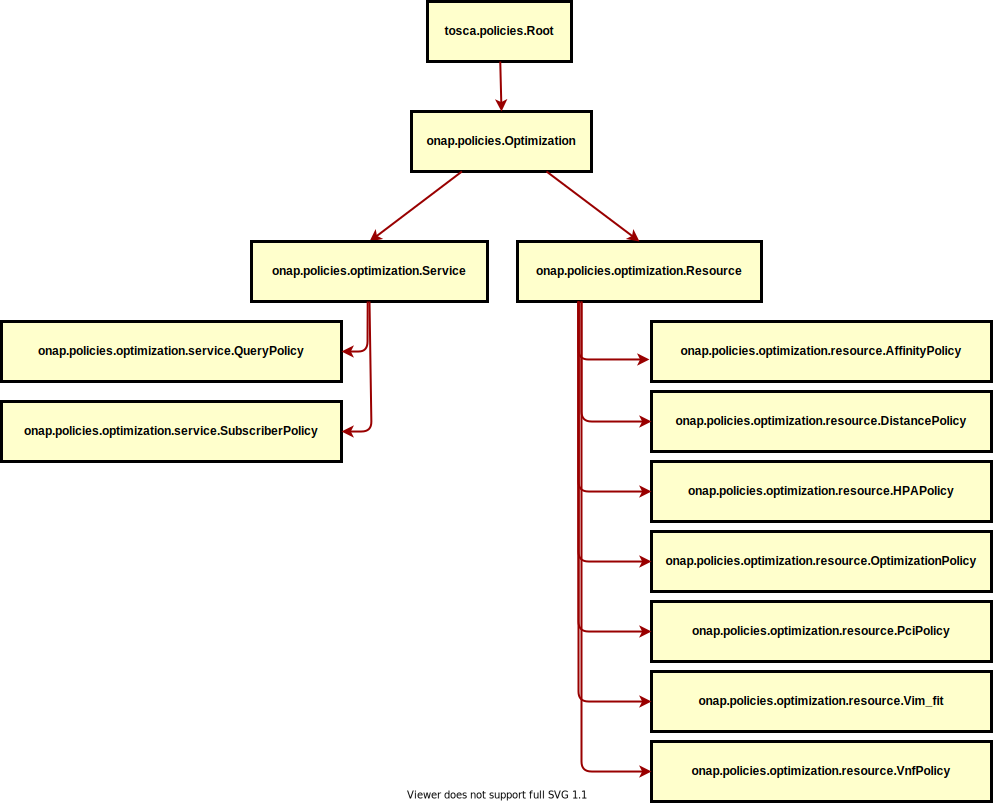

.. This work is licensed under a
.. Creative Commons Attribution 4.0 International License.
.. http://creativecommons.org/licenses/by/4.0

.. _design-label:

Policy Design and Development
#############################

.. contents::
    :depth: 4

This document describes the design principles that should be used to write, deploy, and run policies of various types
using the Policy Framework. It explains the APIs that are available for Policy Framework users. It provides copious
examples to illustrate policy design and API usage.

The figure below shows the Artifacts (Blue) in the ONAP Policy Framework, the Activities (Yellow) that manipulate them,
and important components (Salmon) that interact with them. The Policy Framework is fully TOSCA compliant, and uses
TOSCA to model policies. Please see the :ref:`TOSCA Policy Primer <tosca-label>` page for an introduction to TOSCA
policy concepts.

TOSCA defines the concept of a *PolicyType*, the definition of a type of policy that can be applied to a service. It
also defines the concept of a *Policy*, an instance of a *PolicyType*. In the Policy Framework, we handle and manage
these TOSCA definitions and tie them to real implementations of policies that can run on PDPs.

The diagram above outlines how this is achieved. Each TOSCA *PolicyType* must have a corresponding *PolicyTypeImpl* in
the Policy Framework. The TOSCA *PolicyType* definition can be used to create a TOSCA *Policy* definition, either
directly by the Policy Framework, by CLAMP, or by some other system. Once the *Policy* artifact exists, it can be used
together with the *PolicyTypeImpl* artifact to create a *PolicyImpl* artifact. A *PolicyImpl* artifact is an executable
policy implementation that can run on a PDP.

The TOSCA *PolicyType* artifact defines the external characteristics of the policy; defining its properties, the types
of entities it acts on, and its triggers.  A *PolicyTypeImpl* artifact is an XACML, Drools, or APEX implementation of
that policy definition. *PolicyType* and *PolicyTypeImpl* artifacts may be preloaded, may be loaded manually, or may be
created using the Lifecycle API. Alternatively, *PolicyType* definitions may be loaded over the Lifecycle API for
preloaded *PolicyTypeImpl* artifacts. A TOSCA *PolicyType* artifact can be used by clients (such as CLAMP or CLI tools)
to create, parse, serialize, and/or deserialize an actual Policy.

The TOSCA *Policy* artifact is used internally by the Policy Framework, or is input by CLAMP or other systems. This
artifact specifies the values of the properties for the policy and specifies the specific entities the policy acts on.
Policy Design uses the TOSCA *Policy* artifact and the *PolicyTypeImpl* artifact to create an executable *PolicyImpl*
artifact. 

ONAP Policy Types
=================

Policy Type Design manages TOSCA *PolicyType* artifacts and their *PolicyTypeImpl* implementations.

A TOSCA *PolicyType* may ultimately be defined by the modeling team but for now are defined by the Policy Framework
project. Various editors and GUIs are available for creating *PolicyTypeImpl* implementations. However, systematic
integration of *PolicyTypeImpl* implementation is outside the scope of the ONAP Dublin release.

The *PolicyType* definitions and implementations listed below can be preloaded  so that they are available for use in the
Policy Framework upon platform installation. For a full listing of available preloaded policy types, see the
:ref:`Policy API Preloaded Policy Type List <policy-preload-label>`.

============================================             ===============================================================================
**Base Policy Types**                                    **Description**
============================================             ===============================================================================
onap.policies.Monitoring                                 Base model that supports Policy driven DCAE microservice components used
                                                         in Control Loops
onap.policies.controlloop.operational.Common             Base Control Loop operational policy common definitions
onap.policies.controlloop.guard.Common                   Control Loop Guard Policy common definitions
onap.policies.Optimization                               Base OOF Optimization Policy Type definition
onap.policies.Naming                                     Base SDNC Naming Policy Type definition
onap.policies.Native                                     Base Native Policy Type for PDPs to inherit from in order to provide their own
                                                         native policy type.
============================================             ===============================================================================

.. note::
   The El Alto onap.policies.controlloop.Guard policy types were deprecated and removed in Frankfurt.

1 Base Policy Type: onap.policies.Monitoring
--------------------------------------------

This is a base Policy Type that supports Policy driven DCAE microservice components used in a Control Loops. The
implementation of this Policy Type is done in the XACML PDP. The :ref:`Decision API <decision-api-label>` is used by the DCAE
Policy Handler to retrieve a decision on which policy to enforce during runtime.

.. code-block:: yaml
  :caption: Base Policy Type definition for onap.policies.Monitoring
  :linenos:

  tosca_definitions_version: tosca_simple_yaml_1_1_0
  topology_template:
    policy_types:
      - onap.policies.Monitoring:
          derived_from: tosca.policies.Root
          version: 1.0.0
          description: a base policy type for all policies that govern monitoring provision

The *PolicyTypeImpl* implementation of the *onap.policies.Montoring* Policy Type is generic to support definition of
TOSCA *PolicyType* artifacts in the Policy Framework using the Policy Type Design API. Therefore many TOSCA *PolicyType*
artifacts will use the same *PolicyTypeImpl* implementation with different property types and towards different targets.
This allows dynamically generated DCAE microservice component Policy Types to be created at Design Time.

Please be sure to name your Policy Type appropriately by prepending it with **onap.policies.monitoring.Custom**.
Notice the lowercase **m** for monitoring, which follows TOSCA conventions. And also notice the capitalized "C" for
your analytics policy type name.

.. code-block:: yaml
  :caption: Example PolicyType *onap.policies.monitoring.MyDCAEComponent* derived from *onap.policies.Monitoring*
  :linenos:

  tosca_definitions_version: tosca_simple_yaml_1_1_0
  policy_types:
   - onap.policies.monitoring.Mycomponent:
        derived_from: onap.policies.Monitoring
        version: 1.0.0
        properties:
            my_property_1:
            type: string
            description: A description of this property

For more examples of monitoring policy type definitions, please refer to the examples in the `ONAP policy-models gerrit
repository <https://github.com/onap/policy-models/tree/guilin/models-examples/src/main/resources/policytypes>`__. Please
note that some of the examples do not adhere to TOSCA naming conventions due to backward compatibility.

2 Base Policy Type onap.policies.controlloop.operational.Common
---------------------------------------------------------------
This is the new Operational Policy Type introduced in Frankfurt release to fully support TOSCA Policy Type. There are common
properties and datatypes that are independent of the PDP engine used to enforce this Policy Type.

2.1 onap.policies.controlloop.operational.common.Drools
~~~~~~~~~~~~~~~~~~~~~~~~~~~~~~~~~~~~~~~~~~~~~~~~~~~~~~~

Drools PDP Control Loop Operational Policy definition extends the base common policy type by adding a property for **controllerName**.

Please see the definition of the `Drools Operational Policy Type <https://github.com/onap/policy-models/blob/guilin/models-examples/src/main/resources/policytypes/onap.policies.controlloop.operational.common.Drools.yaml>`_

2.2 onap.policies.controlloop.operational.common.Apex
~~~~~~~~~~~~~~~~~~~~~~~~~~~~~~~~~~~~~~~~~~~~~~~~~~~~~

Apex PDP Control Loop Operational Policy definition extends the base common policy type by adding additional properties.

Please see the definition of the `Apex Operational Policy Type <https://github.com/onap/policy-models/blob/guilin/models-examples/src/main/resources/policytypes/onap.policies.controlloop.operational.common.Apex.yaml>`_

3 Base Policy Type: onap.policies.controlloop.guard.Common
----------------------------------------------------------

This base policy type is the the type definition for Control Loop guard policies for frequency limiting, blacklisting and
min/max guards to help protect runtime Control Loop Actions from doing harm to the network. This policy type is
developed using the XACML PDP to support question/answer Policy Decisions during runtime for the Drools and APEX
onap.controlloop.Operational policy type implementations.

Please see the definition of the `Common Guard Policy Type <https://github.com/onap/policy-models/blob/guilin/models-examples/src/main/resources/policytypes/onap.policies.controlloop.guard.Common.yaml>`_

3.1 Frequency Limiter Guard onap.policies.controlloop.guard.common.FrequencyLimiter
~~~~~~~~~~~~~~~~~~~~~~~~~~~~~~~~~~~~~~~~~~~~~~~~~~~~~~~~~~~~~~~~~~~~~~~~~~~~~~~~~~~

The frequency limiter supports limiting the frequency of actions being taken by an Actor.

Please see the definition of the `Guard Frequency Limiter Policy Type <https://github.com/onap/policy-models/blob/guilin/models-examples/src/main/resources/policytypes/onap.policies.controlloop.guard.common.FrequencyLimiter.yaml>`_

3.2 Min/Max Guard onap.policies.controlloop.guard.common.MinMax
~~~~~~~~~~~~~~~~~~~~~~~~~~~~~~~~~~~~~~~~~~~~~~~~~~~~~~~~~~~~~~~

The Min/Max Guard supports Min/Max number of entity for scaling operations.

Please see the definition of the `Guard Min/Max Policy Type <https://github.com/onap/policy-models/blob/guilin/models-examples/src/main/resources/policytypes/onap.policies.controlloop.guard.common.MinMax.yaml>`_

3.3 Blacklist Guard onap.policies.controlloop.guard.common.Blacklist
~~~~~~~~~~~~~~~~~~~~~~~~~~~~~~~~~~~~~~~~~~~~~~~~~~~~~~~~~~~~~~~~~~~~

The Blacklist Guard Supports blacklisting control loop actions from being performed on specific entity id's.

Please see the definition of the `Guard Blacklist Policy Type <https://github.com/onap/policy-models/blob/guilin/models-examples/src/main/resources/policytypes/onap.policies.controlloop.guard.common.Blacklist.yaml>`_

3.4 Filter Guard onap.policies.controlloop.guard.common.Filter
~~~~~~~~~~~~~~~~~~~~~~~~~~~~~~~~~~~~~~~~~~~~~~~~~~~~~~~~~~~~~~~~~~~~

The Filter Guard Supports filtering control loop actions from being performed on specific entity id's.

Please see the definition of the `Guard Filter Policy Type <https://github.com/onap/policy-models/blob/guilin/models-examples/src/main/resources/policytypes/onap.policies.controlloop.guard.common.Filter.yaml>`_

4 Optimization onap.policies.Optimization
-----------------------------------------

The Optimization Base Policy Type supports the OOF optimization policies. The Base policy Type has common properties shared
by all its derived policy types.

Please see the definition of the `Base Optimization Policy Type <https://github.com/onap/policy-models/blob/guilin/models-examples/src/main/resources/policytypes/onap.policies.Optimization.yaml>`_.

These Policy Types are unique in that some properties have an additional metadata property **matchable** set to **true**
which indicates that this property can be used to support more fine-grained Policy Decisions. For more information,
see the :ref:`XACML Optimization application implementation <xacml-optimization-label>`.

4.1 Optimization Service Policy Type onap.policies.optimization.Service
~~~~~~~~~~~~~~~~~~~~~~~~~~~~~~~~~~~~~~~~~~~~~~~~~~~~~~~~~~~~~~~~~~~~~~~

This policy type further extends the base onap.policies.Optimization type by defining additional properties specific to
a service. For more information:

`Service Optimization Base Policy Type <https://github.com/onap/policy-models/blob/guilin/models-examples/src/main/resources/policytypes/onap.policies.optimization.Service.yaml>`_

Several additional policy types inherit from the Service Optimization Policy Type. For more information, :ref:`XACML Optimization
application implementation <xacml-optimization-label>`.

4.2 Optimization Resource Policy Type onap.policies.optimization.Resource
~~~~~~~~~~~~~~~~~~~~~~~~~~~~~~~~~~~~~~~~~~~~~~~~~~~~~~~~~~~~~~~~~~~~~~~~~

This policy type further extends the base onap.policies.Optimization type by defining additional properties specific to
a resource. For more information:

`Resource Optimization Base Policy Type <https://github.com/onap/policy-models/blob/guilin/models-examples/src/main/resources/policytypes/onap.policies.optimization.Resource.yaml>`_

Several additional policy types inherit from the Resource Optimization Policy Type. For more information, :ref:`XACML Optimization
application implementation <xacml-optimization-label>`.

5 Naming onap.policies.Naming
-----------------------------

Naming policies are used in SDNC to enforce which naming policy should be used during instantiation.

Policies of this type are composed using the `Naming Policy Type Model <https://github.com/onap/policy-models/blob/guilin/models-examples/src/main/resources/policytypes/onap.policies.Naming.yaml>`_.

6 Native Policy Types onap.policies.Native
------------------------------------------

This is the Base Policy Type used by PDP engines to support their native language policies. PDP engines inherit from
this base policy type to implement support for their own custom policy type:

..  code-block:: yaml

  tosca_definitions_version: tosca_simple_yaml_1_1_0
  policy_types:
      onap.policies.Native:
          derived_from: tosca.policies.Root
          description: a base policy type for all native PDP policies
          version: 1.0.0

6.1 Policy Type: onap.policies.native.drools.Controller
~~~~~~~~~~~~~~~~~~~~~~~~~~~~~~~~~~~~~~~~~~~~~~~~~~~~~~~

This policy type supports creation of native PDP-D controllers via policy.   A controller is an abstraction on
the PDP-D that groups communication channels, message mapping rules, and
any other arbitrary configuration data to realize an application.

Policies of this type are composed using the
`onap.policies.native.drools.Controller policy type specification
<https://github.com/onap/policy-models/blob/guilin/models-examples/src/main/resources/policytypes/onap.policies.native.Drools.yaml>`__ specification.

6.2 Policy Type: onap.policies.native.drools.Artifact
~~~~~~~~~~~~~~~~~~~~~~~~~~~~~~~~~~~~~~~~~~~~~~~~~~~~~

This policy type supports the dynamic association of a native PDP-D controller with rules and dependent
java libraries.   This policy type is used in conjuction with the onap.policies.native.drools.Controller
type to create or upgrade a drools application on a live PDP-D.

Policies of this type are composed against the
`onap.policies.native.drools.Controller policy type specification
<https://github.com/onap/policy-models/blob/guilin/models-examples/src/main/resources/policytypes/onap.policies.native.Drools.yaml>`__ specification.

6.3 Policy Type: onap.policies.native.Xacml
~~~~~~~~~~~~~~~~~~~~~~~~~~~~~~~~~~~~~~~~~~~

This policy type supports XACML OASIS 3.0 XML Policies. The policies are URL encoded in order to be easily transported via Lifecycle
API json and yaml Content-Types. When deployed to the XACML PDP (PDP-X), they will be managed by the **native** application. The PDP-X
will route XACML Request/Response RESTful API calls to the **native** application who manages those decisions.

`XACML Native Policy Type <https://github.com/onap/policy-models/blob/guilin/models-examples/src/main/resources/policytypes/onap.policies.native.Xacml.yaml>`_

6.4 Policy Type: onap.policies.native.Apex
~~~~~~~~~~~~~~~~~~~~~~~~~~~~~~~~~~~~~~~~~~

This policy type supports Apex native policy types.

`Apex Native Policy Type <https://github.com/onap/policy-models/blob/guilin/models-examples/src/main/resources/policytypes/onap.policies.native.Apex.yaml>`_
