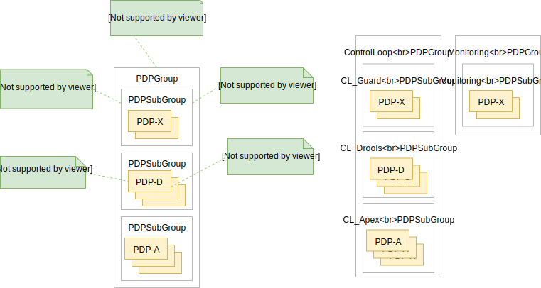

.. This work is licensed under a
.. Creative Commons Attribution 4.0 International License.
.. http://creativecommons.org/licenses/by/4.0

.. _design-label:

Policy Design and Development
#############################

.. contents::
    :depth: 3

This document describes the design principles that should be used to write, deploy, and run policies of various types
using the Policy Framework. It explains the APIs that are available for Policy Framework users. It provides copious
examples to illustrate policy design and API usage.

1 Introduction
==============

The figure below shows the Artifacts (Blue) in the ONAP Policy Framework, the Activities (Yellow) that manipulate them,
and important components (Salmon) that interact with them. The Policy Framework is fully TOSCA compliant, and uses
TOSCA to model policies. Please see the :ref:`TOSCA Policy Primer <tosca-label>` page for an introduction to TOSCA
policy concepts.

TOSCA defines the concept of a *PolicyType*, the definition of a type of policy that can be applied to a service. It
also defines the concept of a *Policy*, an instance of a *PolicyType*. In the Policy Framework, we handle and manage
these TOSCA definitions and tie them to real implementations of policies that can run on PDPs.

The diagram above outlines how this is achieved. Each TOSCA *PolicyType* must have a corresponding *PolicyTypeImpl* in
the Policy Framework. The TOSCA *PolicyType* definition can be used to create a TOSCA *Policy* definition, either
directly by the Policy Framework, by CLAMP, or by some other system. Once the *Policy* artifact exists, it can be used
together with the *PolicyTypeImpl* artifact to create a *PolicyImpl* artifact. A *PolicyImpl* artifact is an executable
policy implementation that can run on a PDP.

The TOSCA *PolicyType* artifact defines the external characteristics of the policy; defining its properties, the types
of entities it acts on, and its triggers.  A *PolicyTypeImpl* artifact is an XACML, Drools, or APEX implementation of
that policy definition. *PolicyType* and *PolicyTypeImpl* artifacts may be preloaded, may be loaded manually, or may be
created using the Lifecycle API. Alternatively, *PolicyType* definitions may be loaded over the Lifecycle API for
preloaded *PolicyTypeImpl* artifacts. A TOSCA *PolicyType* artifact can be used by clients (such as CLAMP or CLI tools)
to create, parse, serialize, and/or deserialize an actual Policy.

The TOSCA *Policy* artifact is used internally by the Policy Framework, or is input by CLAMP or other systems. This
artifact specifies the values of the properties for the policy and specifies the specific entities the policy acts on.
Policy Design uses the TOSCA *Policy* artifact and the *PolicyTypeImpl* artifact to create an executable *PolicyImpl*
artifact. 

2 ONAP Policy Types
===================

Policy Type Design manages TOSCA *PolicyType* artifacts and their *PolicyTypeImpl* implementations.

A TOSCA *PolicyType* may ultimately be defined by the modeling team but for now are defined by the Policy Framework
project. Various editors and GUIs are available for creating *PolicyTypeImpl* implementations. However, systematic
integration of *PolicyTypeImpl* implementation is outside the scope of the ONAP Dublin release.

The *PolicyType* definitions and implementations listed below are preloaded and are always available for use in the
Policy Framework.

====================================== ===============================================================================
**Policy Type**                        **Description**
====================================== ===============================================================================
onap.policies.Monitoring               Overarching model that supports Policy driven DCAE microservice components used
                                       in a Control Loops
onap.policies.controlloop.Operational  Used to support actor/action operational policies for control loops
onap.policies.controlloop.Guard        Control Loop guard policies for policing control loops
onap.policies.controlloop.Coordination Control Loop Coordination policies to assist in coordinating multiple control
                                       loops at runtime
====================================== ===============================================================================

2.1 Policy Type: onap.policies.Monitoring
-----------------------------------------

This is a base Policy Type that supports Policy driven DCAE microservice components used in a Control Loops. The
implementation of this Policy Type is developed using the XACML PDP to support question/answer Policy Decisions during
runtime for the DCAE Policy Handler.

.. code-block:: yaml
  :caption: Base Policy Type definition for onap.policies.Monitoring
  :linenos:

  tosca_definitions_version: tosca_simple_yaml_1_0_0
  topology_template:
    policy_types:
      - onap.policies.Monitoring:
          derived_from: tosca.policies.Root
          version: 1.0.0
          description: a base policy type for all policies that govern monitoring provision

The *PolicyTypeImpl* implementation of the *onap.policies.Montoring* Policy Type is generic to support definition of
TOSCA *PolicyType* artifacts in the Policy Framework using the Policy Type Design API. Therefore many TOSCA *PolicyType*
artifacts will use the same *PolicyTypeImpl* implementation with different property types and towards different targets.
This allows dynamically generated DCAE microservice component Policy Types to be created at Design Time.

DCAE microservice components can generate their own TOSCA *PolicyType* using TOSCA-Lab Control Loop guard policies in
SDC (Stretch Goal) or can do so manually. See `How to generate artefacts for SDC catalog using Tosca Lab Tool
<https://wiki.onap.org/display/DW/How+to+generate+artefacts+for+SDC+catalog+using+Tosca+Lab+Tool>`__
for details on TOSCA-LAB in SDC. For Dublin, the DCAE team is defining the manual steps required to build policy models
`Onboarding steps for DCAE MS through SDC/Policy/CLAMP (Dublin)
<https://wiki.onap.org/pages/viewpage.action?pageId=60883710>`__.

.. note::
  For Dublin, microservice Policy Types will be preloaded into the SDC platform and be available as a Normative. The
  policy framework will preload support for those microservice Monitoring policy types.

.. code-block:: yaml
  :caption: Example PolicyType *onap.policies.monitoring.MyDCAEComponent* derived from *onap.policies.Monitoring*
  :linenos:

  tosca_definitions_version: tosca_simple_yaml_1_0_0
  policy_types:
    - onap.policies.Monitoring:
        derived_from: tosca.policies.Root
        version: 1.0.0
        description: a base policy type for all policies that govern monitoring provision
    - onap.policies.monitoring.MyDCAEComponent:
        derived_from: onap.policies.Monitoring
        version: 1.0.0
        properties:
          mydcaecomponent_policy:
          type: map
          description: The Policy Body I need
          entry_schema:
          type: onap.datatypes.monitoring.mydatatype

  data_types:
    - onap.datatypes.monitoring.MyDataType:
      derived_from: tosca.datatypes.Root
      properties:
        my_property_1:
        type: string
        description: A description of this property
        constraints:
          - valid_values:
            - value example 1
            - value example 2

For more examples of monitoring policy type definitions, please refer to the examples in the `ONAP policy-models gerrit
repository <https://github.com/onap/policy-models/tree/master/models-examples/src/main/resources/policytypes>`__.

2.2 Policy Type: onap.policies.controlloop.Operational
------------------------------------------------------

This policy type is used to support actor/action operational policies for control loops. There are two types of
implementations for this policy type

1. Drools implementations that supports runtime Control Loop actions taken on components such as SO/APPC/VFC/SDNC/SDNR
2. Implementations using APEX to support Control Loops.

.. note::
  For Dublin, this policy type will ONLY be used for the Policy Framework to distinguish the policy type as operational.

.. code-block:: yaml
  :caption: Base Policy Type definition for onap.policies.controlloop.Operational
  :linenos:

  tosca_definitions_version: tosca_simple_yaml_1_0_0
  policy_types:
    - onap.policies.controlloop.Operational:
        derived_from: tosca.policies.Root
        version: 1.0.0
        description: Operational Policy for Control Loops

Applications should use the following Content-Type when creating onap.policies.controlloop.Operational policies:
.. code-block::

  Content-Type: "application/yaml"

2.2.1 Operational Policy Type Schema for Drools
~~~~~~~~~~~~~~~~~~~~~~~~~~~~~~~~~~~~~~~~~~~~~~~

For Dublin Drools will still support the Casablanca YAML definition of an Operational Policy for Control Loops.

Please use the the `YAML Operational Policy format
<https://github.com/onap/policy-models/blob/master/models-interactions/model-yaml/README-v2.0.0.md>`__.

2.2.2 Operational Policy Type Schema for APEX
~~~~~~~~~~~~~~~~~~~~~~~~~~~~~~~~~~~~~~~~~~~~~

The operational Policy Type schema for APEX extends the base operational Policy Type schema. This Policy Type allows
parameters specific to the APEX PDP to be specified as a TOSCA policy. See `this sample APEX policy type definition
<https://github.com/onap/integration-csit/blob/master/tests/policy/apex-pdp/data/onap.policies.controlloop.operational.Apex.json>`__.

2.3 Policy Type: onap.policies.controlloop.Guard
------------------------------------------------

This policy type is the the type definition for Control Loop guard policies for frequency limiting, blacklisting and
min/max guards to help protect runtime Control Loop Actions from doing harm to the network. This policy type is
developed using the XACML PDP to support question/answer Policy Decisions during runtime for the Drools and APEX
onap.controlloop.Operational policy type implementations.

.. code-block:: yaml
  :caption: Base Policy Type definition for onap.policies.controlloop.Guard
  :linenos:

  tosca_definitions_version: tosca_simple_yaml_1_0_0
  policy_types:
    - onap.policies.controlloop.Guard:
        derived_from: tosca.policies.Root
        version: 1.0.0
        description: Guard Policy for Control Loops Operational Policies

As with the *onap.policies.Monitoring* policy type, the *PolicyTypeImpl* implementation of the
*onap.policies.controlloop.Guard* Policy Type is generic to support definition of TOSCA *PolicyType* artifacts in the
Policy Framework using the Policy Type Design API.

.. note::
  For Dublin, only the following derived Policy Type definitions below are preloaded in the Policy Framework. However,
  the creation of policies will still support the payload from Casablanca.

Guard policy type definitions for *FrequencyLimiter*, *BlackList*, and  *MinMax* are available in the `ONAP
policy-models gerrit repository
<https://github.com/onap/policy-models/tree/master/models-examples/src/main/resources/policytypes>`__.

3 PDP Deployment and Registration with PAP
==========================================

The unit of execution and scaling in the Policy Framework is a *PolicyImpl* entity. A *PolicyImpl* entity runs on a PDP.
As is explained above, a *PolicyImpl* entity is a *PolicyTypeImpl* implementation parameterized with a TOSCA *Policy*.

In order to achieve horizontal scalability, we group the PDPs running instances of a given *PolicyImpl* entity logically
together into a *PDPSubGroup*. The number of PDPs in a *PDPSubGroup* can then be scaled up and down using Kubernetes. In
other words, all PDPs in a subgroup run the same *PolicyImpl*, that is the same policy template implementation (in
XACML, Drools, or APEX) with the same parameters.

The figure above shows the layout of *PDPGroup* and *PDPSubGroup* entities. The figure shows examples of PDP groups for
Control Loop and Monitoring policies on the right.

The health of PDPs is monitored by the PAP in order to alert operations teams managing policy. The PAP manages the life
cycle of policies running on PDPs.

The table below shows the deployment methods in which *PolicyImpl* entities can be deployed to PDP Subgroups.

========== =========================================== ============================== ==================================
**Method** **Description**                             **Advantages**                 **Disadvantages**
========== =========================================== ============================== ==================================
Cold       The *PolicyImpl* (*PolicyTypeImpl* and      No run time configuration      Very restrictive, no run time
           TOSCA *Policy*) are predeployed on the PDP. required and run time          configuration of PDPs is possible.
           PDP is fully configured and ready to        administration is simple.
           execute when started.

           PDPs register with the PAP when they
           start, providing the *PolicyImpl* they
           have been predeployed with.

Warm       The *PolicyTypeImpl* entity is predeployed  The configuration, parameters, Administration and management is
           on the PDP. A TOSCA *Policy* may be loaded  and PDP group of PDPs may be   required. The configuration and
           at startup. The PDP may be configured or    changed at run time by loading life cycle of the TOSCA policies
           reconfigured with a new or updated TOSCA    or updating a TOSCA *Policy*   can change at run time and must be
           *Policy* at run time.                       into the PDP.                  administered and managed.

           PDPs register with the PAP when they start, Support TOSCA *Policy* entity
           providing the *PolicyImpl* they have been   life cycle managgement is
           predeployed with if any. The PAP may update supported, allowing features
           the TOSCA *Policy* on a PDP at any time     such as *PolicyImpl* Safe Mode
           after registration.                         and *PolicyImpl* retirement.

Hot        The *PolicyImpl* (*PolicyTypeImpl* and      The policy logic, rules,       Administration and management is
           TOSCA *Policy*) are deployed at run time.   configuration, parameters, and more complex. The *PolicyImpl*
           The *PolicyImpl* (*PolicyTypeImpl* and      PDP group of PDPs may be       itself and its configuration and
           TOSCA *Policy*) may be loaded at startup.   changed at run time by loading life cycle as well as the life
           The PDP may be configured or reconfigured   or updating a TOSCA *Policy*   cycle of the TOSCA policies can
           with a new or updated *PolicyTypeImpl*      and *PolicyTypeImpl* into the  change at run time and must be
           and/or TOSCA *Policy* at run time.          PDP.                           administered and managed.

           PDPs register with the PAP when they        Lifecycle management of TOSCA
           start, providing the *PolicyImpl* they have *Policy* entities and
           been predeployed with if any. The PAP may   *PolicyTypeImpl* entites is
           update the TOSCA *Policy* and               supported, allowing features
           *PolicyTypeImpl* on a PDP at any time after such as *PolicyImpl* Safe Mode
           registration                                and *PolicyImpl* retirement.
========== =========================================== ============================== ==================================

4. Policy Framework Public APIs
===============================

The Policy Framework provides the public APIs outline in the subsections below. For a full description of the APIs, see
their individual documentation linked in each subsection.

4.1 Policy Type Design API for TOSCA Policy Types
-------------------------------------------------

The full documentation for this API is available on the :ref:`Policy Life Cycle API <api-label>` page.

The purpose of this API is to support CRUD of TOSCA *PolicyType* entities. This API is provided by the
*PolicyDevelopment* component of the Policy Framework, see the :ref:`The ONAP Policy Framework Architecture
<architecture-label>` page.

The API allows applications to create, update, delete, and query *PolicyType* entities so that they become available for
use in ONAP by applications such as CLAMP. Some Policy Type entities are preloaded in the Policy Framework. The TOSCA
fields below are valid on API calls:

============ ======= ======== ========== ===============================================================================
**Field**    **GET** **POST** **DELETE** **Comment**
============ ======= ======== ========== ===============================================================================
(name)       M       M        M          The definition of the reference to the Policy Type, GET allows ranges to be
                                         specified
version      O       M        C          GET allows ranges to be specified, must be specified if more than one version
                                         of the Policy Type exists
description  R       O        N/A        Desciption of the Policy Type
derived_from R       C        N/A        Must be specified when a Policy Type is derived from another Policy Type such
                                         as in the case of derived Monitoring Policy Types
metadata     R       O        N/A        Metadata for the Policy Type
properties   R       M        N/A        This field holds the specification of the specific Policy Type in ONAP
targets      R       O        N/A        A list of node types and/or group types to which the Policy Type can be applied
triggers     R       O        N/A        Specification of policy triggers, not currently supported in ONAP
============ ======= ======== ========== ===============================================================================

.. note::
  On this and subsequent tables, use the following legend:   M-Mandatory, O-Optional, R-Read-only, C-Conditional.
  Conditional means the field is mandatory when some other field is present.

.. note::
  Preloaded policy types may only be queried over this API, modification or deletion of preloaded policy type
  implementations is disabled.

.. note::
  Policy types that are in use (referenced by defined Policies) may not be deleted.

.. note::
  The group types of targets in TOSCA are groups of TOSCA nodes, not PDP groups; the *target* concept in TOSCA is
  equivalent to the Policy Enforcement Point (PEP) concept

4.2 Policy Design API
---------------------

The full documentation for this API is available on the :ref:`Policy Life Cycle API <api-label>` page.

The purpose of this API is to support CRUD of TOSCA *Policy* entities from TOSCA compliant *PolicyType* definitions.
TOSCA *Policy* entities become the parameters for *PolicyTypeImpl* entities, producing *PolicyImpl* entities that can
run on PDPs. This API is provided by the *PolicyDevelopment* component of the Policy Framework, see the :ref:`The ONAP
Policy Framework Architecture <architecture-label>` page.

This API allows applications (such as CLAMP and Integration) to create, update, delete, and query *Policy* entities. The
TOSCA fields below are valid on API calls:

=========== ======= ======== ========== ================================================================================
**Field**   **GET** **POST** **DELETE** **Comment**
=========== ======= ======== ========== ================================================================================
(name)      M       M        M          The definition of the reference to the Policy, GET allows ranges to be specified
type        O       M        O          The Policy Type of the policy, see section 3.1
description R       O        O
metadata    R       O        N/A
properties  R       M        N/A        This field holds the specification of the specific Policy in ONAP
targets     R       O        N/A        A list of nodes and/or groups to which the Policy can be applied
=========== ======= ======== ========== ================================================================================

.. note::
  Policies that are deployed (used on deployed *PolicyImpl* entities) may not be deleted

.. note::
  This API is NOT used by DCAE for a decision on what policy the DCAE PolicyHandler should retrieve and enforce

.. note::
  The groups of targets in TOSCA are groups of TOSCA nodes, not PDP groups; the *target* concept in TOSCA is equivalent
  to the Policy Enforcement Point (PEP) concept

4.3 Policy Administration API
-----------------------------

The full documentation for this API is available on the :ref:`Policy Administration Point (PAP) <pap-label>` page.

The purpose of this API is to support CRUD of PDP groups and subgroups and to support the deployment and life cycles of
*PolicyImpl* entities (TOSCA *Policy* and *PolicyTypeImpl* entities) on PDP sub groups and PDPs. This API is provided by
the *PolicyAdministration* component (PAP) of the Policy Framework, see the :ref:`The ONAP Policy Framework Architecture
<architecture-label>` page.

PDP groups and subgroups may be prefedined in the system. Predefined groups and subgroups can be modified or deleted
over this API. The policies running on predefined groups or subgroups as well as the desired instance counts and
properties can also be modified.

A PDP may be preconfigured with its PDP group, PDP subgroup, and policies. The PDP sends this information to the PAP
when it starts. If the PDP group, subgroup, or any policy is unknown to the PAP, the PAP locks the PDP in state PASSIVE.

The state of PDP groups is managed by the API. PDP groups can be in states PASSIVE, TEST, SAFE, or ACTIVE. For a full
description of PDP group states, the :ref:`The ONAP Policy Framework Architecture <architecture-label>` page.

The API supports retrieval of statistics for PDP groups, PDP subgroups, and individual PDPs. It also allows a PDP group
health check to be ordered on PDP groups and on individual PDPs.

The fields below are valid on API calls:

============================ ======= ======== ========== ===============================================================
**Field**                    **GET** **POST** **DELETE** **Comment**
============================ ======= ======== ========== ===============================================================
name                         M       M        M          The name of the PDP group
version                      O       M        C          The version of the PDP group
state                        R       N/A      N/A        The administrative state of the PDP group: PASSIVE, SAFE, TEST,
                                                         or ACTIVE
description                  R       O        N/A        The PDP group description
properties                   R       O        N/A        Specific properties for a PDP group
pdp_subgroups                R       M        N/A        A list of PDP subgroups for a PDP group
->pdp_type                   R       M        N/A        The PDP type of this PDP subgroup, currently xacml, drools, or
                                                         apex
->supported_policy_types     R       N/A      N/A        A list of the policy types supported by the PDPs in this PDP
                                                         subgroup
->policies                   R       M        N/A        The list of policies running on the PDPs in this PDP subgroup
->->(name)                   R       M        N/A        The name of a TOSCA policy running in this PDP subgroup
->->policy_type              R       N/A      N/A        The TOSCA policy type of the policy
->->policy_type_version      R       N/A      N/A        The version of the TOSCA policy type of the policy
->->policy_type_impl         R       C        N/A        The policy type implementation (XACML, Drools Rules, or APEX
                                                         Model) that implements the policy
->instance_count             R       N/A      N/A        The number of PDP instances running in a PDP subgroup
->min_instance_count         O       N/A      N/A        The minumum number of PDP instances to run in a PDP subgroup
->properties                 O       N/A      N/A        Deployment configuration or other properties for the PDP
                                                         subgroup
->deployment_info            R       N/A      N/A        Information on the deployment for a PDP subgroup
->instances                  R       N/A      N/A        A list of PDP instances running in a PDP subgroup
->->instance                 R       N/A      N/A        The instance ID of a PDP running in a Kuberenetes Pod
->->state                    R       N/A      N/A        The administrative state of the PDP: PASSIVE, SAFE, TEST, or
                                                         ACTIVE
->->healthy                  R       N/A      N/A        The result of the latest health check on the PDP:
                                                         HEALTHY/NOT_HEALTHY/TEST_IN_PROGRESS
->->message                  O       N/A      N/A        A status message for the PDP if any
->->deployment_instance_info R       N/A      N/A        Information on the node running the PDP
============================ ======= ======== ========== ===============================================================

Note: In the Dublin release, the *policy_type_impl* of all policy types in a PDP subgroup must be the same.

4.4 Policy Decision API - Getting Policy Decisions
--------------------------------------------------

Policy decisions are required by ONAP components to support the policy-driven ONAP architecture. Policy Decisions are
implemented using the XACML PDP. The calling application must provide attributes in order for the XACML PDP to return a
correct decision.

Decision API queries are implemented with a POST operation with a JSON body that specifies the filter for the policies
to be returned.

*https:{url}:{port}/decision/v1/ POST*

The table below describes the fields in the JSON payload for the decision API Call.

============= ======= ======== ==========================================================================
**Field**     **R/O** **Type** **Description**
============= ======= ======== ==========================================================================
ONAPName      R       String   Name of the ONAP Project that is making the request.
ONAPComponent O       String   Name of the ONAP Project component that is making the request.
ONAPInstance  O       String   Optional instance identification for that ONAP component.
action        R       String   The action that the ONAP component is performing on a resource.
                               "configure" → DCAE uS onap.Monitoring policy Decisions to configure uS
                               "naming"
                               "placement"
                               "guard"
============= ======= ======== ==========================================================================

These sub metadata structures are used to scope the resource the ONAP component is performing an action upon. At least
one must be specified in order for Policy to return a decision. Multiple structures may be utilized to help define a
precise scope for a decision. 

4.4.1 Policy Decision API - DCAE configuration examples
-------------------------------------------------------

These resource fields are examples on how DCAE implements its "configure" application to make Decision API calls.

================= ======= ======== ==================================================================
**Field**         **R/O** **Type** **Description**
================= ======= ======== ==================================================================
policy-type-name  O       String   The policy type name. This may be a regular expression.
policy-id         O       String   The policy id. This may be a regular expression or an exact value.
================= ======= ======== ==================================================================

These example below shows the JSON body of a query with a single policy ID.

.. code-block:: yaml
  :caption: Decision API Call - Single Policy ID query
  :linenos:

  {
    "ONAPName": "DCAE",
    "ONAPComponent": "PolicyHandler",
    "ONAPInstance": "622431a4-9dea-4eae-b443-3b2164639c64",
    "action": "configure",
    "resource": {
      "policy-id": "onap.scaleout.tca"
    }
  }

.. code-block:: yaml
  :caption: Decision Response - Single Policy ID query
  :linenos:

  {
    "policies": {
      "onap.scaleout.tca": {
        "type": "onap.policies.monitoring.cdap.tca.hi.lo.app",
        "version": "1.0.0",
        "metadata": {
          "policy-id": "onap.scaleout.tca",
          "policy-version": 1
        },
        "properties": {
          "tca_policy": {
            "domain": "measurementsForVfScaling",
            "metricsPerEventName": [{
              "eventName": "vLoadBalancer",
              "controlLoopSchemaType": "VNF",
              "policyScope": "type=configuration",
              "policyName": "onap.scaleout.tca",
              "policyVersion": "v0.0.1",
              "thresholds": [{
                  "closedLoopControlName": "ControlLoop-vDNS-6f37f56d-a87d-4b85-b6a9-cc953cf779b3",
                  "closedLoopEventStatus": "ONSET",
                  "version": "1.0.2",
                  "fieldPath": "$.event.measurementsForVfScalingFields.vNicPerformanceArray[*]
                  .receivedBroadcastPacketsAccumulated",
                  "thresholdValue": 500,
                  "direction": "LESS_OR_EQUAL",
                  "severity": "MAJOR"
                },
                {
                  "closedLoopControlName": "ControlLoop-vDNS-6f37f56d-a87d-4b85-b6a9-cc953cf779b3",
                  "closedLoopEventStatus": "ONSET",
                  "version": "1.0.2",
                  "fieldPath": "$.event.measurementsForVfScalingFields.vNicPerformanceArray[*]
                  .receivedBroadcastPacketsAccumulated",
                  "thresholdValue": 5000,
                  "direction": "GREATER_OR_EQUAL",
                  "severity": "CRITICAL"
              }]
            }]
          }
        }
      }
    }
  }

This example below shows the JSON body of a query with multiple policy IDs.

.. code-block:: yaml
  :caption: Decision API Call - Multiple Policy IDs query
  :linenos:

  {
    "ONAPName": "DCAE",
    "ONAPComponent": "PolicyHandler",
    "ONAPInstance": "622431a4-9dea-4eae-b443-3b2164639c64",
    "action": "configure",
    "resource": {
      "policy-id": [
        "onap.scaleout.tca",
        "onap.restart.tca"
      ]
    }
  }

.. code-block:: yaml
  :caption: Decision Response - Multiple Policy IDs query
  :linenos:

  {
    "policies": {
      "onap.scaleout.tca": {
        "type": "onap.policies.monitoring.cdap.tca.hi.lo.app",
        "version": "1.0.0",
        "metadata": {
          "policy-id": "onap.scaleout.tca"
        },
        "properties": {
          "tca_policy": {
            "domain": "measurementsForVfScaling",
            "metricsPerEventName": [
              {
                "eventName": "vLoadBalancer",
                "controlLoopSchemaType": "VNF",
                "policyScope": "type=configuration",
                "policyName": "onap.scaleout.tca",
                "policyVersion": "v0.0.1",
                "thresholds": [
                  {
                    "closedLoopControlName": "ControlLoop-vDNS-6f37f56d-a87d-4b85-b6a9-cc953cf779b3",
                    "closedLoopEventStatus": "ONSET",
                    "version": "1.0.2",
                    "fieldPath": "$.event.measurementsForVfScalingFields.vNicPerformanceArray[*]
                    .receivedBroadcastPacketsAccumulated",
                    "thresholdValue": 500,
                    "direction": "LESS_OR_EQUAL",
                    "severity": "MAJOR"
                  },
                  {
                    "closedLoopControlName": "ControlLoop-vDNS-6f37f56d-a87d-4b85-b6a9-cc953cf779b3",
                    "closedLoopEventStatus": "ONSET",
                    "version": "1.0.2",
                    "fieldPath": "$.event.measurementsForVfScalingFields.vNicPerformanceArray[*]
                    .receivedBroadcastPacketsAccumulated",
                    "thresholdValue": 5000,
                    "direction": "GREATER_OR_EQUAL",
                    "severity": "CRITICAL"
                  }
                ]
              }
            ]
          }
        }
      },
      "onap.restart.tca": {
        "type": "onap.policies.monitoring.cdap.tca.hi.lo.app",
        "version": "1.0.0",
        "metadata": {
          "policy-id": "onap.restart.tca",
          "policy-version": 1
        },
        "properties": {
          "tca_policy": {
            "domain": "measurementsForVfScaling",
            "metricsPerEventName": [
              {
                "eventName": "Measurement_vGMUX",
                "controlLoopSchemaType": "VNF",
                "policyScope": "DCAE",
                "policyName": "DCAE.Config_tca-hi-lo",
                "policyVersion": "v0.0.1",
                "thresholds": [
                  {
                    "closedLoopControlName": "ControlLoop-vCPE-48f0c2c3-a172-4192-9ae3-052274181b6e",
                    "version": "1.0.2",
                    "fieldPath": "$.event.measurementsForVfScalingFields.additionalMeasurements[*]
                    .arrayOfFields[0].value",
                    "thresholdValue": 0,
                    "direction": "EQUAL",
                    "severity": "MAJOR",
                    "closedLoopEventStatus": "ABATED"
                  },
                  {
                    "closedLoopControlName": "ControlLoop-vCPE-48f0c2c3-a172-4192-9ae3-052274181b6e",
                    "version": "1.0.2",
                    "fieldPath": "$.event.measurementsForVfScalingFields.additionalMeasurements[*]
                    .arrayOfFields[0].value",
                    "thresholdValue": 0,
                    "direction": "GREATER",
                    "severity": "CRITICAL",
                    "closedLoopEventStatus": "ONSET"
                  }
                ]
              }
            ]
          }
        }
      }
    }
  }

This example below shows the JSON body of a query to return all the deployed policies for a specific policy type.

.. code-block:: yaml
  :caption: Decision API Call - Policies for Policy Type query
  :linenos:

  {
    "ONAPName": "DCAE",
    "ONAPComponent": "PolicyHandler",
    "ONAPInstance": "622431a4-9dea-4eae-b443-3b2164639c64",
    "action": "configure",
    "resource": {
      "policy-type": "onap.policies.monitoring.cdap.tca.hi.lo.app"
    }
  }

.. code-block:: yaml
  :caption: Decision Response - Policies for Policy Type query
  :linenos:

  {
    "policies": {
      "onap.scaleout.tca": {
        "type": "onap.policies.monitoring.cdap.tca.hi.lo.app",
        "version": "1.0.0",
        "metadata": {
          "policy-id": "onap.scaleout.tca",
          "policy-version": 1,
        },
        "properties": {
          "tca_policy": {
            "domain": "measurementsForVfScaling",
            "metricsPerEventName": [
              {
                "eventName": "vLoadBalancer",
                "controlLoopSchemaType": "VNF",
                "policyScope": "type=configuration",
                "policyName": "onap.scaleout.tca",
                "policyVersion": "v0.0.1",
                "thresholds": [
                  {
                    "closedLoopControlName": "ControlLoop-vDNS-6f37f56d-a87d-4b85-b6a9-cc953cf779b3",
                    "closedLoopEventStatus": "ONSET",
                    "version": "1.0.2",
                    "fieldPath": "$.event.measurementsForVfScalingFields.vNicPerformanceArray[*]
                    .receivedBroadcastPacketsAccumulated",
                    "thresholdValue": 500,
                    "direction": "LESS_OR_EQUAL",
                    "severity": "MAJOR"
                  },
                  {
                    "closedLoopControlName": "ControlLoop-vDNS-6f37f56d-a87d-4b85-b6a9-cc953cf779b3",
                    "closedLoopEventStatus": "ONSET",
                    "version": "1.0.2",
                    "fieldPath": "$.event.measurementsForVfScalingFields.vNicPerformanceArray[*]
                    .receivedBroadcastPacketsAccumulated",
                    "thresholdValue": 5000,
                    "direction": "GREATER_OR_EQUAL",
                    "severity": "CRITICAL"
                  }
                ]
              }
            ]
          }
        }
      },
      "onap.restart.tca": {
        "type": "onap.policies.monitoring.cdap.tca.hi.lo.app",
        "version": "1.0.0",
        "metadata": {
          "policy-id": "onap.restart.tca",
          "policy-version": 1
        },
        "properties": {
          "tca_policy": {
            "domain": "measurementsForVfScaling",
            "metricsPerEventName": [
              {
                "eventName": "Measurement_vGMUX",
                "controlLoopSchemaType": "VNF",
                "policyScope": "DCAE",
                "policyName": "DCAE.Config_tca-hi-lo",
                "policyVersion": "v0.0.1",
                "thresholds": [
                  {
                    "closedLoopControlName": "ControlLoop-vCPE-48f0c2c3-a172-4192-9ae3-052274181b6e",
                    "version": "1.0.2",
                    "fieldPath": "$.event.measurementsForVfScalingFields.additionalMeasurements[*].arrayOfFields[0]
                    .value",
                    "thresholdValue": 0,
                    "direction": "EQUAL",
                    "severity": "MAJOR",
                    "closedLoopEventStatus": "ABATED"
                  },
                  {
                    "closedLoopControlName": "ControlLoop-vCPE-48f0c2c3-a172-4192-9ae3-052274181b6e",
                    "version": "1.0.2",
                    "fieldPath": "$.event.measurementsForVfScalingFields.additionalMeasurements[*].arrayOfFields[0]
                    .value",
                    "thresholdValue": 0,
                    "direction": "GREATER",
                    "severity": "CRITICAL",
                    "closedLoopEventStatus": "ONSET"
                  }
                ]
              }
            ]
          }
        }
      },
      "onap.vfirewall.tca": {
        "type": "onap.policy.monitoring.cdap.tca.hi.lo.app",
        "version": "1.0.0",
        "metadata": {
          "policy-id": "onap.vfirewall.tca",
          "policy-version": 1
        },
        "properties": {
          "tca_policy": {
            "domain": "measurementsForVfScaling",
            "metricsPerEventName": [
              {
                "eventName": "vLoadBalancer",
                "controlLoopSchemaType": "VNF",
                "policyScope": "resource=vLoadBalancer;type=configuration",
                "policyName": "onap.vfirewall.tca",
                "policyVersion": "v0.0.1",
                "thresholds": [
                  {
                    "closedLoopControlName": "ControlLoop-vFirewall-d0a1dfc6-94f5-4fd4-a5b5-4630b438850a",
                    "closedLoopEventStatus": "ONSET",
                    "version": "1.0.2",
                    "fieldPath": "$.event.measurementsForVfScalingFields.vNicPerformanceArray[*]
                    .receivedBroadcastPacketsAccumulated",
                    "thresholdValue": 500,
                    "direction": "LESS_OR_EQUAL",
                    "severity": "MAJOR"
                  },
                  {
                    "closedLoopControlName": "ControlLoop-vFirewall-d0a1dfc6-94f5-4fd4-a5b5-4630b438850a",
                    "closedLoopEventStatus": "ONSET",
                    "version": "1.0.2",
                    "fieldPath": "$.event.measurementsForVfScalingFields.vNicPerformanceArray[*]
                    .receivedBroadcastPacketsAccumulated",
                    "thresholdValue": 5000,
                    "direction": "GREATER_OR_EQUAL",
                    "severity": "CRITICAL"
                  }
                ]
              }
            ]
          }
        }
      }
    }
  }

4.4.2 Policy Decision API - Guard Decision API examples
-------------------------------------------------------

These resource fields are examples on how Drools-PDP implements its "guard" application to make Decision API calls. This
structure is a transition from the legacy guard API calls. So each of these resources are contained under a "guard" object
in the "resource" object of the JSON structure.

================= ======= ======== ==================================================================
**Field**         **R/O** **Type** **Description**
================= ======= ======== ==================================================================
actor             O       String   The actor (eg APPC, SO) that is performing a recipe 
recipe            O       String   The recipe (eg Restart, Reboot) that the actor going to execute
clname            O       String   The unique ID for the Control Loop
target            O       String   The target VNF the actor is executing the recipe on
vfCount           O       String   Specific to SO "VF Module Create" - the current count of VNFs

================= ======= ======== ==================================================================

This example below shows the JSON body of a guard Decision API call.

.. code-block:: json
  :caption: Decision API Call - Guard
  :linenos:

  {
    "ONAPName": "Policy",
    "ONAPComponent": "drools-pdp",
    "ONAPInstance": "usecase-template",
    "requestId": "unique-request-id-1",
    "action": "guard",
    "resource": {
        "guard": {
            "actor": "SO",
            "recipe": "VF Module Create",
            "clname": "ControlLoop-vDNS-6f37f56d-a87d-4b85-b6a9-cc953cf779b3",
            "target": "vLoadBalancer-00",
            "vfCount": "1"
        }
    }
  }

.. code-block:: json
  :caption: Decision Response - Guard
  :linenos:

  {"status":"Permit"}

4.4.3 Policy Decision API - Optimize Decision API examples
----------------------------------------------------------

These resource fields are examples on how OOF project will make Decision API calls. NOTE: The OOF project
has not yet upgraded to the API. This work is scheduled for Frankfurt.

================= ======= ============== ==================================================================
**Field**         **R/O** **Type**       **Description**
================= ======= ============== ==================================================================
scope             O       List of String   Optional scope for the policy.
services          O       List of String   One or more services the policy applies to.
resources         O       List of String   The unique ID for the Control Loop
geography         O       List of String   The target VNF the actor is executing the recipe on

================= ======= ======== ==================================================================

This example below shows the JSON body of an Optimize Decision API call.

.. code-block:: json
  :caption: Decision API Call - Optimize vCPE service in US
  :linenos:

  {
    "ONAPName": "OOF",
    "ONAPComponent": "OOF-component",
    "ONAPInstance": "OOF-component-instance",
    "action": "optimize",
    "resource": {
        "scope": [],
        "services": ["vCPE"],
        "resources": [],
        "geography": ["US"]
    }
  }

.. code-block:: json
  :caption: Decision Response - 
  :linenos:

  {
    "policies:"  {
        ### Omitted for brevity
    }
  }

End of Document
