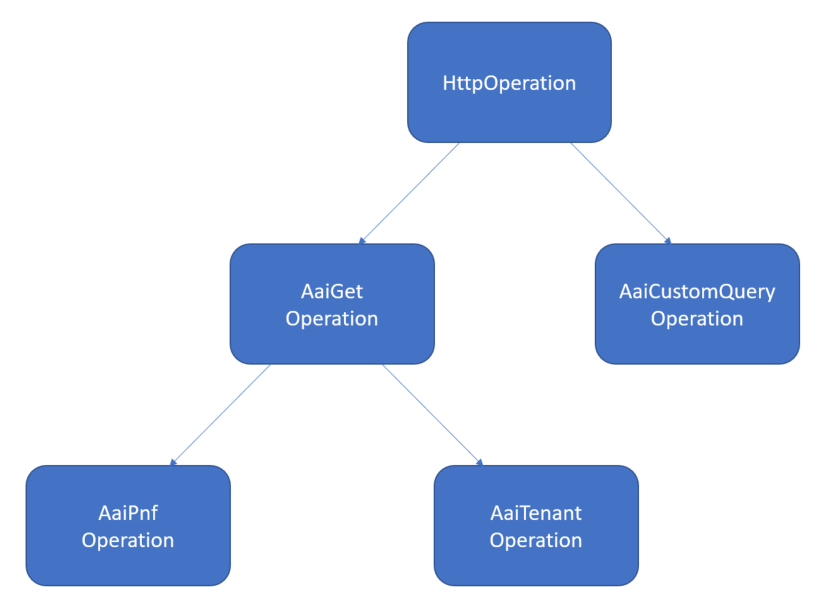

.. This work is licensed under a
.. Creative Commons Attribution 4.0 International License.
.. http://creativecommons.org/licenses/by/4.0

.. _aai-label:

##########
A&AI Actor
##########

.. contents::
    :depth: 3

Overview of A&AI Actor
######################
ONAP Policy Framework enables various actors, several of which require additional
data to be gathered from A&AI via a REST call.  Previously, the request was built,
and the REST call made, by the application.  However, A&AI queries have now been
implemented using the new Actor framework.

Each operation supported by the actor is associated with its own java class, which is
responsible for populating the request structure and invoking the REST service.  The
class hierarchy is shown below.

Currently, the following operations are supported:

- Tenant
- Pnf
- CustomQuery

One thing that sets the A&AI Actor implementation apart from the other Actor
implementations is that it is typically used to gather data for input to the
other actors.  Consequently, when an A&AI operation completes, it places its
response into the *properties* field of the *context*, which is passed via the
*ControlLoopOperationParams*.  The names of the keys within the *properties*
field are typically of the form, "AAI.<operation>.<targetEntity>", where
"operation" is the name of the operation, and "targetEntity" is the *targetEntity*
passed via the *ControlLoopOperationParams*.  For example, the response for
the Tenant query for a target entity named "ozVserver" would be stored as a
*properties* named "AAI.Tenant.ozVserver".

On the other hand, as there is only one "custom query" for a given ONSET, the
*Custom Query* operation deviates from this, in that it always stores its response
using the key, "AAI.AaiCqResponse".

Request
#######

Most of the the A&AI operations use "GET" requests and thus do not populate
a request structure.  However, for those that do, the request structure is
described in the table below.

Note: the Custom Query Operation requires tenant data, thus it performs a *Tenant*
operation before sending its request.  The tenant data is gathered for the vserver
whose name is found in the "vserver.vserver-name" field of the enrichment data provided
by DCAE with the ONSET event.

+----------------------------------+---------+----------------------------------------------------------------------+
| Field Name                       |  Type   |                         Description                                  |
+----------------------------------+---------+----------------------------------------------------------------------+
+----------------------------------+---------+----------------------------------------------------------------------+
| Custom Query:                    |         |                                                                      |
+----------------------------------+---------+----------------------------------------------------------------------+
| *start*                          | string  |   Extracted from the *result-data[0].resource-link* field of the     |
|                                  |         |   Tenant query response.                                             |
+----------------------------------+---------+----------------------------------------------------------------------+

Examples
########

Suppose the *ControlLoopOperationParams* were populated as follows, with the tenant
query having already been performed:

.. code-block:: bash

        {
            "actor": "AAI",
            "operation": "CustomQuery",
            "context": {
                "enrichment": {
                    "vserver.vserver-name": "Ete_vFWCLvFWSNK_7ba1fbde_0"
                },
                "properties": {
                    "AAI.Tenant.Ete_vFWCLvFWSNK_7ba1fbde_0": {
                        "result-data": [
                            {
                                "resource-type": "vserver",
                                "resource-link": "/aai/v15/cloud-infrastructure/cloud-regions/cloud-region/CloudOwner/RegionOne/tenants/tenant/3f2aaef74ecb4b19b35e26d0849fe9a2/vservers/vserver/6c3b3714-e36c-45af-9f16-7d3a73d99497"
                            }
                        ]
                    }
                }
            }
        }

An example of a Custom Query request constructed by the actor using the above
parameters, sent to the A&AI REST server:

.. code-block:: bash

        {
          "start": "/aai/v15/cloud-infrastructure/cloud-regions/cloud-region/CloudOwner/RegionOne/tenants/tenant/3f2aaef74ecb4b19b35e26d0849fe9a2/vservers/vserver/6c3b3714-e36c-45af-9f16-7d3a73d99497",
          "query": "query/closed-loop"
        }

An example response received from the A&AI REST service:

.. code-block:: bash

        {
            "results": [
                {
                    "vserver": {
                        "vserver-id": "f953c499-4b1e-426b-8c6d-e9e9f1fc730f",
                        "vserver-name": "Ete_vFWCLvFWSNK_7ba1fbde_0",
                        "vserver-name2": "Ete_vFWCLvFWSNK_7ba1fbde_0",
                        "prov-status": "ACTIVE",
                        "vserver-selflink": "http://10.12.25.2:8774/v2.1/41d6d38489bd40b09ea8a6b6b852dcbd/servers/f953c499-4b1e-426b-8c6d-e9e9f1fc730f",
                        "in-maint": false,
                        "is-closed-loop-disabled": false,
            ...
        }

Configuration of the A&AI Actor
###############################

The following table specifies the fields that should be provided to configure the A&AI
actor.

=============================== ====================    ==================================================================
Field name                         type                             Description
=============================== ====================    ==================================================================
clientName                        string                  Name of the HTTP client to use to send the request to the
                                                          A&AI REST server.
timeoutSec                        integer (optional)      Maximum time, in seconds, to wait for a response to be received
                                                          from the REST server.  Defaults to 90s.
path                              string                  URI appended to the URL.  This field only applies to individual
                                                          operations; it does not apply at the actor level.  Note: the
                                                          *path* should not include a leading or trailing slash.
=============================== ====================    ==================================================================

The individual operations are configured using these same field names.  However, all
of them, except the *path*, are optional, as they inherit their values from the
corresponding actor-level fields.
