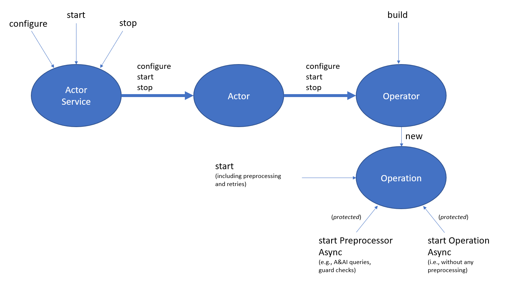

.. This work is licensed under a Creative Commons Attribution 4.0 International License.

.. _actors-overview-label:

#####################
Actor Design Overview
#####################

.. contents::

Intro
#####

An actor/operation is any ONAP component that an Operational Policy can use to control
a VNF/VM/etc. during execution of a control loop operational policy when a Control Loop
Event is triggered.

An Actor Service object contains one or more Actor objects, which are found and created
using *ServiceLoader*.  Each Actor object, in turn, creates one or more Operator objects.
All of these components, the Actor Service, the Actor, and the Operator are typically
singletons that are created once, at start-up (or on the first request).
The Actor Service includes several methods, *configure()*, *start()*, and *stop()*,
which are cascaded to the Actors and then to the Operators.

Operation objects, on the other hand, are not singletons; a new Operation object is
created for each operation that an application wishes to perform. For instance, if an
application wishes to use the "SO" Actor to add two new modules, then two separate
Operation objects would be created, one for each module.

Actors are configured by invoking the Actor Service *configure()* method, passing it
a set of properties.  The *configure()* method extracts the properties that are relevant
to each Actor and passes them to the Actor's *configure()* method.  Similarly, the
Actor's *configure()* method extracts the properties that are relevant
to each Operator and passes them to the Operator's *configure()* method.  Note:
Actors typically extract "default" properties from their respective property sets
and include those when invoking each Operator's *configure()* method.

Once the Actor Service has been configured, it can be started via *start()*.  It will
then continue to run until no longer needed, at which point *stop()* can be invoked.

Note: it is possible to create separate instances of an Actor Service, each with its
own set of properties.  In that case, each Actor Service will get its own instances of
Actors and Operators.

Components
##########

This section describes things to consider when creating a new Actor/Operator.

Actor
*****

- The constructor should use addOperator() to add operators
- By convention, the name of the actor is specified by a static field, "NAME"
- An actor is registered via the Java ServiceLoader by including its jar on the
  classpath and adding its class name to this file, typically contained within the jar:

      onap.policy.controlloop.actorServiceProvider.spi

- Actor loading is ordered, so that those having a lower (i.e., earlier) sequence number
  are loaded first.  If a later actor has the same name as one that has already been
  loaded, a warning will be generated and the later actor discarded.  This makes it
  possible for an organization to override an actor implementation

Operator
********

- Typically, developers don’t have to implement any Operator classes; they just use
  *HttpOperator* or *BidirectionalTopicOperator*

Operation
*********

- Most operations require guard checks to be performed first. Thus, at a minimum, they
  should override *startPreprocessorAsync()* and have it invoke *startGuardAsync()*
- In addition, if the operation depends on data being previously gathered and placed
  into the context, then it should override *startPreprocessorAsync()* and have it
  invoke *obtain()*. Note: *obtain()*
  and the guard can be performed in parallel by using the *allOf()* method.  If the
  guard
  happens to depend on the same data, then it will block until the data is available,
  and then continue; the invoker need not deal with the dependency
- Subclasses will typically derive from *HttpOperation* or *BidirectionalTopicOperation*,
  though if neither of those suffice, then they can extend *OperationPartial*, or
  even just implement a raw *Operation*
- Operation subclasses should be written in a way so-as to avoid any blocking I/O
- Operations return a "future" when *start()* is invoked.  Typically, if the "future" is
  canceled, then any outstanding operation should be canceled.  For instance, HTTP
  connections should be closed without waiting for a response
- If an operation sets the outcome to "FAILURE", it will be automatically retried; other
  failure types are not retried

ControlLoopParams
*****************

- Identifies the operation to be performed
- Includes timeout and retry information, though the actors typically provide default
  values if they are not specified in the parameters
- Includes the event "context"
- Includes “Policy” fields (e.g., "actor" and "operation")

Context (aka, Event Context)
****************************

- Includes:

    - the original onset event
    - enrichment data associated with the event
    - results of A&AI queries

XxxParams and XxxConfig
***********************

- XxxParams objects are POJOs into which the property Maps are decoded when configuring
  actors or operators
- XxxConfig objects contain a single Operator's (or Actor's) configuration information,
  based on what was in the XxxParams.  For instance, the HttpConfig contains a reference
  to the HttpClient that is used to perform HTTP
  operations, while the associated HttpParams just contains the name of the HttpClient.
  XxxConfig objects are
  shared by all operations created by a single Operator.  As a result, it should not
  contain any data associated with an individual operation; such data should be stored
  within the operation object, itself

Junit tests
***********

- Operation Tests may choose to subclass from *BasicHttpOperation*, which provides some
  supporting utilities and mock objects
- Should include a test to verify that the Actor, and possibly each Operator, can be
  retrieved via an Actor Service
- Tests with an actual REST server are performed within *HttpOperationTest*, so need not
  be repeated in subclasses. Instead, they can catch the callback to the *get()*,
  *post()*, etc., methods and pass the rawResponse to it there.  That being said, a
  number of actors spin up a simulator to verify end-to-end request/response processing

Clients (e.g., drools-applications)
***********************************

- When using callbacks, a client may want to use the *isFor()* method to verify that the
  outcome is for the desired operation, as callbacks are invoked with the outcome of all
  operations performed, including any preprocessor steps

Flow of operation
#################

- PDP:

  - Populates a *ControlLoopParams* using *ControlLoopParams.builder()*
  - Invokes *start()* on the *ControlLoopParams*

- ControlLoopParams:

  - Finds the actor/operator
  - Uses it to invoke *buildOperation()*
  - Invokes *start()* on the Operation

- Operation:

  - *start()* invokes *startPreprocessorAsync()* and then *startOperationAsync()*
  - Exceptions that occur while **constructing** the operation pipeline propagate back
    to the client that invoked *start()*
  - Exceptions that occur while **executing** the operation pipeline are caught and
    turned into an *OperationOutcome* whose result is FAILURE_EXCEPTION.  In addition,
    the "start" callback (i.e., specified via the *ControlLoopParams*) will be invoked,
    if it hasn't been invoked yet, and then the "complete" callback will be invoked
  - By default, *startPreprocessorAsync()* does nothing, thus most subclasses will override it to:

    - Do any A&AI query that is needed (beyond enrichment, which is already available in
      the *Context*)
    - Use *Context obtain()* to request the data asynchronously
    - Invoke *startGuardAsync()*

  - By default, *startGuardAsync()* will simply perform a guard check, passing it the
    "standard" payload
  - Subclasses may override *makeGuardPayload()* to add extra fields to the payload
    (e.g., some SO operations add the VF count)
  - If any preprocessing step fails, then the "start" & "complete" callbacks will be
    invoked to indicate a failure of the operation as a whole. Otherwise, the flow will
    continue on to *startOperationAsync()*, after the "start" callback is invoked
  - *StartOperationAsync()* will perform whatever needs to be done to start the operation
  - Once it completes, the "complete" callback will be invoked with the outcome of the
    operation.  *StartOperationAsync()* should not invoke the callback, as that is
    handled automatically by *OperationPartial*, which is the superclass of most
    Operations
