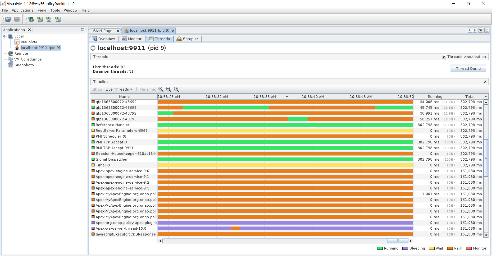
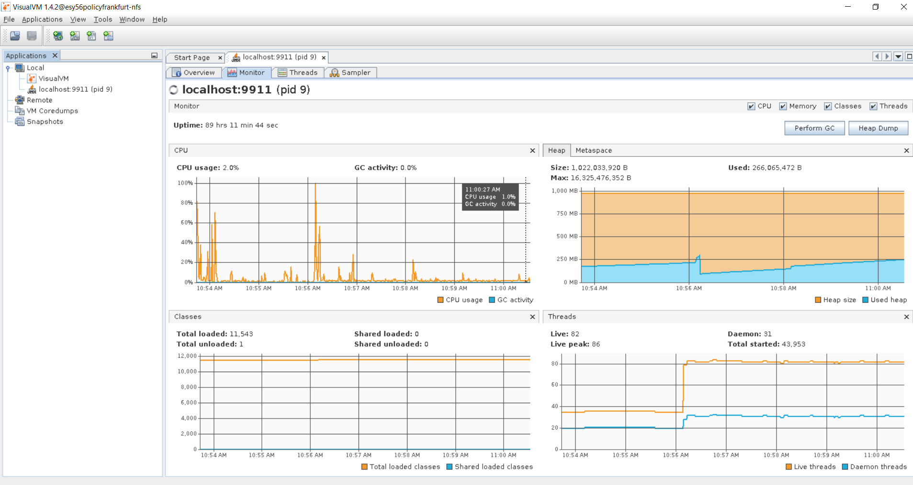
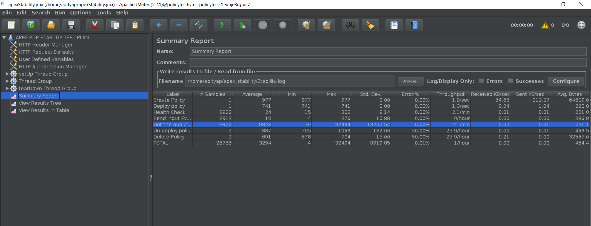
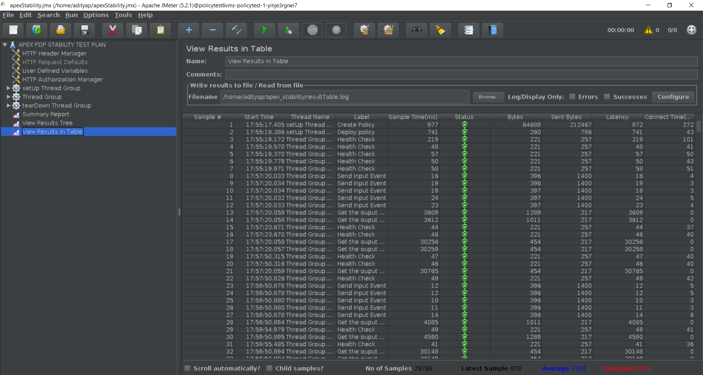

.. This work is licensed under a
.. Creative Commons Attribution 4.0 International License.
.. http://creativecommons.org/licenses/by/4.0

.. _apex-s3p-label:

.. toctree::
   :maxdepth: 2

Policy APEX PDP component
~~~~~~~~~~~~~~~~~~~~~~~~~

Setting up Stability Tests in APEX
++++++++++++++++++++++++++++++++++

Introduction
------------

The 72 hour Stability Test for apex-pdp has the goal of introducing a steady flow of transactions initiated from a test client server running JMeter. The pdp is configured to start a rest server inside it and take input from rest clients (JMeter) and send back output to the rest clients (JMeter).

The input events will be submitted through rest interface of apex-pdp and the results are verified using the rest responses coming out from apex-pdp.

The test will be performed in a multi-threaded environment where 20 threads running in JMeter will keep sending events to apex-pdp in every 500 milliseconds for the duration of 72 hours.

Setup details
-------------

The stability test is performed on VM's running in OpenStack cloud environment. There are 2 seperate VM's, one for running apex pdp & other one for running JMeter to simulate steady flow of transactions.

**OpenStack environment details**

Version: Mitaka

**apex-pdp VM details**

OS:Ubuntu 18.04 LTS

CPU: 4 core

RAM: 4 GB

HardDisk: 40 GB

Docker Version: 19.03.8, build afacb8b7f0

Java: openjdk version "11.0.7"

**JMeter VM details**

OS: Ubuntu 18.04 LTS

CPU: 4 core

RAM: 4 GB

HardDisk: 40 GB

Java: openjdk version "11.0.7"

JMeter: 5.2.1

Install JMeter in virtual machine
---------------------------------

Make the etc/hosts entries

.. code-block:: bash

    echo $(hostname -I | cut -d\  -f1) $(hostname) | sudo tee -a /etc/hosts

Make the DNS entries

.. code-block:: bash

    echo "nameserver <PrimaryDNSIPIP>" >> sudo /etc/resolvconf/resolv.conf.d/head

    echo "nameserver <SecondaryDNSIP>" >> sudo /etc/resolvconf/resolv.conf.d/head

    resolvconf -u

Update the ubuntu software installer

.. code-block:: bash

    apt-get update

Check & Install Java

.. code-block:: bash

    apt-get install -y openjdk-11-jdk

    java -version

Download & install JMeter

.. code-block:: bash

    mkdir jMeter

    cd jMeter

    wget http://mirrors.whoishostingthis.com/apache//jmeter/binaries/apache-jmeter-5.2.1.zip

    unzip apache-jmeter-5.2.1.zip

Install apex-pdp in virtual machine
-----------------------------------

We will be running apex-pdp as docker container. So we need to first install docker and then create the container hosting apex-pdp by pulling the image from ONAP repository.

**Docker Installation**

1. Make the etc/hosts entries

.. code-block:: bash

    echo $(hostname -I | cut -d\  -f1) $(hostname) | sudo tee -a /etc/hosts

2. Make the DNS entries

.. code-block:: bash

    echo "nameserver <PrimaryDNSIPIP>" >> sudo /etc/resolvconf/resolv.conf.d/head
    echo "nameserver <SecondaryDNSIP>" >> sudo /etc/resolvconf/resolv.conf.d/head
    resolvconf -u

3. Update the ubuntu software installer

.. code-block:: bash

    apt-get update

4. Check and Install Java

.. code-block:: bash

    apt-get install -y openjdk-11-jdk
    java -version

Ensure that the Java version that is executing is OpenJDK version 8

5. Check and install docker

.. code-block:: bash

    curl -fsSL https://download.docker.com/linux/ubuntu/gpg | sudo apt-key add -
    sudo add-apt-repository "deb [arch=amd64] https://download.docker.com/linux/ubuntu $(lsb_release -cs) stable"
    sudo apt-get update
    sudo apt-cache policy docker-ce
    sudo apt-get install -y docker-ce
    sudo systemctl enable docker
    sudo systemctl start docker
    sudo usermod -aG docker <your user id>

6. Logout and re-login to ensure the ``usermod`` command takes effective

7. Check the status of the Docker service and ensure it is running correctly

.. code-block:: bash

    docker ps

**Install apex-pdp**

Run the below command to create the container hosting apex-pdp by pulling the image from ONAP repository.

.. code-block:: bash

    docker run -d --name apex -p 12561:12561 -p 23324:23324 -p 9911:9911 nexus3.onap.org:10001/onap/policy-apex-pdp:2.3.1 /bin/bash -c "/opt/app/policy/apex-pdp/bin/apexApps.sh jmx-test -c /opt/app/policy/apex-pdp/examples/config/SampleDomain/RESTServerJsonEvent.json"
    docker ps

Note: If you observe that requests from JMeter client is failing due to timeout, then modify the "RESTServerJsonEvent.json" mentioned in the above command and increase the "synchronousTimeout" property as per needed.

Install & Configure VisualVM
----------------------------

VisualVM needs to be installed in the virtual machine having apex-pdp. It will be used to monitor CPU, Memory, GC for apex-pdp while stability test is running.

Install visualVM

.. code-block:: bash

    sudo apt-get install visualvm

Login to VM using graphical interface in separate terminal window.

.. code-block:: bash

    ssh -X <user>@<VM-IP-ADDRESS>

Open visualVM

.. code-block:: bash

    visualvm &

Connect to apex-pdp JVM's JMX agent
1. Right click on "Local" in the left panel of the screen and select "Add Local JMX Connection..."
2. Enter localhost:9911 for "Connection", and click OK
3. Double click on the newly added nodes under "Local" to start monitoring CPU, Memory & GC.

Sample Screenshot of visualVM

.. image:: images/stability-visualvm1.PNG
.. image:: images/stability-visualvm2.PNG

Test Plan
---------

The 72 hours stability test will run the following steps in 20 threaded loop.

- **Send Input Event** - sends an input message to rest interface of apex-pdp.
- **Assert Response Code** - assert the response code coming from apex-pdp.
- **Assert Response Message** - assert the response message coming from apex-pdp.

The following steps can be used to configure the parameters of test plan.

- **HTTP Header Manager** - used to store headers which will be used for making HTTP requests.
- **HTTP Request Defaults** -  used to store HTTP request details like Server Name or IP, Port, Protocol etc.
- **User Defined Variables** -  used to store following user defined parameters.

==================  ============================================================================  ============================
**Name**            **Description**                                                               **Default Value**
==================  ============================================================================  ============================
wait                Wait time after each request (in milliseconds)                                500
threads             Number of threads to run test cases in parallel.                              20
threadsTimeOutInMs  Synchronization timer for threads running in parallel (in milliseconds).      5000
==================  ============================================================================  ============================

Download and update the jmx file presented in the apex-pdp git repository - `jmx file path <https://gerrit.onap.org/r/gitweb?p=policy/apex-pdp.git;a=tree;f=testsuites/apex-pdp-stability/src/main/resources;h=99d373033a190a690d4e05012bc3a656cae7bc3f;hb=refs/heads/master>`_.

- HTTPSampler.domain - The ip address of VM which the apex container is running
- HTTPSampler.port - The  listening port, here is 23324
- ThreadGroup.druation - Set the duration to 72 hours (in seconds)

Use the CLI mode to start the test

.. code-block:: bash

    ./jmeter.sh -n -t ~/apexPdpStabilityTestPlan.jmx -Jusers=1 -l ~/stability.log

Stability Test Result
---------------------

**Summary**

Stability test plan was triggered for 72 hours injecting input events to apex-pdp from 20 client threads running in JMeter.

After the test stop, we can generate a HTML test report via command

.. code-block:: bash

    ~/jMeter/apache-jmeter-5.2.1/bin/jmeter -g stability.log -o ./result/

==============================================  ===================================================  ================================  =============  ============
**Number of Client Threads running in JMeter**  **Number of Server Threads running in Apex engine**  **Total number of input events**  **Success %**  **Error %**
==============================================  ===================================================  ================================  =============  ============
20                                              4                                                    8594220                           100%           0%
==============================================  ===================================================  ================================  =============  ============

.. image:: images/stability-jmeter.PNG

:download:`result.zip <zip/result.tar>`

Frankfurt release
^^^^^^^^^^^^^^^^^^

The 72 hour Stability Test for apex-pdp has the goal of introducing a steady flow of transactions using jMeter.

The input event will be submitted through the rest interface of DMaaP , which then triggers a grpc request to CDS. Based on the response, another DMaaP event is triggered.

This test will be performed in an OOM deployment setup. The test will be performed in a multi-threaded environment where 5 threads running in JMeter will keep sending events for the duration of 72 hours.

Test Plan Frankfurt release
---------------------------

The 72 hours stability test will run the following steps in a 5 threaded loop.

- **Create Policy** - creates a policy using the policy/api component
- **Deploy Policy** - deploys the policy in the existing PdpGroup
- **Check Health** - checks the health status of apex
- **Send Input Event** - trigger 'unauthenticated.DCAE_CL_OUTPUT' event of DMaaP.
- **Get Output Event Response** - check for the triggered output event.
- **Undeploy Policy** - undeploys the policy from PdpGroup
- **Delete Policy** - deletes the policy using the policy/api component

The following steps can be used to configure the parameters of the test plan.

- **HTTP Header Manager** - used to store headers which will be used for making HTTP requests.
- **HTTP Request Defaults** -  used to store HTTP request details like Server Name or IP, Port, Protocol etc.
- **User Defined Variables** -  used to store the following user defined parameters:

==================  ============================================================================  ============================
**Name**            **Description**                                                               **Default Value**
==================  ============================================================================  ============================
wait                Wait time after each request (in milliseconds)                                120000
threads             Number of threads to run test cases in parallel.                              5
threadsTimeOutInMs  Synchronization timer for threads running in parallel (in milliseconds).      150000
==================  ============================================================================  ============================

Download and update the jmx file presented in the apex-pdp git repository - `jmx file path <https://gerrit.onap.org/r/gitweb?p=policy/apex-pdp.git;a=tree;f=testsuites/apex-pdp-stability/src/main/resources;h=99d373033a190a690d4e05012bc3a656cae7bc3f;hb=refs/heads/master>`_.

- HTTPSampler.domain - The ip address of the VM in which the apex container is running
- HTTPSampler.port - The  listening port, here is 23324
- ThreadGroup.druation - Set the duration to 72 hours (in seconds)

Use the CLI mode to start the test

.. code-block:: bash

    ./jmeter.sh -n -t ~/apexPdpStabilityTestPlan.jmx -Jusers=1 -l ~/stability.log

Stability Test Results Frankfurt release
-----------------------------------------

The stability test plan was triggered for 72 hours, injecting input events to apex-pdp from 5 client threads running in JMeter.

After the test stops, we can generate an HTML test report via the command:

.. code-block:: bash

    ~/jMeter/apache-jmeter-5.2.1/bin/jmeter -g stability.log -o ./result/

==============================================  ===================================================  ================================  =============  ============
**Number of Client Threads running in JMeter**  **Number of Server Threads running in Apex engine**  **Total number of input events**  **Success %**  **Error %**
==============================================  ===================================================  ================================  =============  ============
5                                                4                                                    26766                             100%           0%
==============================================  ===================================================  ================================  =============  ============

**VisualVM Screenshot**

**JMeter Screenshot**

:download:`result.zip <zip/frankfurt/apex_s3p_result.tar>`

Setting up Performance Tests in APEX
++++++++++++++++++++++++++++++++++++

The apex-pdp has built in support for performance testing. A special performance testing REST server is available in the code base for performance testing.
It is in the module `performance-benchmark-test <https://github.com/onap/policy-apex-pdp/tree/master/testsuites/performance/performance-benchmark-test>`_.
To execute a benchmark test, you start the REST server, and then configure and run APEX against the server.
There are example configurations for running tests in the `resources of this module <https://github.com/onap/policy-apex-pdp/tree/master/testsuites/performance/performance-benchmark-test/src/main/resources/examples/benchmark>`_.

In order to run the test for 72 hours, set the batch count in the `EventGeneratorConfig.json <https://github.com/onap/policy-apex-pdp/blob/master/testsuites/performance/performance-benchmark-test/src/main/resources/examples/benchmark/EventGeneratorConfig.json>`_ file to zero, which causes the REST server to generate batches forever.

Here is an example of how to do this:

1. Clone and build the apex-pdp git repo

2. Go into the performance-benchmark-test module and run the REST server

.. code-block:: bash

    cd testsuites/performance/performance-benchmark-test
    mvn exec:java -Dexec.mainClass="org.onap.policy.apex.testsuites.performance.benchmark.eventgenerator.EventGenerator" -Dexec.args="-c  src/main/resources/examples/benchmark/EventGeneratorConfig.json"

3. Separately, create a local directory and unzip the APEX tarball

.. code-block:: bash

    mkdir apex
    cd apex
    tar zxvf ~/git/onap/policy/apex-pdp/packages/apex-pdp-package-full/target/*gz

4. Run APEX with a configuration that runs against the benchmark REST server, select the configuration that is appropriate for the number of threads for the number of cores on the host on which APEX is running. For example on a 32 core machine, select the "32" configuration, on an 8 core machine, select the "08" configuration.

.. code-block:: bash

    bin/apexApps.sh engine -c ~/git/onap/policy/apex-pdp/testsuites/performance/performance-benchmark-test/src/main/resources/examples/benchmark/Javascript64.json

5. To get the test results, Issue the following command using CURL or from a browser(also can store the result into a file by setting outfile in the `EventGeneratorConfig.json <https://github.com/onap/policy-apex-pdp/blob/master/testsuites/performance/performance-benchmark-test/src/main/resources/examples/benchmark/EventGeneratorConfig.json>`_ file, statistics would be written into this file after event generator terminated)

.. code-block:: bash

    curl http://localhost:32801/EventGenerator/Stats

The results are similar to those below:

:download:`Example APEX performance metrics <json/example-apex-perf.json>`

Performance Test Result Frankfurt
---------------------------------

**Summary**

Performance test was triggered for 2 hours on a 4 core, 4GB RAM virtual machine.

**Test Statistics**

:download:`Attached result log <json/frankfurt-apex-perf.json>`

===============  =============  =================  ==============  =====================  ==================  =============  ===========
**batchNumber**  **batchSize**  **eventsNotSent**  **eventsSent**  **eventsNotReceived**  **eventsReceived**  **Success %**  **Error %**
===============  =============  =================  ==============  =====================  ==================  =============  ===========
-1               431250         0                  431250          0                      431250              100 %          0 %
===============  =============  =================  ==============  =====================  ==================  =============  ===========

========================  =========================  ========================
**averageRoundTripNano**  **shortestRoundTripNano**  **longestRoundTripNano**
========================  =========================  ========================
148965724                 20169907                   429339393
========================  =========================  ========================

============================  =============================  ============================
**averageApexExecutionNano**  **shortestApexExecutionNano**  **longestApexExecutionNano**
============================  =============================  ============================
62451899                      3901010                        354528579
============================  =============================  ============================
