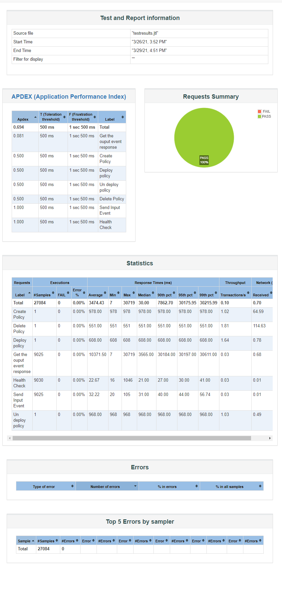

.. This work is licensed under a
.. Creative Commons Attribution 4.0 International License.
.. http://creativecommons.org/licenses/by/4.0

.. _apex-s3p-label:

.. toctree::
   :maxdepth: 2

Policy APEX PDP component
~~~~~~~~~~~~~~~~~~~~~~~~~

Setting up Stability Tests in APEX
++++++++++++++++++++++++++++++++++

Introduction
------------

The 72 hour Stability Test for apex-pdp has the goal of introducing a steady flow of transactions initiated from a test client server running JMeter. The pdp is configured to start a rest server inside it and take input from rest clients (JMeter) and send back output to the rest clients (JMeter).

The input events will be submitted through rest interface of apex-pdp and the results are verified using the rest responses coming out from apex-pdp.

The test will be performed in a multi-threaded environment where 20 threads running in JMeter will keep sending events to apex-pdp in every 500 milliseconds for the duration of 72 hours.

Setup details
-------------

The stability test is performed on VM's running in OpenStack cloud environment. There are 2 seperate VM's, one for running apex pdp & other one for running JMeter to simulate steady flow of transactions.

Install & Configure VisualVM
----------------------------

VisualVM needs to be installed in the virtual machine having apex-pdp. It will be used to monitor CPU, Memory, GC for apex-pdp while stability test is running.

Install visualVM

.. code-block:: bash

    sudo apt-get install visualvm

Login to VM using graphical interface in separate terminal window.

.. code-block:: bash

    ssh -X <user>@<VM-IP-ADDRESS>

Open visualVM

.. code-block:: bash

    visualvm &

Connect to apex-pdp JVM's JMX agent
1. Right click on "Local" in the left panel of the screen and select "Add Local JMX Connection..."
2. Enter localhost:9911 for "Connection", and click OK
3. Double click on the newly added nodes under "Local" to start monitoring CPU, Memory & GC.

Sample Screenshot of visualVM

.. image:: images/stability-visualvm2.PNG

Test Plan
---------

The 72 hours stability test will run the following steps in 5 threaded loop.

- **Send Input Event** - sends an input message to rest interface of apex-pdp.
- **Assert Response Code** - assert the response code coming from apex-pdp.
- **Assert Response Message** - assert the response message coming from apex-pdp.

The following steps can be used to configure the parameters of test plan.

- **HTTP Header Manager** - used to store headers which will be used for making HTTP requests.
- **HTTP Request Defaults** -  used to store HTTP request details like Server Name or IP, Port, Protocol etc.
- **User Defined Variables** -  used to store following user defined parameters.

==================  ============================================================================  ============================
**Name**            **Description**                                                               **Default Value**
==================  ============================================================================  ============================
wait                Wait time after each request (in milliseconds)                                500
threads             Number of threads to run test cases in parallel.                              5
threadsTimeOutInMs  Synchronization timer for threads running in parallel (in milliseconds).      5000
==================  ============================================================================  ============================

Download and update the jmx file presented in the apex-pdp git repository - `jmx file path <https://gerrit.onap.org/r/gitweb?p=policy/apex-pdp.git;a=tree;f=testsuites/apex-pdp-stability/src/main/resources;h=99d373033a190a690d4e05012bc3a656cae7bc3f;hb=refs/heads/master>`_.

- HTTPSampler.domain - The ip address of VM which the apex container is running
- HTTPSampler.port - The  listening port, here is 23324
- ThreadGroup.druation - Set the duration to 72 hours (in seconds)

Use the CLI mode to start the test

.. code-block:: bash

    ./jmeter.sh -n -t ~/apexPdpStabilityTestPlan.jmx -Jusers=1 -l ~/stability.log

Stability Test Result
---------------------

**Summary**

Stability test plan was triggered for 72 hours injecting input events to apex-pdp from 5 client threads.

Once the test has complete - we can generate a HTML test report via the following command

.. code-block:: bash

    ~/jMeter/apache-jmeter-5.2.1/bin/jmeter -g stability.log -o ./result/

==============================================  ================================  =============  ============ ============================
**Number of Client Threads running in JMeter**  **Total number of input events**  **Success %**  **Error %**  **Average Time per Request**
==============================================  ================================  =============  ============ ============================
5                                               129326                            100%           0%           6716.12
==============================================  ================================  =============  ============ ============================

download:`result.zip <apex-s3p-results/apex_s3p_results.zip>`

Stability Test of Apex PDP
^^^^^^^^^^^^^^^^^^^^^^^^^^

The 72 hour Stability Test for apex-pdp has the goal of introducing a steady flow of transactions using jMeter.

The input event will be submitted through the rest interface of DMaaP , which then triggers a grpc request to CDS. Based on the response, another DMaaP event is triggered.

This test will be performed in an OOM deployment setup. The test will be performed in a multi-threaded environment where 5 threads running in JMeter will keep sending events for the duration of 72 hours.

Test Plan
---------

The 72 hours stability test will run the following steps in a 5 threaded loop.

- **Create Policy** - creates a policy using the policy/api component
- **Deploy Policy** - deploys the policy in the existing PdpGroup
- **Check Health** - checks the health status of apex
- **Send Input Event** - trigger 'unauthenticated.DCAE_CL_OUTPUT' event of DMaaP.
- **Get Output Event Response** - check for the triggered output event.
- **Undeploy Policy** - undeploys the policy from PdpGroup
- **Delete Policy** - deletes the policy using the policy/api component

The following steps can be used to configure the parameters of the test plan.

- **HTTP Header Manager** - used to store headers which will be used for making HTTP requests.
- **HTTP Request Defaults** -  used to store HTTP request details like Server Name or IP, Port, Protocol etc.
- **User Defined Variables** -  used to store the following user defined parameters:

==================  ============================================================================  ============================
**Name**            **Description**                                                               **Default Value**
==================  ============================================================================  ============================
wait                Wait time after each request (in milliseconds)                                120000
threads             Number of threads to run test cases in parallel.                              5
threadsTimeOutInMs  Synchronization timer for threads running in parallel (in milliseconds).      150000
PAP_PORT            Port number of PAP for making REST API calls
API_PORT            Port number of API for making REST API calls
APEX_PORT           Port number of APEX for making REST API calls
DMAAP_PORT          Port number of DMAAP for making REST API calls
==================  ============================================================================  ============================

Download and update the jmx file presented in the apex-pdp git repository - `jmx file path <https://gerrit.onap.org/r/gitweb?p=policy/apex-pdp.git;a=tree;f=testsuites/apex-pdp-stability/src/main/resources;h=99d373033a190a690d4e05012bc3a656cae7bc3f;hb=refs/heads/master>`_.

- HTTPSampler.domain - The ip address of the VM in which the apex container is running
- HTTPSampler.port - The  listening port, here is 23324
- ThreadGroup.duration - Set the duration to 72 hours (in seconds)

Use the CLI mode to start the test

.. code-block:: bash

    nohup ./jmeter.sh -n -t ~/apexPdpStabilityTestPlan.jmx -Jusers=1 -l ~/stability.log

Stability Test Results
----------------------

The stability test plan was triggered for 72 hours, injecting input events to apex-pdp pod from 5 client threads running in JMeter.

The stability tests were executed as part of a full ONAP OOM deployment in Nordix lab.

Once the tests complete, we can generate an HTML test report via the command:

.. code-block:: bash

    ~/jMeter/apache-jmeter-5.2.1/bin/jmeter -g stability.log -o ./result/

==============================================  ================================  =============  ============ ============================
**Number of Client Threads running in JMeter**  **Total number of input events**  **Success %**  **Error %**  **Average Time per Request**
==============================================  ================================  =============  ============ ============================
5                                               129326                            100%           0%           6716.12
==============================================  ================================  =============  ============ ============================

**JMeter Screenshot**

.. image:: images/apex_s3p_jm-1.png
.. image:: images/apex_s3p_jm-2.png

download:`result.zip <apex-s3p-results/apex_s3p_results.zip>`

Setting up Performance Tests in APEX
++++++++++++++++++++++++++++++++++++

The Performance test is performed on a similar setup to the Stability test. JMeter will send a large number of REST requests and will then retrieve those requests.

Performance test plan will be the same as the stability test plan except for some differences listed below:

- Increase the number of threads from 5 to 60.
- Reduce test time to ninety minutes.
- Calculate the amount of requests handled in the time frame.

Run Test
--------

Running the performance test will be the same as the stability test. That is, launch JMeter pointing to corresponding *.jmx* test plan. The *API_HOST* , *API_PORT* , *PAP_HOST* , *PAP_PORT* are already set up in *.jmx*.

.. code-block:: bash

    nohup ./jmeter.sh -n -t ~/performance.jmx -Jusers=1 -l ~/perf.log

Once the tests have completed, run the following the gather results.

.. code-block:: bash

    ~/jMeter/apache-jmeter-5.2.1/bin/jmeter -g perf.log -o ./performance_result/

Performance Test Result
-----------------------

**Summary**

Performance test was triggered for 90 minutes. The results are shown below.

**Test Statistics**

============================ =========== ========= ==================================
**Total Number of Requests** **Success** **Error** **Average Time Taken per Request**
============================ =========== ========= ==================================
9870                         100 %       0 %       5506.09 ms
============================ =========== ========= ==================================

**JMeter Screenshot**

.. image:: images/apex_perf_jm_1.png

.. image:: images/apex_perf_jm_2.png
