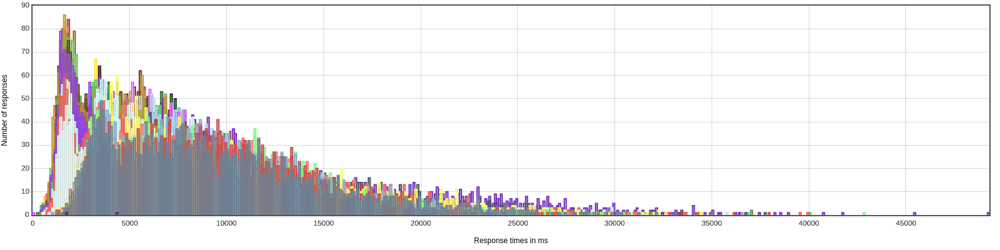
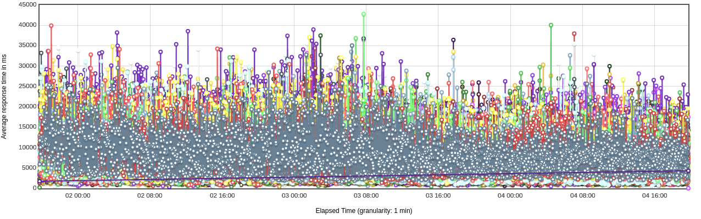

.. This work is licensed under a
.. Creative Commons Attribution 4.0 International License.
.. http://creativecommons.org/licenses/by/4.0

.. _api-s3p-label:

.. toctree::
   :maxdepth: 2

Policy API S3P Tests
####################

72 Hours Stability Test of Policy API
+++++++++++++++++++++++++++++++++++++

Introduction
------------

The 72 hour stability test of policy API has the goal of verifying the stability of running policy design API REST
service by ingesting a steady flow of transactions in a multi-threaded fashion to
simulate multiple clients' behaviors.
All the transaction flows are initiated from a test client server running JMeter for the duration of 72 hours.

Setup Details
-------------

The stability test was performed on a default ONAP OOM installation in the Intel Wind River Lab environment.
JMeter was installed on a separate VM to inject the traffic defined in the
`API stability script
<https://git.onap.org/policy/api/tree/testsuites/stability/src/main/resources/testplans/policy_api_stability.jmx>`_
with the following command:

.. code-block:: bash

    jmeter.sh --nongui --testfile policy_api_stability.jmx --logfile result.jtl

Test Plan
---------

The 72+ hours stability test will be running the following steps sequentially
in multi-threaded loops. Thread number is set to 5 to simulate 5 API clients'
behaviors (they can be calling the same policy CRUD API simultaneously).
Each thread creates a different version of the policy types and policies to not
interfere with one another while operating simultaneously.  The point version
of each entity is set to the running thread number.

**Setup Thread (will be running only once)**

- Get policy-api Healthcheck
- Get API Counter Statistics
- Get Preloaded Policy Types

**API Test Flow (5 threads running the same steps in the same loop)**

- Create a new Monitoring Policy Type with Version 6.0.#
- Create a new Monitoring Policy Type with Version 7.0.#
- Create a new Optimization Policy Type with Version 6.0.#
- Create a new Guard Policy Type with Version 6.0.#
- Create a new Native APEX Policy Type with Version 6.0.#
- Create a new Native Drools Policy Type with Version 6.0.#
- Create a new Native XACML Policy Type with Version 6.0.#
- Get All Policy Types
- Get All Versions of the new Monitoring Policy Type
- Get Version 6.0.# of the new Monitoring Policy Type
- Get Version 6.0.# of the new Optimzation Policy Type
- Get Version 6.0.# of the new Guard Policy Type
- Get Version 6.0.# of the new Native APEX Policy Type
- Get Version 6.0.# of the new Native Drools Policy Type
- Get Version 6.0.# of the new Native XACML Policy Type
- Get the Latest Version of the New Monitoring Policy Type
- Create Monitoring Policy Ver 6.0.# w/Monitoring Policy Type Ver 6.0.#
- Create Monitoring Policy Ver 7.0.# w/Monitoring Policy Type Ver 7.0.#
- Create Optimization Policy Ver 6.0.# w/Optimization Policy Type Ver 6.0.#
- Create Guard Policy Ver 6.0.# w/Guard Policy Type Ver 6.0.#
- Create Native APEX Policy Ver 6.0.# w/Native APEX Policy Type Ver 6.0.#
- Create Native Drools Policy Ver 6.0.# w/Native Drools Policy Type Ver 6.0.#
- Create Native XACML Policy Ver 6.0.# w/Native XACML Policy Type Ver 6.0.#
- Get Version 6.0.# of the new Monitoring Policy
- Get Version 6.0.# of the new Optimzation Policy
- Get Version 6.0.# of the new Guard Policy
- Get Version 6.0.# of the new Native APEX Policy
- Get Version 6.0.# of the new Native Drools Policy
- Get Version 6.0.# of the new Native XACML Policy
- Get the Latest Version of the new Monitoring Policy
- Delete Version 6.0.# of the new Monitoring Policy
- Delete Version 7.0.# of the new Monitoring Policy
- Delete Version 6.0.# of the new Optimzation Policy
- Delete Version 6.0.# of the new Guard Policy
- Delete Version 6.0.# of the new Native APEX Policy
- Delete Version 6.0.# of the new Native Drools Policy
- Delete Version 6.0.# of the new Native XACML Policy
- Delete Monitoring Policy Type with Version 6.0.#
- Delete Monitoring Policy Type with Version 7.0.#
- Delete Optimization Policy Type with Version 6.0.#
- Delete Guard Policy Type with Version 6.0.#
- Delete Native APEX Policy Type with Version 6.0.#
- Delete Native Drools Policy Type with Version 6.0.#
- Delete Native XACML Policy Type with Version 6.0.#

**TearDown Thread (will only be running after API Test Flow is completed)**

- Get policy-api Healthcheck
- Get Preloaded Policy Types

Test Results
------------

**Summary**

No errors were found during the 72 hours of the Policy API stability run.
The load was performed against a non-tweaked ONAP OOM installation.

**Test Statistics**

=======================  =============  ===========  ===============================  ===============================  ===============================
**Total # of requests**  **Success %**    **TPS**    **Avg. time taken per request**  **Min. time taken per request**  **Max. time taken per request**
=======================  =============  ===========  ===============================  ===============================  ===============================
    176407                    100%         0.68              7340 ms                               34 ms                          49298 ms
=======================  =============  ===========  ===============================  ===============================  ===============================

**JMeter Results**

The following graphs shows the response time distribution.   The "Get Policy Types" API calls are the most expensive calls that
average a 10 seconds plus response time.

Performance Test of Policy API
++++++++++++++++++++++++++++++

A specific performance test was omitted in Guilin.   The JMeter script used in the stability run injected
back to back traffic with 5 parallel threads with no pauses between requests.   Since the JMeter threads operate
in synchronous mode (waiting for a request's response before sending the next request), JMeter injection rates autoregulate
because of the backpressure imposed by the response times.   Even though the response times are high, the
"Response over Time" graph above indicates that they remain constant at large, throughout the duration of the test.
This together with the absence of notorious spikes in the kubernetes node CPU utilization suggests that the API
component is not strained.   A more enlightning set of tests, would plot jmeter threads (increasing load)
against response times.   These tests have not been performed in this release.

