.. This work is licensed under a
.. Creative Commons Attribution 4.0 International License.
.. http://creativecommons.org/licenses/by/4.0

.. toctree::
   :maxdepth: 2

Policy API S3P Tests
####################

72 Hours Stability Test of Policy API
+++++++++++++++++++++++++++++++++++++

Introduction
------------

The 72 hour stability test of policy API has the goal of verifying the stability of running policy design API REST service by 
ingesting a steady flow of transactions of policy design API calls in a multi-thread fashion to simulate multiple clients' behaviors. 
All the transaction flows are initiated from a test client server running JMeter for the duration of 72+ hours.

Setup Details
-------------

The stability test is performed on VMs running in Intel Wind River Lab environment.
There are 2 seperate VMs. One for running API while the other running JMeter & other necessary components, e.g. MariaDB, to simulate steady flow of transactions.
For simplicity, let's assume:

VM1 will be running JMeter, MariaDB.
VM2 will be running API REST service and visualVM.

**Lab Environment**

Intel ONAP Integration and Deployment Labs 
`Physical Labs <https://wiki.onap.org/display/DW/Physical+Labs>`_,
`Wind River <https://www.windriver.com/>`_

**API VM Details (VM2)**

OS: Ubuntu 18.04 LTS

CPU: 4 core

RAM: 8 GB

HardDisk: 91 GB

Docker Version: 18.09.8

Java: OpenJDK 1.8.0_212

**JMeter VM Details (VM1)**

OS: Ubuntu 18.04 LTS

CPU: 4 core

RAM: 8GB

HardDisk: 91GB

Docker Version: 18.09.8

Java: OpenJDK 1.8.0_212

JMeter: 5.1.1

**Software Installation & Configuration**

**VM1 & VM2 in lab**

**Install Java & Docker**

Make the etc/hosts entries

.. code-block:: bash
   
    $ echo $(hostname -I | cut -d\  -f1) $(hostname) | sudo tee -a /etc/hosts
    
Update the Ubuntu software installer

.. code-block:: bash
   
    $ sudo apt-get update
    
Check and install Java

.. code-block:: bash
   
    $ sudo apt-get install -y openjdk-8-jdk
    $ java -version
    
Ensure that the Java version executing is OpenJDK version 8
    
Check and install docker

.. code-block:: bash
    
    $ curl -fsSL https://download.docker.com/linux/ubuntu/gpg | sudo apt-key add -
    $ sudo add-apt-repository "deb [arch=amd64] https://download.docker.com/linux/ubuntu $(lsb_release -cs) stable"
    $ sudo apt-get update
    $ sudo apt-cache policy docker-ce
    $ sudo apt-get install -y docker-ce
    $ systemctl status docker
    $ docker ps

Change the permissions of the Docker socket file

.. code-block:: bash
   
    $ sudo chmod 777 /var/run/docker.sock

Check the status of the Docker service and ensure it is running correctly

.. code-block:: bash
   
    $ service docker status
    $ docker ps
    
**VM1 in lab**

**Install JMeter**

Download & install JMeter

.. code-block:: bash
   
    $ mkdir jMeter
    $ cd jMeter
    $ wget http://mirrors.whoishostingthis.com/apache//jmeter/binaries/apache-jmeter-5.1.1.zip
    $ unzip apache-jmeter-5.1.1.zip
    
**Install other necessary components**

Pull api code & run setup components script

.. code-block:: bash
   
    $ cd ~
    $ git clone https://git.onap.org/policy/api
    $ cd api/testsuites/stability/src/main/resources/simulatorsetup
    $ ./setup_components.sh
    
After installation, make sure the following mariadb container is up and running

.. code-block:: bash
   
    ubuntu@test:~/api/testsuites/stability/src/main/resources/simulatorsetup$ docker ps
    CONTAINER ID        IMAGE               COMMAND                  CREATED             STATUS              PORTS                    NAMES
    3849ce44b86d        mariadb:10.2.14     "docker-entrypoint.s…"   11 days ago         Up 11 days          0.0.0.0:3306->3306/tcp   mariadb

**VM2 in lab**

**Install policy-api**

Pull api code & run setup api script

.. code-block:: bash
   
    $ cd ~
    $ git clone https://git.onap.org/policy/api
    $ cd api/testsuites/stability/src/main/resources/apisetup
    $ ./setup_api.sh <host ip running api> <host ip running mariadb>

After installation, make sure the following api container is up and running

.. code-block:: bash
   
    ubuntu@tools-2:~/api/testsuites/stability/src/main/resources/apisetup$ docker ps
    CONTAINER ID        IMAGE                                                  COMMAND                  CREATED             STATUS              PORTS                                          NAMES
    4f08f9972e55        nexus3.onap.org:10001/onap/policy-api:2.1.1-SNAPSHOT   "bash ./policy-api.sh"   11 days ago         Up 11 days          0.0.0.0:6969->6969/tcp, 0.0.0.0:9090->9090/tcp   policy-api

**Install & configure visualVM**

VisualVM needs to be installed in the virtual machine having API up and running. It will be used to monitor CPU, Memory, GC for API while stability test is running.

Install visualVM

.. code-block:: bash
   
    $ sudo apt-get install visualvm
    
Run few commands to configure permissions

.. code-block:: bash
   
    $ cd /usr/lib/jvm/java-8-openjdk-amd64/bin/
    $ sudo touch visualvm.policy
    $ sudo chmod 777 visualvm.policy
      
    $ vi visualvm.policy
      
    Add the following in visualvm.policy
      
      
    grant codebase "file:/usr/lib/jvm/java-8-openjdk-amd64/lib/tools.jar" {
       permission java.security.AllPermission;
    };

Run following commands to start jstatd using port 1111

.. code-block:: bash
   
    $ cd /usr/lib/jvm/java-8-openjdk-amd64/bin/
    $ ./jstatd -p 1111 -J-Djava.security.policy=visualvm.policy  &
    
**Local Machine**

**Run & configure visualVM**

Run visualVM by typing

.. code-block:: bash
   
    $ jvisualvm
    
Connect to jstatd & remote policy-api JVM

    1. Right click on "Remote" in the left panel of the screen and select "Add Remote Host..."
    2. Enter the IP address of VM2 (running policy-api)
    3. Right click on IP address, select "Add JMX Connection..."
    4. Enter the VM2 IP Address (from step 2) <IP address>:9090 ( for example, 10.12.6.151:9090) and click OK.
    5. Double click on the newly added nodes under "Remote" to start monitoring CPU, Memory & GC.

Sample Screenshot of visualVM

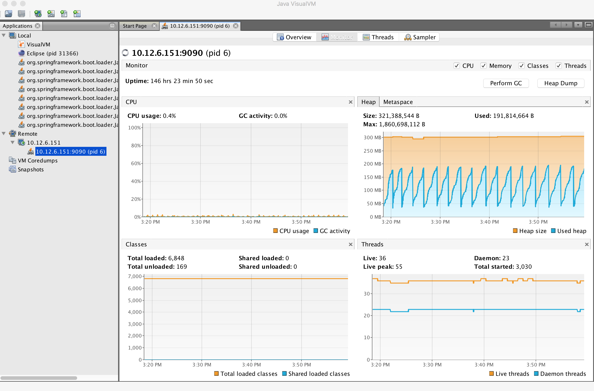

Test Plan
---------

The 72+ hours stability test will be running the following steps sequentially in multi-threaded loops.
Thread number is set to 5 to simulate 5 API clients' behaviors (they can be calling the same policy CRUD API simultaneously).

**Setup Thread (will be running only once)**
    
- Get policy-api Healthcheck
- Get API Counter Statistics
- Get Preloaded Policy Types

**API Test Flow (5 threads running the same steps in the same loop)**

- Create a new TCA Policy Type with Version 1.0.0
- Create a new TCA Policy Type with Version 2.0.0
- Create a new TCA Policy Type with Version 3.0.0
- Create a new TCA Policy Type with Version 4.0.0
- Create a new TCA Policy Type with Version 5.0.0
- Create a new TCA Policy Type with Version 6.0.0
- Create a new TCA Policy Type with Version 7.0.0
- Create a new TCA Policy Type with Version 8.0.0
- Create a new TCA Policy Type with Version 9.0.0
- Create a new TCA Policy Type with Version 10.0.0
- Create a new TCA Policy Type with Version 11.0.0
- A 10 sec timer
- Get All Existing Policy Types
- Get All Existing Versions of the New TCA Policy Type
- Get Version 1.0.0 of the New TCA Policy Type
- Get Version 2.0.0 of the New TCA Policy Type
- Get Version 3.0.0 of the New TCA Policy Type
- Get Version 4.0.0 of the New TCA Policy Type
- Get Version 5.0.0 of the New TCA Policy Type
- Get Version 6.0.0 of the New TCA Policy Type
- Get Version 7.0.0 of the New TCA Policy Type
- Get Version 8.0.0 of the New TCA Policy Type
- Get Version 9.0.0 of the New TCA Policy Type
- Get Version 10.0.0 of the New TCA Policy Type
- Get Version 11.0.0 of the New TCA Policy Type
- Get the Latest Version of the New TCA Policy Type
- A 10 sec timer
- Create a New TCA Policy with Version 1.0.0 over the New TCA Policy Type Version 2.0.0
- Create a New TCA Policy with Version 2.0.0 over the New TCA Policy Type Version 2.0.0
- Create a New TCA Policy with Version 3.0.0 over the New TCA Policy Type Version 2.0.0
- Create a New TCA Policy with Version 4.0.0 over the New TCA Policy Type Version 2.0.0
- Create a New TCA Policy with Version 5.0.0 over the New TCA Policy Type Version 2.0.0
- Create a New TCA Policy with Version 6.0.0 over the New TCA Policy Type Version 2.0.0
- Create a New TCA Policy with Version 7.0.0 over the New TCA Policy Type Version 2.0.0
- Create a New TCA Policy with Version 8.0.0 over the New TCA Policy Type Version 2.0.0
- Create a New TCA Policy with Version 9.0.0 over the New TCA Policy Type Version 2.0.0
- Create a New TCA Policy with Version 10.0.0 over the New TCA Policy Type Version 2.0.0
- Create a New TCA Policy with Version 11.0.0 over the New TCA Policy Type Version 2.0.0
- A 10 sec Timer
- Get All Existing TCA Policies
- Get All Existing Versions of TCA Policies
- Get Version 1.0.0 of the New TCA Policy
- Get Version 2.0.0 of the New TCA Policy
- Get Version 3.0.0 of the New TCA Policy
- Get Version 4.0.0 of the New TCA Policy
- Get Version 5.0.0 of the New TCA Policy
- Get Version 6.0.0 of the New TCA Policy
- Get Version 7.0.0 of the New TCA Policy
- Get Version 8.0.0 of the New TCA Policy
- Get Version 9.0.0 of the New TCA Policy
- Get Version 10.0.0 of the New TCA Policy
- Get Version 11.0.0 of the New TCA Policy
- Get the Latest Version of the New TCA Policy
- A 10 sec Timer
- Create a New Guard Policy with Version 1
- Create a New Guard Policy with Version 5
- Create a New Guard Policy with Version 9
- Create a New Guard Policy with Version 12
- A 10 sec Timer
- Get Version 1 of the New Guard Policy
- Get Version 5 of the New Guard Policy
- Get Version 9 of the New Guard Policy
- Get Version 12 of the New Guard Policy
- Get the Latest Version of the New Guard Policy
- A 10 sec Timer

**TearDown Thread (will only be running after API Test Flow is completed)**

- Delete Version 2.0.0 of the New TCA Policy Type (suppose to return 409-Conflict)
- Delete Version 3.0.0 of the New TCA Policy Type
- Delete Version 4.0.0 of the New TCA Policy Type
- Delete Version 5.0.0 of the New TCA Policy Type
- Delete Version 6.0.0 of the New TCA Policy Type
- Delete Version 7.0.0 of the New TCA Policy Type
- Delete Version 8.0.0 of the New TCA Policy Type
- Delete Version 9.0.0 of the New TCA Policy Type
- Delete Version 10.0.0 of the New TCA Policy Type
- Delete Version 11.0.0 of the New TCA Policy Type
- Delete Version 1.0.0 of the New TCA Policy
- Delete Version 2.0.0 of the New TCA Policy
- Delete Version 3.0.0 of the New TCA Policy
- Delete Version 4.0.0 of the New TCA Policy
- Delete Version 5.0.0 of the New TCA Policy
- Delete Version 6.0.0 of the New TCA Policy
- Delete Version 7.0.0 of the New TCA Policy
- Delete Version 8.0.0 of the New TCA Policy
- Delete Version 9.0.0 of the New TCA Policy
- Delete Version 10.0.0 of the New TCA Policy
- Delete Version 11.0.0 of the New TCA Policy
- Re-Delete Version 2.0.0 of the New TCA Policy Type (will return 200 now since all TCA policies created over have been deleted)
- Delete Version 1 of the new Guard Policy
- Delete Version 5 of the new Guard Policy
- Delete Version 9 of the new Guard Policy
- Delete Version 12 of the new Guard Policy

Run Test
--------

**Local Machine**

Connect to lab VPN

.. code-block:: bash
    
    $ sudo openvpn --config <path to lab ovpn key file>
    
SSH into JMeter VM (VM1)

.. code-block:: bash

    $ ssh -i <path to lab ssh key file> ubuntu@<host ip of JMeter VM>

Run JMeter test in background for 72+ hours

.. code-block:: bash
  
    $ mkdir s3p
    $ nohup ./jMeter/apache-jmeter-5.1.1/bin/jmeter.sh -n -t ~/api/testsuites/stability/src/main/resources/testplans/policy_api_stability.jmx &

(Optional) Monitor JMeter test that is running in background (anytime after re-logging into JMeter VM - VM1)

.. code-block:: bash

    $ tail -f s3p/stability.log nohup.out

Test Results
------------

**Summary**

Policy API stability test plan was triggered and running for 72+ hours without any error occurred.

**Test Statistics**

=======================  =============  ===========  ===============================  ===============================  ===============================
**Total # of requests**  **Success %**  **Error %**  **Avg. time taken per request**  **Min. time taken per request**  **Max. time taken per request**
=======================  =============  ===========  ===============================  ===============================  ===============================
    49723                    100%           0%              86 ms                               4 ms                            795 ms
=======================  =============  ===========  ===============================  ===============================  ===============================

**VisualVM Results**

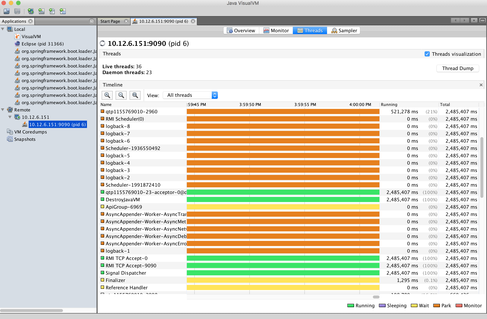

**JMeter Results**

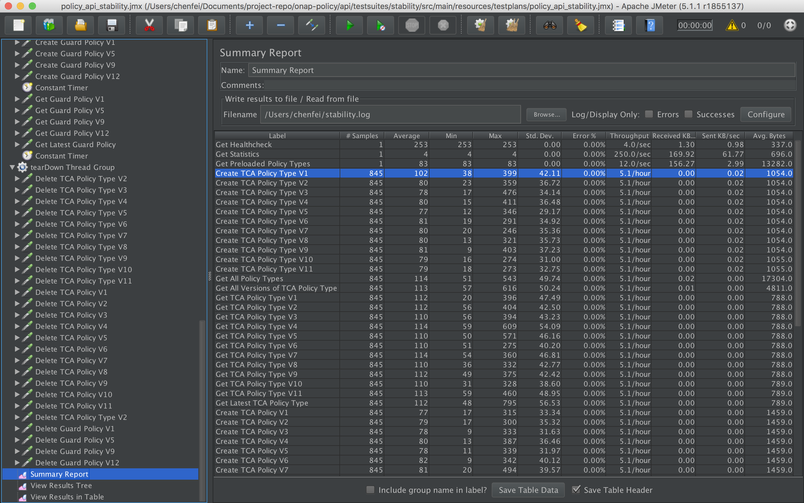
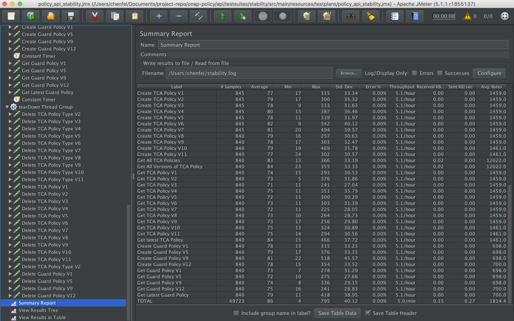
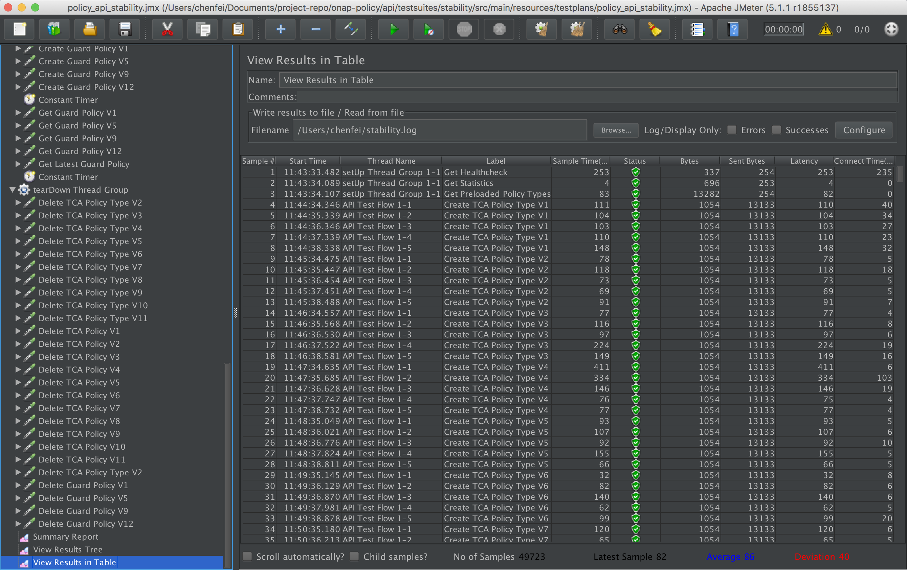
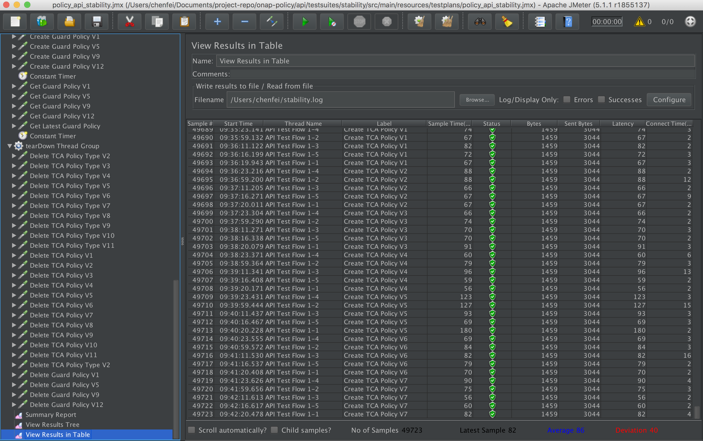

Performance Test of Policy API
++++++++++++++++++++++++++++++

Introduction
------------

Performance test of policy-api has the goal of testing the min/avg/max processing time and rest call throughput for all the requests when the number of requests are large enough to saturate the resource and find the bottleneck. 

Setup Details
-------------

The performance test is performed on OOM-based deployment of ONAP Policy framework components in Intel Wind River Lab environment.
In addition, we use another VM with JMeter installed to generate the transactions.
The JMeter VM will be sending large number of REST requests to the policy-api component and collecting the statistics.
Policy-api component already knows how to communicate with MariaDB component if OOM-based deployment is working correctly.

Test Plan
---------

Performance test plan is the same as stability test plan above.
Only differences are, in performance test, we increase the number of threads up to 20 (simulating 20 users' behaviors at the same time) whereas reducing the test time down to 1 hour. 

Run Test
--------

Running/Triggering performance test will be the same as stability test. That is, launch JMeter pointing to corresponding *.jmx* test plan. The *API_HOST* and *API_PORT* are already set up in *.jmx*.

Test Results
------------

Test results are shown as below. Overall, the test was running smoothly and successfully. We do see some minor failed transactions, especially in POST calls which intend to write into DB simultaneously in a multi-threaded fashion . All GET calls (reading from DB) were succeeded.

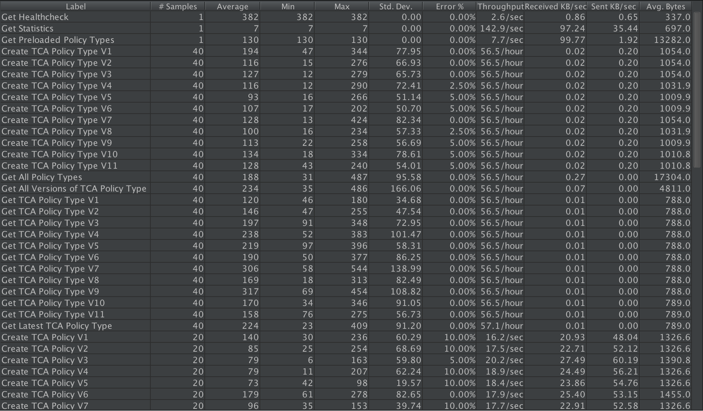
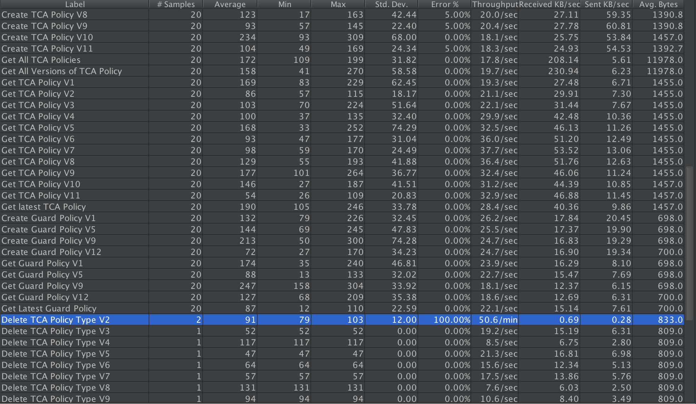
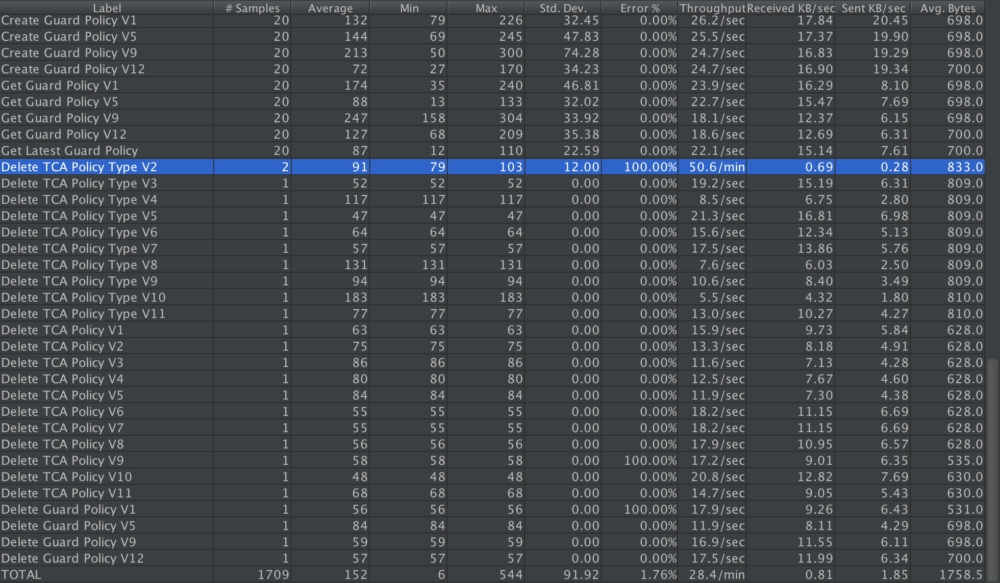
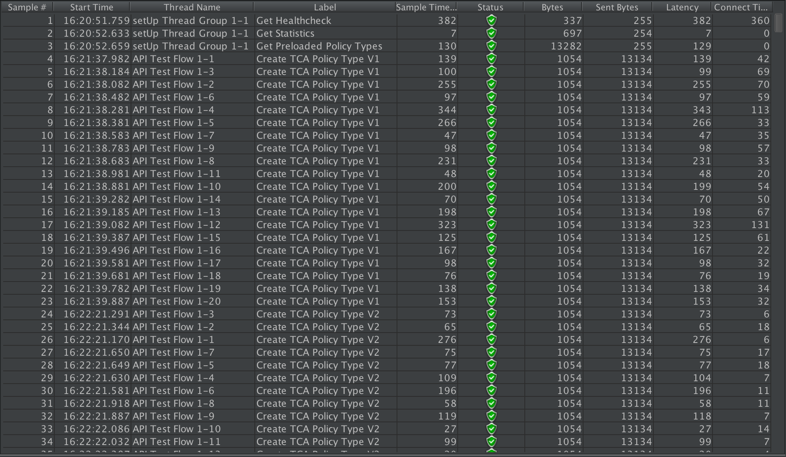
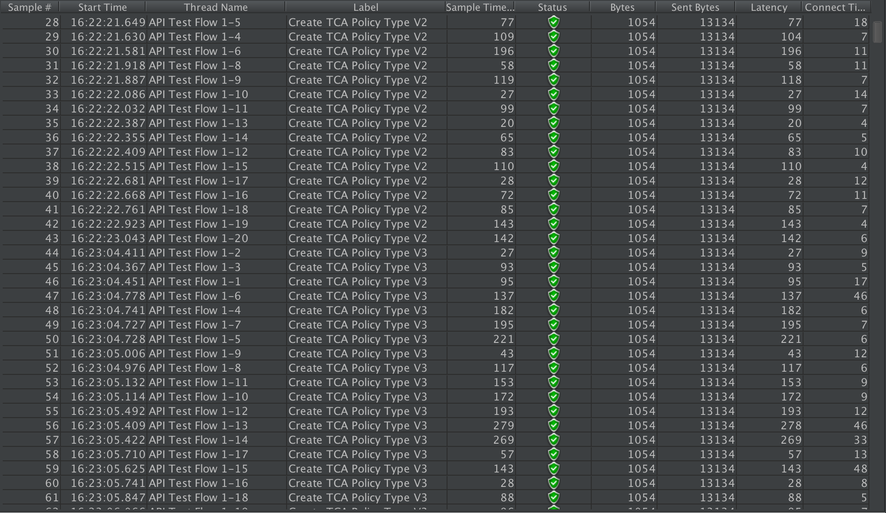
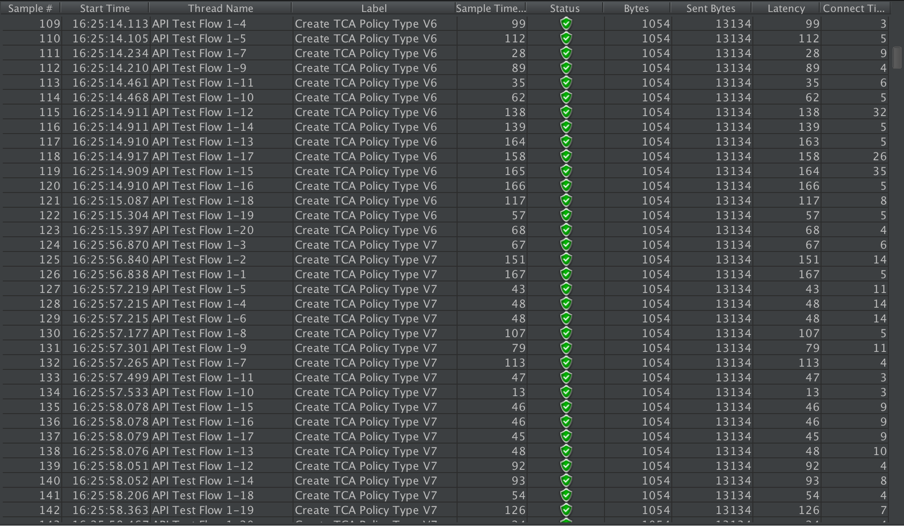
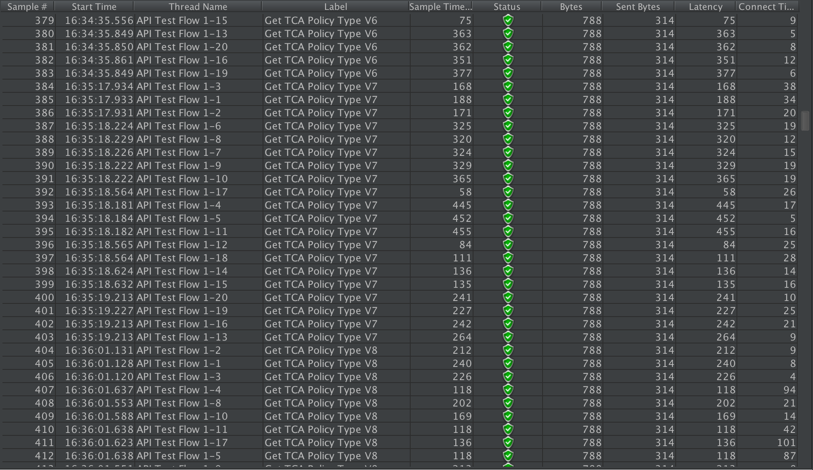
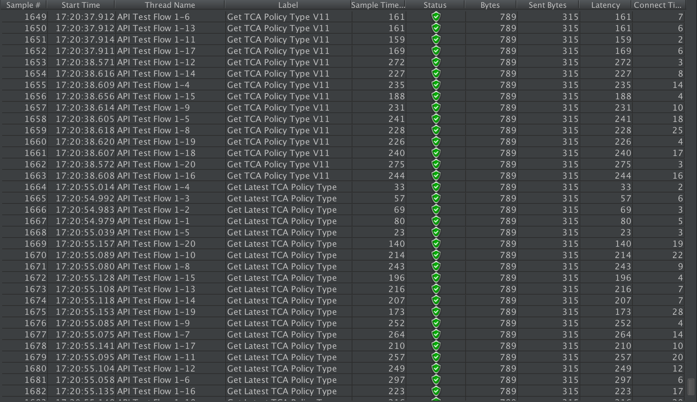
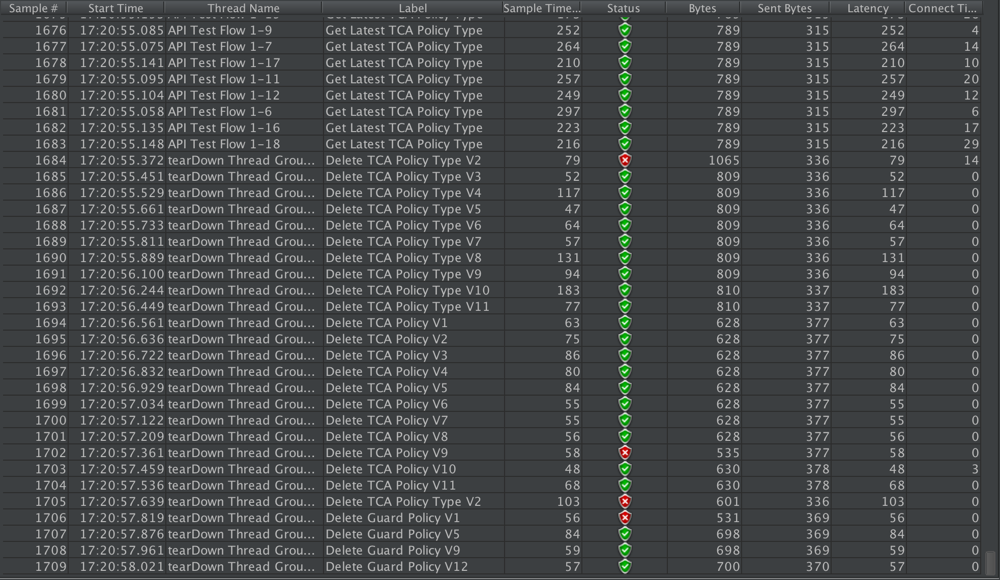

