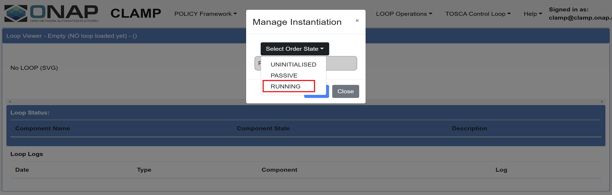
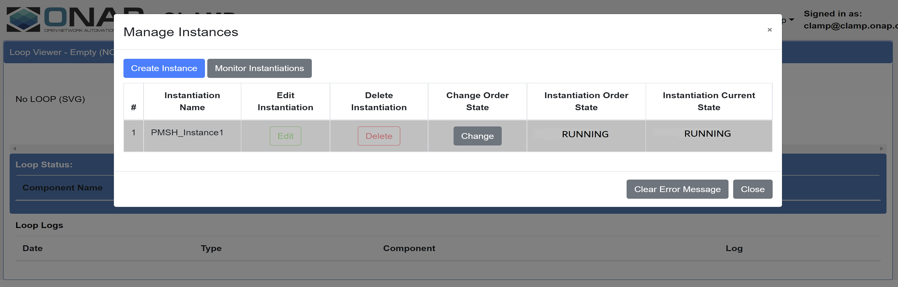

.. This work is licensed under a
.. Creative Commons Attribution 4.0 International License.
.. http://creativecommons.org/licenses/by/4.0

.. _clamp-pairwise-testing-label:

.. toctree::
   :maxdepth: 2

CLAMP <-> Policy Core
~~~~~~~~~~~~~~~~~~~~~

The pairwise testing is executed against a default ONAP installation in the OOM.
CLAMP-Control loop interacts with Policy framework to create and deploy policies.
This test verifies the interaction between policy and controlloop works as expected.

General Setup
*************

The kubernetes installation allocated all policy components across multiple worker node VMs.
The worker VM hosting the policy components has the following spec:

- 16GB RAM
- 8 VCPU
- 160GB Ephemeral Disk

The ONAP components used during the pairwise tests are:

- CLAMP control loop runtime, policy participant, kubernetes participant.
- DMaaP for the communication between Control loop runtime and participants.
- Policy API to create (and delete at the end of the tests) policies for each
  scenario under test.
- Policy PAP to deploy (and undeploy at the end of the tests) policies for each scenario under test.
- Policy Gui for instantiation and commissioning of control loops.

Testing procedure
*****************

The test set focused on the following use cases:

- creation/Deletion of policies
- Deployment/Undeployment of policies

Creation of the Control Loop:
-----------------------------
A Control Loop is created by commissioning a Tosca template with Control loop definitions and instantiating the Control Loop with the state "UNINITIALISED".

- Upload a TOSCA template from the POLICY GUI. The definitions includes a policy participant and a control loop element that creates and deploys required policies. :download:`Sample Tosca template <tosca/pairwise-testing.yml>`

  .. image:: images/cl-commission.png

  Verification: The template is commissioned successfully without errors.

- Instantiate the commissioned Control loop from the Policy Gui under 'Instantiation Management'.

  .. image:: images/create-instance.png

  Update instance properties of the Control Loop Elements if required.

  .. image:: images/update-instance.PNG

  Verification: The control loop is created with default state "UNINITIALISED" without errors.

  .. image:: images/cl-instantiation.png

Creation of policies:
---------------------
The Control Loop state is changed from "UNINITIALISED" to "PASSIVE" from the Policy Gui. Verify the POLICY API endpoint for the creation of policy types that are defined in the TOSCA template.

.. image:: images/cl-passive.png

Verification:

- The policy types defined in the tosca template is created by the policy participant and listed in the policy Api.
  Policy Api endpoint: `<https://<POLICY-API-IP>/policy/api/v1/policytypes>`

- The overall state of the Control Loop is changed to "PASSIVE" in the Policy Gui.

Deployment of policies:
-----------------------
The Control Loop state is changed from "PASSIVE" to "RUNNING" from the Policy Gui.

Verification:

- The policy participant deploys the policies of Tosca Control loop elements in Policy PAP for all the pdp groups.
  Policy PAP endpoint: `<https://<POLICY-PAP-IP>/policy/pap/v1/pdps>`

- The overall state of the Control Loop is changed to "RUNNING" in the Policy Gui.

Deletion of Policies:
---------------------
The Control Loop state is changed from "RUNNING" to "PASSIVE" from the Policy Gui.

Verification:

- The policy participant deletes the created policy types which can be verified on the Policy Api. The policy types created as part of the control loop should not be listed on the Policy Api.
  Policy Api endpoint: `<https://<POLICY-API-IP>/policy/api/v1/policytypes>`

- The overall state of the Control Loop is changed to "PASSIVE" in the Policy Gui.

Undeployment of policies:
-------------------------
The Control Loop state is changed from "PASSIVE" to "UNINITIALISED" from the Policy Gui.

Verification:

- The policy participant undeploys the policies of the control loop element from the pdp groups. The policies deployed as part of the control loop should not be listed on the Policy PAP.
  Policy PAP endpoint: `<https://<POLICY-PAP-IP>/policy/pap/v1/pdps>`

- The overall state of the Control Loop is changed to "UNINITIALISED" in the Policy Gui.

.. image:: images/cl-uninitialised-state.png
