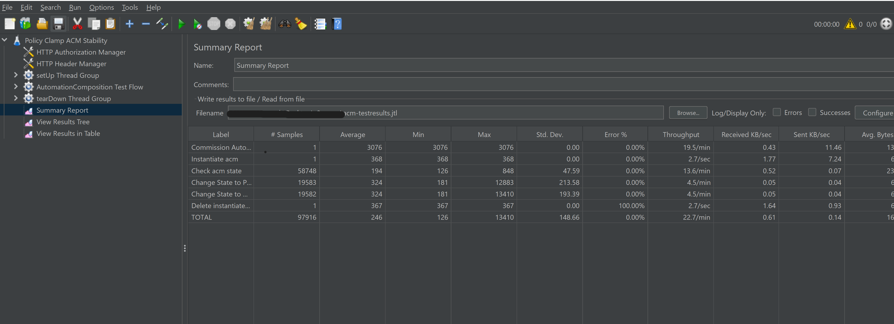
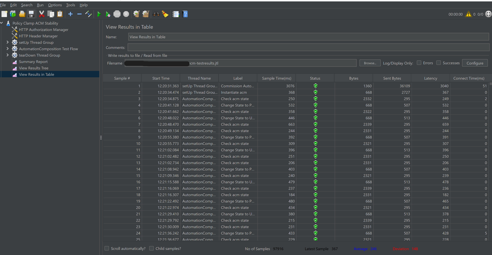
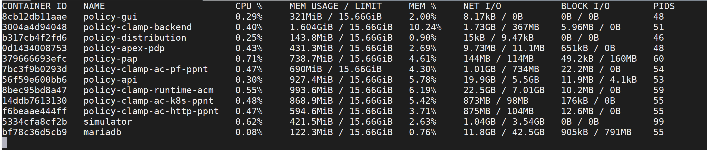

.. This work is licensed under a
.. Creative Commons Attribution 4.0 International License.
.. http://creativecommons.org/licenses/by/4.0

.. _acm-s3p-label:

.. toctree::
   :maxdepth: 2

Policy Clamp Automation Composition
~~~~~~~~~~~~~~~~~~~~~~~~~~~~~~~~~~~

Both the Performance and the Stability tests were executed by performing requests
against acm components installed as docker images in local environment.

ACM Deployment
++++++++++++++

The docker containers can be deployed via Policy CSIT script.
Clone the Policy/docker repo to the local vm

.. code-block:: bash

    git clone "https://gerrit.onap.org/r/policy/docker"

Set the following environment variables on the system before deploying the containers.

.. code-block:: bash

    export CONTAINER_LOCATION=nexus3.onap.org:10001/
    export PROJECT=clamp

Invoke the following script from the ~/docker/csit folder.

.. code-block:: bash

    ./start-all.sh

This script installs the docker containers of ACM and Policy components required for running the tests.

Jmeter setup
++++++++++++

Apache jmeter tool is installed either on the same virtual machine or on a different virtual machine.

.. code-block:: bash

    # Install required packages
    sudo apt install -y wget unzip

    # Install JMeter
    mkdir -p jmeter
    cd jmeter
    wget https://dlcdn.apache.org//jmeter/binaries/apache-jmeter-5.5.zip # check if valid version
    unzip -q apache-jmeter-5.5.zip
    rm apache-jmeter-5.5.zip

Setup Verification
++++++++++++++++++
Ensure the following components are up and running before executing the test.

- acm runtime component docker image is started and running.
- Participant docker images policy-clamp-cl-pf-ppnt, policy-clamp-cl-http-ppnt, policy-clamp-cl-k8s-ppnt are started and running.
- Dmaap simulator for communication between components.
- mariadb docker container for policy and clampacm database.
- policy-api for communication between policy participant and policy-framework
- Both tests were run via jMeter, which was installed on a separate VM.

Stability Test of acm components
++++++++++++++++++++++++++++++++

Test Plan
---------
The 72 hours stability test ran the following steps sequentially in a single threaded loop.

- **Create Policy defaultDomain** - creates an operational policy using policy/api component
- **Delete Policy sampleDomain** - deletes the operational policy sampleDomain using policy/api component
- **Commission AC definition** - commissions the acm definition in runtime
- **Instantiate acm** - Instantiate the acm towards participants
- **Check acm state** - check the current state of acm
- **Change State to PASSIVE** - change the state of the acm to PASSIVE
- **Check acm state** - check the current state of acm
- **Change State to UNINITIALISED** - change the state of the ACM to UNINITIALISED
- **Check acm state** - check the current state of acm
- **Delete instantiated acm** - delete the instantiated acm from all participants
- **Delete ACM Definition** - delete the acm definition on runtime

The following parameters can be configured on the JMX file for the test.

- **HTTP Authorization Manager** - used to store user/password authentication details.
- **HTTP Header Manager** - used to store headers which will be used for making HTTP requests.
- **User Defined Variables** -  used to store following user defined parameters.

=============================  ========================================================================
 **Name**                      **Description**
=============================  ========================================================================
 RUNTIME_HOST                  IP Address or host name of acm runtime component
 RUNTIME_PORT                  Port number of acm runtime components for making REST API calls
 POLICY_PARTICIPANT_HOST       IP Address or host name of policy participant
 POLICY_PARTICIPANT_HOST_PORT  Port number of policy participant
=============================  ========================================================================

Download the ACM stability.jmx and performance.jmx files from the Policy-Clamp repo.

Stability jmx file

.. code-block:: bash

    ~/clamp/testsuites/stability/src/main/resources/testplans/stability.jmx

The test was run in the background via "nohup", to prevent it from being interrupted:

.. code-block:: bash

    nohup ./jmeter/apache-jmeter-5.5/bin/jmeter -n -t stability.jmx -l testresults.jtl

Test Results
------------

**Summary**

Stability test plan was triggered for 72 hours.

.. Note::

              .. container:: paragraph
			  
                  The assertions of state changes are not completely taken care of, as the stability is ran with acm components
                  alone, and not including complete policy framework deployment, which makes it difficult for actual state changes from
                  PASSIVE to RUNNING etc to happen.

**Test Statistics**

=======================  =================  ==================  ==================================
**Total # of requests**  **Success %**      **Error %**         **Average time taken per request**
=======================  =================  ==================  ==================================
97916                    100.00 %           0.00 %              246 ms
=======================  =================  ==================  ==================================

**ACM component Setup**

================  ============================================================    ===========================================  =========================
**CONTAINER ID**  **IMAGE**                                                       **PORT**                                     **NAME**
================  ============================================================    ===========================================  =========================
 a9cb0cd103cf     nexus3.onap.org:10001/onap/policy-clamp-runtime-acm:latest      6969/tcp                                     policy-clamp-runtime-acm
 886e572b8438     nexus3.onap.org:10001/onap/policy-clamp-ac-pf-ppnt:latest       6969/tcp                                     policy-clamp-ac-pf-ppnt
 035707b1b95f     nexus3.onap.org:10001/onap/policy-api:latest                    6969/tcp                                     policy-api
 d34204f95ff3     nexus3.onap.org:10001/onap/policy-clamp-ac-http-ppnt:latest     6969/tcp                                     policy-clamp-ac-http-ppnt
 4470e608c9a8     nexus3.onap.org:10001/onap/policy-clamp-ac-k8s-ppnt:latest      6969/tcp                                     policy-clamp-ac-k8s-ppnt
 62229d46b79c     nexus3.onap.org:10001/onap/policy-models-simulator:latest       3905/tcp, 6666/tcp, 6668-6670/tcp, 6680/tcp  simulator
 efaf0ca5e1f0     nexus3.onap.org:10001/mariadb:10.5.8                            3306/tcp                                     mariadb
 e84cf17db2a4     nexus3.onap.org:10001/onap/policy-pap:latest                    6969/tcp                                     policy-pap
 0a16eecd13c9     nexus3.onap.org:10001/onap/policy-apex-pdp:latest               6969/tcp                                     policy-apex-pdp
================  ============================================================    ===========================================  =========================

.. Note::

              .. container:: paragraph

                  There were no failures during the 72 hours test.

**JMeter Screenshot**

**JMeter Screenshot**

**Memory and CPU usage**

The memory and CPU usage can be monitored by running "docker stats" command.

Memory and CPU usage after test execution:

Performance Test of acm components
++++++++++++++++++++++++++++++++++

Introduction
------------

Performance test of acm components has the goal of testing the min/avg/max processing time and rest call throughput for all the requests with multiple requests at the same time.

Setup Details
-------------

The performance test is performed on a similar setup as Stability test. The JMeter VM will be sending a large number of REST requests to the runtime component and collecting the statistics.

Test Plan
---------

Performance test plan is the same as the stability test plan above except for the few differences listed below.

- Increase the number of threads up to 5 (simulating 5 users' behaviours at the same time).
- Reduce the test time to 2 hours.

Run Test
--------

Performance jmx file

.. code-block:: bash

    ~/clamp/testsuites/performance/src/main/resources/testplans/performance.jmx

Running/Triggering the performance test will be the same as the stability test. That is, launch JMeter pointing to corresponding *.jmx* test plan. The *RUNTIME_HOST*, *RUNTIME_PORT*, *POLICY_PARTICIPANT_HOST*, *POLICY_PARTICIPANT_HOST_PORT* are already set up in *.jmx*

.. code-block:: bash

    nohup ./jmeter/apache-jmeter-5.5/bin/jmeter -n -t performance.jmx -l testresults.jtl

Once the test execution is completed, execute the below script to get the statistics:

.. code-block:: bash

    $ cd ./clamp/testsuites/performance/src/main/resources/testplans
    $ ./results.sh resultTree.log

Test Results
------------

Test results are shown as below.

**Test Statistics**

=======================  =================  ==================  ==================================
**Total # of requests**  **Success %**      **Error %**         **Average time taken per request**
=======================  =================  ==================  ==================================
13591                    100 %              0.00 %              249 ms
=======================  =================  ==================  ==================================

**ACM component Setup**

================  ============================================================    ===========================================  =========================
**CONTAINER ID**  **IMAGE**                                                       **PORT**                                     **NAME**
================  ============================================================    ===========================================  =========================
 a9cb0cd103cf     nexus3.onap.org:10001/onap/policy-clamp-runtime-acm:latest      6969/tcp                                     policy-clamp-runtime-acm
 886e572b8438     nexus3.onap.org:10001/onap/policy-clamp-ac-pf-ppnt:latest       6969/tcp                                     policy-clamp-ac-pf-ppnt
 035707b1b95f     nexus3.onap.org:10001/onap/policy-api:latest                    6969/tcp                                     policy-api
 d34204f95ff3     nexus3.onap.org:10001/onap/policy-clamp-ac-http-ppnt:latest     6969/tcp                                     policy-clamp-ac-http-ppnt
 4470e608c9a8     nexus3.onap.org:10001/onap/policy-clamp-ac-k8s-ppnt:latest      6969/tcp                                     policy-clamp-ac-k8s-ppnt
 62229d46b79c     nexus3.onap.org:10001/onap/policy-models-simulator:latest       3905/tcp, 6666/tcp, 6668-6670/tcp, 6680/tcp  simulator
 efaf0ca5e1f0     nexus3.onap.org:10001/mariadb:10.5.8                            3306/tcp                                     mariadb
 e84cf17db2a4     nexus3.onap.org:10001/onap/policy-pap:latest                    6969/tcp                                     policy-pap
 0a16eecd13c9     nexus3.onap.org:10001/onap/policy-apex-pdp:latest               6969/tcp                                     policy-apex-pdp
================  ============================================================    ===========================================  =========================

**JMeter Screenshot**

