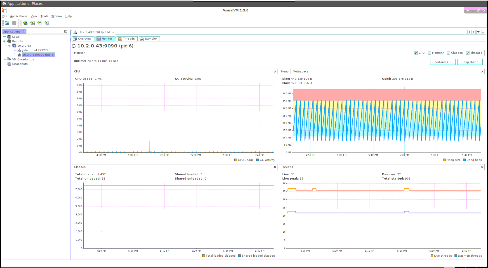
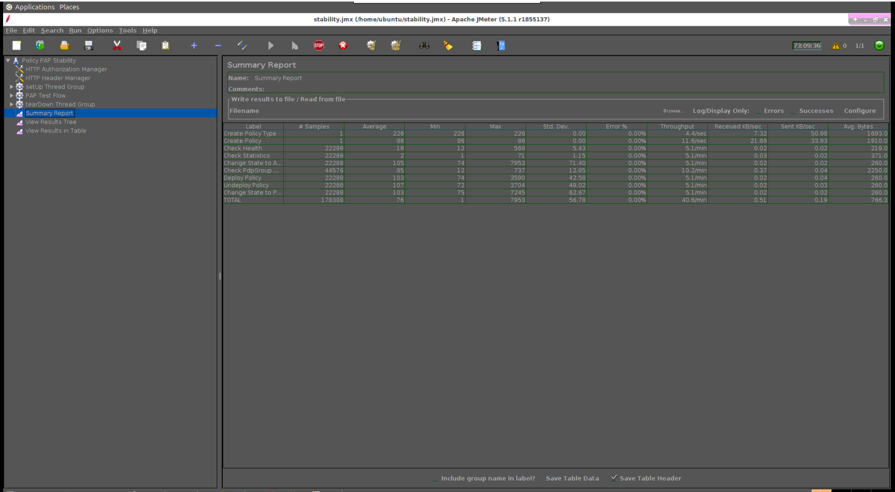

.. This work is licensed under a
.. Creative Commons Attribution 4.0 International License.
.. http://creativecommons.org/licenses/by/4.0

Policy Platform Development Tools
#################################

.. contents::
    :depth: 3

This article explains how to build the ONAP Policy Framework for development purposes and how to run stability/performance tests for a variety of components. To start, the developer should consult the latest ONAP Wiki to familiarize themselves with developer best practices and how-tos to setup their environment, see `https://wiki.onap.org/display/DW/Developer+Best+Practices`.

This article assumes that:

* You are using a *\*nix* operating system such as linux or macOS.
* You are using a directory called *git* off your home directory *(~/git)* for your git repositories
* Your local maven repository is in the location *~/.m2/repository*
* You have added settings to access the ONAP Nexus to your M2 configuration, see `Maven Settings Example <https://wiki.onap.org/display/DW/Setting+Up+Your+Development+Environment>`_ (bottom of the linked page)

The procedure documented in this article has been verified to work on a MacBook laptop running macOS Yosemite Version 10.10,5, Sierra Version 10.12.6, a HP Z600 desktop running Ubuntu 16.04.3 LTS, and an Unbuntu 16.04 VM.

Cloning All The Policy Repositories
***********************************

Run a script such as the script below to clone the required modules from the `ONAP git repository <https://gerrit.onap.org/r/#/admin/projects/?filter=policy>`_. This script clones all the ONAP Policy Framework repositories.

ONAP Policy Framework has dependencies to the ONAP Parent *oparent* module, the ONAP ECOMP SDK *ecompsdkos* module, and the A&AI Schema module.

.. code-block:: bash
   :caption: Typical ONAP Policy Framework Clone Script
   :linenos:

    #!/usr/bin/env bash

    ## script name for output
    MOD_SCRIPT_NAME=`basename $0`

    ## the ONAP clone directory, defaults to "onap"
    clone_dir="onap"

    ## the ONAP repos to clone
    onap_repos="\
    policy/parent \
    policy/common \
    policy/models \
    policy/docker \
    policy/api \
    policy/pap \
    policy/apex-pdp \
    policy/drools-pdp \
    policy/drools-applications \
    policy/xacml-pdp \
    policy/engine \
    policy/distribution"

    ##
    ## Help screen and exit condition (i.e. too few arguments)
    ##
    Help()
    {
        echo ""
        echo "$MOD_SCRIPT_NAME - clones all required ONAP git repositories"
        echo ""
        echo "       Usage:  $MOD_SCRIPT_NAME [-options]"
        echo ""
        echo "       Options"
        echo "         -d          - the ONAP clone directory, defaults to '.'"
        echo "         -h          - this help screen"
        echo ""
        exit 255;
    }

    ##
    ## read command line
    ##
    while [ $# -gt 0 ]
    do
        case $1 in
            #-d ONAP clone directory
            -d)
                shift
                if [ -z "$1" ]; then
                    echo "$MOD_SCRIPT_NAME: no clone directory"
                    exit 1
                fi
                clone_dir=$1
                shift
            ;;

            #-h prints help and exists
            -h)
                Help;exit 0;;

            *)    echo "$MOD_SCRIPT_NAME: undefined CLI option - $1"; exit 255;;
        esac
    done

    if [ -f "$clone_dir" ]; then
        echo "$MOD_SCRIPT_NAME: requested clone directory '$clone_dir' exists as file"
        exit 2
    fi
    if [ -d "$clone_dir" ]; then
        echo "$MOD_SCRIPT_NAME: requested clone directory '$clone_dir' exists as directory"
        exit 2
    fi

    mkdir $clone_dir
    if [ $? != 0 ]
    then
        echo cannot clone ONAP repositories, could not create directory '"'$clone_dir'"'
        exit 3
    fi

    for repo in $onap_repos
    do
        repoDir=`dirname "$repo"`
        repoName=`basename "$repo"`

        if [ ! -z $dirName ]
        then
            mkdir "$clone_dir/$repoDir"
            if [ $? != 0 ]
            then
                echo cannot clone ONAP repositories, could not create directory '"'$clone_dir/repoDir'"'
                exit 4
            fi
        fi

        git clone https://gerrit.onap.org/r/${repo} $clone_dir/$repo
    done

    echo ONAP has been cloned into '"'$clone_dir'"'

Execution of the script above results in the following directory hierarchy in your *~/git* directory:

    *  ~/git/onap
    *  ~/git/onap/policy
    *  ~/git/onap/policy/parent
    *  ~/git/onap/policy/common
    *  ~/git/onap/policy/models
    *  ~/git/onap/policy/api
    *  ~/git/onap/policy/pap
    *  ~/git/onap/policy/docker
    *  ~/git/onap/policy/drools-applications
    *  ~/git/onap/policy/drools-pdp
    *  ~/git/onap/policy/engine
    *  ~/git/onap/policy/apex-pdp
    *  ~/git/onap/policy/xacml-pdp
    *  ~/git/onap/policy/distribution

Building ONAP Policy Framework Components
*****************************************

**Step 1:** Optionally, for a completely clean build, remove the ONAP built modules from your local repository.

    .. code-block:: bash

        rm -fr ~/.m2/repository/org/onap

**Step 2:**  A pom such as the one below can be used to build the ONAP Policy Framework modules. Create the *pom.xml* file in the directory *~/git/onap/policy*.

.. code-block:: xml
   :caption: Typical pom.xml to build the ONAP Policy Framework
   :linenos:

    <project xmlns="http://maven.apache.org/POM/4.0.0" xmlns:xsi="http://www.w3.org/2001/XMLSchema-instance" xsi:schemaLocation="http://maven.apache.org/POM/4.0.0 http://maven.apache.org/xsd/maven-4.0.0.xsd">
        <modelVersion>4.0.0</modelVersion>
        <groupId>org.onap</groupId>
        <artifactId>onap-policy</artifactId>
        <version>1.0.0-SNAPSHOT</version>
        <packaging>pom</packaging>
        <name>${project.artifactId}</name>
        <inceptionYear>2017</inceptionYear>
        <organization>
            <name>ONAP</name>
        </organization>

        <modules>
            <module>parent</module>
            <module>common</module>
            <module>models</module>
            <module>api</module>
            <module>pap</module>
            <module>apex-pdp</module>
            <module>xacml-pdp</module>
            <module>drools-pdp</module>
            <module>drools-applications</module>
            <!-- The engine repo is being deprecated,
            and can be ommitted if not working with
            legacy api and components. -->
            <module>engine</module>
            <module>distribution</module>
        </modules>
    </project>

**Policy Architecture/API Transition**

In Dublin, a new Policy Architecture was introduced. The legacy architecture runs in parallel with the new architecture. It will be deprecated after Frankfurt release.
If the developer is only interested in working with the new architecture components, the engine sub-module can be ommitted.

**Step 3:** You can now build the Policy framework

    .. code-block:: bash

       cd ~/git/onap
       mvn clean install

Running the Stability/Performance Tests
***************************************

Policy API component
~~~~~~~~~~~~~~~~~~~~

72 Hours Stability Test of Policy API
+++++++++++++++++++++++++++++++++++++

Introduction
------------

The 72 hour stability test of policy API has the goal of verifying the stability of running policy design API REST service by 
ingesting a steady flow of transactions of policy design API calls in a multi-thread fashion to simulate multiple clients' behaviors. 
All the transaction flows are initiated from a test client server running JMeter for the duration of 72+ hours.

Setup Details
-------------

The stability test is performed on VMs running in Intel Wind River Lab environment.
There are 2 seperate VMs. One for running API while the other running JMeter & other necessary components, e.g. MariaDB, to simulate steady flow of transactions.
For simplicity, let's assume:

VM1 will be running JMeter, MariaDB.
VM2 will be running API REST service and visualVM.

**Lab Environment**

Intel ONAP Integration and Deployment Labs 
`Physical Labs <https://wiki.onap.org/display/DW/Physical+Labs>`_,
`Wind River <https://www.windriver.com/>`_

**API VM Details (VM2)**

OS: Ubuntu 18.04 LTS

CPU: 4 core

RAM: 8 GB

HardDisk: 91 GB

Docker Version: 18.09.8

Java: OpenJDK 1.8.0_212

**JMeter VM Details (VM1)**

OS: Ubuntu 18.04 LTS

CPU: 4 core

RAM: 8GB

HardDisk: 91GB

Docker Version: 18.09.8

Java: OpenJDK 1.8.0_212

JMeter: 5.1.1

**Software Installation & Configuration**

**VM1 & VM2 in lab**

**Install Java & Docker**

Make the etc/hosts entries

.. code-block:: bash
   
    $ echo $(hostname -I | cut -d\  -f1) $(hostname) | sudo tee -a /etc/hosts
    
Update the Ubuntu software installer

.. code-block:: bash
   
    $ sudo apt-get update
    
Check and install Java

.. code-block:: bash
   
    $ sudo apt-get install -y openjdk-8-jdk
    $ java -version
    
Ensure that the Java version executing is OpenJDK version 8
    
Check and install docker

.. code-block:: bash
    
    $ curl -fsSL https://download.docker.com/linux/ubuntu/gpg | sudo apt-key add -
    $ sudo add-apt-repository "deb [arch=amd64] https://download.docker.com/linux/ubuntu $(lsb_release -cs) stable"
    $ sudo apt-get update
    $ sudo apt-cache policy docker-ce
    $ sudo apt-get install -y docker-ce
    $ systemctl status docker
    $ docker ps

Change the permissions of the Docker socket file

.. code-block:: bash
   
    $ sudo chmod 777 /var/run/docker.sock

Check the status of the Docker service and ensure it is running correctly

.. code-block:: bash
   
    $ service docker status
    $ docker ps
    
**VM1 in lab**

**Install JMeter**

Download & install JMeter

.. code-block:: bash
   
    $ mkdir jMeter
    $ cd jMeter
    $ wget http://mirrors.whoishostingthis.com/apache//jmeter/binaries/apache-jmeter-5.1.1.zip
    $ unzip apache-jmeter-5.1.1.zip
    
**Install other necessary components**

Pull api code & run setup components script

.. code-block:: bash
   
    $ cd ~
    $ git clone https://git.onap.org/policy/api
    $ cd api/testsuites/stability/src/main/resources/simulatorsetup
    $ ./setup_components.sh
    
After installation, make sure the following mariadb container is up and running

.. code-block:: bash
   
    ubuntu@test:~/api/testsuites/stability/src/main/resources/simulatorsetup$ docker ps
    CONTAINER ID        IMAGE               COMMAND                  CREATED             STATUS              PORTS                    NAMES
    3849ce44b86d        mariadb:10.2.14     "docker-entrypoint.s…"   11 days ago         Up 11 days          0.0.0.0:3306->3306/tcp   mariadb

**VM2 in lab**

**Install policy-api**

Pull api code & run setup api script

.. code-block:: bash
   
    $ cd ~
    $ git clone https://git.onap.org/policy/api
    $ cd api/testsuites/stability/src/main/resources/apisetup
    $ ./setup_api.sh <host ip running api> <host ip running mariadb>

After installation, make sure the following api container is up and running

.. code-block:: bash
   
    ubuntu@tools-2:~/api/testsuites/stability/src/main/resources/apisetup$ docker ps
    CONTAINER ID        IMAGE                                                  COMMAND                  CREATED             STATUS              PORTS                                          NAMES
    4f08f9972e55        nexus3.onap.org:10001/onap/policy-api:2.1.1-SNAPSHOT   "bash ./policy-api.sh"   11 days ago         Up 11 days          0.0.0.0:6969->6969/tcp, 0.0.0.0:9090->9090/tcp   policy-api

**Install & configure visualVM**

VisualVM needs to be installed in the virtual machine having API up and running. It will be used to monitor CPU, Memory, GC for API while stability test is running.

Install visualVM

.. code-block:: bash
   
    $ sudo apt-get install visualvm
    
Run few commands to configure permissions

.. code-block:: bash
   
    $ cd /usr/lib/jvm/java-8-openjdk-amd64/bin/
    $ sudo touch visualvm.policy
    $ sudo chmod 777 visualvm.policy
      
    $ vi visualvm.policy
      
    Add the following in visualvm.policy
      
      
    grant codebase "file:/usr/lib/jvm/java-8-openjdk-amd64/lib/tools.jar" {
       permission java.security.AllPermission;
    };

Run following commands to start jstatd using port 1111

.. code-block:: bash
   
    $ cd /usr/lib/jvm/java-8-openjdk-amd64/bin/
    $ ./jstatd -p 1111 -J-Djava.security.policy=visualvm.policy  &
    
**Local Machine**

**Run & configure visualVM**

Run visualVM by typing

.. code-block:: bash
   
    $ jvisualvm
    
Connect to jstatd & remote policy-api JVM

    1. Right click on "Remote" in the left panel of the screen and select "Add Remote Host..."
    2. Enter the IP address of VM2 (running policy-api)
    3. Right click on IP address, select "Add JMX Connection..."
    4. Enter the VM2 IP Address (from step 2) <IP address>:9090 ( for example, 10.12.6.151:9090) and click OK.
    5. Double click on the newly added nodes under "Remote" to start monitoring CPU, Memory & GC.

Sample Screenshot of visualVM

.. image:: images/results-5.png

Test Plan
---------

The 72+ hours stability test will be running the following steps sequentially in multi-threaded loops.
Thread number is set to 5 to simulate 5 API clients' behaviors (they can be calling the same policy CRUD API simultaneously).

**Setup Thread (will be running only once)**
    
- Get policy-api Healthcheck
- Get API Counter Statistics
- Get Preloaded Policy Types

**API Test Flow (5 threads running the same steps in the same loop)**

- Create a new TCA Policy Type with Version 1.0.0
- Create a new TCA Policy Type with Version 2.0.0
- Create a new TCA Policy Type with Version 3.0.0
- Create a new TCA Policy Type with Version 4.0.0
- Create a new TCA Policy Type with Version 5.0.0
- Create a new TCA Policy Type with Version 6.0.0
- Create a new TCA Policy Type with Version 7.0.0
- Create a new TCA Policy Type with Version 8.0.0
- Create a new TCA Policy Type with Version 9.0.0
- Create a new TCA Policy Type with Version 10.0.0
- Create a new TCA Policy Type with Version 11.0.0
- A 10 sec timer
- Get All Existing Policy Types
- Get All Existing Versions of the New TCA Policy Type
- Get Version 1.0.0 of the New TCA Policy Type
- Get Version 2.0.0 of the New TCA Policy Type
- Get Version 3.0.0 of the New TCA Policy Type
- Get Version 4.0.0 of the New TCA Policy Type
- Get Version 5.0.0 of the New TCA Policy Type
- Get Version 6.0.0 of the New TCA Policy Type
- Get Version 7.0.0 of the New TCA Policy Type
- Get Version 8.0.0 of the New TCA Policy Type
- Get Version 9.0.0 of the New TCA Policy Type
- Get Version 10.0.0 of the New TCA Policy Type
- Get Version 11.0.0 of the New TCA Policy Type
- Get the Latest Version of the New TCA Policy Type
- A 10 sec timer
- Create a New TCA Policy with Version 1.0.0 over the New TCA Policy Type Version 2.0.0
- Create a New TCA Policy with Version 2.0.0 over the New TCA Policy Type Version 2.0.0
- Create a New TCA Policy with Version 3.0.0 over the New TCA Policy Type Version 2.0.0
- Create a New TCA Policy with Version 4.0.0 over the New TCA Policy Type Version 2.0.0
- Create a New TCA Policy with Version 5.0.0 over the New TCA Policy Type Version 2.0.0
- Create a New TCA Policy with Version 6.0.0 over the New TCA Policy Type Version 2.0.0
- Create a New TCA Policy with Version 7.0.0 over the New TCA Policy Type Version 2.0.0
- Create a New TCA Policy with Version 8.0.0 over the New TCA Policy Type Version 2.0.0
- Create a New TCA Policy with Version 9.0.0 over the New TCA Policy Type Version 2.0.0
- Create a New TCA Policy with Version 10.0.0 over the New TCA Policy Type Version 2.0.0
- Create a New TCA Policy with Version 11.0.0 over the New TCA Policy Type Version 2.0.0
- A 10 sec Timer
- Get All Existing TCA Policies
- Get All Existing Versions of TCA Policies
- Get Version 1.0.0 of the New TCA Policy
- Get Version 2.0.0 of the New TCA Policy
- Get Version 3.0.0 of the New TCA Policy
- Get Version 4.0.0 of the New TCA Policy
- Get Version 5.0.0 of the New TCA Policy
- Get Version 6.0.0 of the New TCA Policy
- Get Version 7.0.0 of the New TCA Policy
- Get Version 8.0.0 of the New TCA Policy
- Get Version 9.0.0 of the New TCA Policy
- Get Version 10.0.0 of the New TCA Policy
- Get Version 11.0.0 of the New TCA Policy
- Get the Latest Version of the New TCA Policy
- A 10 sec Timer
- Create a New Guard Policy with Version 1
- Create a New Guard Policy with Version 5
- Create a New Guard Policy with Version 9
- Create a New Guard Policy with Version 12
- A 10 sec Timer
- Get Version 1 of the New Guard Policy
- Get Version 5 of the New Guard Policy
- Get Version 9 of the New Guard Policy
- Get Version 12 of the New Guard Policy
- Get the Latest Version of the New Guard Policy
- A 10 sec Timer

**TearDown Thread (will only be running after API Test Flow is completed)**

- Delete Version 2.0.0 of the New TCA Policy Type (suppose to return 409-Conflict)
- Delete Version 3.0.0 of the New TCA Policy Type
- Delete Version 4.0.0 of the New TCA Policy Type
- Delete Version 5.0.0 of the New TCA Policy Type
- Delete Version 6.0.0 of the New TCA Policy Type
- Delete Version 7.0.0 of the New TCA Policy Type
- Delete Version 8.0.0 of the New TCA Policy Type
- Delete Version 9.0.0 of the New TCA Policy Type
- Delete Version 10.0.0 of the New TCA Policy Type
- Delete Version 11.0.0 of the New TCA Policy Type
- Delete Version 1.0.0 of the New TCA Policy
- Delete Version 2.0.0 of the New TCA Policy
- Delete Version 3.0.0 of the New TCA Policy
- Delete Version 4.0.0 of the New TCA Policy
- Delete Version 5.0.0 of the New TCA Policy
- Delete Version 6.0.0 of the New TCA Policy
- Delete Version 7.0.0 of the New TCA Policy
- Delete Version 8.0.0 of the New TCA Policy
- Delete Version 9.0.0 of the New TCA Policy
- Delete Version 10.0.0 of the New TCA Policy
- Delete Version 11.0.0 of the New TCA Policy
- Re-Delete Version 2.0.0 of the New TCA Policy Type (will return 200 now since all TCA policies created over have been deleted)
- Delete Version 1 of the new Guard Policy
- Delete Version 5 of the new Guard Policy
- Delete Version 9 of the new Guard Policy
- Delete Version 12 of the new Guard Policy

Run Test
--------

**Local Machine**

Connect to lab VPN

.. code-block:: bash
    
    $ sudo openvpn --config <path to lab ovpn key file>
    
SSH into JMeter VM (VM1)

.. code-block:: bash

    $ ssh -i <path to lab ssh key file> ubuntu@<host ip of JMeter VM>

Run JMeter test in background for 72+ hours

.. code-block:: bash
  
    $ mkdir s3p
    $ nohup ./jMeter/apache-jmeter-5.1.1/bin/jmeter.sh -n -t ~/api/testsuites/stability/src/main/resources/testplans/policy_api_stability.jmx &

(Optional) Monitor JMeter test that is running in background (anytime after re-logging into JMeter VM - VM1)

.. code-block:: bash

    $ tail -f s3p/stability.log nohup.out

Test Results
------------

**Summary**

Policy API stability test plan was triggered and running for 72+ hours without any error occurred.

**Test Statistics**

=======================  =============  ===========  ===============================  ===============================  ===============================
**Total # of requests**  **Success %**  **Error %**  **Avg. time taken per request**  **Min. time taken per request**  **Max. time taken per request**
=======================  =============  ===========  ===============================  ===============================  ===============================
    49723                    100%           0%              86 ms                               4 ms                            795 ms
=======================  =============  ===========  ===============================  ===============================  ===============================

**VisualVM Results**

.. image:: images/results-5.png
.. image:: images/results-6.png

**JMeter Results**

.. image:: images/results-1.png
.. image:: images/results-2.png
.. image:: images/results-3.png
.. image:: images/results-4.png

Performance Test of Policy API
++++++++++++++++++++++++++++++

Introduction
------------

Performance test of policy-api has the goal of testing the min/avg/max processing time and rest call throughput for all the requests when the number of requests are large enough to saturate the resource and find the bottleneck. 

Setup Details
-------------

The performance test is performed on OOM-based deployment of ONAP Policy framework components in Intel Wind River Lab environment.
In addition, we use another VM with JMeter installed to generate the transactions.
The JMeter VM will be sending large number of REST requests to the policy-api component and collecting the statistics.
Policy-api component already knows how to communicate with MariaDB component if OOM-based deployment is working correctly.

Test Plan
---------

Performance test plan is the same as stability test plan above.
Only differences are, in performance test, we increase the number of threads up to 20 (simulating 20 users' behaviors at the same time) whereas reducing the test time down to 1 hour. 

Run Test
--------

Running/Triggering performance test will be the same as stability test. That is, launch JMeter pointing to corresponding *.jmx* test plan. The *API_HOST* and *API_PORT* are already set up in *.jmx*.

Test Results
------------

Test results are shown as below. Overall, the test was running smoothly and successfully. We do see some minor failed transactions, especially in POST calls which intend to write into DB simultaneously in a multi-threaded fashion . All GET calls (reading from DB) were succeeded.

.. image:: images/summary-1.png
.. image:: images/summary-2.png
.. image:: images/summary-3.png
.. image:: images/result-1.png
.. image:: images/result-2.png
.. image:: images/result-3.png
.. image:: images/result-4.png
.. image:: images/result-5.png
.. image:: images/result-6.png

Policy PAP component
~~~~~~~~~~~~~~~~~~~~

72 Hours Stability Test of PAP
++++++++++++++++++++++++++++++

Introduction
------------

The 72 hour Stability Test for PAP has the goal of introducing a steady flow of transactions initiated from a test client server running JMeter for the duration of 72 hours.

Setup details
-------------

The stability test is performed on VM's running in OpenStack cloud environment.

There are 2 seperate VM's, one for running PAP & other one for running JMeter to simulate steady flow of transactions.

All the dependencies like mariadb, dmaap simulator, pdp simulator & policy/api component are installed in the VM having JMeter.

For simplicity lets assume

VM1 will be running JMeter, MariaDB, DMaaP simulator, PDP simulator & API component.

VM2 will be running only PAP component.

**OpenStack environment details**

Version: Mitaka

**PAP VM details (VM2)**

OS:Ubuntu 16.04 LTS

CPU: 4 core

RAM: 4 GB

HardDisk: 40 GB

Docker Version: 18.09.6

Java: openjdk version "1.8.0_212"

**JMeter VM details (VM1)**

OS: Ubuntu 16.04 LTS

CPU: 4 core

RAM: 4 GB

HardDisk: 40 GB

Docker Version: 18.09.6

Java: openjdk version "1.8.0_212"

JMeter: 5.1.1

Install Docker in VM1 & VM2
---------------------------

Make sure to execute below commands in VM1 & VM2 both.

Make the etc/hosts entries

.. code-block:: bash

    $ echo $(hostname -I | cut -d\  -f1) $(hostname) | sudo tee -a /etc/hosts
    
Make the DNS entries

.. code-block:: bash

    $ echo "nameserver <PrimaryDNSIPIP>" >> /etc/resolvconf/resolv.conf.d/head
    $ echo "nameserver <SecondaryDNSIP>" >> /etc/resolvconf/resolv.conf.d/head
    $ resolvconf -u
    
Update the ubuntu software installer

.. code-block:: bash

    $ apt-get update
    
Check and Install Java

.. code-block:: bash

    $ apt-get install -y openjdk-8-jdk
    $ java -version

Ensure that the Java version that is executing is OpenJDK version 8

Check and install docker

.. code-block:: bash

    $ curl -fsSL https://download.docker.com/linux/ubuntu/gpg | sudo apt-key add -
    $ add-apt-repository "deb [arch=amd64] https://download.docker.com/linux/ubuntu $(lsb_release -cs) stable"
    $ apt-get update
    $ apt-cache policy docker-ce
    $ apt-get install -y docker-ce
    $ systemctl status docker
    $ docker ps

Change the permissions of the Docker socket file

.. code-block:: bash

    $ chmod 777 /var/run/docker.sock
    
Check the status of the Docker service and ensure it is running correctly

.. code-block:: bash

    $ service docker status
    $ docker ps

Install JMeter in VM1
---------------------

Download & install JMeter

.. code-block:: bash

    $ mkdir jMeter
    $ cd jMeter
    $ wget http://mirrors.whoishostingthis.com/apache//jmeter/binaries/apache-jmeter-5.1.1.zip
    $ unzip apache-jmeter-5.1.1.zip

Run JMeter

.. code-block:: bash

    $ /home/ubuntu/jMeter/apache-jmeter-5.1.1/bin/jmeter

The above command will load the JMeter UI. Then navigate to File → Open → Browse and select the test plan jmx file to open. 
The jmx file is present in the policy/pap git repository.

Install simulators in VM1
-------------------------

For installing simulator, there is a script placed at `install simulator script <https://gerrit.onap.org/r/gitweb?p=policy/pap.git;a=blob;f=testsuites/stability/src/main/resources/simulatorsetup/setup_components.sh;h=86de3c1efcb468431a2395eef610db209a613fc3;hb=refs/heads/master>`_

Copy the script & all related files in virtual machine and run it.

After installation make sure that following 4 docker containers are up and running.

.. code-block:: bash

    root@policytest-policytest-3-p5djn6as2477:/home/ubuntu/simulator# docker ps
    CONTAINER ID        IMAGE                                   COMMAND                  CREATED             STATUS              PORTS                    NAMES
    887efa8dac12        nexus3.onap.org:10001/onap/policy-api   "bash ./policy-api.sh"   6 days ago          Up 6 days           0.0.0.0:6969->6969/tcp   policy-api
    0a931c0a63ac        pdp/simulator:latest                    "bash pdp-sim.sh"        6 days ago          Up 6 days                                    pdp-simulator
    a41adcb32afb        dmaap/simulator:latest                  "bash dmaap-sim.sh"      6 days ago          Up 6 days           0.0.0.0:3904->3904/tcp   dmaap-simulator
    d52d6b750ba0        mariadb:10.2.14                         "docker-entrypoint.s…"   6 days ago          Up 6 days           0.0.0.0:3306->3306/tcp   mariadb

Install PAP in VM2
------------------

For installing PAP, there is a script placed at `install pap script <https://gerrit.onap.org/r/gitweb?p=policy/pap.git;a=blob;f=testsuites/stability/src/main/resources/papsetup/setup_pap.sh;h=dc5e69e76da9f48f6b23cc012e14148f1373d1e1;hb=refs/heads/master>`_

Copy the script & all related files in virtual machine and run it.

After installation make sure that following docker container is up and running.

.. code-block:: bash

    root@policytest-policytest-0-uc3y2h5x6p4j:/home/ubuntu/pap# docker ps
    CONTAINER ID        IMAGE                                                         COMMAND                  CREATED             STATUS              PORTS                                            NAMES
    42ac0ed4b713        nexus3.onap.org:10001/onap/policy-pap:2.0.0-SNAPSHOT-latest   "bash ./policy-pap.sh"   3 days ago          Up 3 days           0.0.0.0:6969->6969/tcp, 0.0.0.0:9090->9090/tcp   policy-pap

Install & configure visualVM in VM2
-----------------------------------

visualVM needs to be installed in the virtual machine having PAP. It will be used to monitor CPU, Memory, GC for PAP while stability test is running.

Install visualVM

.. code-block:: bash

    $ sudo apt-get install visualvm
    
Run few commands to configure permissions

.. code-block:: bash

    $ cd /usr/lib/jvm/java-8-openjdk-amd64/bin/
    $ sudo touch visualvm.policy
    $ sudo chmod 777 visualvm.policy
     
    $ vi visualvm.policy
     
    Add the following in visualvm.policy
     
     
    grant codebase "file:/usr/lib/jvm/java-8-openjdk-amd64/lib/tools.jar" {
       permission java.security.AllPermission;
    };

Run following commands to start jstatd using port 1111

.. code-block:: bash

    $ cd /usr/lib/jvm/java-8-openjdk-amd64/bin/
    $ ./jstatd -p 1111 -J-Djava.security.policy=visualvm.policy  &
    
Run visualVM locally to connect to remote VM2

.. code-block:: bash

    # On your windows machine or your linux box locally, launch visualVM
    
Connect to jstatd & remote apex-pdp JVM

    1. Right click on "Remote" in the left panel of the screen and select "Add Remote Host..."
    2. Enter the IP address of VM2.
    3. Right click on IP address, select "Add JMX Connection..."
    4. Enter the VM2 IP Address (from step 2) <IP address>:9090 ( for example -10.12.6.201:9090) and click OK.
    5. Double click on the newly added nodes under "Remote" to start monitoring CPU, Memory & GC.

Sample Screenshot of visualVM

.. image:: images/pap-s3p-vvm-sample.png

Test Plan
---------

The 72 hours stability test will run the following steps sequentially in a single threaded loop.

- **Create Policy Type** - creates an operational policy type using policy/api component
- **Create Policy** - creates an operational policy using the policy type create in above step using policy/api component
- **Check Health** - checks the health status of pap
- **Check Statistics** - checks the statistics of pap
- **Change state to ACTIVE** - changes the state of PdpGroup to ACTIVE
- **Check PdpGroup Query** - makes a PdpGroup query request and verify that PdpGroup is in ACTIVE state.
- **Deploy Policy** - deploys the policy in PdpGroup
- **Undeploy Policy** - undeploy the policy from PdpGroup
- **Change state to PASSIVE** - changes the state of PdpGroup to PASSIVE
- **Check PdpGroup Query** - makes a PdpGroup query request and verify that PdpGroup is in PASSIVE state.
- **Delete Policy** - deletes the operational policy using policy/api component
- **Delete Policy Type** - deletes the operational policy type using policy/api component

The following steps can be used to configure the parameters of test plan.

- **HTTP Authorization Manager** - used to store user/password authentication details.
- **HTTP Header Manager** - used to store headers which will be used for making HTTP requests.
- **User Defined Variables** -  used to store following user defined parameters.

==========  ===============================================
 **Name**    **Description**
==========  ===============================================
 PAP_HOST     IP Address or host name of PAP component
 PAP_PORT     Port number of PAP for making REST API calls
 API_HOST     IP Address or host name of API component
 API_PORT     Port number of API for making REST API calls
==========  ===============================================

Screenshot of PAP stability test plan

.. image:: images/pap-s3p-testplan.png

Test Results
------------

**Summary**

Stability test plan was triggered for 72 hours.

**Test Statistics**

=======================  =================  ==================  ==================================
**Total # of requests**  **Success %**      **Error %**         **Average time taken per request**
=======================  =================  ==================  ==================================
178208                   100 %              0 %                 76 ms
=======================  =================  ==================  ==================================

**VisualVM Screenshot**

.. image:: images/pap-s3p-vvm-2.png

**JMeter Screenshot**

Policy XACML PDP component
~~~~~~~~~~~~~~~~~~~~~~~~~~

Performance Test of Policy XACML PDP
++++++++++++++++++++++++++++++++++++

Summary
-------

The Performance test was executed by performing requests against the Policy RESTful APIs residing on the XACML PDP installed in the windriver lab to get policy decisions for monitoring and guard policy types.  This was running on a kubernetes host having the following configuration:

- 16GB RAM
- 8 VCPU
- 160GB Disk

The performance test runs 10 simultaneous threads calling XACML PDP RESTful APIs to get decisions for Monitoring, Guard Min Max, and Guard Frequency Limiter policy types, with at duration of 6000 seconds.  The test execution lasted approximately 50 minutes resulting in the following summary:

- 37,305 Healthcheck requests
- 33,716 Statistics requests
- 25,294 Monitoring decision requests
- 25,288 Guard Min Max decisions
- 25,286 Guard Frequency Limiter requests

The average throughput was about 9.8 transactions per second. CPU and memory usage along with a screenshot of the JMeter Summary Report are provided in this document.

Results
-------

**CPU Utilization**

Total CPU used by the PDP was measured before and after the test, using "ps -l".

===================  ==================  ================  ===================  ===============  ==================
**Intial CPU time**  **Final CPU time**  **Intial CPU %**  **Intial Memory %**  **Final CPU %**  **Final Memory %**   
===================  ==================  ================  ===================  ===============  ==================
00:60:27             00:73:45            3.5%              4.0%                 94.12.3%         4.0%
===================  ==================  ================  ===================  ===============  ==================

**Memory Utilization**

.. code-block:: bash

    Number of young garbage collections used during the test: 518
    Avg. Young garbage collection time: ~11.56ms per collection
    Total number of Full garbage collection: 32
    Avg. Full garbage collection time: ~315.06ms per collection
     
    
     S0C         S1C        S0U    S1U      EC              EU             OC              OU            MC          MU         CCSC      CCSU     YGC     YGCT    FGC     FGCT     GCT  
    
    16768.0   16768.0  0.0   5461.0    134144.0    71223.6   334692.0     138734.5    50008.0   48955.8  5760.0    5434.3   4043    45.793  32        10.082   55.875
    
    16768.0   16768.0  0.0   4993.4    134144.0    66115.7   334692.0     252887.4    50264.0   49036.5  5760.0    5439.7   4561    53.686  32        10.082   63.768

**Jmeter Results Summary**

.. image:: images/xacml-s3p.PNG

Policy Drools PDP component
~~~~~~~~~~~~~~~~~~~~~~~~~~~

Policy APEX PDP component
~~~~~~~~~~~~~~~~~~~~~~~~~

Setting up Stability Tests in APEX
++++++++++++++++++++++++++++++++++

Introduction
------------

The 72 hour Stability Test for apex-pdp has the goal of introducing a steady flow of transactions initiated from a test client server running JMeter. The pdp is configured to start a rest server inside it and take input from rest clients (JMeter) and send back output to the rest clients (JMeter).

The input events will be submitted through rest interface of apex-pdp and the results are verified using the rest responses coming out from apex-pdp.

The test will be performed in a multi-threaded environment where 20 threads running in JMeter will keep sending events to apex-pdp in every 500 milliseconds for the duration of 72 hours.

Setup details
-------------

The stability test is performed on VM's running in OpenStack cloud environment. There are 2 seperate VM's, one for running apex pdp & other one for running JMeter to simulate steady flow of transactions.

**OpenStack environment details**

Version: Mitaka

**apex-pdp VM details**

OS:Ubuntu 16.04.5 LTS

CPU: 4 core

RAM: 4 GB

HardDisk: 40 GB

Docker Version: 18.06.1-ce, build e68fc7a

Java: openjdk version "1.8.0_181"

**JMeter VM details**

OS: Ubuntu 16.04.3 LTS

CPU: 4 core

RAM: 4 GB

HardDisk: 40 GB

Java: openjdk version "1.8.0_181"

JMeter: 5.1.1

Install JMeter in virtual machine
---------------------------------

Make the etc/hosts entries

.. code-block:: bash
    
    echo $(hostname -I | cut -d\  -f1) $(hostname) | sudo tee -a /etc/hosts
    
Make the DNS entries

.. code-block:: bash

    echo "nameserver <PrimaryDNSIPIP>" >> sudo /etc/resolvconf/resolv.conf.d/head
      
    echo "nameserver <SecondaryDNSIP>" >> sudo /etc/resolvconf/resolv.conf.d/head
      
    resolvconf -u

Update the ubuntu software installer

.. code-block:: bash

    apt-get update
    
Check & Install Java

.. code-block:: bash

    apt-get install -y openjdk-8-jdk
  
    java -version

Download & install JMeter

.. code-block:: bash

    mkdir jMeter
     
     
    cd jMeter
     
     
    wget http://mirrors.whoishostingthis.com/apache//jmeter/binaries/apache-jmeter-5.1.1.zip
     
     
    unzip apache-jmeter-5.1.1.zip 

Install apex-pdp in virtual machine
-----------------------------------

We will be running apex-pdp as docker container. So we need to first install docker and then create the container hosting apex-pdp by pulling the image from ONAP repository.

**Docker Installation**

1. Make the etc/hosts entries

.. code-block:: bash

    echo $(hostname -I | cut -d\  -f1) $(hostname) | sudo tee -a /etc/hosts
    
2. Make the DNS entries

.. code-block:: bash

    echo "nameserver <PrimaryDNSIPIP>" >> sudo /etc/resolvconf/resolv.conf.d/head
    echo "nameserver <SecondaryDNSIP>" >> sudo /etc/resolvconf/resolv.conf.d/head
    resolvconf -u

3. Update the ubuntu software installer

.. code-block:: bash

    apt-get update

4. Check and Install Java

.. code-block:: bash

    apt-get install -y openjdk-8-jdk
    java -version

Ensure that the Java version that is executing is OpenJDK version 8

5. Check and install docker

.. code-block:: bash

    curl -fsSL https://download.docker.com/linux/ubuntu/gpg | sudo apt-key add -
    add-apt-repository "deb [arch=amd64] https://download.docker.com/linux/ubuntu $(lsb_release -cs) stable"
    apt-get update
    apt-cache policy docker-ce
    apt-get install -y docker-ce
    systemctl status docker
    docker ps

6. Change the permissions of the Docker socket file

.. code-block:: bash

    chmod 777 /var/run/docker.sock

7. Check the status of the Docker service and ensure it is running correctly

.. code-block:: bash

    service docker status
    docker ps

**Install apex-pdp**

Run the below command to create the container hosting apex-pdp by pulling the image from ONAP repository.

.. code-block:: bash

    docker run -d --name apex -p 12561:12561 -p 23324:23324 -it nexus3.onap.org:10001/onap/policy-apex-pdp:2.1.0-latest /bin/bash -c "/opt/app/policy/apex-pdp/bin/apexApps.sh jmx-test -c /opt/app/policy/apex-pdp/examples/config/SampleDomain/RESTServerJsonEvent.json"
    docker ps

Note: If you observe that requests from JMeter client is failing due to timeout, then modify the "RESTServerJsonEvent.json" mentioned in the above command and increase the "synchronousTimeout" property as per needed.

Install & Configure VisualVM
----------------------------

VisualVM needs to be installed in the virtual machine having apex-pdp. It will be used to monitor CPU, Memory, GC for apex-pdp while stability test is running.

Install visualVM

.. code-block:: bash

    sudo apt-get install visualvm

Login to docker container (using root)

.. code-block:: bash

    docker exec -u 0 -it apex /bin/bash
    
Run few commands to configure permissions

.. code-block:: bash

    cd /usr/lib/jvm/java-1.8-openjdk/bin/
 
    touch visualvm.policy
     
    vi visualvm.policy
     
    Add the following in visualvm.policy
     
     
    grant codebase "file:/usr/lib/jvm/java-1.8-openjdk/lib/tools.jar" {
       permission java.security.AllPermission;
    };
     
     
    chmod 777 visualvm.policy
     
     
    exit

Login to docker container (using normal user)

.. code-block:: bash

    docker exec -it apex /bin/bash

Run following commands to start jstatd using port 1111

.. code-block:: bash

    cd /usr/lib/jvm/java-1.8-openjdk/bin/
     
     
    ./jstatd -p 1111 -J-Djava.security.policy=visualvm.policy  &
     
     
    exit

Login to VM using graphical interface in separate terminal window.

.. code-block:: bash

    ssh -X <user>@<VM-IP-ADDRESS>

Open visualVM

.. code-block:: bash

    visualvm &
    
Connect to jstatd & remote apex-pdp JVM

1. Right click on "Remote" in the left panel of the screen and select "Add Remote Host..."

2. Enter the IP address of apex-pdp docker container.

.. code-block:: bash
    
    docker inspect -f '{{range .NetworkSettings.Networks}}{{.IPAddress}}{{end}}' container_name_or_id

3. Right click on IP address, select "Add jstatd Connection..."
4. In "jstatd Connections" tab, enter port 1111 and click OK.
5. Right click on IP address, select "Add JMX Connection..."
6. Enter the apex-pdp docker container IP Address (from step 2) <IP address>:9911 ( for example - 172.17.0.2:9911) and click OK.
7. Double click on the newly added nodes under "Remote" to start monitoring CPU, Memory & GC.

Sample Screenshot of visualVM

.. image:: images/apex-s3p-vvm-sample.jpg

Test Plan
---------

The 72 hours stability test will run the following steps in 20 threaded loop.

- **Send Input Event** - sends an input message to rest interface of apex-pdp.
- **Assert Response Code** - assert the response code coming from apex-pdp.
- **Assert Response Message** - assert the response message coming from apex-pdp.

The following steps can be used to configure the parameters of test plan.

- **HTTP Header Manager** - used to store headers which will be used for making HTTP requests.
- **HTTP Request Defaults** -  used to store HTTP request details like Server Name or IP, Port, Protocol etc.
- **User Defined Variables** -  used to store following user defined parameters.

==================  ============================================================================  ============================
**Name**            **Description**                                                               **Default Value**
==================  ============================================================================  ============================
wait	            Wait time after each request (in milliseconds)	                              500
threads	            Number of threads to run test cases in parallel.	                          20
threadsTimeOutInMs	Synchronization timer for threads running in parallel (in milliseconds).	  5000
==================  ============================================================================  ============================

Download and update the jmx file presented in the apex-pdp git repository - `jmx file path <https://gerrit.onap.org/r/gitweb?p=policy/apex-pdp.git;a=tree;f=testsuites/apex-pdp-stability/src/main/resources;h=99d373033a190a690d4e05012bc3a656cae7bc3f;hb=refs/heads/master>`_.

- HTTPSampler.domain - The ip address of VM which the apex container is running
- HTTPSampler.port - The  listening port, here is 23324
- ThreadGroup.druation - Set the duration to 72 hours (in seconds)

Use the CLI mode to start the test

.. code-block:: bash

    ./jmeter.sh -n -t ~/apexPdpStabilityTestPlan.jmx -Jusers=1 -l ~/stability.log

Stability Test Result
---------------------

**Summary**

Stability test plan was triggered for 72 hours injecting input events to apex-pdp from 20 client threads running in JMeter.

After the test stop, we can generate a HTML test report via command

.. code-block:: bash

    ~/jMeter/apache-jmeter-5.1.1/bin/jmeter -g stability.log -o ./result/

==============================================  ===================================================  ================================  =============  ============
**Number of Client Threads running in JMeter**  **Number of Server Threads running in Apex engine**  **Total number of input events**  **Success %**  **Error %**
==============================================  ===================================================  ================================  =============  ============
20                                              4                                                    6394602                           99.999971%     0.0029%
==============================================  ===================================================  ================================  =============  ============

:download:`result.zip <zip/result.zip>`
:download:`onap.zip <zip/onap.zip>`

Setting up Performance Tests in APEX
++++++++++++++++++++++++++++++++++++

The apex-pdp has built in support for performance testing. A special performance testing REST server is available in the code base for performance testing. 
It is in the module `performance-benchmark-test <https://github.com/onap/policy-apex-pdp/tree/master/testsuites/performance/performance-benchmark-test>`_. 
To execute a benchmark test, you start the REST server, and then configure and run APEX against the server. 
There are example configurations for running tests in the `resources of this module <https://github.com/onap/policy-apex-pdp/tree/master/testsuites/performance/performance-benchmark-test/src/main/resources/examples/benchmark>`_.

In order to run the test for 72 hours, set the batch count in the `EventGeneratorConfig.json <https://github.com/onap/policy-apex-pdp/blob/master/testsuites/performance/performance-benchmark-test/src/main/resources/examples/benchmark/EventGeneratorConfig.json>`_ file to zero, which causes the REST server to generate batches forever.

Here is an example of how to do this:

1. Clone and build the apex-pdp git repo

2. Go into the performance-benchmark-test module and run the REST server

.. code-block:: bash

    cd testsuites/performance/performance-benchmark-test
    mvn exec:java -Dexec.mainClass="org.onap.policy.apex.testsuites.performance.benchmark.eventgenerator.EventGenerator" -Dexec.args="-c  src/main/resources/examples/benchmark/EventGeneratorConfig.json"

3. Separately, create a local directory and unzip the APEX tarball

.. code-block:: bash

    mkdir apex
    cd apex
    tar zxvf ~/git/onap/policy/apex-pdp/packages/apex-pdp-package-full/target/*gz
    
4. Run APEX with a configuration that runs against the benchmark REST server, select the configuration that is appropriate for the number of threads for the number of cores on the host on which APEX is running. For example on a 32 core machine, select the "32" configuration, on an 8 core machine, select the "08" configuration.

.. code-block:: bash

    bin/apexApps.sh engine -c ~/git/onap/policy/apex-pdp/testsuites/performance/performance-benchmark-test/src/main/resources/examples/benchmark/Javascript64.json
 
5. To get the test results, Issue the following command using CURL or from a browser(also can store the result into a file by setting outfile in the `EventGeneratorConfig.json <https://github.com/onap/policy-apex-pdp/blob/master/testsuites/performance/performance-benchmark-test/src/main/resources/examples/benchmark/EventGeneratorConfig.json>`_ file, statistics would be written into this file after event generator terminated)
 
.. code-block:: bash

    curl http://localhost:32801/EventGenerator/Stats
    
The results are similar to those below:
 
:download:`Example APEX performance metrics <json/example-apex-perf.json>`

Performance Test Result
-----------------------

**Summary**

Performance test was triggered for 2 hours on a 4 core, 4GB RAM virtual machine. 

**Test Statistics**

:download:`Attached result log <json/result.json>`

===============  =============  =================  ==============  =====================  ==================  =============  ===========
**batchNumber**  **batchSize**  **eventsNotSent**  **eventsSent**  **eventsNotReceived**  **eventsReceived**  **Success %**  **Error %**
===============  =============  =================  ==============  =====================  ==================  =============  ===========
3650             182500         0                  182500          0                      182500              100 %          0 %
===============  =============  =================  ==============  =====================  ==================  =============  ===========

========================  =========================  ========================
**averageRoundTripNano**  **shortestRoundTripNano**  **longestRoundTripNano**
========================  =========================  ========================
40024623                  7439158                    5161374486              
========================  =========================  ========================

============================  =============================  ============================
**averageApexExecutionNano**  **shortestApexExecutionNano**  **longestApexExecutionNano**
============================  =============================  ============================
1335622                       513650                         5104326434                  
============================  =============================  ============================
