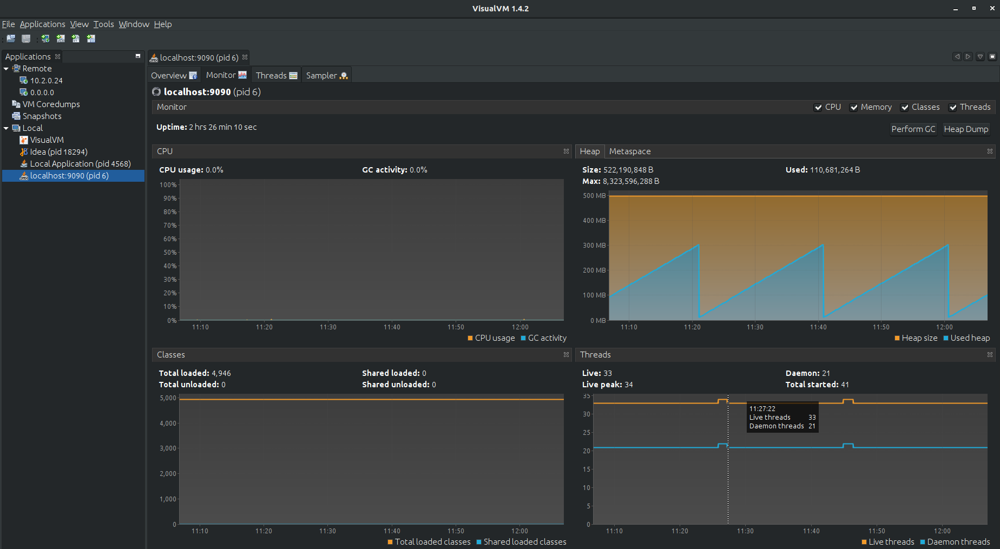
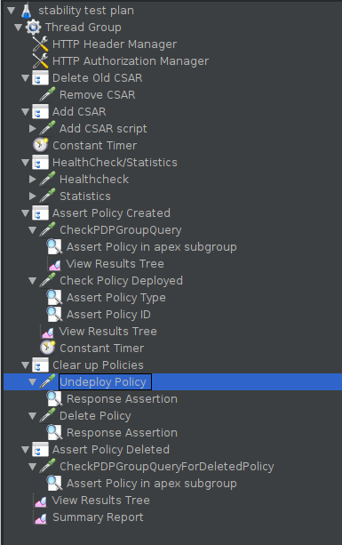
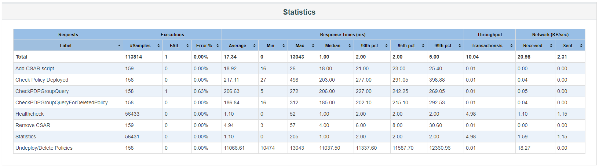
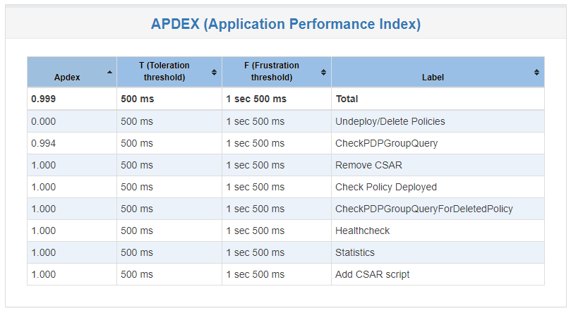
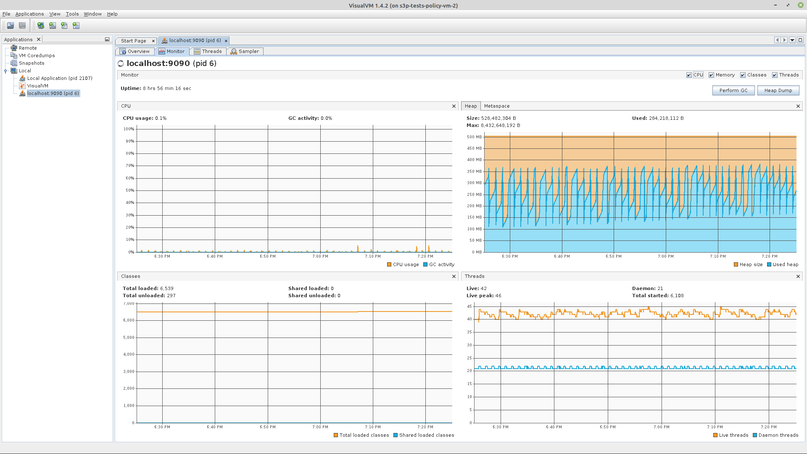
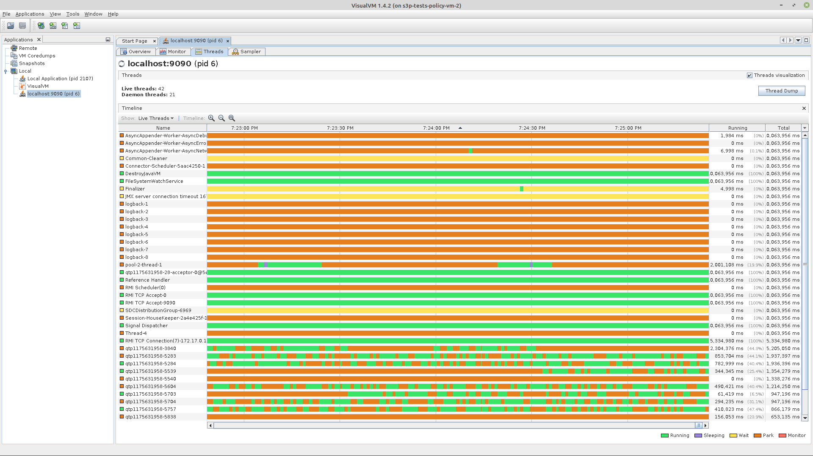

.. This work is licensed under a
.. Creative Commons Attribution 4.0 International License.
.. http://creativecommons.org/licenses/by/4.0

.. _distribution-s3p-label:

Policy Distribution component
#############################

72h Stability and 4h Performance Tests of Distribution
++++++++++++++++++++++++++++++++++++++++++++++++++++++

VM Details
----------

The stability and performance tests are performed on VM's running in the OpenStack cloud environment in the ONAP integration lab. There are two separate VMs, one for running backend policy services which policy distribution needs, and the other for the policy distribution service itself and Jmeter.

**OpenStack environment details**

- Version: Windriver Titanium

**Policy Backend VM details (VM1)**

- OS: Ubuntu 18.04.5 LTS
- CPU: 8 core, Intel Xeon E3-12xx v2 (Ivy Bridge), 2693.668 MHz, 16384 kB cache
- RAM: 32 GB
- HardDisk: 200 GB
- Docker version 19.03.8, build afacb8b7f0
- Java: openjdk 11.0.8 2020-07-14

**JMeter and Distribution VM details (VM2)**

- OS: Ubuntu 18.04.5 LTS
- CPU: 8 core, Intel Xeon E3-12xx v2 (Ivy Bridge), 2693.668 MHz, 16384 kB cache
- RAM: 32 GB
- HardDisk: 200 GB
- Docker version 19.03.8, build afacb8b7f0
- Java: openjdk 11.0.8 2020-07-14
- JMeter: 5.1.1

VM1 & VM2: Common Setup
-----------------------
Make sure to execute below commands on both VM1 & VM2

Update the ubuntu software installer

.. code-block:: bash

    sudo apt update

Install Java

.. code-block:: bash

    sudo apt install -y openjdk-11-jdk

Ensure that the Java version that is executing is OpenJDK version 11

.. code-block:: bash

    $ java --version
    openjdk 11.0.8 2020-07-14
    OpenJDK Runtime Environment (build 11.0.8+10-post-Ubuntu-0ubuntu118.04.1)
    OpenJDK 64-Bit Server VM (build 11.0.8+10-post-Ubuntu-0ubuntu118.04.1, mixed mode, sharing)

Install Docker

.. code-block:: bash

    # Add docker repository
    curl -fsSL https://download.docker.com/linux/ubuntu/gpg | sudo apt-key add -
    sudo add-apt-repository "deb [arch=amd64] https://download.docker.com/linux/ubuntu $(lsb_release -cs) stable"
    sudo apt update

    # Check available docker versions (if necessary)
    apt-cache policy docker-ce

    # Install docker
    sudo apt install -y docker-ce=5:19.03.8~3-0~ubuntu-bionic docker-ce-cli=5:19.03.8~3-0~ubuntu-bionic containerd.io

Change the permissions of the Docker socket file

.. code-block:: bash

    sudo chmod 666 /var/run/docker.sock

Check the status of the Docker service and ensure it is running correctly

.. code-block:: bash

    $ systemctl status --no-pager docker
    docker.service - Docker Application Container Engine
       Loaded: loaded (/lib/systemd/system/docker.service; enabled; vendor preset: enabled)
       Active: active (running) since Wed 2020-10-14 13:59:40 UTC; 1 weeks 0 days ago
       # ... (truncated for brevity)

    $ docker ps
    CONTAINER ID        IMAGE               COMMAND             CREATED             STATUS              PORTS               NAMES

Clone the policy-distribution repo to access the test scripts

.. code-block:: bash

    git clone https://gerrit.onap.org/r/policy/distribution

VM1 Only: Install Simulators, Policy-PAP, Policy-API and MariaDB
----------------------------------------------------------------

Modify the setup_components.sh script located at:

- ~/distribution/testsuites/stability/src/main/resources/simulatorsetup/setup_components.sh

Ensure the correct docker image versions are specified - e.g. for Guilin-RC0

- nexus3.onap.org:10001/onap/policy-api:2.3.2
- nexus3.onap.org:10001/onap/policy-pap:2.3.2

Run the setup_components.sh script to start the test support components:

.. code-block:: bash

    ~/distribution/testsuites/stability/src/main/resources/simulatorsetup/setup_components.sh

After installation, ensure the following docker containers are up and running:

.. code-block:: bash

    $ docker ps
    CONTAINER ID        IMAGE                                         COMMAND                  CREATED             STATUS              PORTS                    NAMES
    a187cb0ff08a        nexus3.onap.org:10001/onap/policy-pap:2.3.2   "bash ./policy-pap.sh"   4 days ago          Up 4 days           0.0.0.0:7000->6969/tcp   policy-pap
    2f7632fe90c3        nexus3.onap.org:10001/onap/policy-api:2.3.2   "bash ./policy-api.sh"   4 days ago          Up 4 days           0.0.0.0:6969->6969/tcp   policy-api
    70fa27d6d992        pdp/simulator:latest                          "bash pdp-sim.sh"        4 days ago          Up 4 days                                    pdp-simulator
    3c9ff28ba050        dmaap/simulator:latest                        "bash dmaap-sim.sh"      4 days ago          Up 4 days           0.0.0.0:3904->3904/tcp   message-router
    60cfcf8cfe65        mariadb:10.2.14                               "docker-entrypoint.s…"   4 days ago          Up 4 days           0.0.0.0:3306->3306/tcp   mariadb

VM2 Only: Install Distribution
------------------------------

Modify the setup_distribution.sh script located at:

- ~/distribution/testsuites/stability/src/main/resources/distributionsetup/setup_distribution.sh

Ensure the correct docker image version is specified - e.g. for Guilin-RC0:

- nexus3.onap.org:10001/onap/policy-distribution:2.4.2

Run the setup_distribution.sh script to install the distribution service, provide the IP of VM1 (twice) as the arguments to the script:

.. code-block:: bash

    ~/distribution/testsuites/stability/src/main/resources/distributionsetup/setup_distribution.sh <vm1-ipaddr> <vm1-ipaddr>

Ensure the distribution container is running.

.. code-block:: bash

    $ docker ps
    CONTAINER ID        IMAGE                                                  COMMAND                  CREATED             STATUS              PORTS                                            NAMES
    9a8db2bad156        nexus3.onap.org:10001/onap/policy-distribution:2.4.2   "bash ./policy-dist.…"   29 hours ago        Up 29 hours         0.0.0.0:6969->6969/tcp, 0.0.0.0:9090->9090/tcp   policy-distribution

VM2 Only: Install JMeter
------------------------

Download and install JMeter

.. code-block:: bash

    # Install required packages
    sudo apt install -y wget unzip

    # Install JMeter
    mkdir -p jmeter
    wget https://archive.apache.org/dist/jmeter/binaries/apache-jmeter-5.1.1.zip
    unzip -qd jmeter apache-jmeter-5.1.1.zip
    rm apache-jmeter-5.1.1.zip

VM2 Only: Install & configure visualVM
--------------------------------------

VisualVM needs to be installed in the virtual machine running Distribution (VM2). It will be used to monitor CPU, Memory and GC for Distribution while the stability tests are running.

.. code-block:: bash

    sudo apt install -y visualvm

Run these commands to configure permissions

.. code-block:: bash

    # Create Java security policy file for VisualVM
    sudo cat > /usr/lib/jvm/java-11-openjdk-amd64/bin/visualvm.policy << EOF
    grant codebase "jrt:/jdk.jstatd" {
       permission java.security.AllPermission;
    };
    grant codebase "jrt:/jdk.internal.jvmstat" {
       permission java.security.AllPermission;
    };
    EOF

    # Set globally accessable permissions on policy file
    sudo chmod 777 /usr/lib/jvm/java-11-openjdk-amd64/bin/visualvm.policy

Run the following command to start jstatd using port 1111

.. code-block:: bash

    /usr/lib/jvm/java-11-openjdk-amd64/bin/jstatd -p 1111 -J-Djava.security.policy=/usr/lib/jvm/java-11-openjdk-amd64/bin/visualvm.policy &

Run visualVM to connect to localhost:9090

.. code-block:: bash

    visualvm &

This will load up the visualVM GUI

Connect to Distribution JMX Port.

    1. Right click on "Local" in the left panel of the screen and select "Add JMX Connection"
    2. Enter the Port 9090. this is the JMX port exposed by the distribution container
    3. Double click on the newly added nodes under "Local" to start monitoring CPU, Memory & GC.

Example Screenshot of visualVM

Stability Test of Policy Distribution
+++++++++++++++++++++++++++++++++++++

Introduction
------------

The 72 hour Stability Test for policy distribution has the goal of introducing a steady flow of transactions initiated from a test client server running JMeter. The policy distribution is configured with a special FileSystemReception plugin to monitor a local directory for newly added csar files to be processed by itself. The input CSAR will be added/removed by the test client(JMeter) and the result will be pulled from the backend (PAP and PolicyAPI) by the test client (JMeter).

The test will be performed in an environment where Jmeter will continuously add/remove a test csar into the special directory where policy distribution is monitoring and will then get the processed results from PAP and PolicyAPI to verify the successful deployment of the policy. The policy will then be undeployed and the test will loop continuously until 72 hours have elapsed.

Test Plan Sequence
------------------

The 72h stability test will run the following steps sequentially in a single threaded loop.

- **Delete Old CSAR** - Checks if CSAR already exists in the watched directory, if so it deletes it
- **Add CSAR** - Adds CSAR to the directory that distribution is watching
- **Get Healthcheck** - Ensures Healthcheck is returning 200 OK
- **Get Statistics** - Ensures Statistics is returning 200 OK
- **CheckPDPGroupQuery** - Checks that PDPGroupQuery contains the deployed policy
- **CheckPolicyDeployed** - Checks that the policy is deployed
- **Undeploy Policy** - Undeploys the policy
- **Delete Policy** - Deletes the Policy for the next loop
- **Check PDP Group for Deletion** - Ensures the policy has been removed and does not exist

The following steps can be used to configure the parameters of the test plan.

- **HTTP Authorization Manager** - used to store user/password authentication details.
- **HTTP Header Manager** - used to store headers which will be used for making HTTP requests.
- **User Defined Variables** -  used to store following user defined parameters.

==========  ===============================================
 **Name**    **Description**
==========  ===============================================
 PAP_HOST     IP Address or host name of PAP component
 PAP_PORT     Port number of PAP for making REST API calls
 API_HOST     IP Address or host name of API component
 API_PORT     Port number of API for making REST API calls
 DURATION     Duration of Test
==========  ===============================================

Screenshot of Distribution stability test plan

Running the Test Plan
---------------------

Edit the /tmp folder permissions to allow the testplan to insert the CSAR into the /tmp/policydistribution/distributionmount folder

.. code-block:: bash

    sudo mkdir -p /tmp/policydistribution/distributionmount
    sudo chmod -R a+trwx /tmp

From the apache JMeter folder run the test for 72h, pointing it towards the stability.jmx file inside the testplans folder and specifying a logfile to collect the results

.. code-block:: bash

    ~/jmeter/apache-jmeter-5.1.1/bin/jmeter -n -t ~/distribution/testsuites/stability/src/main/resources/testplans/stability.jmx -Jduration=259200 -l ~/distr-stability.jtl &

Test Results
------------

**Summary**

- Stability test plan was triggered for 72 hours.
- No errors were reported

**Test Statistics**

.. image:: images/distribution/dist_stability_statistics.png
.. image:: images/distribution/dist_stability_threshold.png

**VisualVM Screenshots**

.. image:: images/distribution/dist_stability_monitor.png
.. image:: images/distribution/dist_stability_threads.png

Performance Test of Policy Distribution
+++++++++++++++++++++++++++++++++++++++

Introduction
------------

The 4h Performance Test of Policy Distribution has the goal of testing the min/avg/max processing time and rest call throughput for all the requests when the number of requests are large enough to saturate the resource and find the bottleneck.

It also tests that distribution can handle multiple policy CSARs and that these are deployed within 30 seconds consistently.

Setup Details
-------------

The performance test is based on the same setup as the distribution stability tests.

Test Plan Sequence
------------------

Performance test plan is different from the stability test plan.

- Instead of handling one policy csar at a time, multiple csar's are deployed within the watched folder at the exact same time.
- We expect all policies from these csar's to be deployed within 30 seconds.
- There are also multithreaded tests running towards the healthcheck and statistics endpoints of the distribution service.

Running the Test Plan
---------------------

Edit the /tmp folder permissions to allow the Testplan to insert the CSAR into the /tmp/policydistribution/distributionmount folder.

.. code-block:: bash

    sudo mkdir -p /tmp/policydistribution/distributionmount
    sudo chmod -R a+trwx /tmp

From the apache JMeter folder run the test for 4h, pointing it towards the performance.jmx file inside the testplans folder and specifying a logfile to collect the results

.. code-block:: bash

    ~/jmeter/apache-jmeter-5.1.1/bin/jmeter -n -t ~/distribution/testsuites/performance/src/main/resources/testplans/performance.jmx -Jduration=14400 -l ~/distr-performance.jtl &

Test Results
------------

**Summary**

- Performance test plan was triggered for 4 hours.
- No errors were reported

**Test Statistics**

**VisualVM Screenshots**

