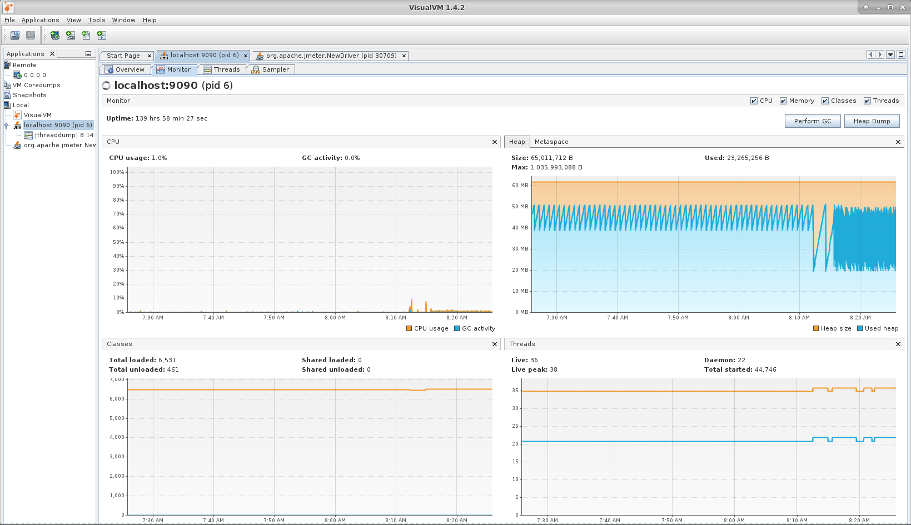
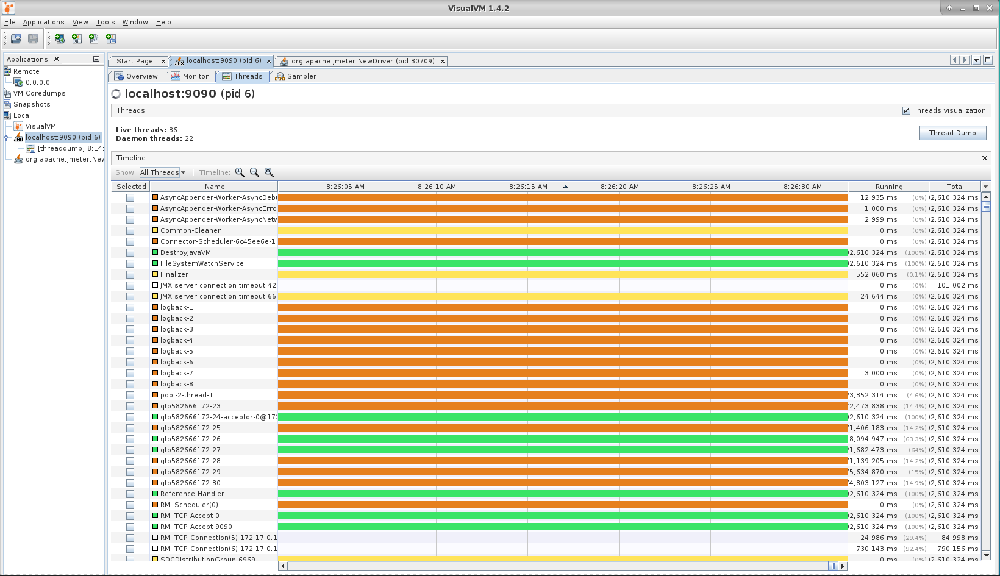
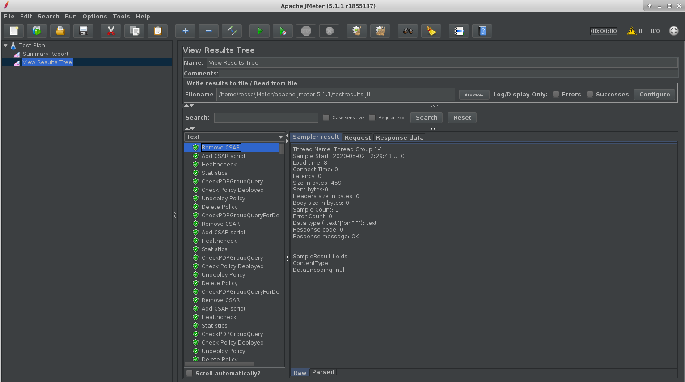
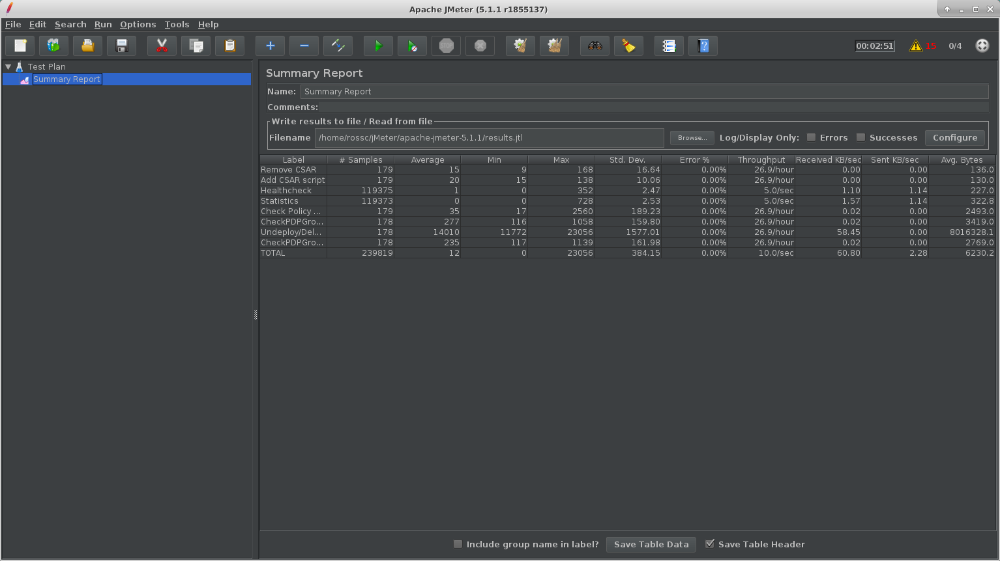
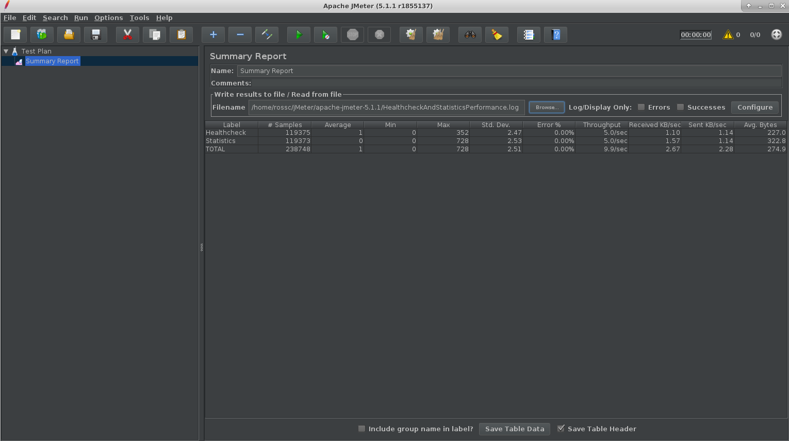

.. This work is licensed under a
.. Creative Commons Attribution 4.0 International License.
.. http://creativecommons.org/licenses/by/4.0

.. _distribution-s3p-label:

Policy Distribution component
#############################

72 Hours Stability Test of Distribution
+++++++++++++++++++++++++++++++++++++++

Introduction
------------
The 72 hour Stability Test for policy distribution has the goal of introducing a steady flow of transactions initiated from a test client server running JMeter. The policy distribution is configured with a special FileSystemReception plugin to monitor a local directory for newly added csar files to be processed by itself. The input CSAR will be added/removed by the test client(JMeter) and the result will be pulled from the backend(PAP and PolicyAPI) by the test client(JMeter).

The test will be performed in an environment where Jmeter will continuously add/remove a test csar into the special directory where policy distribuion is monitoring and will then get the processed results from PAP and PolicyAPI to verify the successful deployment of the policy. The policy will then be undeployed and the test will loop continuously until 72 hours have elapsed.

Setup details
-------------

The stability test is performed on VM's running in the OpenStack cloud environment in the ONAP integration lab. There are 2 separate VMs, one for running backend policy services which policy distribution needs, and the other is for policy distribution service itself and Jmeter.

**OpenStack environment details**

Version: Windriver Titanium

**Policy Backend VM details(VM1)**

OS:Ubuntu 18.04.4 LTS

CPU: 8 core

RAM: 32 GB

HardDisk: 160 GB

Docker version 19.03.8, build afacb8b7f0

Java: openjdk version "11.0.7"

**JMeter and Distribution VM details(VM2)**

OS: Ubuntu 18.04.4 LTS

CPU: 8 core

RAM: 32 GB

HardDisk: 160 GB

Docker version 19.03.8, build afacb8b7f0

Java: openjdk version "11.0.7"

JMeter: 5.1.1

Install Docker in VM1 & VM2
---------------------------
Make sure to execute below commands in VM1 & VM2 both.

Update the ubuntu software installer

.. code-block:: bash

    $ apt-get update

Install and check Java

.. code-block:: bash

    $ apt-get install -y openjdk-11-jdk
    $ java -version

Ensure that the Java version that is executing is OpenJDK version 11

Install and check Docker

.. code-block:: bash

    $ curl -fsSL https://download.docker.com/linux/ubuntu/gpg | sudo apt-key add - add-apt-repository "deb [arch=amd64] https://download.docker.com/linux/ubuntu $(lsb_release -cs) stable"
    $ apt-get update
    $ apt-cache policy docker-ce
    $ apt-get install -y docker-ce
    $ systemctl status docker
    $ docker ps

Change the permissions of the Docker socket file

.. code-block:: bash

    $ sudo chmod 666 /var/run/docker.sock

Check the status of the Docker service and ensure it is running correctly

.. code-block:: bash

    $ service docker status
    $ docker ps

Install Simulators, PAP, PolicyAPI and MariaDB in VM1
-----------------------------------------------------

To install all the components needed for Distribution, copy over the script and related files found within the simulatorsetup directory within $(REPOPATH)/distribution/testsuites/stability/src/main/resources

Run setup_components.sh script to bring up the required docker containers

After installation, ensure the following docker containers are up and running:

.. code-block:: bash

    CONTAINER ID        IMAGE                                                  COMMAND                  CREATED              STATUS              PORTS                    NAMES
    11195b01300a        nexus3.onap.org:10001/onap/policy-pap:2.2.2-SNAPSHOT   "bash ./policy-pap.sh"   13 seconds ago       Up 9 seconds        0.0.0.0:7000->6969/tcp   policy-pap
    6266aa6b0137        nexus3.onap.org:10001/onap/policy-api:2.2.3-SNAPSHOT   "bash ./policy-api.sh"   25 seconds ago       Up 22 seconds       0.0.0.0:6969->6969/tcp   policy-api
    6a85d155aa8a        pdp/simulator:latest                                   "bash pdp-sim.sh"        About a minute ago   Up About a minute                            pdp-simulator
    0b41992ccfd7        dmaap/simulator:latest                                 "bash dmaap-sim.sh"      About a minute ago   Up About a minute   0.0.0.0:3904->3904/tcp   message-router
    595056b2a094        mariadb:10.2.14                                        "docker-entrypoint.s…"   About a minute ago   Up About a minute   0.0.0.0:3306->3306/tcp   mariadb

Install Distribution in VM2
---------------------------

To install the Distribution service, copy over the script and related files found within the distributionsetup directory within $(REPOPATH)/distribution/testsuites/stability/src/main/resources

Run setup_distribution.sh script to install the distribution service, provide the IP of VM1 as the arguments to the script.

e.g
.. code-block:: bash

    $ ./setup_distribution.sh 10.2.0.24 10.2.0.24

Ensure the distribution container is running.

Install JMeter in VM2
---------------------

Download and install jMeter

.. code-block:: bash

    $ mkdir jMeter
    $ cd jMeter
    $ wget https://archive.apache.org/dist/jmeter/binaries/apache-jmeter-5.1.1.zip
    $ unzip apache-jmeter-5.1.1.zip

Install & configure visualVM in VM2
-----------------------------------
VisualVM needs to be installed in the virtual machine running Distrbution. It will be used to monitor CPU, Memory and GC for Distribution while the stability tests are running.

.. code-block:: bash

    $ sudo apt-get install visualVM

Run these commands to configure permissions

.. code-block:: bash

    $ cd /usr/lib/jvm/java-11-openjdk-amd64/bin/
    $ sudo touch visualvm.policy
    $ sudo chmod 777 visualvm.policy

    $ vi visualvm.policy

    Add the following in visualvm.policy

    grant codebase "file:/usr/lib/jvm/java-11-openjdk-amd64/lib/tools.jar" {
    permission java.security.AllPermission;
    };

Run the following commands to start jstatd using port 1111

.. code-block:: bash

    $ cd /usr/lib/jvm/java-8-openjdk-amd64/bin/
    $ ./jstatd -p 1111 -J-Djava.security.policy=visualvm.policy  &

Using the VM2 Desktop, run visualVM to connect to localhost:9090
Run the command

.. code-block:: bash

    $ visualvm

This will load up the visualVM GUI

Connect to Distribution JMX Port.

    1. Right click on "Local" in the left panel of the screen and select "Add JMX Connection"
    2. Enter the Port 9090. this is the JMX port exposed by the dsitribution container
    3. Double click on the newly added nodes under "Local" to start monitoring CPU, Memory & GC.

Example Screenshot

Sample Screenshot of visualVM

.. image:: images/distribution-s3p-vvm-sample.png

Test Plan Setup
---------------

The 72 hours stability test will run the following steps sequentially in a single threaded loop.

- **Delete Old CSAR** - Checks if CSAR already exists in the watched directory, if so it deletes it
- **Add CSAR** - Adds CSAR to the directory that distribution is watching
- **Get Healthcheck** - Ensures Healthcheck is returning 200 OK
- **Get Statistics** - Ensures Statistics is returning 200 OK
- **CheckPDPGroupQuery** - Checks that PDPGroupQuery contains the deployed policy
- **CheckPolicyDeployed** - Checks that the policy is deployed
- **Undeploy Policy** - Undeploys the policy
- **Delete Policy** - Deletes the Policy for the next loop
- **Check PDP Group for Deletion** - Ensures the policy has been removed and does not exist

The following steps can be used to configure the parameters of the test plan.

- **HTTP Authorization Manager** - used to store user/password authentication details.
- **HTTP Header Manager** - used to store headers which will be used for making HTTP requests.
- **User Defined Variables** -  used to store following user defined parameters.

==========  ===============================================
 **Name**    **Description**
==========  ===============================================
 PAP_HOST     IP Address or host name of PAP component
 PAP_PORT     Port number of PAP for making REST API calls
 API_HOST     IP Address or host name of API component
 API_PORT     Port number of API for making REST API calls
 DURATION     Duration of Test
==========  ===============================================

Screenshot of Distribution stability test plan

.. image:: images/distribution-s3p-testplan.png

Running the Test Plan
---------------------

Copy the Test Plans folder onto VM2
Edit the /tmp/ folder permissions to allow the Testplan to insert the CSAR into the /tmp/policydistribution/distributionmount/ folder

.. code-block:: bash

    $ sudo chmod a+trwx /tmp

From the apache jMeter folder run the test, pointing it towards the stabiltiy.jmx file inside the testplans folder

.. code-block:: bash

    $ ./bin/jmeter -n -t /home/rossc/testplans/stability.jmx -Jduration=259200 -l testresults.jtl

Test Results
------------

**Summary**

Stability test plan was triggered for 72 hours.

**Test Statistics**

=======================  =================  ==================  ==================================
**Total # of requests**  **Success %**      **Error %**         **Average time taken per request**
=======================  =================  ==================  ==================================
194313                   100 %              0 %                 145 ms
=======================  =================  ==================  ==================================

**VisualVM Screenshot**

**JMeter Screenshot**

.. image:: images/distribution-summary-report.png

Performance Test of Policy Distribution
+++++++++++++++++++++++++++++++++++++++

Introduction
------------

Performance test of distribution has the goal of testing the min/avg/max processing time and 
rest call throughput for all the requests when the number of requests are large enough to saturate 
the resource and find the bottleneck.
It also tests that distribution can handle multiple policy csar's and that these are deployed within 30 seconds consistently.

Setup Details
-------------

The performance test is based on the same setup as the distribution stability tests.

Test Plan
---------

Performance test plan is different from the stability test plan.
Instead of handling one policy csar at a time, multiple csar's are deployed within the watched folder at the exact same time.
We then expect all policies from these csar's to be deployed within 30 seconds.
Alongside these, there are multithreaded tests running towards the healtchcheck and statistics endpoints of the distribution service.

Run Test
--------

Copy the performance test plans folder onto VM2.
Edit the /tmp/ folder permissions to allow the Testplan to insert the CSAR into the /tmp/policydistribution/distributionmount/ folder.

.. code-block:: bash

    $ sudo chmod a+trwx /tmp

From the apache jMeter folder run the test, pointing it towards the stabiltiy.jmx file inside the testplans folder

.. code-block:: bash

    $ ./bin/jmeter -n -t /home/rossc/testplans/performance.jmx -Jduration=259200 -l testresults.jtl

Test Results
------------

**Summary**

Performance test plan was triggered for 4 hours.

**Test Statistics**

=======================  =================  ==================  ==================================
**Total # of requests**  **Success %**      **Error %**         **Average time taken per request**
=======================  =================  ==================  ==================================
239819                   100 %              0 %                 100 ms
=======================  =================  ==================  ==================================

**JMeter Screenshot**

