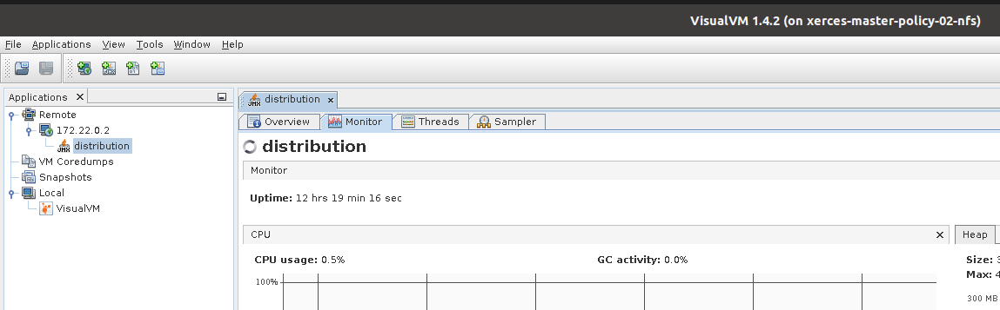
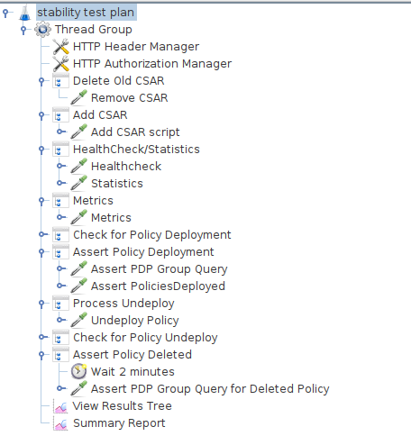
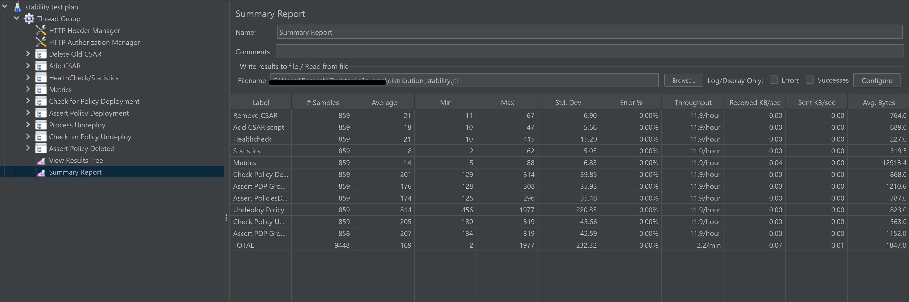
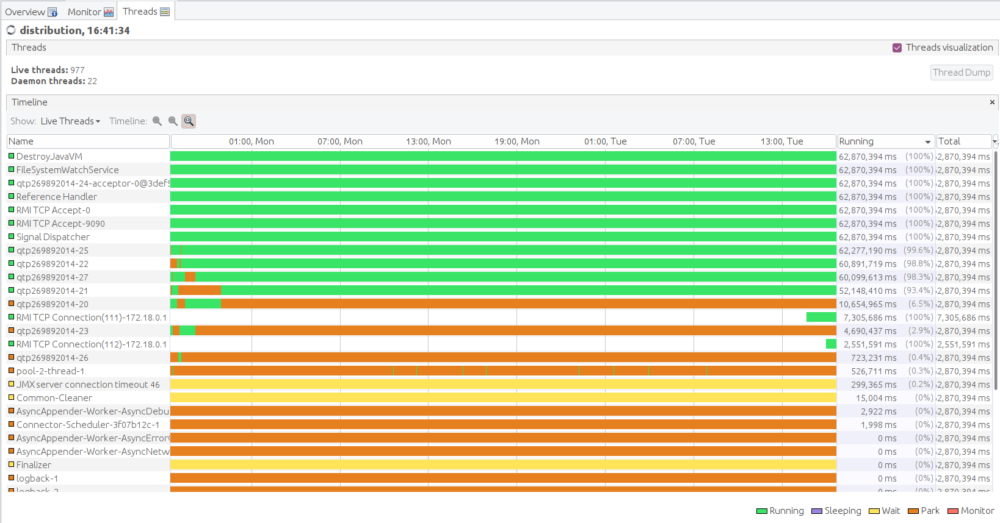
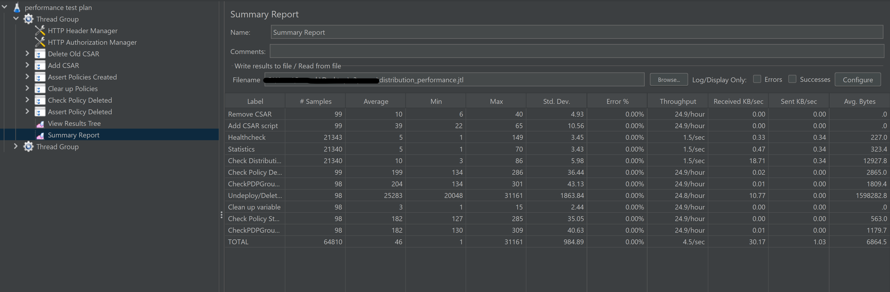
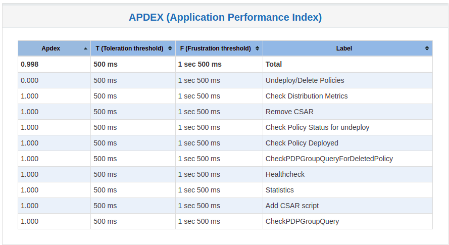
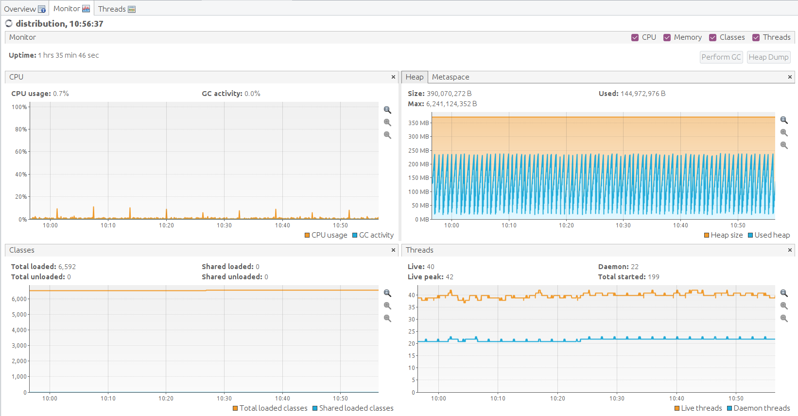
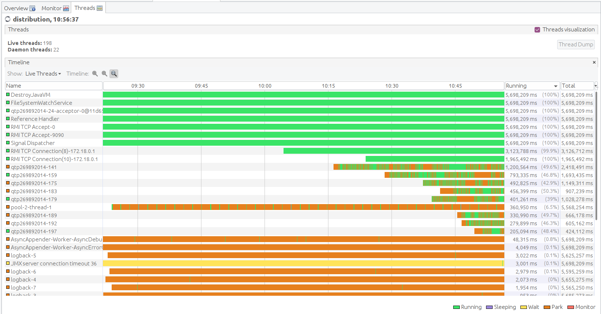

.. This work is licensed under a
.. Creative Commons Attribution 4.0 International License.
.. http://creativecommons.org/licenses/by/4.0

.. _distribution-s3p-label:

Policy Distribution component
#############################

72h Stability and 4h Performance Tests of Distribution
++++++++++++++++++++++++++++++++++++++++++++++++++++++

Common Setup
------------

Update the ubuntu software installer

.. code-block:: bash

    sudo apt update

Install Java

.. code-block:: bash

    sudo apt install -y openjdk-11-jdk

Ensure that the Java version that is executing is OpenJDK version 11

.. code-block:: bash

    $ java --version
    openjdk 11.0.11 2021-04-20
    OpenJDK Runtime Environment (build 11.0.11+9-Ubuntu-0ubuntu2.18.04)
    OpenJDK 64-Bit Server VM (build 11.0.11+9-Ubuntu-0ubuntu2.18.04, mixed mode)

Install Docker and Docker Compose

.. code-block:: bash

    # Add docker repository
    curl -fsSL https://download.docker.com/linux/ubuntu/gpg | sudo gpg --dearmor -o /usr/share/keyrings/docker-archive-keyring.gpg

    echo "deb [arch=amd64 signed-by=/usr/share/keyrings/docker-archive-keyring.gpg] https://download.docker.com/linux/ubuntu \
    $(lsb_release -cs) stable" | sudo tee /etc/apt/sources.list.d/docker.list > /dev/null

    sudo apt update

    # Install docker
    sudo apt-get install docker-ce docker-ce-cli containerd.io

Change the permissions of the Docker socket file

.. code-block:: bash

    sudo chmod 666 /var/run/docker.sock

Check the status of the Docker service and ensure it is running correctly

.. code-block:: bash

    systemctl status --no-pager docker
    docker.service - Docker Application Container Engine
       Loaded: loaded (/lib/systemd/system/docker.service; enabled; vendor preset: enabled)
       Active: active (running) since Wed 2020-10-14 13:59:40 UTC; 1 weeks 0 days ago
       # ... (truncated for brevity)

    docker ps
    CONTAINER ID        IMAGE               COMMAND             CREATED             STATUS              PORTS               NAMES

Install and verify docker-compose

.. code-block:: bash

    # Install compose (check if version is still available or update as necessary)
    sudo curl -L "https://github.com/docker/compose/releases/download/1.29.2/docker-compose-$(uname -s)-$(uname -m)" -o /usr/local/bin/docker-compose
    sudo chmod +x /usr/local/bin/docker-compose

    # Check if install was successful
    docker-compose --version

Clone the policy-distribution repo to access the test scripts

.. code-block:: bash

    git clone https://gerrit.onap.org/r/policy/distribution

.. _setup-distribution-s3p-components:

Start services for MariaDB, Policy API, PAP and Distribution
------------------------------------------------------------

Navigate to the main folder for scripts to setup services:

.. code-block:: bash

    cd ~/distribution/testsuites/stability/src/main/resources/setup

Modify the versions.sh script to match all the versions being tested.

.. code-block:: bash

    vi ~/distribution/testsuites/stability/src/main/resources/setup/versions.sh

Ensure the correct docker image versions are specified - e.g. for Kohn-M4

- export POLICY_DIST_VERSION=2.8-SNAPSHOT

Run the start.sh script to start the components. After installation, script will execute
``docker ps`` and show the running containers.

.. code-block:: bash

    ./start.sh

    Creating network "setup_default" with the default driver
    Creating policy-distribution ... done
    Creating mariadb             ... done
    Creating simulator           ... done
    Creating policy-db-migrator  ... done
    Creating policy-api          ... done
    Creating policy-pap          ... done

    fa4e9bd26e60   nexus3.onap.org:10001/onap/policy-pap:2.7-SNAPSHOT-latest                "/opt/app/policy/pap…"   1 second ago    Up Less than a second   6969/tcp             policy-pap
    efb65dd95020   nexus3.onap.org:10001/onap/policy-api:2.7-SNAPSHOT-latest                "/opt/app/policy/api…"   1 second ago    Up Less than a second   6969/tcp             policy-api
    cf602c2770ba   nexus3.onap.org:10001/onap/policy-db-migrator:2.5-SNAPSHOT-latest        "/opt/app/policy/bin…"   2 seconds ago   Up 1 second             6824/tcp             policy-db-migrator
    99383d2fecf4   pdp/simulator                                                            "sh /opt/app/policy/…"   2 seconds ago   Up 1 second                                  pdp-simulator
    3c0e205c5f47   nexus3.onap.org:10001/onap/policy-models-simulator:2.7-SNAPSHOT-latest   "simulators.sh"          3 seconds ago   Up 2 seconds            3904/tcp             simulator
    3ad00d90d6a3   nexus3.onap.org:10001/onap/policy-distribution:2.8-SNAPSHOT-latest       "/opt/app/policy/bin…"   3 seconds ago   Up 2 seconds            6969/tcp, 9090/tcp   policy-distribution
    bb0b915cdecc   nexus3.onap.org:10001/mariadb:10.5.8                                     "docker-entrypoint.s…"   3 seconds ago   Up 2 seconds            3306/tcp             mariadb

.. note::
    The containers on this docker-compose are running with HTTP configuration. For HTTPS, ports
    and configurations will need to be changed, as well certificates and keys must be generated
    for security.

Install JMeter
--------------

Download and install JMeter

.. code-block:: bash

    # Install required packages
    sudo apt install -y wget unzip

    # Install JMeter
    mkdir -p jmeter
    cd jmeter
    wget https://dlcdn.apache.org//jmeter/binaries/apache-jmeter-5.5.zip # check if valid version
    unzip -q apache-jmeter-5.5.zip
    rm apache-jmeter-5.5.zip

Install & configure visualVM
--------------------------------------

VisualVM needs to be installed in the virtual machine running Distribution. It will be used to
monitor CPU, Memory and GC for Distribution while the stability tests are running.

.. code-block:: bash

    sudo apt install -y visualvm

Run these commands to configure permissions (if permission errors happens, use ``sudo su``)

.. code-block:: bash

    # Set globally accessable permissions on policy file
    sudo chmod 777 /usr/lib/jvm/java-11-openjdk-amd64/bin/visualvm.policy

    # Create Java security policy file for VisualVM
    sudo cat > /usr/lib/jvm/java-11-openjdk-amd64/bin/visualvm.policy << EOF
    grant codebase "jrt:/jdk.jstatd" {
       permission java.security.AllPermission;
    };
    grant codebase "jrt:/jdk.internal.jvmstat" {
       permission java.security.AllPermission;
    };
    EOF

Run the following command to start jstatd using port 1111

.. code-block:: bash

    /usr/lib/jvm/java-11-openjdk-amd64/bin/jstatd -p 1111 -J-Djava.security.policy=/usr/lib/jvm/java-11-openjdk-amd64/bin/visualvm.policy &

Run visualVM to connect to POLICY_DISTRIBUTION_IP:9090

.. code-block:: bash

    # Get the Policy Distribution container IP
    echo $(docker inspect -f '{{range.NetworkSettings.Networks}}{{.IPAddress}}{{end}}' policy-distribution)

    # Start visual vm
    visualvm &

This will load up the visualVM GUI

Connect to Distribution JMX Port.

    1. On the visualvm toolbar, click on "Add JMX Connection"
    2. Enter the Distribution container IP and Port 9090. This is the JMX port exposed by the
       distribution container
    3. Double click on the newly added nodes under "Remotes" to start monitoring CPU, Memory & GC.

Example Screenshot of visualVM

Stability Test of Policy Distribution
+++++++++++++++++++++++++++++++++++++

Introduction
------------

The 72 hour Stability Test for policy distribution has the goal of introducing a steady flow of
transactions initiated from a test client server running JMeter. The policy distribution is
configured with a special FileSystemReception plugin to monitor a local directory for newly added
csar files to be processed by itself. The input CSAR will be added/removed by the test client
(JMeter) and the result will be pulled from the backend (PAP and PolicyAPI) by the test client
(JMeter).

The test will be performed in an environment where Jmeter will continuously add/remove a test csar
into the special directory where policy distribution is monitoring and will then get the processed
results from PAP and PolicyAPI to verify the successful deployment of the policy. The policy will
then be undeployed and the test will loop continuously until 72 hours have elapsed.

Test Plan Sequence
------------------

The 72h stability test will run the following steps sequentially in a single threaded loop.

- **Delete Old CSAR** - Checks if CSAR already exists in the watched directory, if so it deletes it
- **Add CSAR** - Adds CSAR to the directory that distribution is watching
- **Get Healthcheck** - Ensures Healthcheck is returning 200 OK
- **Get Statistics** - Ensures Statistics is returning 200 OK
- **Get Metrics** - Ensures Metrics is returning 200 OK
- **Assert PDP Group Query** - Checks that PDPGroupQuery contains the deployed policy
- **Assert PoliciesDeployed** - Checks that the policy is deployed
- **Undeploy/Delete Policy** - Undeploys and deletes the Policy for the next loop
- **Assert PDP Group Query for Deleted Policy** - Ensures the policy has been removed and does not exist

The following steps can be used to configure the parameters of the test plan.

- **HTTP Authorization Manager** - used to store user/password authentication details.
- **HTTP Header Manager** - used to store headers which will be used for making HTTP requests.
- **User Defined Variables** -  used to store following user defined parameters.

==========  ===============================================
 **Name**    **Description**
==========  ===============================================
 PAP_HOST     IP Address or host name of PAP component
 PAP_PORT     Port number of PAP for making REST API calls
 API_HOST     IP Address or host name of API component
 API_PORT     Port number of API for making REST API calls
 DURATION     Duration of Test
==========  ===============================================

Screenshot of Distribution stability test plan

Running the Test Plan
---------------------

Check if the /tmp/policydistribution/distributionmount exists as it was created during the start.sh
script execution. If not, run the following commands to create folder and change folder permissions
to allow the testplan to insert the CSAR into the /tmp/policydistribution/distributionmount folder.

.. note::
    Make sure that only csar file is being loaded in the watched folder and log generation is in a
    logs folder, as any sort of zip file can be understood by distribution as a policy file. A
    logback.xml configuration file is available under setup/distribution folder.

.. code-block:: bash

    sudo mkdir -p /tmp/policydistribution/distributionmount
    sudo chmod -R a+trwx /tmp

Navigate to the stability test folder.

.. code-block:: bash

    cd ~/distribution/testsuites/stability/src/main/resources/testplans/

Execute the run_test.sh

.. code-block:: bash

    ./run_test.sh

Test Results
------------

**Summary**

- Stability test plan was triggered for 72 hours.
- No errors were reported

**Test Statistics**

**VisualVM Screenshots**

Performance Test of Policy Distribution
+++++++++++++++++++++++++++++++++++++++

Introduction
------------

The 4h Performance Test of Policy Distribution has the goal of testing the min/avg/max processing
time and rest call throughput for all the requests when the number of requests are large enough to
saturate the resource and find the bottleneck.

It also tests that distribution can handle multiple policy CSARs and that these are deployed within
60 seconds consistently.

Setup Details
-------------

The performance test is based on the same setup as the distribution stability tests.

Test Plan Sequence
------------------

Performance test plan is different from the stability test plan.

- Instead of handling one policy csar at a time, multiple csar's are deployed within the watched
  folder at the exact same time.
- We expect all policies from these csar's to be deployed within 60 seconds.
- There are also multithreaded tests running towards the healthcheck and statistics endpoints of
  the distribution service.

Running the Test Plan
---------------------

Check if /tmp folder permissions to allow the Testplan to insert the CSAR into the
/tmp/policydistribution/distributionmount folder.
Clean up from previous run. If necessary, put containers down with script ``down.sh`` from setup
folder mentioned on :ref:`Setup components <setup-distribution-s3p-components>`

.. code-block:: bash

    sudo mkdir -p /tmp/policydistribution/distributionmount
    sudo chmod -R a+trwx /tmp

Navigate to the testplan folder and execute the test script:

.. code-block:: bash

    cd ~/distribution/testsuites/performance/src/main/resources/testplans/
    ./run_test.sh
    

Test Results
------------

**Summary**

- Performance test plan was triggered for 4 hours.
- No errors were reported

**Test Statistics**

**VisualVM Screenshots**

End of document
