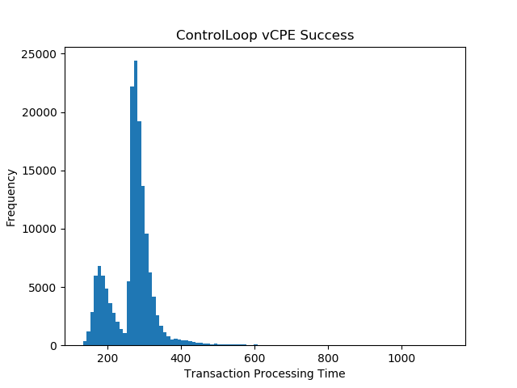
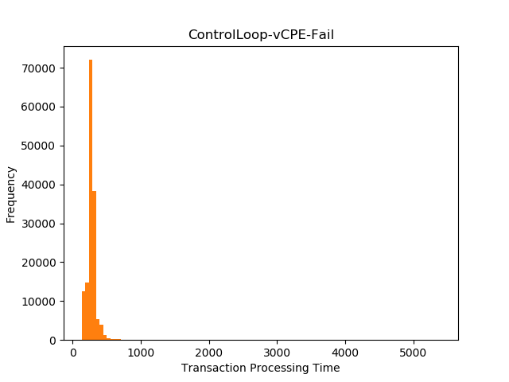
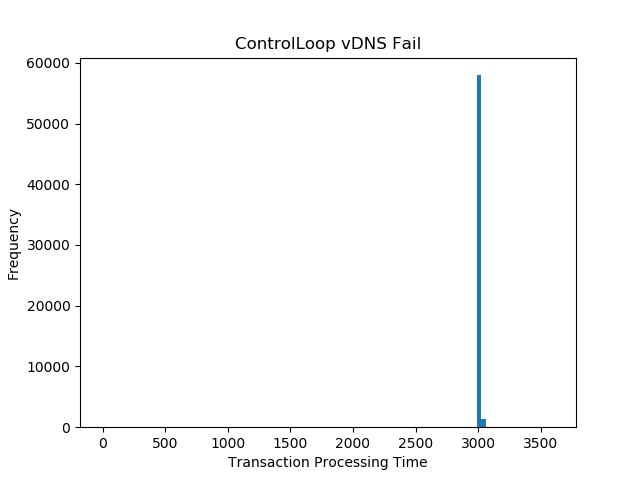
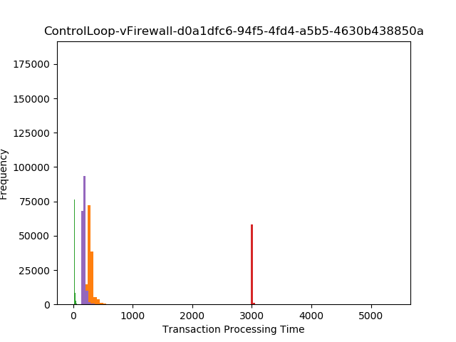

.. This work is licensed under a
.. Creative Commons Attribution 4.0 International License.
.. http://creativecommons.org/licenses/by/4.0

.. _drools-s3p-label:

.. toctree::
   :maxdepth: 2

Policy Drools PDP component
~~~~~~~~~~~~~~~~~~~~~~~~~~~

Both the Performance and the Stability tests were executed against a default ONAP installation in the policy-k8s tenant in windriver lab, from an independent VM running the jmeter tool to inject the load.

General Setup
*************

The kubernetes installation allocated all policy components in the same worker node VM and some additional ones.
The worker VM hosting the policy components has the following spec:

- 16GB RAM
- 8 VCPU
- 160GB Ephemeral Disk

The standalone VM designated to run jmeter has the same configuration.  The jmeter JVM
was instantiated with a max heap configuration of 12G.

Other ONAP components used during the stability tests are:

- Policy XACML PDP to process guard queries for each transaction.
- DMaaP to carry PDP-D and jmeter initiated traffic to complete transactions.
- Policy API to create (and delete at the end of the tests) policies for each
  scenario under test.
- Policy PAP to deploy (and undeploy at the end of the tests) policies for each scenario under test.

The following components are simulated during the tests.

- SO actor for the vDNS use case.
- APPC responses for the vCPE and vFW use cases.
- AAI to answer queries for the use cases under test.

In order to avoid interferences with the APPC component while running the tests,
the APPC component was disabled.

SO, and AAI actors were simulated within the PDP-D JVM by enabling the
feature-controlloop-utils before running the tests.

PDP-D Setup
***********

The kubernetes charts were modified previous to the installation with
the changes below.

The oom/kubernetes/policy/charts/drools/resources/configmaps/base.conf was
modified as follows:

.. code-block:: bash

   --- a/kubernetes/policy/components/policy-drools-pdp/resources/configmaps/base.conf
   +++ b/kubernetes/policy/components/policy-drools-pdp/resources/configmaps/base.conf
   @@ -86,27 +86,27 @@ DMAAP_SERVERS=message-router

    # AAI

   -AAI_HOST=aai.{{.Release.Namespace}}
   -AAI_PORT=8443
   +AAI_HOST=localhost
   +AAI_PORT=6666
    AAI_CONTEXT_URI=

    # MSO

   -SO_HOST=so.{{.Release.Namespace}}
   -SO_PORT=8080
   -SO_CONTEXT_URI=onap/so/infra/
   -SO_URL=https://so.{{.Release.Namespace}}:8080/onap/so/infra
   +SO_HOST=localhost
   +SO_PORT=6667
   +SO_CONTEXT_URI=
   +SO_URL=https://localhost:6667/

    # VFC

   -VFC_HOST=
   -VFC_PORT=
   +VFC_HOST=localhost
   +VFC_PORT=6668
    VFC_CONTEXT_URI=api/nslcm/v1/

    # SDNC

   -SDNC_HOST=sdnc.{{.Release.Namespace}}
   -SDNC_PORT=8282
   +SDNC_HOST=localhost
   +SDNC_PORT=6670
    SDNC_CONTEXT_URI=restconf/operations/

The feature-controlloop-utils was started by adding in statefulset.yaml:

.. code-block:: bash

   --- a/kubernetes/policy/components/policy-drools-pdp/templates/statefulset.yaml
   +++ b/kubernetes/policy/components/policy-drools-pdp/templates/statefulset.yaml
   @@ -75,6 +75,7 @@ spec:
           args: ["if [ -f {{ .Values.certInitializer.credsPath }}/.ci ]; then \
                   source {{ .Values.certInitializer.credsPath }}/.ci; fi;\
                   cp {{ .Values.certInitializer.credsPath }}/org.onap.policy.p12 ${POLICY_HOME}/etc/ssl/policy-keystore;\
   +                  /opt/app/policy/bin/features enable controlloop-utils; \
                      /opt/app/policy/bin/pdpd-cl-entrypoint.sh boot"]

Stability Test of Policy PDP-D
******************************

The 72 hour stability test happened in parallel with the stability run of the API component.

Worker Node performance
=======================

The VM named onap-k8s-09 was monitored for the duration of the 72 hours
stability run.  The table below show the usage ranges:

.. code-block:: bash

    NAME          CPU(cores)   CPU%
    onap-k8s-09   <=1214m      <=20%

    KiB Mem : 16424320 total,  3223952 free,  7481616 used,  5718752 buff/cache

PDP-D performance
=================

The drools-pdp is run and monitored by k8s. All working nodes is initiated by rke. Pods are deployed by helm command.

.. code-block:: bash

   root@pk8s-nfs:~# kubectl get pod -o wide -A | grep dev-policy-drools-pdp-0
   onap      dev-policy-drools-pdp-0    1/1     Running     463        2d7h   10.42.7.51    onap-k8s-09   <none>       <none>

Garbage collection was monitored without detecting any significant degradation.

The test set focused on the following use cases:

- vCPE
- vDNS
- vFirewall

For 72 hours the following 5 scenarios ran in parallel:

- vCPE success scenario
- vCPE failure scenario (failure returned by simulated APPC recipient through DMaaP).
- vDNS success scenario.
- vDNS failure scenario.
- vFirewall success scenario.

Five threads ran in parallel, one for each scenario.   The transactions were initiated
by each jmeter thread group.   Each thread initiated a transaction, monitored the transaction, and
as soon as the transaction ending was detected, it initiated the next one, so back to back with no
pauses.

All transactions completed successfully as it was expected in each scenario, with no failures.

The command executed was

.. code-block:: bash

    ./jmeter -n -t /home/ubuntu/drools-applications/testsuites/stability/src/main/resources/frankfurt/s3p.jmx  -l /home/ubuntu/jmeter_result/jmeter.jtl -e -o /home/ubuntu/jmeter_result > /dev/null 2>&1

The results were computed by taking the ellapsed time from the audit.log
(this log reports all end to end transactions, marking the start, end, and
ellapsed times).

The count reflects the number of successful transactions as expected in the
use case, as well as the average, standard deviation, and max/min.   An histogram
of the response times have been added as a visual indication on the most common
transaction times.

vCPE Success scenario
=====================

ControlLoop-vCPE-48f0c2c3-a172-4192-9ae3-052274181b6e:

.. code-block:: bash

    Max: 4323 ms, Min: 143 ms, Average: 380 ms [samples taken for average: 260628]

vCPE Failure scenario
=====================

ControlLoop-vCPE-Fail:

.. code-block:: bash

   Max: 3723 ms, Min: 148 ms, Average: 671 ms [samples taken for average: 87888]

vDNS Success scenario
=====================

ControlLoop-vDNS-6f37f56d-a87d-4b85-b6a9-cc953cf779b3:

.. code-block:: bash

   Max: 6437 ms, Min: 19 ms, Average: 165 ms [samples taken for average: 59259]

.. image:: images/ControlLoop-vDNS-6f37f56d-a87d-4b85-b6a9-cc953cf779b3.png

vDNS Failure scenario
=====================

ControlLoop-vDNS-Fail:

.. code-block:: bash

    Max: 1176 ms, Min: 4 ms, Average: 5 ms [samples taken for average: 340810]

vFirewall Success scenario
==========================

ControlLoop-vFirewall-d0a1dfc6-94f5-4fd4-a5b5-4630b438850a:

.. code-block:: bash

    Max: 4016 ms, Min: 177 ms, Average: 644 ms [samples taken for average: 36460]

