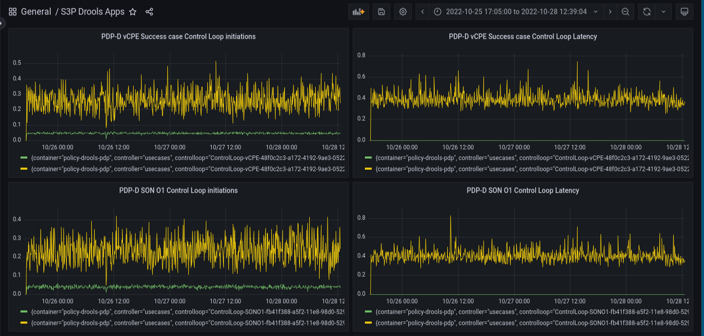
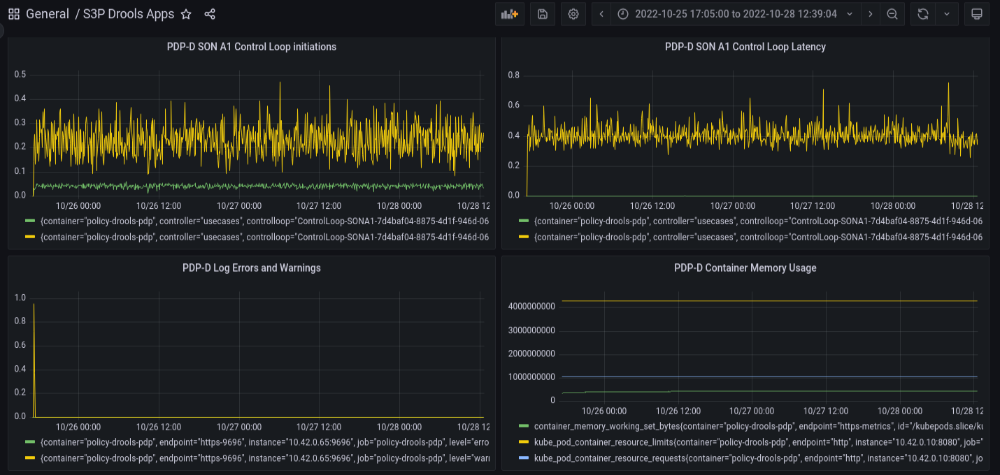
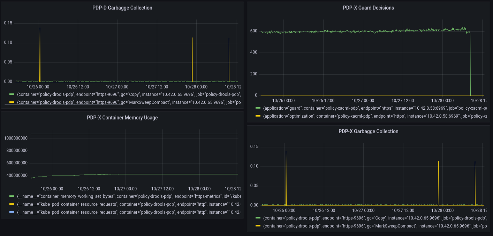

.. This work is licensed under a
.. Creative Commons Attribution 4.0 International License.
.. http://creativecommons.org/licenses/by/4.0

.. _drools-s3p-label:

.. toctree::
   :maxdepth: 2

Policy Drools PDP component
~~~~~~~~~~~~~~~~~~~~~~~~~~~

Both the Performance and the Stability tests were executed against an ONAP installation in the Policy tenant
in the UNH lab, from the admin VM running the jmeter tool to inject the load.

General Setup
*************

Agent VMs in this lab have the following configuration:

- 16GB RAM
- 8 VCPU

Jmeter is run from the admin VM.

The drools-pdp container uses the JVM memory and CPU settings from the default OOM installation.

Other ONAP components exercised during the stability tests were:

- Policy XACML PDP to process guard queries for each transaction.
- DMaaP to carry PDP-D and jmeter initiated traffic to complete transactions.
- Policy API to create (and delete at the end of the tests) policies for each
  scenario under test.
- Policy PAP to deploy (and undeploy at the end of the tests) policies for each scenario under test.

The following components are simulated during the tests.

- SO actor for the vDNS use case.
- APPC responses for the vCPE and vFW use cases.
- AAI to answer queries for the use cases under test.

Stability Test of Policy PDP-D
******************************

PDP-D performance
=================

The tests focused on the following use cases:

- vCPE
- vDNS
- vFirewall

For 72 hours the following 5 scenarios ran in parallel:

- vCPE success scenario
- vDNS success scenario.
- vFirewall success scenario.
- vCPE failure scenario (simulates a failure scenario returned by simulated APPC recipient through DMaaP).
- vDNS failure scenario (simulates a failure by introducing in the DCAE ONSET a non-existent vserver-name reference).

Five threads ran in parallel, one for each scenario, back to back with no pauses.   The transactions were initiated
by each jmeter thread group.   Each thread initiated a transaction, monitored the transaction, and
as soon as the transaction ending was detected, it initiated the next one.

The results are illustrated on the following graphs:

Commentary
==========

There is around 1% unexpected failures during the 72-hour run.   This can also be seen in the
final output of jmeter:

.. code-block:: bash

    summary = 37705505 in 72:00:56 =  145.4/s Avg:    30 Min:     0 Max: 20345 Err: 360852 (0.96%)

The 1% errors were found to be related to the nature of the run, where each one of the 5 use case
threads run without pauses starting one after the other a new round of their assigned control loop.
It has been found that at times, the release time of the lock (which requires DB operations) outruns
the initiation of the next control loop (using the same resource), therefore the newly initiated control
loop fails.  In reality, this scenario with the same resource being used back to back in consecutive control
loop rounds will be unlikely.

