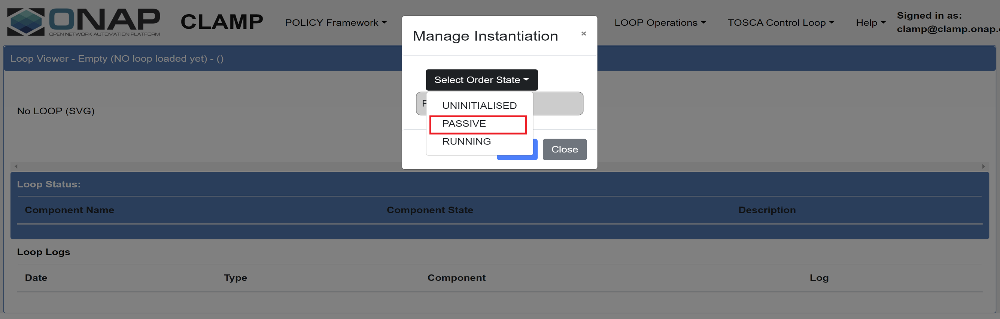

.. This work is licensed under a
.. Creative Commons Attribution 4.0 International License.
.. http://creativecommons.org/licenses/by/4.0

.. _clamp-pairwise-testing-label:

.. toctree::
   :maxdepth: 2

CLAMP <-> Dcae
~~~~~~~~~~~~~~

The pairwise testing is executed against a default ONAP installation in the OOM.
CLAMP-Automation Composition interacts with DCAE to deploy dcaegen2 services like PMSH.
This test verifies the interaction between DCAE and clamp-acm works as expected.

General Setup
*************

The kubernetes installation allocated all policy components across multiple worker node VMs.
The worker VM hosting the policy components has the following spec:

- 16GB RAM
- 8 VCPU
- 160GB Ephemeral Disk

The ONAP components used during the pairwise tests are:

- CLAMP acm runtime, policy participant, kubernetes participant.
- DCAE for running dcaegen2-service via kubernetes participant.
- ChartMuseum service from platform, initialised with DCAE helm charts.
- DMaaP for the communication between Automation Composition runtime and participants.
- Policy Gui for instantiation and commissioning of control loops.

ChartMuseum Setup
*****************

The chartMuseum helm chart from the platform is deployed in the same cluster. The chart server is then initialized with the helm charts of dcaegen2-services by running the below script in OOM repo.
The script accepts the directory path as an argument where the helm charts are located.

.. code-block:: bash

    #!/bin/sh
    ./oom/kubernetes/contrib/tools/registry-initialize.sh -d /oom/kubernetes/dcaegen2-services/charts/

Testing procedure
*****************

The test set focused on the following use cases:

- Deployment and Configuration of DCAE microservice PMSH
- Undeployment of PMSH

Creation of the Automation Composition:
---------------------------------------
An Automation Composition is created by commissioning a Tosca template with Automation Composition definitions and instantiating the Automation Composition with the state "UNINITIALISED".

- Upload a TOSCA template from the POLICY GUI. The definitions include a kubernetes participant and automation composition elements that deploys and configures a microservice in the kubernetes cluster.
  Automation Composition element for kubernetes participant includes a helm chart information of DCAE microservice and the element for Http Participant includes the configuration entity for the microservice.
  :download:`Sample Tosca template <tosca/pairwise-testing.yml>`

  .. image:: images/ac-commission.png

  .. image:: images/ac-upload.png

  Verification: The template is commissioned successfully without errors.

- Instantiate the commissioned Automation Composition definitions from the Policy Gui under 'Instantiation Management'.

  .. image:: images/create-instance.png

  Update instance properties of the Automation Composition Elements if required.

  .. image:: images/update-instance.png

  Verification: The Automation composition is created with default state "UNINITIALISED" without errors.

  .. image:: images/ac-instantiation.png

Deployment and Configuration of DCAE microservice (PMSH):
---------------------------------------------------------
The Automation Composition state is changed from "UNINITIALISED" to "PASSIVE" from the Policy Gui. The kubernetes participant deploys the PMSH helm chart from the DCAE chartMuseum server.

Verification:

- DCAE service PMSH is deployed in to the kubernetes cluster. PMSH pods are in RUNNING state.
  `helm ls -n <namespace>` - The helm deployment of dcaegen2 service PMSH is listed.
  `kubectl get pod -n <namespace>` - The PMSH pods are deployed, up and running.

- The subscription configuration for PMSH microservice from the TOSCA definitions are updated in the Consul server. The configuration can be verified on the Consul server UI `http://<CONSUL-SERVER_IP>/ui/#/dc1/kv/`

- The overall state of the Automation Composition is changed to "PASSIVE" in the Policy Gui.

.. image:: images/ac-create.png

Undeployment of DCAE microservice (PMSH):
-----------------------------------------
The Automation Composition state is changed from "PASSIVE" to "UNINITIALISED" from the Policy Gui.

.. image:: images/ac-uninitialise.png

Verification:

- The kubernetes participant uninstall the DCAE PMSH helm chart from the kubernetes cluster. The pods are removed from the cluster.

- The overall state of the Automation Composition is changed to "UNINITIALISED" in the Policy Gui.

.. image:: images/ac-uninitialised-state.png

