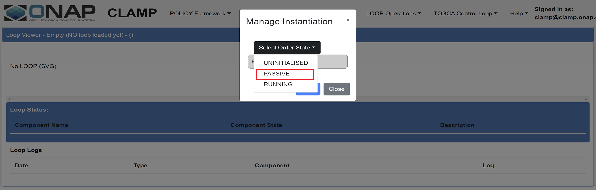

.. This work is licensed under a
.. Creative Commons Attribution 4.0 International License.
.. http://creativecommons.org/licenses/by/4.0

.. _clamp-pairwise-testing-label:

.. toctree::
   :maxdepth: 2

CLAMP <-> Policy Core
~~~~~~~~~~~~~~~~~~~~~

The pairwise testing is executed against a default ONAP installation in the OOM.
CLAMP-Automation Composition interacts with Policy framework to create and deploy policies.
This test verifies the interaction between policy and clamp-acm works as expected.

General Setup
*************

The kubernetes installation allocated all policy components across multiple worker node VMs.
The worker VM hosting the policy components has the following spec:

- 16GB RAM
- 8 VCPU
- 160GB Ephemeral Disk

The ONAP components used during the pairwise tests are:

- CLAMP Automation Composition runtime, policy participant, kubernetes participant.
- DMaaP for the communication between Automation Composition runtime and participants.
- Policy API to create (and delete at the end of the tests) policies for each
  scenario under test.
- Policy PAP to deploy (and undeploy at the end of the tests) policies for each scenario under test.
- Policy Gui for instantiation and commissioning of Automation Compositions.

Testing procedure
*****************

The test set focused on the following use cases:

- creation/Deletion of policies
- Deployment/Undeployment of policies

Creation of the Automation Composition:
---------------------------------------
An Automation Composition is created by commissioning a Tosca template with Automation Composition definitions and instantiating the Automation Composition with the state "UNINITIALISED".

- Upload a TOSCA template from the POLICY GUI. The definitions include a policy participant and an Automation Composition element that creates and deploys required policies. :download:`Sample Tosca template <tosca/pairwise-testing.yml>`

  .. image:: images/ac-commission.png

  Verification: The template is commissioned successfully without errors.

- Instantiate the commissioned Automation Composition from the Policy Gui under 'Instantiation Management'.

  .. image:: images/create-instance.png

  Update instance properties of the Automation Composition Elements if required.

  .. image:: images/update-instance.png

  Verification: The Automation Composition is created with default state "UNINITIALISED" without errors.

  .. image:: images/ac-instantiation.png

Creation and deployment of policies:
------------------------------------
The Automation Composition state is changed from "UNINITIALISED" to "PASSIVE" from the Policy Gui. Verify the POLICY API endpoint for the creation of policy types that are defined in the TOSCA template. Verify the PAP endpoint for the deployment of policies.

Verification:

- The policy types defined in the tosca template is created by the policy participant and listed in the policy Api.
  Policy Api endpoint: `<https://<POLICY-API-IP>/policy/api/v1/policytypes>`

- The policy participant deploys the policies of Tosca Automation Composition elements in Policy PAP for all the pdp groups.
  Policy PAP endpoint: `<https://<POLICY-PAP-IP>/policy/pap/v1/pdps>`

- The overall state of the Automation Composition is changed to "PASSIVE" in the Policy Gui.

.. image:: images/ac-create.png

Undeployment and deletion of Policies:
--------------------------------------
The Automation Composition state is changed from "PASSIVE" to "UNINITIALISED" from the Policy Gui.

Verification:

- The policy participant undeploys the policies of the Automation Composition element from the pdp groups. The policies deployed as part of the Automation Composition should not be listed on the Policy PAP.
  Policy PAP endpoint: `<https://<POLICY-PAP-IP>/policy/pap/v1/pdps>`

- The policy participant deletes the created policy types which can be verified on the Policy Api. The policy types created as part of the Automation Composition should not be listed on the Policy Api.
  Policy Api endpoint: `<https://<POLICY-API-IP>/policy/api/v1/policytypes>`

- The overall state of the Automation Composition is changed to "PASSIVE" in the Policy Gui.

.. image:: images/ac-create.png

