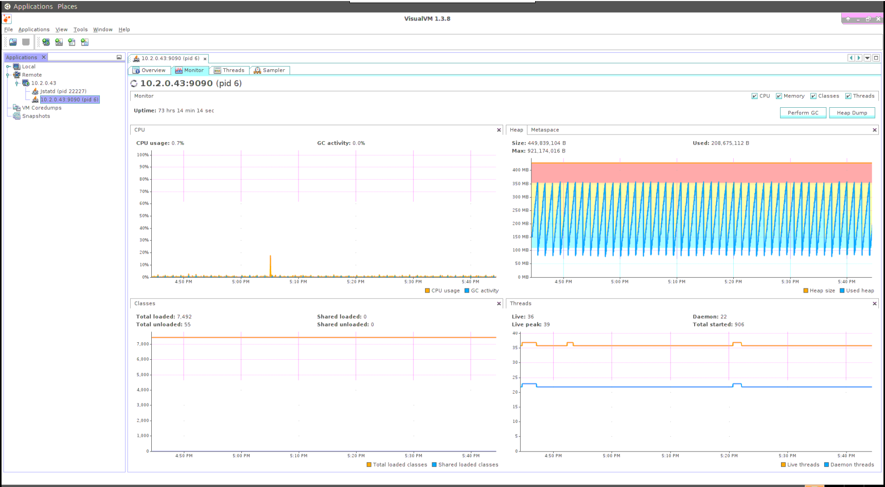
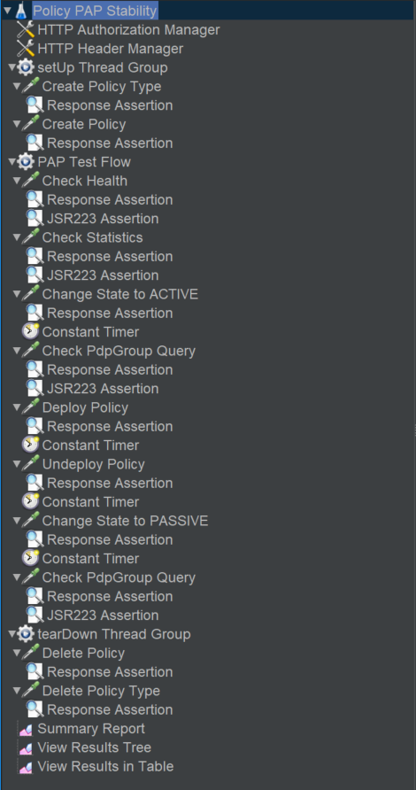
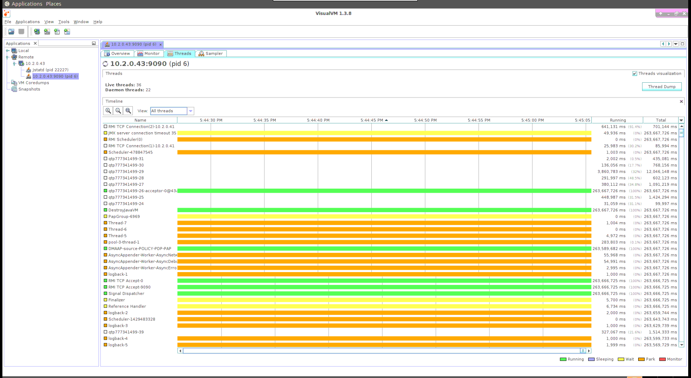
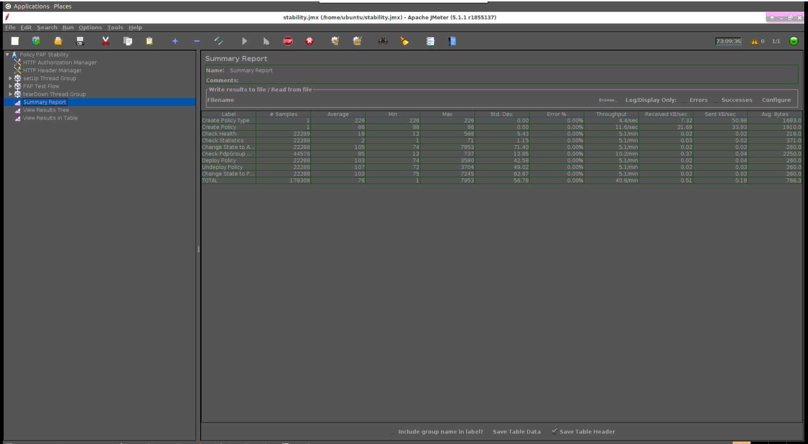
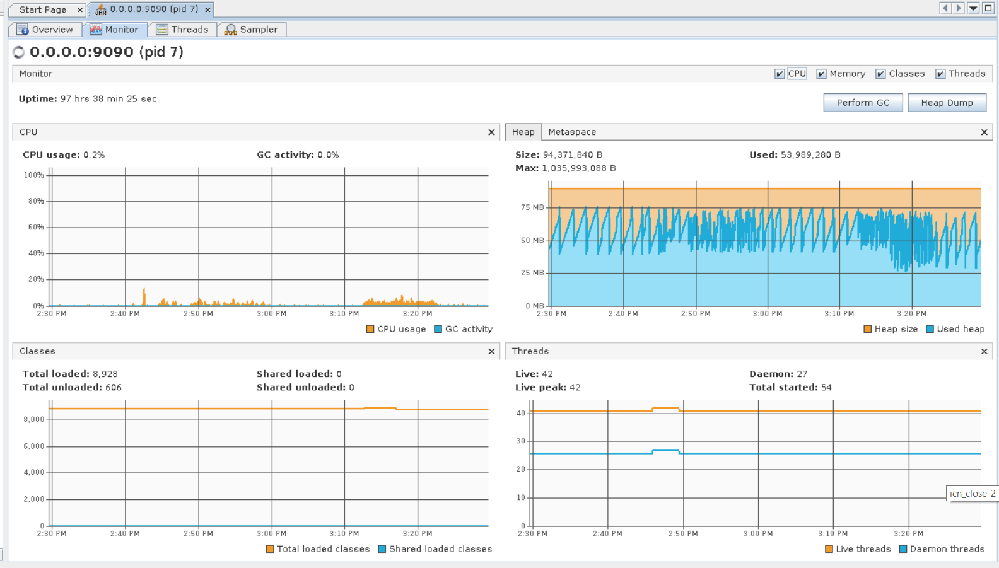
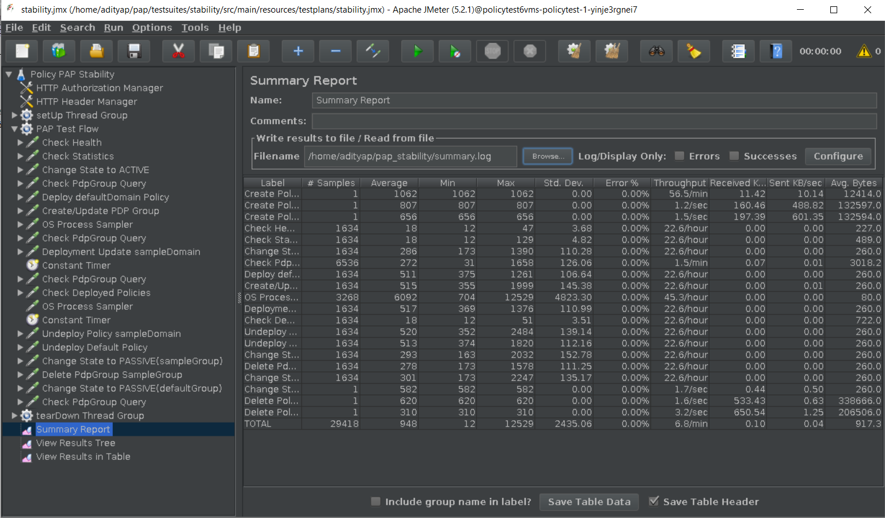
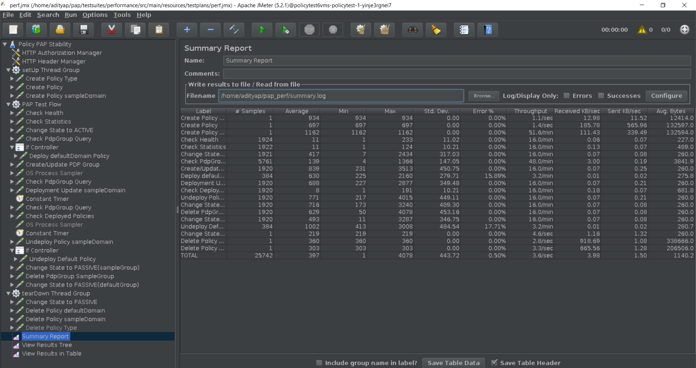
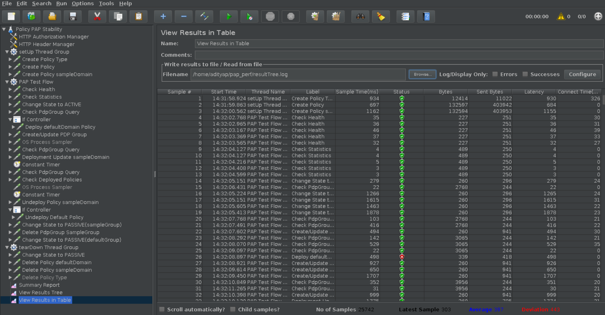

.. This work is licensed under a
.. Creative Commons Attribution 4.0 International License.
.. http://creativecommons.org/licenses/by/4.0

.. _pap-s3p-label:

.. toctree::
   :maxdepth: 2

Policy PAP component
~~~~~~~~~~~~~~~~~~~~

72 Hours Stability Test of PAP
++++++++++++++++++++++++++++++

Introduction
------------

The 72 hour Stability Test for PAP has the goal of introducing a steady flow of transactions initiated from a test client server running JMeter for the duration of 72 hours.

Setup details
-------------

The stability test is performed on VM's running in OpenStack cloud environment.

There are 2 seperate VM's, one for running PAP & other one for running JMeter to simulate steady flow of transactions.

All the dependencies like mariadb, dmaap simulator, pdp simulator & policy/api component are installed in the VM having JMeter.

For simplicity lets assume

VM1 will be running JMeter, MariaDB, DMaaP simulator, PDP simulator & API component.

VM2 will be running only PAP component.

**OpenStack environment details**

Version: Mitaka

**PAP VM details (VM2)**

OS:Ubuntu 16.04 LTS

CPU: 4 core

RAM: 4 GB

HardDisk: 40 GB

Docker version 19.03.8

Java: openjdk version "11.0.7" 2020-04-14

**JMeter VM details (VM1)**

OS: Ubuntu 16.04 LTS

CPU: 4 core

RAM: 4 GB

HardDisk: 40 GB

Docker Version: 18.09.6

Java: openjdk version "11.0.7" 2020-04-14

JMeter: 5.2.1

Install Docker in VM1 & VM2
---------------------------

Make sure to execute below commands in VM1 & VM2 both.

Make the etc/hosts entries

.. code-block:: bash

    $ echo $(hostname -I | cut -d\  -f1) $(hostname) | sudo tee -a /etc/hosts

Make the DNS entries

.. code-block:: bash

    $ echo "nameserver <PrimaryDNSIPIP>" >> /etc/resolvconf/resolv.conf.d/head
    $ echo "nameserver <SecondaryDNSIP>" >> /etc/resolvconf/resolv.conf.d/head
    $ resolvconf -u

Update the ubuntu software installer

.. code-block:: bash

    $ apt-get update

Check and Install Java

.. code-block:: bash

    $ apt-get install -y openjdk-11-jdk
    $ java -version

Ensure that the Java version that is executing is OpenJDK version 8

Check and install docker

.. code-block:: bash

    $ curl -fsSL https://download.docker.com/linux/ubuntu/gpg | sudo apt-key add -
    $ add-apt-repository "deb [arch=amd64] https://download.docker.com/linux/ubuntu $(lsb_release -cs) stable"
    $ apt-get update
    $ apt-cache policy docker-ce
    $ apt-get install -y docker-ce
    $ systemctl status docker
    $ docker ps

Change the permissions of the Docker socket file

.. code-block:: bash

    $ chmod 777 /var/run/docker.sock
    
Check the status of the Docker service and ensure it is running correctly

.. code-block:: bash

    $ service docker status
    $ docker ps

Install JMeter in VM1
---------------------

Download & install JMeter

.. code-block:: bash

    $ mkdir jMeter
    $ cd jMeter
    $ wget http://mirrors.whoishostingthis.com/apache//jmeter/binaries/apache-jmeter-5.2.1.zip
    $ unzip apache-jmeter-5.2.1.zip

Run JMeter

.. code-block:: bash

    $ /home/ubuntu/jMeter/apache-jmeter-5.2.1/bin/jmeter

The above command will load the JMeter UI. Then navigate to File → Open → Browse and select the test plan jmx file to open.
The jmx file is present in the policy/pap git repository.

Install simulators in VM1
-------------------------

Clone PAP to VM1 using the following command :

.. code-block:: bash

    root@policytest-policytest-3-p5djn6as2477:~$ git clone http://gerrit.onap.org/r/policy/pap

For installing simulator, execute the script `setup_components.sh` as shown below:

.. code-block:: bash

    root@policytest-policytest-3-p5djn6as2477:~$ ./pap/testsuites/stability/src/main/resources/simulatorsetup/setup_components.sh

After installation make sure that following 4 docker containers are up and running.

.. code-block:: bash

    root@policytest-policytest-3-p5djn6as2477:~$ docker ps
    CONTAINER ID        IMAGE                                   COMMAND                  CREATED             STATUS              PORTS                    NAMES
    887efa8dac12        nexus3.onap.org:10001/onap/policy-api   "bash ./policy-api.sh"   6 days ago          Up 6 days           0.0.0.0:6969->6969/tcp   policy-api
    0a931c0a63ac        pdp/simulator:latest                    "bash pdp-sim.sh"        6 days ago          Up 6 days                                    pdp-simulator
    a41adcb32afb        dmaap/simulator:latest                  "bash dmaap-sim.sh"      6 days ago          Up 6 days           0.0.0.0:3904->3904/tcp   dmaap-simulator
    d52d6b750ba0        mariadb:10.2.14                         "docker-entrypoint.s…"   6 days ago          Up 6 days           0.0.0.0:3306->3306/tcp   mariadb

Install PAP in VM2
------------------

Clone PAP to VM1 using the following command :

.. code-block:: bash

    root@policytest-policytest-3-p5djn6as2477:~$ git clone http://gerrit.onap.org/r/policy/pap

For installing simulator, execute the script `setup_pap.sh` as shown below:

.. code-block:: bash

    root@policytest-policytest-3-p5djn6as2477:~$ cd pap/testsuites/stability/src/main/resources/papsetup/
    root@policytest-policytest-3-p5djn6as2477:~$ ./setup_pap.sh <VM2_IP> <VM1_IP>

After installation make sure that following docker container is up and running.

.. code-block:: bash

    root@policytest-policytest-0-uc3y2h5x6p4j:~$ docker ps
    CONTAINER ID        IMAGE                                                         COMMAND                  CREATED             STATUS              PORTS                                            NAMES
    42ac0ed4b713        nexus3.onap.org:10001/onap/policy-pap:2.2.3-SNAPSHOT          "bash ./policy-pap.sh"   3 days ago          Up 3 days           0.0.0.0:6969->6969/tcp, 0.0.0.0:9090->9090/tcp   policy-pap

Install & configure visualVM in VM2
-----------------------------------

visualVM needs to be installed in the virtual machine having PAP. It will be used to monitor CPU, Memory, GC for PAP while stability test is running.

Install visualVM

.. code-block:: bash

    $ sudo apt-get install visualvm

Run few commands to configure permissions

.. code-block:: bash

    $ cd /usr/lib/jvm/java-11-openjdk-amd64/bin/
    $ sudo touch visualvm.policy
    $ sudo chmod 777 visualvm.policy

    $ vi visualvm.policy

    Add the following in visualvm.policy

    grant codebase "file:/usr/lib/jvm/java-11-openjdk-amd64/lib/tools.jar" {
       permission java.security.AllPermission;
    };

Run following commands to start jstatd using port 1111

.. code-block:: bash

    $ cd /usr/lib/jvm/java-11-openjdk-amd64/bin/
    $ ./jstatd -p 1111 -J-Djava.security.policy=visualvm.policy  &

Run visualVM locally to connect to remote VM2

.. code-block:: bash

    # On your windows machine or your linux box locally, launch visualVM
    $ nohup visualvm

Connect to jstatd & remote apex-pdp JVM

    1. Right click on "Remote" in the left panel of the screen and select "Add Remote Host..."
    2. Enter the IP address of VM2.
    3. Right click on IP address, select "Add JMX Connection..."
    4. Enter the VM2 IP Address (from step 2) <IP address>:9090 ( for example -10.12.6.201:9090) and click OK.
    5. Double click on the newly added nodes under "Remote" to start monitoring CPU, Memory & GC.

Sample Screenshot of visualVM

Test Plan
---------

The 72 hours stability test will run the following steps sequentially in a single threaded loop.

- **Create Policy Type** - creates an operational policy type using policy/api component
- **Create Policy defaultDomain** - creates an operational policy using the policy type created in the above step using policy/api component
- **Create Policy sampleDomain** - creates an operational policy using the policy type created in the above step using policy/api component
- **Check Health** - checks the health status of pap
- **Check Statistics** - checks the statistics of pap
- **Change state to ACTIVE** - changes the state of defaultGroup PdpGroup to ACTIVE
- **Check PdpGroup Query** - makes a PdpGroup query request and verifies that PdpGroup is in the ACTIVE state.
- **Deploy defaultDomain Policy** - deploys the policy defaultDomain in the existing PdpGroup
- **Create/Update PDP Group** - creates a new PDPGroup named sampleGroup.
- **OS Process Sampler** - OS Process Sampler to start a new Pdp Instance
- **Check PdpGroup Query** - makes a PdpGroup query request and verifies that 2 PdpGroups are in the ACTIVE state and defaultGroup has a policy deployed on it.
- **Deployment Update sampleDomain** - deploys the policy sampleDomain in sampleGroup PdpGroup using pap api
- **Check PdpGroup Query** - makes a PdpGroup query request and verifies that the defaultGroup has a policy defaultDomain deployed on it and sampleGroup has policy sampleDomain deployed on it.
- **Check Deployed Policies** - checks for all the deployed policies using pap api.
- **OS Process Sampler** - OS Process Sampler to stop the newly created Pdp Instance
- **Undeploy Policy sampleDomain** - undeploys the policy sampleDomain from sampleGroup PdpGroup using pap api
- **Undeploy Default Policy** - undeploys the policy defaultDomain from PdpGroup
- **Change state to PASSIVE(sampleGroup)** - changes the state of sampleGroup PdpGroup to PASSIVE
- **Delete PdpGroup SampleGroup** - delete the sampleGroup PdpGroup using pap api
- **Change State to PASSIVE(defaultGroup)** - changes the state of defaultGroup PdpGroup to PASSIVE
- **Check PdpGroup Query** - makes a PdpGroup query request and verifies that PdpGroup is in the PASSIVE state.
- **Delete Policy defaultDomain** - deletes the operational policy defaultDomain using policy/api component
- **Delete Policy sampleDomain** - deletes the operational policy sampleDomain using policy/api component
- **Delete Policy Type** - deletes the operational policy type using policy/api component

The following steps can be used to configure the parameters of test plan.

- **HTTP Authorization Manager** - used to store user/password authentication details.
- **HTTP Header Manager** - used to store headers which will be used for making HTTP requests.
- **User Defined Variables** -  used to store following user defined parameters.

===========   ===================================================================
 **Name**      **Description**
===========   ===================================================================
 PAP_HOST      IP Address or host name of PAP component
 PAP_PORT      Port number of PAP for making REST API calls
 API_HOST      IP Address or host name of API component
 API_PORT      Port number of API for making REST API calls
 DIR           Path where the pdp instance startup and stop script is placed
 CONFIG_DIR    Path where the pdp default Config file is placed
===========   ===================================================================

Screenshot of PAP stability test plan

Test Results
------------

**Summary**

Stability test plan was triggered for 72 hours.

**Test Statistics**

=======================  =================  ==================  ==================================
**Total # of requests**  **Success %**      **Error %**         **Average time taken per request**
=======================  =================  ==================  ==================================
178208                   100 %              0 %                 76 ms
=======================  =================  ==================  ==================================

**VisualVM Screenshot**

**JMeter Screenshot**

Test Results Frankfurt release
-------------------------------

**Summary**

Stability test plan was triggered for 72 hours.

.. Note::

              .. container:: paragraph

                  Test cases for starting and stopping the PDP Instance has been included in the
                  test plan. These test cases have resulted in a spike in the Average time taken per request.

**Test Statistics**

=======================  =================  ==================  ==================================
**Total # of requests**  **Success %**      **Error %**         **Average time taken per request**
=======================  =================  ==================  ==================================
  29423                  100 %              0 %                 948 ms
=======================  =================  ==================  ==================================

**VisualVM Screenshot**

.. image:: images/pap-s3p-vvm-2_F.png

**JMeter Screenshot**

Performance Test of PAP
++++++++++++++++++++++++

Introduction
------------

Performance test of PAP has the goal of testing the min/avg/max processing time and rest call throughput for all the requests with multiple requests at the same time.

Setup Details
-------------

The performance test is performed on a similar setup as Stability test. The JMeter VM will be sending a large number of REST requests to the PAP component and collecting the statistics.

Test Plan
---------

Performance test plan is the same as the stability test plan above except for the few differences listed below.

- Increase the number of threads up to 5 (simulating 5 users' behaviours at the same time).
- Reduce the test time to 2 hours.
- Usage of counters to create different groups by the 'Create/Update PDP Group' test case.
- Usage of If-Controller for 'Deploy defaultDomain Policy' and 'Undeploy defaultDomain Policy' test cases to install and uninstall the Default policy only in one thread.
- OS Process Sampler for starting and stopping the PDP Instance has been disabled in the performance test plan for a better performance check.

Run Test
--------

Running/Triggering the performance test will be the same as the stability test. That is, launch JMeter pointing to corresponding *.jmx* test plan. The *API_HOST* , *API_PORT* , *PAP_HOST* , *PAP_PORT* are already set up in *.jmx*.

Once the test execution is completed, execute the below script to get the statistics:

.. code-block:: bash

    $ cd /home/ubuntu/pap/testsuites/performance/src/main/resources/testplans
    $ ./results.sh /home/ubuntu/pap_perf/resultTree.log

Test Results
------------

Test results are shown as below. Overall, the test was running smoothly and successfully. We do see some minor failed transactions, especially in the 'Deploy' and 'Undeploy' Pap API in a multi-threaded fashion .

**Test Statistics**

=======================  =================  ==================  ==================================  =======================
**Total # of requests**  **Success %**      **Error %**         **Average time taken per request**  **Requests/sec**
=======================  =================  ==================  ==================================  =======================
  25743                  99.5 %              0.50 %                 397 ms                           5148
=======================  =================  ==================  ==================================  =======================

**JMeter Screenshot**

