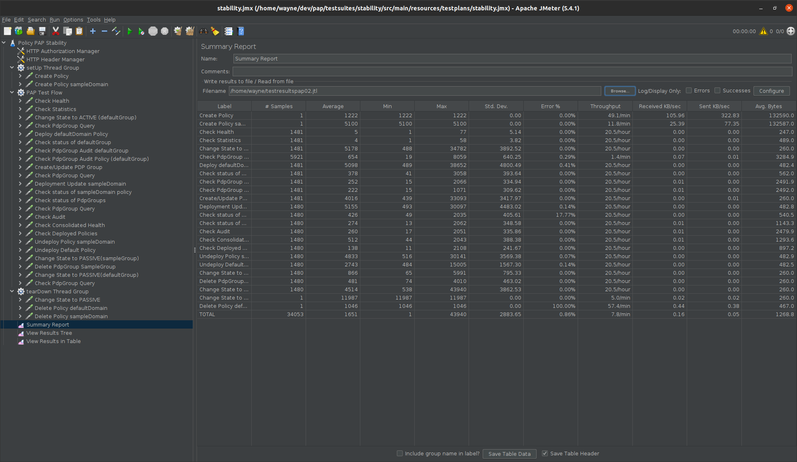
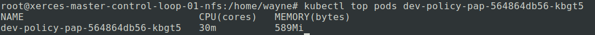
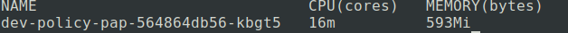
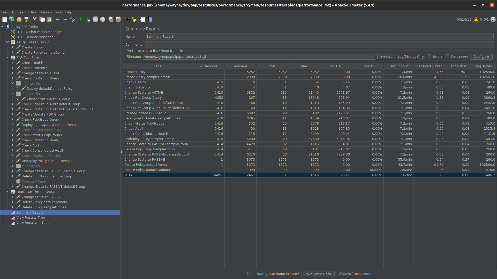

.. This work is licensed under a
.. Creative Commons Attribution 4.0 International License.
.. http://creativecommons.org/licenses/by/4.0

.. _pap-s3p-label:

.. toctree::
   :maxdepth: 2

Policy PAP component
~~~~~~~~~~~~~~~~~~~~

Both the Performance and the Stability tests were executed by performing requests
against Policy components installed as part of a full ONAP OOM deployment in Nordix lab.

Setup Details
+++++++++++++

- Policy-PAP along with all policy components deployed as part of a full ONAP OOM deployment.
- A second instance of APEX-PDP is spun up in the setup. Update the configuration file(OnapPfConfig.json) such that the PDP can register to the new group created by PAP in the tests.
- Both tests were run via jMeter, which was installed on a separate VM.

Stability Test of PAP
+++++++++++++++++++++

Test Plan
---------
The 72 hours stability test ran the following steps sequentially in a single threaded loop.

- **Create Policy defaultDomain** - creates an operational policy using policy/api component
- **Create Policy sampleDomain** - creates an operational policy using policy/api component
- **Check Health** - checks the health status of pap
- **Check Statistics** - checks the statistics of pap
- **Change state to ACTIVE** - changes the state of defaultGroup PdpGroup to ACTIVE
- **Check PdpGroup Query** - makes a PdpGroup query request and verifies that PdpGroup is in the ACTIVE state.
- **Deploy defaultDomain Policy** - deploys the policy defaultDomain in the existing PdpGroup
- **Check status of defaultGroup** - checks the status of defaultGroup PdpGroup with the defaultDomain policy 1.0.0.
- **Check PdpGroup Audit defaultGroup** - checks the audit information for the defaultGroup PdpGroup.
- **Check PdpGroup Audit Policy (defaultGroup)** - checks the audit information for the defaultGroup PdpGroup with the defaultDomain policy 1.0.0.
- **Create/Update PDP Group** - creates a new PDPGroup named sampleGroup.
- **Check PdpGroup Query** - makes a PdpGroup query request and verifies that 2 PdpGroups are in the ACTIVE state and defaultGroup has a policy deployed on it.
- **Deployment Update sampleDomain** - deploys the policy sampleDomain in sampleGroup PdpGroup using pap api
- **Check status of sampleGroup** - checks the status of the sampleGroup PdpGroup.
- **Check status of PdpGroups** - checks the status of both PdpGroups.
- **Check PdpGroup Query** - makes a PdpGroup query request and verifies that the defaultGroup has a policy defaultDomain deployed on it and sampleGroup has policy sampleDomain deployed on it.
- **Check Audit** - checks the audit information for all PdpGroups.
- **Check Consolidated Health** - checks the consolidated health status of all policy components.
- **Check Deployed Policies** - checks for all the deployed policies using pap api.
- **Undeploy Policy sampleDomain** - undeploys the policy sampleDomain from sampleGroup PdpGroup using pap api
- **Undeploy Default Policy** - undeploys the policy defaultDomain from PdpGroup
- **Change state to PASSIVE(sampleGroup)** - changes the state of sampleGroup PdpGroup to PASSIVE
- **Delete PdpGroup SampleGroup** - delete the sampleGroup PdpGroup using pap api
- **Change State to PASSIVE(defaultGroup)** - changes the state of defaultGroup PdpGroup to PASSIVE
- **Check PdpGroup Query** - makes a PdpGroup query request and verifies that PdpGroup is in the PASSIVE state.
- **Delete Policy defaultDomain** - deletes the operational policy defaultDomain using policy/api component
- **Delete Policy sampleDomain** - deletes the operational policy sampleDomain using policy/api component

The following steps can be used to configure the parameters of test plan.

- **HTTP Authorization Manager** - used to store user/password authentication details.
- **HTTP Header Manager** - used to store headers which will be used for making HTTP requests.
- **User Defined Variables** -  used to store following user defined parameters.

===========   ===================================================================
 **Name**      **Description**
===========   ===================================================================
 PAP_HOST      IP Address or host name of PAP component
 PAP_PORT      Port number of PAP for making REST API calls
 API_HOST      IP Address or host name of API component
 API_PORT      Port number of API for making REST API calls
===========   ===================================================================

The test was run in the background via "nohup", to prevent it from being interrupted:

.. code-block:: bash

    nohup ./jMeter/apache-jmeter-5.3/bin/jmeter.sh -n -t stability.jmx -l testresults.jtl

Test Results
------------

**Summary**

Stability test plan was triggered for 72 hours.

.. Note::

              .. container:: paragraph

                  As part of the OOM deployment, another APEX-PDP pod is spun up with the pdpGroup name specified as 'sampleGroup'.
                  After creating the new group called 'sampleGroup' as part of the test, a time delay of 2 minutes is added,
                  so that the pdp is registered to the newly created group.
                  This has  resulted in a spike in the Average time taken per request. But, this is required to make proper assertions,
                  and also for the consolidated health check.

**Test Statistics**

=======================  =================  ==================  ==================================
**Total # of requests**  **Success %**      **Error %**         **Average time taken per request**
=======================  =================  ==================  ==================================
34053                    99.14 %            0.86 %              1051 ms
=======================  =================  ==================  ==================================

.. Note::

              .. container:: paragraph

                  There were some failures during the 72 hour stability tests. These tests were caused by the apex-pdp pods restarting
                  intermitently due to limited resources in our testing environment. The second apex instance was configured as a
                  replica of the apex-pdp pod and therefore, when it restarted, registered to the "defaultGroup" as the configuration 
                  was taken from the original apex-pdp pod. This meant a manual change whenever the pods restarted to make apex-pdp-"2"
                  register with the "sampleGroup".
                  When both pods were running as expected, no errors relating to the pap functionality were observed. These errors are
                  strictly caused by the environment setup and not by pap.

**JMeter Screenshot**

**Memory and CPU usage**

The memory and CPU usage can be monitored by running "top" command on the PAP pod. A snapshot is taken before and after test execution to monitor the changes in resource utilization.

Memory and CPU usage before test execution:

Memory and CPU usage after test execution:

Performance Test of PAP
++++++++++++++++++++++++

Introduction
------------

Performance test of PAP has the goal of testing the min/avg/max processing time and rest call throughput for all the requests with multiple requests at the same time.

Setup Details
-------------

The performance test is performed on a similar setup as Stability test. The JMeter VM will be sending a large number of REST requests to the PAP component and collecting the statistics.

Test Plan
---------

Performance test plan is the same as the stability test plan above except for the few differences listed below.

- Increase the number of threads up to 5 (simulating 5 users' behaviours at the same time).
- Reduce the test time to 2 hours.
- Usage of counters to create different groups by the 'Create/Update PDP Group' test case.
- Removed the delay to wait for the new PDP to be registered. Also removed the corresponding assertions where the Pdp instance registration to the newly created group is validated.

Run Test
--------

Running/Triggering the performance test will be the same as the stability test. That is, launch JMeter pointing to corresponding *.jmx* test plan. The *API_HOST* , *API_PORT* , *PAP_HOST* , *PAP_PORT* are already set up in *.jmx*.

.. code-block:: bash

    nohup ./jMeter/apache-jmeter-5.3/bin/jmeter.sh -n -t performance.jmx -l perftestresults.jtl

Once the test execution is completed, execute the below script to get the statistics:

.. code-block:: bash

    $ cd /home/ubuntu/pap/testsuites/performance/src/main/resources/testplans
    $ ./results.sh /home/ubuntu/pap_perf/resultTree.log

Test Results
------------

Test results are shown as below.

**Test Statistics**

=======================  =================  ==================  ==================================
**Total # of requests**  **Success %**      **Error %**         **Average time taken per request**
=======================  =================  ==================  ==================================
24092                    100 %              0.00 %              2467 ms
=======================  =================  ==================  ==================================

**JMeter Screenshot**

