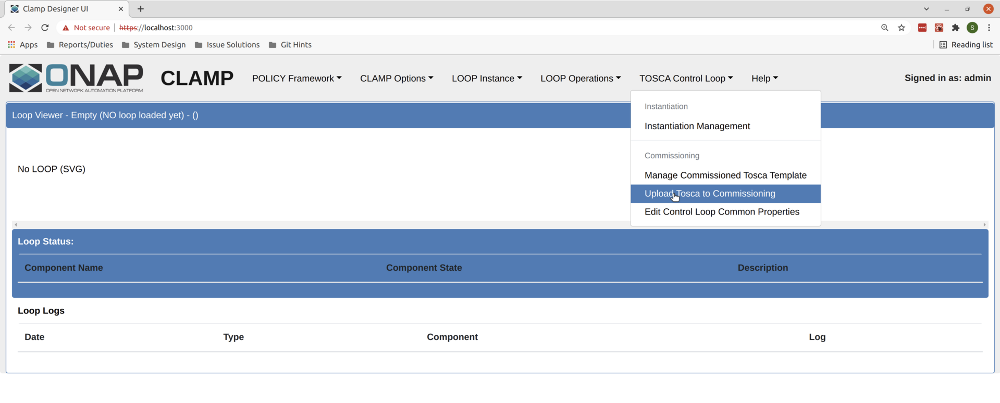
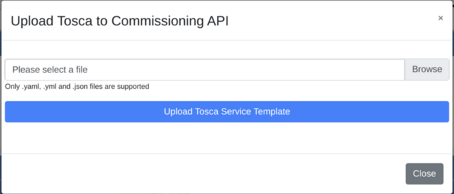
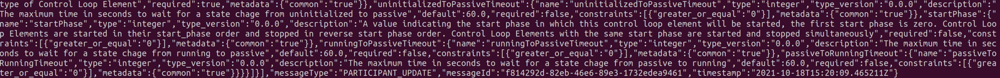
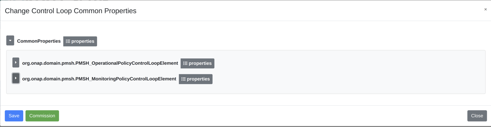
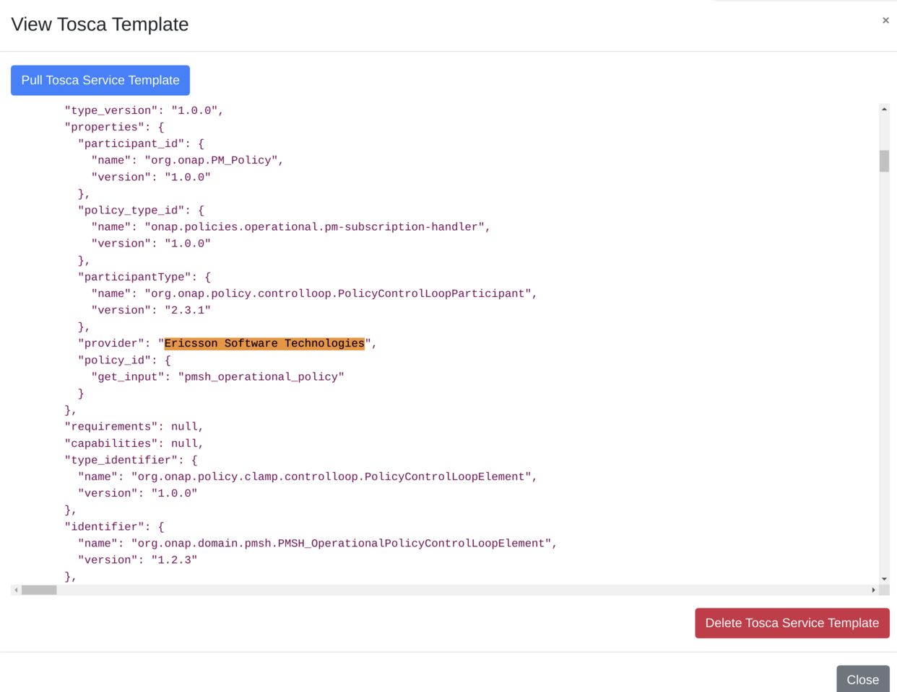
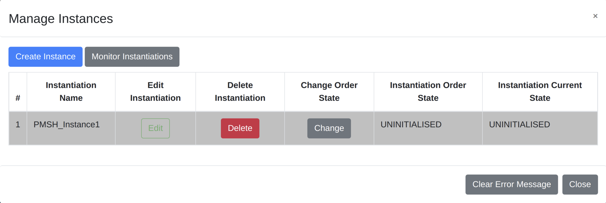
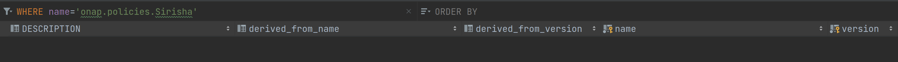
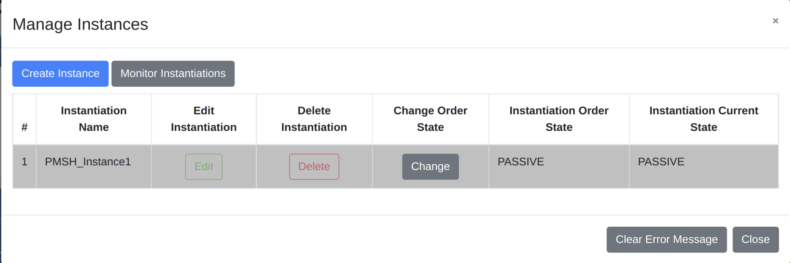
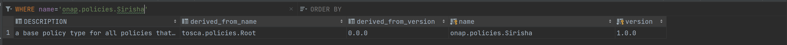
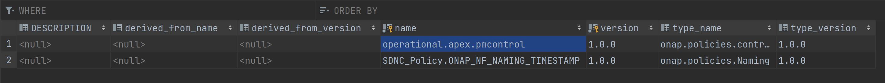

.. This work is licensed under a Creative Commons Attribution 4.0 International License.

.. _clamp-gui-acm-smoke-tests:

CLAMP GUI Smoke Tests
---------------------
1. Introduction
***************
The CLAMP GUI for Automation Compositions is designed to provide a user the ability to interact
with the Automation Composition Runtime to perform several actions.

- Commission new Tosca Service Templates.
- Editing Common Properties.
- Decommission existing Tosca Service Templates.
- Create new instances of Automation Compositions.
- Change the state of the Automation Compositions.
- Delete Automation Compositions.

This document will serve as a guide to do smoke tests on the different components that are involved when working with the GUI and outline how they operate. It will also show a developer how to set up their environment for carrying out smoke tests on the GUI.

2. Setup Guide
**************
This section will show the developer how to set up their environment to start testing in GUI with some instruction on how to carry out the tests. There are several prerequisites. Note that this guide is written by a Linux user - although the majority of the steps show will be exactly the same in Windows or other systems. The IDE used in the examples here is Intellij but most or all of what is described should be the same across IDEs.

2.1 Prerequisites
=================
- Java 11
- node
- npm
- Docker
- Maven 3
- Git
- Refer to this guide for basic environment setup `Setting up dev environment <https://wiki.onap.org/display/DW/Setting+Up+Your+Development+Environment>`_

2.2 Assumptions
===============
- You are accessing the policy repositories through gerrit
- You are using "git review".

The following repositories are required for development in this project. These repositories should be present on your machine and you should run "mvn clean install" on all of them so that the packages are present in your .m2 repository.

- policy/parent
- policy/common
- policy/models
- policy/clamp
- policy/docker
- policy/gui
- policy/api

In this setup guide, we will be setting up all the components technically required for a working convenient dev environment. We will not be setting up all of the participants - we will setup only the policy participant as an example.

2.3 Setting up the components
=============================

2.3.3 MariaDB Setup
^^^^^^^^^^^^^^^^^^^
We will be using Docker to run our mariadb instance. It will have a total of three databases running in it.

- acm: the clampacm db
- cldsdb4: the clamp backend db
- policyadmin: the policy-api db

The easiest way to do this is to perform a small alteration on an SQL script provided by the clamp backend in the file "runtime/extra/sql/bulkload/create-db.sql"

.. code-block:: mysql

    CREATE DATABASE `cldsdb4`;
    USE `cldsdb4`;
    DROP USER 'clds';
    CREATE USER 'clds';
    GRANT ALL on cldsdb4.* to 'clds' identified by 'sidnnd83K' with GRANT OPTION;
    CREATE DATABASE `clampacm`;
    USE `clampacm`;
    DROP USER 'policy';
    CREATE USER 'policy';
    GRANT ALL on clampacm.* to 'policy' identified by 'P01icY' with GRANT OPTION;
    CREATE DATABASE `policyadmin`;
    USE `policyadmin`;
    DROP USER 'policy_user';
    CREATE USER 'policy_user';
    GRANT ALL on clampacm.* to 'policy_user' identified by 'policy_user' with GRANT OPTION;
    FLUSH PRIVILEGES;

Once this has been done, we can run the bash script provided here: "runtime/extra/bin-for-dev/start-db.sh"

.. code-block:: bash

    ./start-db.sh

This will setup all three databases. It will also ensure that the tables in cldsdb4 are created. The database will be exposed locally on port 3306 and will be backed by an anonymous docker volume.

2.3.4 DMAAP Simulator
^^^^^^^^^^^^^^^^^^^^^
For convenience, a dmaap simulator has been provided in the policy/models repository. To start the simulator, you can do the following:

1. Navigate to /models-sim/policy-models-simulators in the policy/models repository.
2. Add a configuration file to src/test/resources with the following contents:

.. code-block:: json

    {
       "dmaapProvider":{
          "name":"DMaaP simulator",
          "topicSweepSec":900
       },
       "restServers":[
          {
             "name":"DMaaP simulator",
             "providerClass":"org.onap.policy.models.sim.dmaap.rest.DmaapSimRestControllerV1",
             "host":"localhost",
             "port":3904,
             "https":false
          }
       ]
    }

3. You can then start dmaap with:

.. code-block:: bash

    mvn exec:java  -Dexec.mainClass=org.onap.policy.models.simulators.Main -Dexec.args="src/test/resources/YOUR_CONF_FILE.json"

At this stage the dmaap simulator should be running on your local machine on port 3904.

2.3.5 Policy API
^^^^^^^^^^^^^^^^
In the policy-api repo, you should fine the file "src/main/resources/etc/defaultConfig.json". This file must be altered slightly - as below with the restServerParameters and databaseProviderParameters shown. Note how the database parameters match-up with what you setup in Mariadb:

.. code-block:: json

    {
        "restServerParameters": {
            "host": "0.0.0.0",
            "port": 6970,
            "userName": "healthcheck",
            "password": "zb!XztG34",
            "prometheus": true,
            "https": false,
            "aaf": false
        },
        "databaseProviderParameters": {
            "name": "PolicyProviderParameterGroup",
            "implementation": "org.onap.policy.models.provider.impl.DatabasePolicyModelsProviderImpl",
            "databaseDriver": "org.mariadb.jdbc.Driver",
            "databaseUrl": "jdbc:mariadb://mariadb:3306/policyadmin",
            "databaseUser": "policy_user",
            "databasePassword": "policy_user",
            "persistenceUnit": "PolicyMariaDb"
        },
    }

Next, navigate to the "/main" directory. You can then run the following command to start the policy api:

.. code-block:: bash

    mvn exec:java -Dexec.mainClass=org.onap.policy.api.main.startstop.Main -Dexec.args=" -c ../packages/policy-api-tarball/src/main/resources/etc/defaultConfig.json"

2.3.6 Clamp Backend
^^^^^^^^^^^^^^^^^^^
The Clamp Backend can potentially make calls to policy pap, policy api, cds, sdc and others. For acm development purposes, we only need to connect with the acm runtime api. For convenience, there has been an emulator provided to respond to requests from Clamp to all those services that we do not care about. This emulator can be run by running the following bash script "runtime/extra/bin-for-dev/start-emulator.sh"

.. code-block:: bash

    ./start-emulator.sh

Once the emulator is running, we can then run the clamp backend. Before doing this, we need to make sure that all of the calls from the clamp backend are directed towards the correct places. We can do this by editing the application-noaaf.properties file: "src/main/resources/application-noaaf.properties". For development purposes and because we are running the components in a non-https way, this file will not need to be altered currently. The clamp backend can then be run with the script "runtime/extra/bin-for-dev/start-backend.sh".

.. code-block:: bash

    ./start-backend.sh

Once the clamp backend is running, we can start the acm runtime.

2.3.7 Automation Composition Runtime
^^^^^^^^^^^^^^^^^^^^^^^^^^^^^^^^^^^^
To start the acm runtime we need to go the "runtime-acm" directory in the clamp repo. There is a config file that is used, by default, for the acm runtime. That config file is here: "src/main/resources/application.yaml". For development in your local environment, it shouldn't need any adjustment and we can just run the acm runtime with:

.. code-block:: bash

    mvn spring-boot:run

2.3.8 Automation Composition GUI
^^^^^^^^^^^^^^^^^^^^^^^^^^^^^^^^
At this point, all of the components required to test out the acm gui are running. We can start to make changes, and have those changes reflected in the UI for immediate feedback on our changes. But first, we must run the GUI.

Firstly, go to the GUI repo and navigate to "gui-clamp/ui-react". To setup for development, we must install the dependencies of the GUI. We can do this using the npm package manager. In the directory, simply run:

.. code-block:: bash

    npm install

This will trigger installation of the required packages. The application is configured to proxy all relevant calls to the clamp backend. The application can be started with a simple:

.. code-block:: bash

    npm start

This uses nodes internal test dev web server to server the GUI. Once started, you can navigate to the server at "localhost:3000" and login with "admin/password".

That completes the development setup of the environment.

3. Running Tests
****************
In this section, we will run through the functionalities mentioned at the start of this document is section 1. Each functionality will be tested and we will confirm that they were carried out successfully. There is a tosca service template that can be used for this test

:download:`Tosca Service Template <tosca/tosca-for-gui-smoke-tests.yaml>`

3.1 Commissioning
=================
We can carry out commissioning using the GUI. To do so, from the main page, we can select "Upload Tosca to Commissioning" as shown in the image below:

Clicking this will take us to a screen where we can upload a file. Select a file to upload and click on the upload button.

After clicking upload, you should get a message on the modal to tell you that the upload was successful. You can then look in the logs of the policy-participant to see that the message has been received from the runtime:

This confirms that commissioning has been complete.

3.2 Edit Common Properties
==========================
At this stage we can edit the common properties. These properties will be common to all instances of the automation composition definitions we uploaded with the tosca service template. Once an instance is created, we will not be able to alter these common properties again. We can simply click on "Edit Common Properties" in the dropdown menu and we will be taken to the modal shown below.

The arrows to the left of the modal can be used to expand and contract the elements. If we expand one of the elements, we can see that the provider is one of the properties that we can edit. Edit this property to be "Ericsson Software Technologies". Press "Save" and then press "Commission". You should get a success message. Once you do, you can look at the full tosca service template to confirm the change in provider has been recorder. Click on "Manage Commissioned Tosca Template". Then click on "Pull Tosca Service Template". You should receive the full template on the screen. You should find your change as shown below.

3.3 Create New Instances of Automation Compositions
===================================================
Once the template is commissioned, we can start to create instances. In the dropdown, click on "Instantiation Management". In the modal, you will see an empty table, as shown.

.. image:: images/gui/ManageInstancesModal.png

Then we will click on "Create Instance". That takes us to a page where we can edit the properties of the instance. Not the common properties, but the instance properties. The last element has Provider set as an instance property. In the same way as we did for the common properties, change the provider to "Some Other Company" - then click save. You should get a success message if all went ok. You can then go back to the instantiation management table and you should now see an instance there.

Since the instance is uninitialised, the policies and policy types are not being deployed to the policy api. We can confirm this by looking at the policy-apis database. See the image below.

3.3 Change the State of the Instance
====================================
Now we will change the instance state to PASSIVE. This should trigger the deployment of the policy types onto the policy-api. To trigger the change of state, click on the "change" button on the instance in the instance management table. This will bring up another modal to allow you to change the state.

.. image:: images/gui/ChangeState.png

Pick PASSIVE and then click save. If we once again navigate to the Instance Management table, we can see that our actual state has become passive.

This should also mean that our policies and policy types should be written to the policy-api database. We can query that DB again. In the images below, we can see that the policies and the policy types have been written successfully.

and

Following the same procedure as changing the state to PASSIVE, we can then change to UNINITIALISED. This deletes the policies and policy types through the policy api and changes the overall state of the loop. we can then delete it from the Manage Instances table by clicking on Delete.

Decommissioning
===============
Finally, we can decommission the template. On the dropdown menu, click "Manage Commissioned Tosca Template" and then pull it. Clicking the "Delete Tosca Service Template" button will fully decommission the template. You will receive a success message if the deletion was successful.

This concluded the required smoke tests

