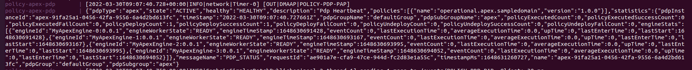

.. This work is licensed under a
.. Creative Commons Attribution 4.0 International License.
.. http://creativecommons.org/licenses/by/4.0

.. _policy-distribution-smoke-testing-label:

Policy Distribution Smoke Test
################################

The policy-distribution smoke testing is executed against a custom ONAP docker installation as defined in the docker compose file in "policy/docker/csit/".
The policy-distribution configuration file is located in "docker/csit/config/distribution/".
This test verifies the execution of the REST api's exposed by the component to make sure the CSAR Decoding and Forwarding works as expected.

General Setup
*****************
In policy/docker/csit/

.. code-block:: bash

    ./start-grafana.sh distribution

This script will compose the ONAP components used during the smoke tests are:

- Policy API to perform CRUD of policies.
- Policy DB to store the policies, and DB Migrator to start the db.
- DMAAP Simulator for the communication between components.
- Policy PAP to perform runtime administration (deploy/undeploy/status/statistics/etc).
- Policy Apex-PDP to deploy & undeploy policies. And send heartbeats to PAP.
- Policy Drools-PDP to deploy & undeploy policies. And send heartbeats to PAP.
- Policy Xacml-PDP to deploy & undeploy policies. And send heartbeats to PAP.

- Policy Distribution to test the Decoding and Forwarding functions.

Use this script to easily bring down the containers :

.. code-block:: bash

    ./stop-grafana.sh

Testing procedure
**********************

The test set is focused on the following use cases:

- Wait until Distribution starts and reach the built-in REST endpoints for fetching healthcheck & statistics.
- Execute some of the REST api's exposed by policy-pap component.

Starting Policy Distribution
------------------------------------

Check the docker logs to see when Distribution service is up and running.

Get the ips of distribution and pap services:

.. code::
  :number-lines:

    ./get-instance-ip.sh policy-distribution
	./get-instance-ip.sh policy-pap

Health check status & statistical data of running distribution system.

.. code-block:: bash

	curl -u 'healthcheck:zb!XztG34' --basic http://{POLICY_DISTRIBUTION_IP}:6969/healthcheck
	curl -u 'healthcheck:zb!XztG34' --basic http://{POLICY_DISTRIBUTION_IP}:6969/statistics

Expected result for healthcheck

.. code-block:: json

	{"name":"Policy SSD","url":"policy-distribution","healthy":true,"code":200,"message":"alive"}

Expected result for statistics

.. code-block:: json

	{"code":200,"totalDistributionCount":0,"distributionSuccessCount":0,"distributionFailureCount":0,"totalDownloadCount":0,"downloadSuccessCount":0,"downloadFailureCount":0}

Trigger Policy Distribution Core
------------------------------------------

In order to test policy-distribution, we need to trigger the decoding copying a .csar in the mapped volume,
defined in the docker-compose-distribution-smoke.yml as :

.. code-block:: yaml

      volumes:
       - ./distribution/config/temp/:/opt/app/policy/distribution/etc/temp/

So now copy the "sample_csar_with_apex_policy.csar" from ./distribution/config/csar/ to ./distribution/config/temp/

If the commissioning is successful we should see from the logs this message

So if we check the distribution statistics again

.. code-block:: bash

	{"code":200,"totalDistributionCount":1,"distributionSuccessCount":1,"distributionFailureCount":0,"totalDownloadCount":1,"downloadSuccessCount":1,"downloadFailureCount":0}

Execute policy-pap testing
------------------------------------
.. note::
	The user for pap is different.

Check the details of policies deployed

.. code-block:: bash

	curl -k --user 'policyadmin:zb!XztG34' http://{POLICY_PAP_IP}:6969/policy/pap/v1/policies/status

Expected SUCCESS result

.. code-block:: json

	[{"pdpGroup":"defaultGroup","pdpType":"apex","pdpId":"apex-91fa25a1-0456-42fa-9556-6a4d2bd613fc","policy":{"name":"operational.apex.sampledomain","version":"1.0.0"},"policyType":{"name":"onap.policies.native.Apex","version":"1.0.0"},"deploy":true,"state":"SUCCESS"},{"pdpGroup":"defaultGroup","pdpType":"xacml","pdpId":"xacml-83e19452-0854-41dd-9f17-8b0a68f11813","policy":{"name":"SDNC_Policy.ONAP_NF_NAMING_TIMESTAMP","version":"1.0.0"},"policyType":{"name":"onap.policies.Naming","version":"1.0.0"},"deploy":true,"state":"SUCCESS"}]

Check number of policies deployed

.. code-block:: bash

	curl -k --user 'policyadmin:zb!XztG34' http://{POLICY_PAP_IP}:6969/policy/pap/v1/policies/deployed

Expected success-count result

.. code-block:: json

	[{"policy-type":"onap.policies.native.Apex","policy-type-version":"1.0.0","policy-id":"operational.apex.sampledomain","policy-version":"1.0.0","success-count":1,"failure-count":0,"incomplete-count":0},{"policy-type":"onap.policies.Naming","policy-type-version":"1.0.0","policy-id":"SDNC_Policy.ONAP_NF_NAMING_TIMESTAMP","policy-version":"1.0.0","success-count":1,"failure-count":0,"incomplete-count":0}]

Or download & execute the steps in postman collection for verifying policy-pap component.
The steps need to be performed sequentially one after another. And no input is required from user.

`Policy Framework Administration API <https://github.com/onap/policy-pap/blob/master/postman/pap-api-collection.json>`_

Make sure to execute the delete steps in order to clean the setup after testing.
