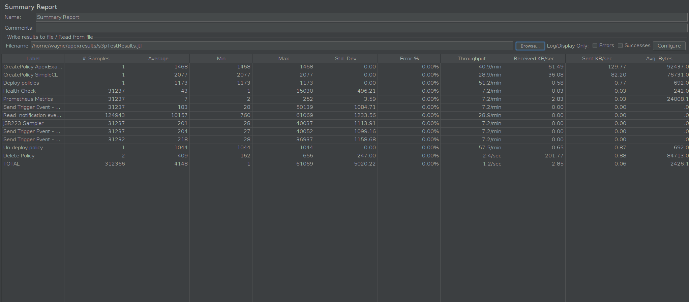
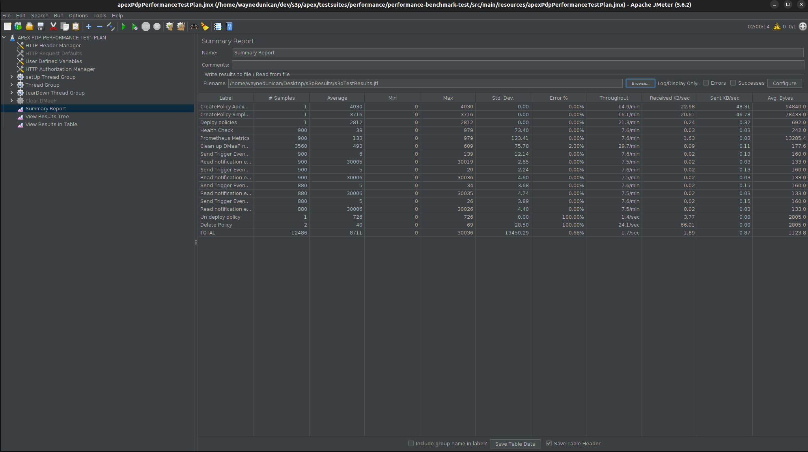

.. This work is licensed under a
.. Creative Commons Attribution 4.0 International License.
.. http://creativecommons.org/licenses/by/4.0

.. _apex-s3p-label:

.. toctree::
   :maxdepth: 2

Policy APEX PDP component
~~~~~~~~~~~~~~~~~~~~~~~~~

Both the Stability and the Performance tests were executed in a full Policy Framework deployment in a VM.

Setup Details
+++++++++++++

Deploying ONAP using OOM
------------------------

APEX-PDP along with all policy components are deployed as part of a full Policy Framework deployment.
At a minimum, the following components are needed: policy, mariadb-galera, prometheus and dmaap.

The S3P tests utilise the ./run-s3p-tests script in the apex component. This will setup the microk8s environment, deploy
policy and prometheus, expose the services so they can be reached by JMeter, install JMeter and run the tests based on
the arguments provided.

Set up policy-models-simulator
------------------------------

Policy-models-simulator is deployed to use the DMaaP simulator during policy execution.
    Simulator configurations used are available in apex-pdp repository:
      testsuites/apex-pdp-stability/src/main/resources/simulatorConfig/

The published port 30904 is used in JMeter for the DMaaP simulator.

JMeter Tests
------------

Two APEX policies are executed in the APEX-PDP engine, and are triggered by multiple threads during the tests.
Both tests were run via jMeter.

    Stability test script is available in apex-pdp repository:
      testsuites/apex-pdp-stability/src/main/resources/apexPdpStabilityTestPlan.jmx

    Performance test script is available in apex-pdp repository:
      testsuites/performance/performance-benchmark-test/src/main/resources/apexPdpPerformanceTestPlan.jmx

.. Note::
   Policy executions are validated in a stricter fashion during the tests.
   There are test cases where up to 80 events are expected on the DMaaP topic.
   DMaaP simulator is used to keep it simple and avoid any message pickup timing related issues.

Stability Test of APEX-PDP
++++++++++++++++++++++++++

Test Plan
---------

The 72 hours stability test ran the following steps.

Setup Phase
"""""""""""

Policies are created and deployed to APEX-PDP during this phase. Only one thread is in action and this step is done only once.

- **Create Policy onap.policies.apex.Simplecontrolloop** - creates the first APEX policy using policy/api component.
      This is a sample policy used for PNF testing.
- **Create Policy onap.policies.apex.Example** - creates the second APEX policy using policy/api component.
      This is a sample policy used for VNF testing.
- **Deploy Policies** - Deploy both the policies created to APEX-PDP using policy/pap component

Main Phase
""""""""""

Once the policies are created and deployed to APEX-PDP by the setup thread, five threads execute the below tests for 72 hours.

- **Healthcheck** - checks the health status of APEX-PDP
- **Prometheus Metrics** - checks that APEX-PDP is exposing prometheus metrics
- **Test Simplecontrolloop policy success case** - Send a trigger event to *unauthenticated.DCAE_CL_OUTPUT* DMaaP topic.
    If the policy execution is successful, 3 different notification events are sent to *APEX-CL-MGT* topic by each one of the 5 threads.
    So, it is checked if 15 notification messages are received in total on *APEX-CL-MGT* topic with the relevant messages.
- **Test Simplecontrolloop policy failure case** - Send a trigger event with invalid pnfName to *unauthenticated.DCAE_CL_OUTPUT* DMaaP topic.
    The policy execution is expected to fail due to AAI failure response. 2 notification events are expected on *APEX-CL-MGT* topic by a thread in this case.
    It is checked if 10 notification messages are received in total on *APEX-CL-MGT* topic with the relevant messages.
- **Test Example policy success case** - Send a trigger event to *unauthenticated.DCAE_POLICY_EXAMPLE_OUTPUT* DMaaP topic.
    If the policy execution is successful, 4 different notification events are sent to *APEX-CL-MGT* topic by each one of the 5 threads.
    So, it is checked if 20 notification messages are received in total on *APEX-CL-MGT* topic with the relevant messages.
- **Test Example policy failure case** - Send a trigger event with invalid vnfName to *unauthenticated.DCAE_POLICY_EXAMPLE_OUTPUT* DMaaP topic.
    The policy execution is expected to fail due to AAI failure response. 2 notification events are expected on *APEX-CL-MGT* topic by a thread in this case.
    So, it is checked if 10 notification messages are received in total on *APEX-CL-MGT* topic with the relevant messages.
- **Clean up DMaaP notification topic** - DMaaP notification topic which is *APEX-CL-MGT* is cleaned up after each test to make sure that one failure doesn't lead to cascading errors.

Teardown Phase
""""""""""""""

Policies are undeployed from APEX-PDP and deleted during this phase.
Only one thread is in action and this step is done only once after the Main phase is complete.

- **Undeploy Policies** - Undeploy both the policies from APEX-PDP using policy/pap component
- **Delete Policy onap.policies.apex.Simplecontrolloop** - delete the first APEX policy using policy/api component.
- **Delete Policy onap.policies.apex.Example** - delete the second APEX policy also using policy/api component.

Test Configuration
------------------

The following steps can be used to configure the parameters of test plan.

- **HTTP Authorization Manager** - used to store user/password authentication details.
- **HTTP Header Manager** - used to store headers which will be used for making HTTP requests.
- **User Defined Variables** - used to store following user defined parameters.

===================  ===============================================================================
 **Name**            **Description**
===================  ===============================================================================
 HOSTNAME            IP Address or host name to access the components
 PAP_PORT            Port number of PAP for making REST API calls such as deploy/undeploy of policy
 API_PORT            Port number of API for making REST API calls such as create/delete of policy
 APEX_PORT           Port number of APEX for making REST API calls such as healthcheck/metrics
 SIM_HOST            IP Address or hostname running policy-models-simulator
 DMAAP_PORT          Port number of DMaaP simulator for making REST API calls such as reading notification events
 wait                Wait time if required after a request (in milliseconds)
 threads             Number of threads to run test cases in parallel
 threadsTimeOutInMs  Synchronization timer for threads running in parallel (in milliseconds)
===================  ===============================================================================

Run Test
--------

The test was run in the background via "nohup", to prevent it from being interrupted.

Test Results
------------

**Summary**

Stability test plan was triggered for 72 hours. There were no failures during the 72 hours test.

**Test Statistics**

=======================  =================  ==================  ==================================
**Total # of requests**  **Success %**      **Error %**         **Average time taken per request**
=======================  =================  ==================  ==================================
112245                   99.47 %            0.53 %              2.309 sec.
=======================  =================  ==================  ==================================

**JMeter Screenshot**

.. Note::
    These results show a huge dip in the number of requests compared to the previous release of Apex-PDP>
    Further investigation and improvement is needed in the coming release.

Performance Test of APEX-PDP
++++++++++++++++++++++++++++

Introduction
------------

Performance test of APEX-PDP is done similar to the stability test, but in a more extreme manner using higher thread count.

Setup Details
-------------

The performance test is performed on a similar setup as Stability test.

Test Plan
---------

Performance test plan is the same as the stability test plan above except for the few differences listed below.

- Increase the number of threads used in the Main Phase from 5 to 20.
- Reduce the test time to 2 hours.

Run Test
--------

The test was run in the background via "nohup", to prevent it from being interrupted.

Test Results
------------

Test results are shown as below.

**Test Statistics**

=======================  =================  ==================  ==================================
**Total # of requests**  **Success %**      **Error %**         **Average time taken per request**
=======================  =================  ==================  ==================================
12486                    99.32 %            0.68 %              576.64 ms
=======================  =================  ==================  ==================================

**JMeter Screenshot**

.. Note::
    These results show a huge dip in the number of requests compared to the previous release of Apex-PDP>
    Further investigation and improvement is needed in the coming release.

Summary
+++++++

Multiple policies were executed in a multi-threaded fashion for both stability and performance tests.
Both tests showed a dip in performance and stability.
