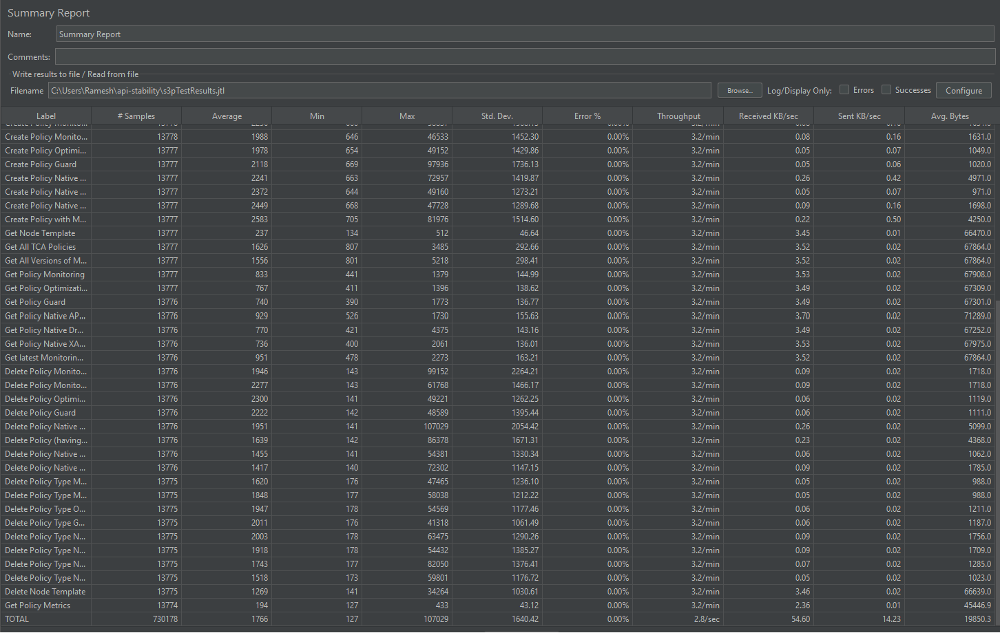
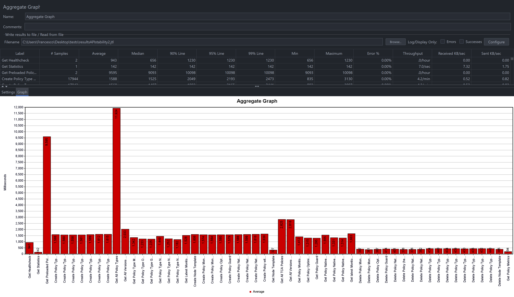
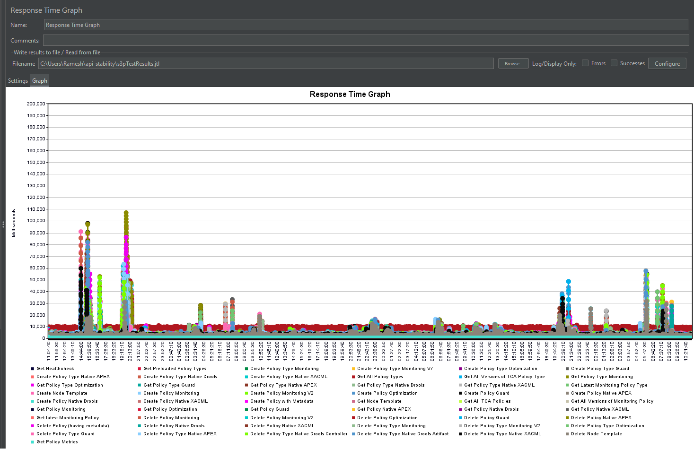
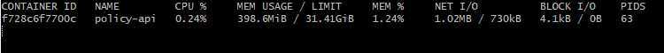
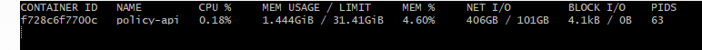
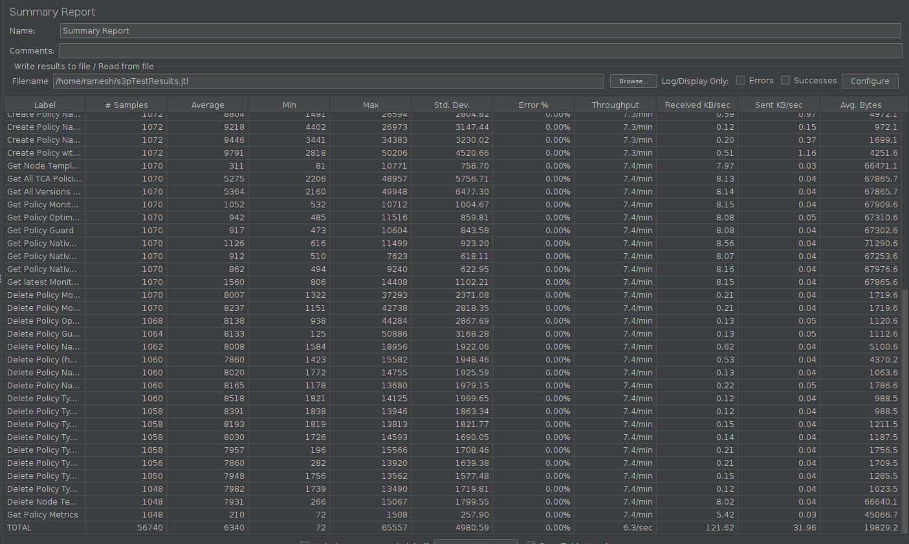
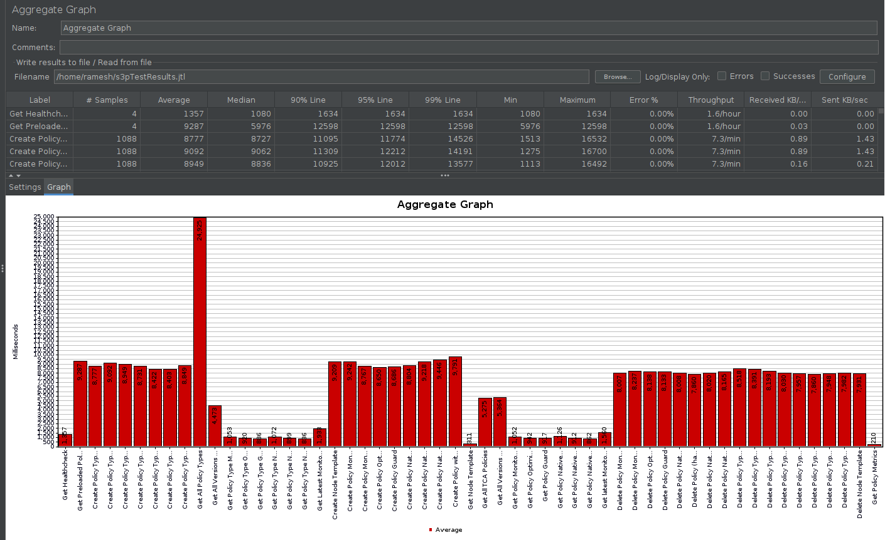
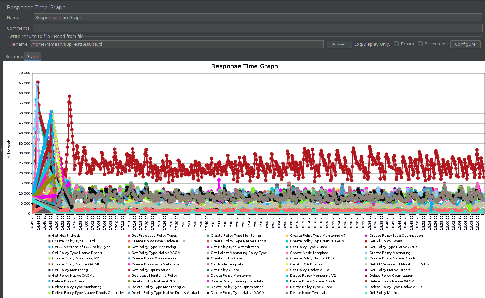

.. This work is licensed under a
.. Creative Commons Attribution 4.0 International License.
.. http://creativecommons.org/licenses/by/4.0

.. _api-s3p-label:

.. toctree::
   :maxdepth: 2

Policy API S3P Tests
####################

72 Hours Stability Test of Policy API
+++++++++++++++++++++++++++++++++++++

Introduction
------------

The 72 hour stability test of policy API has the goal of verifying the stability of running policy design API REST
service by ingesting a steady flow of transactions in a multi-threaded fashion to
simulate multiple clients' behaviours.
All the transaction flows are initiated from a test client server running JMeter for the duration of 72 hours.

Setup Details
-------------

The stability test was performed on a default Policy docker installation in the Nordix Lab environment.
JMeter was installed on a separate VM to inject the traffic defined in the
`API stability script
<https://git.onap.org/policy/api/tree/testsuites/stability/src/main/resources/testplans/policy_api_stability.jmx>`_
with the following command:

.. code-block:: bash

    nohup apache-jmeter-5.6.2/bin/jmeter -n -t policy_api_stability.jmx -l stabilityTestResultsPolicyApi.jtl &

The test was run in the background via “nohup” and “&”, to prevent it from being interrupted.

Test Plan
---------

The 72+ hours stability test will be running the following steps sequentially
in multi-threaded loops. Thread number is set to 5 to simulate 5 API clients'
behaviours (they can be calling the same policy CRUD API simultaneously).
Each thread creates a different version of the policy types and policies to not
interfere with one another while operating simultaneously.  The point version
of each entity is set to the running thread number.

**Setup Thread (will be running only once)**

- Get policy-api Healthcheck
- Get Preloaded Policy Types

**API Test Flow (5 threads running the same steps in the same loop)**

- Create a new Monitoring Policy Type with Version 6.0.#
- Create a new Monitoring Policy Type with Version 7.0.#
- Create a new Optimization Policy Type with Version 6.0.#
- Create a new Guard Policy Type with Version 6.0.#
- Create a new Native APEX Policy Type with Version 6.0.#
- Create a new Native Drools Policy Type with Version 6.0.#
- Create a new Native XACML Policy Type with Version 6.0.#
- Get All Policy Types
- Get All Versions of the new Monitoring Policy Type
- Get Version 6.0.# of the new Monitoring Policy Type
- Get Version 6.0.# of the new Optimization Policy Type
- Get Version 6.0.# of the new Guard Policy Type
- Get Version 6.0.# of the new Native APEX Policy Type
- Get Version 6.0.# of the new Native Drools Policy Type
- Get Version 6.0.# of the new Native XACML Policy Type
- Get the Latest Version of the New Monitoring Policy Type
- Create Version 6.0.# of Node Template
- Create Monitoring Policy Ver 6.0.# w/Monitoring Policy Type Ver 6.0.#
- Create Monitoring Policy Ver 7.0.# w/Monitoring Policy Type Ver 7.0.#
- Create Optimization Policy Ver 6.0.# w/Optimization Policy Type Ver 6.0.#
- Create Guard Policy Ver 6.0.# w/Guard Policy Type Ver 6.0.#
- Create Native APEX Policy Ver 6.0.# w/Native APEX Policy Type Ver 6.0.#
- Create Native Drools Policy Ver 6.0.# w/Native Drools Policy Type Ver 6.0.#
- Create Native XACML Policy Ver 6.0.# w/Native XACML Policy Type Ver 6.0.#
- Create Version 6.0.# of PNF Example Policy with Metadata
- Get Node Template
- Get All TCA Policies
- Get All Versions of Monitoring Policy Type
- Get Version 6.0.# of the new Monitoring Policy
- Get Version 6.0.# of the new Optimization Policy
- Get Version 6.0.# of the new Guard Policy
- Get Version 6.0.# of the new Native APEX Policy
- Get Version 6.0.# of the new Native Drools Policy
- Get Version 6.0.# of the new Native XACML Policy
- Get the Latest Version of the new Monitoring Policy
- Delete Version 6.0.# of the new Monitoring Policy
- Delete Version 7.0.# of the new Monitoring Policy
- Delete Version 6.0.# of the new OptimizationPolicy
- Delete Version 6.0.# of the new Guard Policy
- Delete Version 6.0.# of the new Native APEX Policy
- Delete Version 6.0.# of PNF Example Policy having Metadata
- Delete Version 6.0.# of the new Native Drools Policy
- Delete Version 6.0.# of the new Native XACML Policy
- Delete Monitoring Policy Type with Version 6.0.#
- Delete Monitoring Policy Type with Version 7.0.#
- Delete Optimization Policy Type with Version 6.0.#
- Delete Guard Policy Type with Version 6.0.#
- Delete Native APEX Policy Type with Version 6.0.#
- Delete Native Drools Policy Type with Version 6.0.#
- Delete Native XACML Policy Type with Version 6.0.#
- Delete Node Template
- Get Policy Metrics

**TearDown Thread (will only be running after API Test Flow is completed)**

- Get policy-api Healthcheck
- Get Preloaded Policy Types

Test Results
------------

**Summary**

No errors were found during the 72 hours of the Policy API stability run.
The load was performed against a non-tweaked Policy docker deployment.

**Test Statistics**

=======================  =============  ===========  ===============================  ===============================  ===============================
**Total # of requests**  **Success %**    **TPS**    **Avg. time taken per request**  **Min. time taken per request**  **Max. time taken per request**
=======================  =============  ===========  ===============================  ===============================  ===============================
    214617                    100%         2.8              6028 ms                               206 ms                          115153 ms
=======================  =============  ===========  ===============================  ===============================  ===============================

**JMeter Results**

The following graphs show the response time distributions.   The "Get Policy Types" API calls are the most expensive calls that
average a 8.6 seconds plus response time.

**Memory and CPU usage**

The memory and CPU usage can be monitored by running "docker stats" command in the policy-api container.
A snapshot is taken before and after test execution to monitor the changes in resource utilization.

Memory and CPU usage before test execution:

Memory and CPU usage after test execution:

Performance Test of Policy API
++++++++++++++++++++++++++++++

Introduction
------------

Performance test of policy-api has the goal of testing the min/avg/max processing time and rest call throughput for all the requests when the number of requests are large enough to saturate the resource and find the bottleneck.

Setup Details
-------------

The performance test was performed on a default Policy docker installation in the Nordix Lab environment.
JMeter was installed on a separate VM to inject the traffic defined in the
`API performance script
<https://git.onap.org/policy/api/tree/testsuites/performance/src/main/resources/testplans/policy_api_performance.jmx>`_
with the following command:

.. code-block:: bash

    nohup apache-jmeter-5.6.2/bin/jmeter -n -t policy_api_performance.jmx -l performanceTestResultsPolicyApi.jtl &

The test was run in the background via “nohup” and “&”, to prevent it from being interrupted.

Test Plan
---------

Performance test plan is the same as stability test plan above.
Only differences are, in performance test, we increase the number of threads up to 20 (simulating 20 users' behaviours at the same time) whereas reducing the test time down to 2.5 hours.

Run Test
--------

Running/Triggering performance test will be the same as stability test. That is, launch JMeter pointing to corresponding *.jmx* test plan. The *API_HOST* and *API_PORT* are already set up in *.jmx*.

**Test Statistics**

=======================  =============  ===========  ===============================  ===============================  ===============================
**Total # of requests**  **Success %**    **TPS**    **Avg. time taken per request**  **Min. time taken per request**  **Max. time taken per request**
=======================  =============  ===========  ===============================  ===============================  ===============================
    1671                     99.7%           6.3              108379 ms                              223 ms                          1921999 ms
=======================  =============  ===========  ===============================  ===============================  ===============================

Test Results
------------

The following graphs show the response time distributions.

